# 1、JS基础

## var、const、let

**var的缺点：**

1. 作用域问题：var的作用域是函数级别的，而不是块级别的。这意味着var声明的变量在函数内部的任何地方都可以访问，而不管它是在块级（如if或for语句）内声明的。这种行为会导致意想不到的错位，特别是在大范围代码中；

   ```js
       function example() {
         if (true) {
           var x = 10;
         }
         console.log(x); // 10
       }
       example();
   ```

2. 变量提升（Hoisting）：var声明的变量会被提升到函数或全局作用域的顶部。这意味着变量可以在声明之前使用，但其值为undefined；

   ```js
   console.log(a); // undefined
   var a = 5;
   ```

3. 重复声明：var允许在同一作用域内多次声明同一个变量，这可能会导致意外覆盖和难以跟踪的错误。

   ```js
   var x = 1;
   var x = 2;
   console.log(x); // 2
   ```

## 数据类型

1. 基本数据类型：number、string、boolean、undefined、null；
2. 引用数据类型：object；

什么时候出现未定义数据类型？以后开发场景是？

- 定义变量为给值就是undefined；
- 如果监测变量是undefined就说明没有值传递过来；

null是什么类型？开发场景是？

- 空类型；
- 如果一个变量里面确定存放的是对象，如果还没准备好对象，可以放个null；

null和undefined的区别：Nan代表一个计算错误。它是一个不正确的或者一个未定义的数学操作所得到的结果。

```js
    console.log(undefined + 1);// NaN
    console.log(null + 1);// 1

    const temp = undefined + 1;
    console.log(typeof temp); // number
```

## 显示转换和隐式转换

```js
    // 显示转换
    console.log(parseInt('str'));// NaN
    console.log(parseInt('2str'));// 2
    console.log(parseInt('20.22'));// 20
    console.log(parseFloat('str'));// NaN
    console.log(parseFloat('20str'));// 20
    console.log(parseFloat('20.31str'));// 20.31

    // 隐式转换
    const a1 = '2' + 1;
    console.log(typeof a1, a1);// string, '21'
    const a2 = '2' - 1
    console.log(typeof a2, a2);// number, 1
    const a3 = 3 - '2'
    console.log(typeof a3, a3);// number, 1
    const a4 = +'5';
    console.log(typeof a4, a4);// number, 5
```

## 显示对象所有的属性和方法

```js
console.dir()
```

# 2、WEB APIs

## 2.1、声明变量const优先

1. 以后声明变量优先使用哪个？
   - const；
   - 有了变量先给const，如果发现它后面是要被修改的，再改为let；
2. 为什么const声明的对象可以修改里面的属性？
   - 因为对象是引用类型，里面存储的是地址，只要地址不变，就不会报错；
   - **建议数组和对象是用const来声明；**
3. 什么时候let声明变量？
   - 如果基本数据类型的值或者引用类型的地址发生变化的时候，需要用let；
   - 比如：一个变量进行加减运算，比如：for循环中的i++。

## 2.2、获取DOM对象

### 2.2.1、根据CSS选择器来获取DOM元素（重点）

```html
  <body>
    <ul class="nav">
      <li>我的首页</li>
      <li>产品介绍</li>
      <li>联系方式</li>
    </ul>
    <script>
      const nav = document.querySelector(".nav");
      console.log(nav);

      const li2 = document.querySelector("ul li:first-child");
      console.log(li2);

      const lis = document.querySelectorAll(".nav li");
      console.log(lis);

      for(let i = 0; i < lis.length; i++) {
        lis[i].style.color = 'green';
      }
    </script>
  </body>
```

#### 伪类选择器

带冒号，所以被称为伪类。

```css
    .wrapper textarea:focus {
      border-color: #e4e4e4;
      background: #fff;
      height: 50px;
    }
```

```css
    input[type='checkbox']:checked {
      height: 50px;
      width: 50px;
    }
```

#### 属性选择器

```html
<input type="text" />
// 双引号可省略：'[type="text"]'
const txt = document.querySelector('[type=text]');
```

```html
  <style>
    input[type=text] {
      color: red
    }
  </style>

<body>
  <input type="text" value="123" data-id="0" data-name="andy">
  <input type="password">
  <script>
    const input = document.querySelector('input[value]');
  </script>
</body>
```

### 2.2.2、其他获取DOM元素方法（了解）

```js
// 根据id获取一个元素
document.getElementById('nav')
// 根据标签获取一类元素：获取页面所有div
document.getElementsByTagName('div')
// 根据类名获取元素：获取页面所有类名为w的
document.getElementsByClassName('w')
```

## 2.3、伪数组

```js
const lis = document.querySelectorAll("ul li");
```

有长度有索引号的数组，没有pop()，push()等数组方法，但是有自己的一些特定方法。

想要得到里面的每一个对象，则需要便利（for）的方式来获得。

## 2.4、操作元素内容

1. 元素innerText属性：
   - 将文本内容添加/更新到任意标签位置；
   - 显示纯文本，不解析标签；
2. 元素.innerHTML属性：
   - 将文本内容添加/更新到任意标签位置；
   - 会解析标签，多标签建议使用模板字符；

**年会抽奖案例：**

```html
  <div class="wrapper">
    <strong>年会抽奖</strong>
    <h1>一等奖：<span id="one">???</span></h1>
    <h3>二等奖：<span id="two">???</span></h3>
    <h5>三等奖：<span id="three">???</span></h5>
  </div>
  <script>
    // 1、创建名单数组
    const names = ['张三', '李四', '王五', '赵六', '刘德华', '周润发'];
    // 2、获取随机数（在数组长度范围内）
    const random = Math.floor(Math.random() * names.length);
    // 3、获取元素节点
    // 4、通过随机数获取数组对应的人员姓名
    // 5、设置innerHTML
    const one = document.querySelector('#one');
    one.innerHTML = names[random];
    // 6、剔除该人员名单
    names.splice(random, 1);

	// ...
  </script>
```

## 2.5、操作元素属性

### 2.5.1、常用属性

**随机图片案例：**

```html
  

  <script>
    // 获取[n, m]的随机数
    function getRandom(n, m) {
      return Math.floor(Math.random() * (m - n + 1)) + n;
    }

    // 1、获取元素
    const img = document.querySelector('img');
    // 2、获取元素属性、路径
    const indx = img.src.lastIndexOf('/');
    const src = img.src.substring(0, indx + 1);
    // 3、设置属性
    img.src = `${src}${getRandom(1, 6)}.webp`;
  </script>
```

### 2.5.2、样式属性

#### 2.5.2.1、通过style属性操作CSS

**生成的是行内样式表，权重比较高。（如果需要通过内嵌样式改变的话，需要在内嵌样式中通过!important提高权重）**

```html
  <div class="box"></div>
  <script>
    const box = document.querySelector('.box');
    box.style.width = '300px';
    box.style.backgroundColor = 'pink';
    box.style.border = '3px solid gray';
  </script>
```

注意：

1. 修改样式通过**style**属性引出；
2. 如果属性有-连接符，需要转换为**小驼峰**命名法；
3. 赋值的时候，不要忘记加CSS**单位**；

**随机更换背景图片案例：**

```html
  <style>
    body {
      background: url(./images/desktop_1.jpg) no-repeat top center/cover;
    }
  </style>

  <script>
    function getRandom(n, m) {
      return Math.floor(Math.random() * (m - n + 1)) + n;
    }
    document.body.style.backgroundImage = `url(./images/desktop_${getRandom(1, 10)}.jpg)`;
  </script>
```

#### 2.5.2.2、通过类名（className）操作CSS

```html
  <style>
    div {
      width: 200px;
      height: 200px;
      background-color: aqua;
    }

    .errMsg {
      color: red;
    }

    .nav {
      width: 300px;
      height: 300px;
      border: 1px solid black;
      background-color: bisque;
      margin: 300px 100px;
    }
  </style>
  
<body>
  <div>123</div>
  <script>
    const div = document.querySelector('div');
    div.className = 'errMsg nav';
  </script>
</body>
```

#### 2.5.2.3、通过classList（H5新增）操作类控制CSS

```js
const div = document.querySelector('div');
div.classList.add('active');
div.classList.remove('nav');
// 有就删掉，没有就添加
div.classList.toggle('err');
```

**轮播图随机版案例：**

```js
    // 1. 初始数据
    const sliderData = [
      { url: './images/slider01.jpg', title: '对人类来说会不会太超前了？', color: 'rgb(100, 67, 68)' },
      { url: './images/slider02.jpg', title: '开启剑与雪的黑暗传说！', color: 'rgb(43, 35, 26)' },
      { url: './images/slider03.jpg', title: '真正的jo厨出现了！', color: 'rgb(36, 31, 33)' },
      { url: './images/slider04.jpg', title: '李玉刚：让世界通过B站看到东方大国文化', color: 'rgb(139, 98, 66)' },
      { url: './images/slider05.jpg', title: '快来分享你的寒假日常吧~', color: 'rgb(67, 90, 92)' },
      { url: './images/slider06.jpg', title: '哔哩哔哩小年YEAH', color: 'rgb(166, 131, 143)' },
      { url: './images/slider07.jpg', title: '一站式解决你的电脑配置问题！！！', color: 'rgb(53, 29, 25)' },
      { url: './images/slider08.jpg', title: '谁不想和小猫咪贴贴呢！', color: 'rgb(99, 72, 114)' },
    ]

    // 2、获取随机数，数组长8
    const random = parseInt(Math.random() * sliderData.length);
    // 3、获取img元素，替换图片
    const img = document.querySelector('.slider-wrapper img');
    img.src = sliderData[random].url;
    // 4、获取底部元素，替换背景色
    const footer = document.querySelector('.slider-footer');
    console.log(footer);
    footer.style.backgroundColor = sliderData[random].color;
    // 5、获取p元素，替换文本
    const p = document.querySelector('.slider-footer p');
    p.innerHTML = sliderData[random].title;
    // 6、获取li元素，替换类
    const li = document.querySelector(`.slider-indicator li:nth-child(${random + 1})`);
    li.classList.toggle('active');
```

### 2.5.3、表单元素属性

```html
<body>
  <input type="text" value="xxx"/>
  <input id="ck" type="checkbox"/>
  <!-- H5标准：属性和值一致的情况可以省略 -->
  <input id="ck1" type="checkbox" checked/>
  <input type="button" value="登录" disabled/> 
  <script>
    const ipt = document.querySelector('input');
    // 获取文本内容
    console.log(ipt.value);
    // 改变文本内容
    ipt.value = 'yyy';
    // 变成密码框
    ipt.type ='password';
    
    const ck = document.querySelector('#ck');
    // 设置勾选
    ck.checked = true;
    // 空字符串为false,此时存在隐式转换,尽量避免
    ck.checked = '';
  </script>
</body>
```

### 2.5.4、自定义属性

**标准属性：**标签天生自带的属性，比如class，id，title等，可以直接使用点语法操作，比如：disabled，checked，selected；

**自定义属性：**

- 在html5中推出来了专门的data-自定义属性；
- 在标签上一律以data-开头；
- 在DOM对象上一律以dataset对象方式获取；

```html
<body>
  <div data-id="1" data-scm="xxx">1</div>
  <script>
    const div = document.querySelector('div');
    console.log(div.dataset);
  </script>
</body>
```

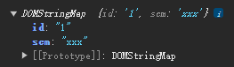

##  2.6、定时器-间歇函数

```html
<body>
  <div></div>
  <button>停止</button>
  <script>
    let i = 0;
    const div = document.querySelector('div');
    // 定时器返回的是一个id数字，最好用关键字let修饰，因为有些场景需要反复开启和关闭定时器
    let timer = setInterval(() => {
      div.innerHTML = i++;
    }, 1000);

    const btn = document.querySelector('button');
    btn.onclick = function () {
      clearInterval(timer);
    }
  </script>
</body>
```

```js
// 可指定函数，不用加括号
setInterval(func, 1000);
```

反例：

```js
setInterval('func()', 1000);
```

**用户注册倒计时案例：**

```html
<body>
    <textarea name="" id="" cols="30" rows="10">
        用户注册协议
        欢迎注册成为京东用户！在您注册过程中，您需要完成我们的注册流程并通过点击同意的形式在线签署以下协议，请您务必仔细阅读、充分理解协议中的条款内容后再点击同意（尤其是以粗体或下划线标识的条款，因为这些条款可能会明确您应履行的义务或对您的权利有所限制）。
        【请您注意】如果您不同意以下协议全部或任何条款约定，请您停止注册。您停止注册后将仅可以浏览我们的商品信息但无法享受我们的产品或服务。如您按照注册流程提示填写信息，阅读并点击同意上述协议且完成全部注册流程后，即表示您已充分阅读、理解并接受协议的全部内容，并表明您同意我们可以依据协议内容来处理您的个人信息，并同意我们将您的订单信息共享给为完成此订单所必须的第三方合作方（详情查看
    </textarea>
    <br>
    <button class="btn" disabled>我已经阅读用户协议(60)</button>
    <script>
        // 0、前提：页面加载的时候，按钮不可用
        // 1、获取按钮元素
        const btn = document.querySelector('.btn');
        // 2、定义总时间
        let time = 5;
        // 3、开启定时器，返回定时器序号
        let timer = setInterval(() => {
            // 3.1、倒计时
            time--;
            // 3.2、设置倒计时文本
            btn.innerHTML = `我已经阅读用户协议(${time})`;
            // 3.3、倒计时是否结束
            if (time === 0) {
                // 3.3.1、关闭定时器
                clearInterval(timer);
                // 3.3.2、改变按钮文本
                btn.innerHTML = '同意';
                // 3.3.3、设置按钮可用
                btn.disabled = false;
            }
        }, 1000);
    </script>
</body>
```

**轮播图定时版案例：**

```html
  <script>
    // 0. 初始数据
    const sliderData = [
      { url: './images/slider01.jpg', title: '对人类来说会不会太超前了？', color: 'rgb(100, 67, 68)' },
      { url: './images/slider02.jpg', title: '开启剑与雪的黑暗传说！', color: 'rgb(43, 35, 26)' },
      { url: './images/slider03.jpg', title: '真正的jo厨出现了！', color: 'rgb(36, 31, 33)' },
      { url: './images/slider04.jpg', title: '李玉刚：让世界通过B站看到东方大国文化', color: 'rgb(139, 98, 66)' },
      { url: './images/slider05.jpg', title: '快来分享你的寒假日常吧~', color: 'rgb(67, 90, 92)' },
      { url: './images/slider06.jpg', title: '哔哩哔哩小年YEAH', color: 'rgb(166, 131, 143)' },
      { url: './images/slider07.jpg', title: '一站式解决你的电脑配置问题！！！', color: 'rgb(53, 29, 25)' },
      { url: './images/slider08.jpg', title: '谁不想和小猫咪贴贴呢！', color: 'rgb(99, 72, 114)' },
    ]

    // 1、定义信号量
    let i = 0;
    // 2、获取目标元素
    const img = document.querySelector('.slider-wrapper img');
    const p = document.querySelector('.slider-footer p');
    const footer = document.querySelector('.slider-footer');
    // 3、开启定时器
    let timer = setInterval(() => {
      // 3.1、信号量递增
      i++;
      // 4、重置信号量
      if (i >= sliderData.length) {
        i = 0;
      }
      // 3.2、设置url
      img.src = sliderData[i].url;
      // 3.3、设置title
      p.innerHTML = sliderData[i].title;
      // 3.4、设置背景色
      footer.style.backgroundColor = sliderData[i].color;
      // 3.5、清空小圆点激活样式
      const active = document.querySelector('.slider-indicator .active');
      active.classList.remove('active');
      // 3.6、增加小圆点激活样式
      const li = document.querySelector(`.slider-indicator li:nth-child(${i + 1})`);
      li.classList.add('active');
    }, 1000);
  </script>
```

## 2.7、事件监听

```html
  <script>
    const div = document.querySelector('div');
    const btn = document.querySelector('#btn');
    btn.addEventListener('click', () => {
      div.style.display = 'none';
    })
  </script>
```

**随机点名案例：**

```html
<body>
    <h2>随机点名</h2>
    <div class="box">
        <span>名字是：</span>
        <div class="qs">这里显示姓名</div>
    </div>
    <div class="btns">
        <button class="start">开始</button>
        <button class="end">结束</button>
    </div>
    <script>
        // 数据数组
        // const arr = ['马超', '黄忠', '赵云', '关羽', '张飞', '李白', '杜甫', '刘德华'];
        const arr = ['马超', '黄忠', '赵云'];

        // 0、获取文本框、开始按钮、结束按钮
        const qs = document.querySelector('.qs');
        const start = document.querySelector('.start');
        const end = document.querySelector('.end');

        // 定时器序号
        let timer = 0;
        // 随机数
        let random = 0;

        // 1、开始按钮
        // 绑定点击事件
        start.addEventListener('click', function () {
            // 开启定时器
            timer = setInterval(() => {
                // 获取随机数
                random = parseInt(Math.random() * arr.length);
                // 设置文本框内容
                qs.innerHTML = arr[random];
                // 数组长度为1，禁止开始和结束按钮
                if (arr.length === 1) {
                    start.disabled = end.disabled = true;
                }
            }, 60);
        });

        // 2、结束按钮
        // 绑定点击事件
        end.addEventListener('click', function () {
            // 关闭定时器
            clearInterval(timer);
            // 剔除数组元素
            arr.splice(random, 1);
        });
    </script>
</body>
```

### 2.7.1、事件监听版本

**DOM L0：**事件源.on事件 = function() { }

**DOM L2：**事件源(元素).addEventListener(事件, 事件处理函数)

**区别：**on方式会被覆盖，addEventListener方式可绑定多次，拥有事件更多特性，推荐使用。

**发展史：**

- DOM L0：是DOM发展的第一个版本；
- DOM L1：DOM级别1于1998年10月1日成为W3C推荐标准；
- DOM L2：使用addEventListener注册事件；
- DOM L3：DOM3级事件模块在DOM2级事件的基础上重新定义了这些事件，也添加了一些新事件类型。

```html
<body>
  <button id="btn1">登录1</button>
  <button id="btn2">登录2</button>
  <script>
    const btn1 = document.querySelector('#btn1');
    // 因为onclick是赋值操作，所以重复定义的话，后面的会覆盖前面的
    btn1.onclick = function () {
      alert(11);
    }
    btn1.onclick = function () {
      alert(22);
    }

    // 两次绑定内容共存
    const btn2 = document.querySelector('#btn2');
    btn2.addEventListener('click', function () {
      alert(33);
    })
    btn2.addEventListener('click', function () {
      alert(44);
    })
  </script>
</body>
```

### 2.7.2、事件类型

| 事件源   | 触发时机     | 事件类型             |
| -------- | ------------ | -------------------- |
| 鼠标事件 | 鼠标触发     | click 鼠标点击       |
|          |              | mouseenter 鼠标经过  |
|          |              | mouseleave 鼠标离开  |
| 焦点事件 | 表单获得光标 | focus 获得焦点       |
|          |              | blur 失去焦点        |
| 键盘事件 | 键盘触发     | keydown 键盘按下触发 |
|          |              | keyup 键盘抬起触发   |
| 文本事件 | 表单输入触发 | input 用户输入事件   |

**轮播图完整版案例：**

```html
  <script>
    // 1. 初始数据
    const sliderData = [
      { url: './images/slider01.jpg', title: '对人类来说会不会太超前了？', color: 'rgb(100, 67, 68)' },
      { url: './images/slider02.jpg', title: '开启剑与雪的黑暗传说！', color: 'rgb(43, 35, 26)' },
      { url: './images/slider03.jpg', title: '真正的jo厨出现了！', color: 'rgb(36, 31, 33)' },
      { url: './images/slider04.jpg', title: '李玉刚：让世界通过B站看到东方大国文化', color: 'rgb(139, 98, 66)' },
      { url: './images/slider05.jpg', title: '快来分享你的寒假日常吧~', color: 'rgb(67, 90, 92)' },
      { url: './images/slider06.jpg', title: '哔哩哔哩小年YEAH', color: 'rgb(166, 131, 143)' },
      { url: './images/slider07.jpg', title: '一站式解决你的电脑配置问题！！！', color: 'rgb(53, 29, 25)' },
      { url: './images/slider08.jpg', title: '谁不想和小猫咪贴贴呢！', color: 'rgb(99, 72, 114)' },
    ]

    const img = document.querySelector('.slider-wrapper img');
    const p = document.querySelector('.slider-footer p');
    const footer = document.querySelector('.slider-footer');
    const prev = document.querySelector('.prev');
    const next = document.querySelector('.next');
    const slider = document.querySelector('.slider');
    let timer = 0; // 计时器序号

    // 随机数
    let i = 0;
    // 下一个按钮
    next.addEventListener('click', function () {
      i++;
      if (i >= 8) {
        i = 0;
      }
      render();
    });
    // 上一个按钮
    prev.addEventListener('click', function () {
      i--;
      if (i < 0) {
        i = sliderData.length - 1;
      }
      render();
    });
    // 定时器
    timer = setInterval(() => {
      next.click();
    }, 1000);
    // 鼠标经过
    slider.addEventListener('mouseenter', function () {
      clearInterval(timer);
    });
    // 鼠标离开
    slider.addEventListener('mouseleave', function () {
      clearInterval(timer);
      timer = setInterval(() => {
        next.click();
      }, 1000);
    });

    function render() {
      img.src = sliderData[i].url;
      p.innerHTML = sliderData[i].title;
      footer.style.backgroundColor = sliderData[i].color;
      document.querySelector('.slider-footer .active').classList.remove('active');
      document.querySelector(`.slider-footer li:nth-child(${i + 1})`).classList.add('active');
    }
  </script>
```

### 2.7.3、事件对象

在事件绑定的回调函数的第一个参数就是事件对象，一般命名为event、ev、e。

部分常用属性：

- type：获取当前的事件类型；
- clientX/clientY：获取光标相对于浏览器可见窗口左上角的位置；
- offsetX/offsetY：获取光标相对于当前DOM元素左上角的位置；
- key：用户按下的键盘键的值（现在不提倡使用keyCode）。

**评论回车发布案例：**

```html
  <script>
    const tx = document.querySelector('#tx');
    const total = document.querySelector('.wrapper .total');
    const btn = document.querySelector('.wrapper button');
    const item = document.querySelector('.list .item');
    const name = document.querySelector('.info .name');
    const text = document.querySelector('.info .text');
    const time = document.querySelector('.info .time');
    const names = ['马超', '黄忠', '赵云', '关羽', '张飞', '李白', '杜甫', '刘德华'];

    // 输入框获取焦点
    tx.addEventListener('focus', function () {
      total.style.opacity = 1;
    });
    // 输入框失去焦点
    tx.addEventListener('blur', function () {
      total.style.opacity = 0;
    });
    // 输入框输入事件
    tx.addEventListener('input', function () {
      if (tx.value.length > 200) {
        tx.value = tx.value.substring(0, 200)
      }
      total.innerHTML = `${tx.value.length}/200字`;
    })
    // 输入框的keyup事件
    tx.addEventListener('keyup', function (e) {
      if (e.key === 'Enter') {
        btn.click();
      }
    });
    // 发布按钮的点击事件
    btn.addEventListener('click', function () {
      if (tx.value.trim()) {
        const ramdom = parseInt(Math.random() * names.length);
        name.innerHTML = names[ramdom];
        text.innerHTML = tx.value;
        time.innerHTML = new Date();
        item.style.display = 'block';
      }
      tx.value = '';// 等我们按下回车，结束，清空文本域
      total.innerHTML = '0/200字';// 按下回车之后，就要把 字符统计 复原
    }) 
  </script>
```

### 2.7.4、环境对象

this代表着函数运行时所处的环境。谁调用，this就是谁。

### 2.7.5、回调函数

如果将函数A作为参数传递给函数B时，我们称函数A为回调函数。常见的使用场景：

```js
function fn() { console.log('我是回调函数...') }
setInterval(fn, 1000);
```

回调函数本质还是函数，只不过把它当成参数使用。

使用匿名函数作为回调函数比较常见。

### 2.7.6、综合案例

**TAB栏切换案例：**

```html
  <style>
    * {
      margin: 0;
      padding: 0;
    }

    .tab {
      width: 590px;
      height: 340px;
      margin: 20px;
      border: 1px solid #e4e4e4;
    }

    .tab-nav {
      width: 100%;
      height: 60px;
      line-height: 60px;
      display: flex;
      justify-content: space-between;
    }

    .tab-nav h3 {
      font-size: 24px;
      font-weight: normal;
      margin-left: 20px;
    }

    .tab-nav ul {
      list-style: none;
      display: flex;
      justify-content: flex-end;
    }

    .tab-nav ul li {
      margin: 0 20px;
      font-size: 14px;
    }

    .tab-nav ul li a {
      text-decoration: none;
      border-bottom: 2px solid transparent;
      color: #333;
    }

    .tab-nav ul li a.active {
      border-color: #e1251b;
      color: #e1251b;
    }

    .tab-content {
      padding: 0 16px;
    }

    .tab-content .item {
      display: none;
    }

    .tab-content .item.active {
      display: block;
    }
  </style>
</head>

<body>
  <div class="tab">
    <div class="tab-nav">
      <h3>每日特价</h3>
      <ul>
        <li><a class="active" href="javascript:;">精选</a></li>
        <li><a href="javascript:;">美食</a></li>
        <li><a href="javascript:;">百货</a></li>
        <li><a href="javascript:;">个护</a></li>
        <li><a href="javascript:;">预告</a></li>
      </ul>
    </div>
    <div class="tab-content">
      <div class="item active"></div>
      <div class="item"></div>
      <div class="item"></div>
      <div class="item"></div>
      <div class="item"></div>
    </div>
  </div>
  <script>
    // 不能用hover，因为hover是停留了才显示，离开了就不显示
    // 对于下面的内容盒子来说，在经过下一个tab之前，内容盒子都必须显示
    const as = document.querySelectorAll('.tab-nav a');
    for (let i = 0; i < as.length; i++) {
      as[i].addEventListener('mouseenter', function () {
        // 去除上一个经过的tab元素的高亮样式
        document.querySelector('.tab-nav .active').classList.remove('active');
        // 设置当前经过的tab元素的高亮样式
        this.classList.add('active');
        // 隐藏上一个内容盒子
        document.querySelector('.tab-content .active').classList.remove('active');
        // 显示当前内容盒子
        document.querySelector(`.tab-content div:nth-child(${i + 1})`).classList.add('active');
      });
    }
  </script>
</body>
```

**全选反选案例：**

```html
  <script>
    // 获取全选复选框
    const checkAll = document.querySelector('#checkAll');
    // 获取列表中所有复选框
    const cks = document.querySelectorAll('.ck');
    // 为全选复选框添加点击事件：
    checkAll.addEventListener('click', function () {
      // 遍历所有列表中的复选框并赋值，循环中的复选框.checked = 全选复选框.checked
      for (let i = 0; i < cks.length; i++) {
        cks[i].checked = this.checked;
      }
    });
    // 为所有列表中的复选框添加点击事件：
    for (let i = 0; i < cks.length; i++) {
      cks[i].addEventListener('click', function () {
        // 通过类选择器获取【列表中所有勾选的复选框个数】
        // 比较【勾选的复选框个数】和【列表中所有复选框个数】是否一致，并把结果赋值给【全选复选框.checked】
        checkAll.checked = document.querySelectorAll('.ck:checked').length === cks.length;
      });
    }
  </script>
```

## 2.8、事件流

事件流指的是事件完整执行过程中的流动路径。

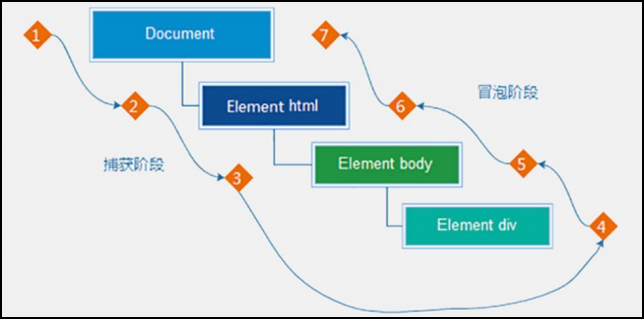

说明：假设页面里有个div，当触发事件时，会经历两个阶段，分别是捕获阶段、冒泡阶段。

简单来说：捕获阶段都是从父到子，冒泡阶段是从子到父。

**实际工作都是使用事件冒泡为主。**

## 2.9、事件捕获

事件捕获概念：从DOM的根元素开始去执行对应的事件（从外到里）。

事件捕获需要写对应代码才能看到效果：

- DOM L0：事件源.on事件 = function() {} 只有冒泡阶段，没有捕获阶段；
- DOM L2：事件源.addEventListener(事件， 事件处理函数[，是否使用捕获机制])；
  - 第三个参数，默认false（不触发捕获阶段，触发冒泡阶段）；

**此时不使用捕获机制，只使用冒泡机制，所以点最里层的d1时，事件会向上冒泡：**

```html
  <div id="d3">
    <div id="d2">
      <div id="d1"></div>
    </div>
  </div>
  <script>
    const d3 = document.querySelector('#d3');
    const d2 = document.querySelector('#d2');
    const d1 = document.querySelector('#d1');
    d3.addEventListener('click', function () { alert('d3'); });
    d2.addEventListener('click', function () { alert('d2'); });
    d1.addEventListener('click', function () { alert('d1'); });
  </script>
```

**此时三层div都使用捕获机制，点击最里层d1时，依次打印d3，d2，d1：**

```html
  <div id="d3">
    <div id="d2">
      <div id="d1"></div>
    </div>
  </div>
  <script>
    const d3 = document.querySelector('#d3');
    const d2 = document.querySelector('#d2');
    const d1 = document.querySelector('#d1');
    d3.addEventListener('click', function () { alert('d3'); }, true);
    d2.addEventListener('click', function () { alert('d2'); }, true);
    d1.addEventListener('click', function () { alert('d1'); }, true);
  </script>
```

**此时最外层使用捕获机制。因此点击最里层d1后，依次打印d3，d1，d2：**

```html
  <div id="d3">
    <div id="d2">
      <div id="d1"></div>
    </div>
  </div>
  <script>
    const d3 = document.querySelector('#d3');
    const d2 = document.querySelector('#d2');
    const d1 = document.querySelector('#d1');
    d3.addEventListener('click', function () { alert('d3'); }, true);
    d2.addEventListener('click', function () { alert('d2'); });
    d1.addEventListener('click', function () { alert('d1'); });
  </script>
```

## 2.10、事件冒泡

事件冒泡概念：当一个元素的事件被触发时，同样的事件将会在该元素的所有祖先元素中依次被触发。这一过程被称为冒泡。

简单理解：当一个元素触发事件后，会依次向上调用所有父级元素的**同名事件**。

## 2.11、阻止冒泡

问题：因为默认就有冒泡模式的存在，所以容易导致事件影响到父级元素。

需求：若想把事件就限制在当前元素内，就需要组织事件冒泡。

前提：阻止事件冒泡需要拿到事件对象。

```html
  <div id="d3">
    <div id="d2">
      <div id="d1"></div>
    </div>
  </div>
  <script>
    const d3 = document.querySelector('#d3');
    const d2 = document.querySelector('#d2');
    const d1 = document.querySelector('#d1');
    d3.addEventListener('click', function () { alert('d3'); });
    d2.addEventListener('click', function () { alert('d2'); });
    d1.addEventListener('click', function () { 
        alert('d1');
        // 此方法可以阻断事件流动传播，不光在冒泡阶段有效，捕获阶段也有效
        e.stopPropagation();
    });
  </script>
```

## 2.12、阻止默认行为

我们某些情况下需要阻止默认行为的发生，比如阻止链接的跳转，表单域跳转：

```html
  <form action="http://www.baidu.com">
    姓名：<input type="text" />
    <input type="submit" value="提交1" />
    <button>提交2</button>
  </form>
  <a href="http://www.baidu.com">百度</a>
  <script>
    const form = document.querySelector('form');
    form.addEventListener('click', function (e) {
      console.log(e.target);
      // e.preventDefault();
    });
    const a = document.querySelector('a');
    a.addEventListener('click', function (e) {
      e.preventDefault();
    }); 
  </script>
```

## 2.13、解绑事件

DOM L0：事件源.on事件 = function() {} 解绑事件直接使用null覆盖：

```html
  <button>点击</button>
  <script>
    const btn = document.querySelector('button');
    // 绑定事件
    btn.onclick = function () {
      alert('点击了');
    }
    // 解绑事件
    btn.onclick = null;
  </script>
```

DOM L2：事件源.addEventListener(事件， 事件处理函数)  解绑事件使用removeEventListener（匿名函数无法解绑）：

```js
    function fn() {
      alert('点击了');
    }
    btn.addEventListener('click', fn);
    btn.removeEventListener('click', fn);
```

## 2.14、鼠标经过事件的区别

mouseover和mouseout会有冒泡效果，mouseenter和mouseleave没有冒泡效果（推荐）。

## 2.15、两种注册事件的区别

传统on注册（L0）：

- 同一个对象，后面注册的事件会覆盖前面注册（同一个事件）；
- 直接使用null覆盖就可以实现事件的解绑；
- 都是冒泡阶段执行的；

事件监听注册（L2）：

- 后面注册事件不会覆盖前面注册的事件（同一个事件）；
- 可以通过第三个参数去确定是在冒泡或者捕获阶段执行；
- 必须使用removeEventListener（事件类型，事件处理函数，获取捕获或者冒泡阶段）；
- 匿名函数无法被解绑；

## 2.16、事件委托

不需要循环注册事件，利用事件流的特性，注册一次事件就能完成：

```html
  <ul>
    <li><a href="javascript:void(0);">第一个li</a></li>
    <li><a href="javascript:void(0);">第二个li</a></li>
    <li><a href="javascript:void(0);">第三个li</a></li>
    <p>我是p</p>
  </ul>
  <script>
    const ul = document.querySelector('ul');
    ul.addEventListener('click', function (e) {
      if (e.target.nodeName === 'A') {
        e.target.style.color = 'red';
      }
    });
  </script>
```

事件委托是利用事件流的特征解决一些开发需求的知识技巧：

- 优点：减少注册次数，可以提高程序性能；
- 原理：事件委托其实是利用事件冒泡的特点。给**父元素注册事件**，当我们触发子元素的时候，会冒泡到父元素身上，从而触发父元素的事件；
- 事件对象.target.tagName/nodeName可以获得真正触发事件的元素；

**TAB栏切换改造案例：**

```html
  <script>
    const ul = document.querySelector('.tab-nav ul');
    const items = document.querySelectorAll('.tab-content div');
    // 给ul绑定点击事件
    ul.addEventListener('click', function (e) {
      // 判定事件对象标签是不是Ass
      if (e.target.nodeName === 'A') {
        // 获取上一个高亮元素，移除active类
        document.querySelector('.tab-nav .active').classList.remove('active');
        // 给TAB添加active类
        e.target.classList.add('active');
        // 移除内容div的active类
        document.querySelector('.tab-content .active').classList.remove('active');
        // 为tab增加自定义属性
        // 通过dataset获取自定义属性id
        const id = +e.target.dataset.id;//隐式转换，字符串->数值
        // 方式一：通过nth-child获取指定div，添加active类
        // document.querySelector(`.tab-content div:nth-child(${id + 1})`).classList.add('active');
        // 方式二：直接获取数组元素
        items[id].classList.add('active');
      }
    });
  </script>
```

## 2.17、其他事件

### 2.17.1、页面加载事件

#### 2.17.1.1、资源加载事件

触发时机：外部资源（图片、外联CSS和JavaScript等）加载完毕时触发。

为什么需要它：

- 有些时候需要等页面资源全部处理完了做一些事情；
- 一些老代码喜欢把script写在head中，这时候直接找dom元素找不到；

监听页面所有资源加载完毕：

```js
    window.addEventListener('load', function () {
      console.log('morning')
    })
```

监听某个资源（超大图片等）加载完毕：

```html
  <script>
    const img = document.querySelector('img');
    img.addEventListener('load', function () {
      console.log('morning')
    })
  </script>
</head>
<body>
  
</body>
```

#### 2.17.1.2、HTML加载事件

**触发时机：**当初始的HTML文档被完全加载和解析完成之后，DOMContentLoaded事件被触发，而无需等待样式表、图像等完全加载。

监听页面DOM加载完毕：

```js
    document.addEventListener('DOMContentLoaded', function () { })
```

### 2.17.2、元素滚动事件

获取位置：

- 获取被卷曲的大小、获取元素内容往左、往上滚出去看不到的距离；

- 这两个值是**可以读写**的；

  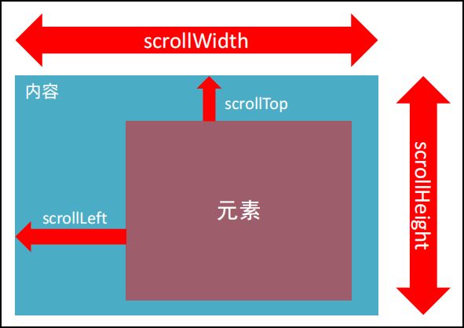

```html
  <style>
    body {
      padding-left: 20px;
      padding-top: 20px;
      height: 2000px;
    }

    div {
      margin-top: 800px;
      width: 300px;
      height: 300px;
      overflow: scroll;
      border: 1px solid black;
      display: none;
    }
  </style>
  
  <script>
    const div = document.querySelector('div');
    // 给单个元素绑定滚动事件
    div.addEventListener('scroll', function () {
      console.log(div.scrollTop)
    })
    // 给整个页面绑定滚动事件
    window.addEventListener('scroll', function () {
      // 获取整个页面的滚动距离
      // document.documentElement是获取整个HTML元素
      const n = document.documentElement.scrollTop;
      if (n >= 400) {
        div.style.display = 'block';
      } else {
        div.style.display = 'none';
      }
    })
  </script>
```

电梯导航案例：

```html
  <script>
    // 获取电梯导航
    const elevatorDiv = document.querySelector('.xtx-elevator');
    // 获取返回顶部按钮
    const backTopBtn = document.querySelector('#backTop');

    // 给页面绑定scroll事件
    window.addEventListener('scroll', function () {
      const n = document.documentElement.scrollTop;
      // 当scrollTop >= 300 的时候，显示通过opacity显示电梯导航
      // 否则，通过opacity隐藏电梯导航
      elevatorDiv.style.opacity = n >= 300 ? 1 : 0;
    })
    // 点击返回顶部按钮，将scrollTop设置为0
    backTopBtn.addEventListener('click', function () {
      // 方式一：
      document.documentElement.scrollTop = 0;
      // 方式二：
      // window.scrollTo(x, y);
      window.scrollTo(0, 0);
    })
  </script>
```

### 2.17.3、页面尺寸事件

会在窗口尺寸改变的时候触发事件：

```js
    window.addEventListener('resize', function () {
      let n = document.documentElement.clientHeight;
      console.log(n);
    })
```

#### 2.17.3.1、clientWidth和clientHeight

获取元素的可见部分宽高（不包含边框、margin、滚动条等）：

**注意：**如果元素是隐藏的，获取的结果是0。

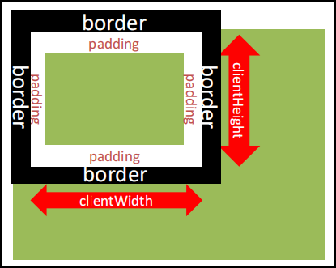

被绿色覆盖部分：

```html
  <style>
    div {
      width: 800px;
      height: 200px;
      border: 2px solid black;
      overflow: scroll;
      background-color: aquamarine;
    }
  </style>
  <script>
    const div = document.querySelector('div');
    console.log(div.clientWidth);
  </script>
```

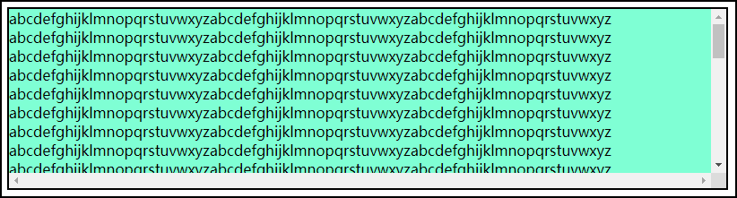

#### 2.17.3.2、offsetHeight和offsetWidth

获取元素的自身宽高、包含元素自身设置的宽高、padding、border。

获取出来的是数值，方便计算。

**注意：**如果元素是隐藏的，获取的结果是0。

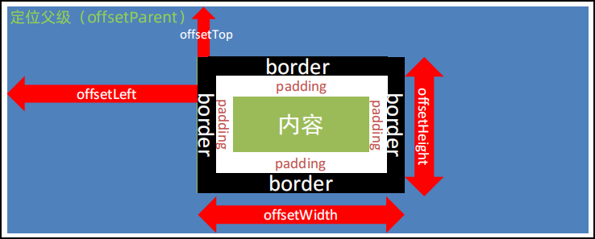

```html
  <style>
    div {
      margin: 50px;
      width: 300px;
      height: 300px;
      background-color: cadetblue;
      border: 2px solid black;
      padding: 10px;
    }

    p {
      width: 50px;
      height: 50px;
      background-color: bisque;
      margin: auto;
    }
  </style>
<body>
  <div>
    <p></p>
  </div>
  <script>
    const div = document.querySelector('div');
    // width:300px + padding:10px * 2 + border:2px * 2 = 324
    console.log(div.offsetWidth);
  </script>
</body>
```

#### 2.17.3.3、offsetLeft和offsetTop

获取元素距离自己定位父级元素的左、上距离。

**注意：**

- 只读属性；
- 得到的位置以带有定位的父级元素为准，没有的话则以文档左上角为准；

```html
  <style>
    body {
      margin: 0;
    }

    div {
      margin: 50px;
      width: 300px;
      height: 300px;
      background-color: cadetblue;
      border: 2px solid black;
      padding: 10px;
      position: relative;
    }

    p {
      width: 50px;
      height: 50px;
      background-color: bisque;
      margin: auto;
    }
  </style>
<body>
  <div>
    <p></p>
  </div>
  <script>
    const p = document.querySelector('p');
    // div设置position:relative前，p的父元素是HTML：
    // (div.width:300 - p.width.50) / 2 + div.padding:10 + div.border:2 + div.margin:50 = 187px
      
    // div设置position:relative后，p的父元素是div：
    // (div.width:300 - p.width.50) / 2 + div.padding:10 = 135px 
    console.log(p.offsetLeft);
  </script>
</body>
```

电梯导航改造案例：

```js
    // 获取entry
    const entry = document.querySelector('.xtx_entry');

	// 给页面绑定scroll事件
    window.addEventListener('scroll', function () {
      const n = document.documentElement.scrollTop;
      // 当scrollTop >= 300 的时候，显示通过opacity显示电梯导航
      // 否则，通过opacity隐藏电梯导航
      elevatorDiv.style.opacity = n >= entry.offsetTop ? 1 : 0;
    })
```

仿新浪固定头部案例：

```html
<style>
        .header {
            position: fixed;
            top: -80px;
            left: 0;
            width: 100%;
            height: 80px;
            background-color: purple;
            text-align: center;
            color: #fff;
            line-height: 80px;
            font-size: 30px;
            transition: all .3s;
        }
</style>

<body>
    <div class="header">我是顶部导航栏</div>
    <div class="content">
        <div class="sk">秒杀模块</div>
    </div>
    <div class="backtop">
        
        <a href="javascript:;"></a>
    </div>
    <script>
        // 获取顶部元素
        const header = document.querySelector('.header');
        // 获取秒杀模块元素
        const sk = document.querySelector('.sk');

        // 为页面绑定滚动事件
        window.addEventListener('scroll', function () {
            // 当滚动内容>=秒杀模块的offsetTop的时候，通过top显示顶部
            // 否则通过top隐藏顶部
            const n = document.documentElement.scrollTop;
            header.style.top = n >= sk.offsetTop ? 0 : '-80px';
        })
    </script>
</body>
```

哔哩哔哩导航滑动案例：

```html
  <style>
    .line {
      transition: all .3s;
    }
  </style>
  <script>
    const list = document.querySelector('.tabs-list')
    const line = document.querySelector('.line')
    list.addEventListener('click', function (e) {
      if (e.target.tarName = 'A') {
        // console.log(11)
        // console.log((e.target.offsetLeft - 16) / 3.75 + 'vw')
        // console.log((e.target.offsetLeft) / 3.75 + 'vw')
        // line.style.left = (e.target.offsetLeft + 16) / 3.75 + 'vw'
        line.style.transform = `translateX(${e.target.offsetLeft}px)`;
      }
    })
  </script>
```

#### 2.17.3.4、getBoundingClientRect()

返回一个对象，包含元素的大小及其相对于视口的位置：

```html
  <script>
    const div = document.querySelector('div');
    const n = div.getBoundingClientRect();
    console.log(n);
  </script>
```

top:8是相对于当前可视窗口的距离。

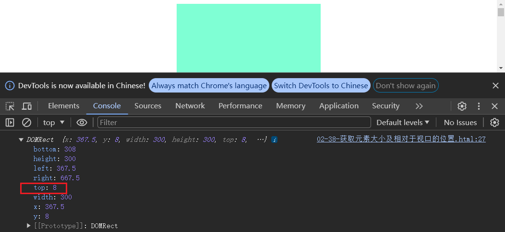

当滚动条向下滚动，整个HTML文档向上卷出，带颜色的DIV盒子相对于整个视觉窗口的向上位置则为top:-192。

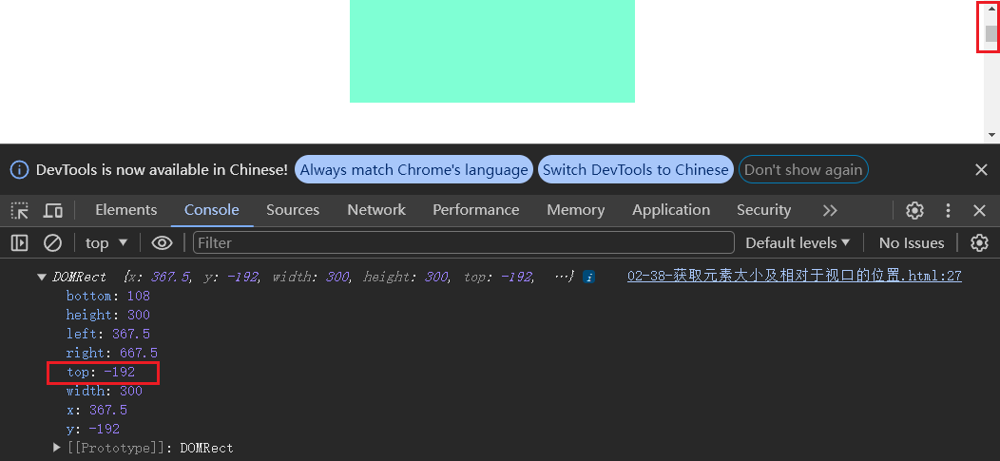

**注意：**通过getBoundingClientRect()获取到的top是会相对于视口而变化的，而scrollTop则是相对于整个HTML文档而言固定不变。

#### 2.17.3.5、总结

| 属性                      | 作用                                     | 说明                                                         |
| ------------------------- | ---------------------------------------- | ------------------------------------------------------------ |
| scrollLeft和scrollTop     | 被卷去的头部和左侧                       | 配合页面滚动来用，**可读写**                                 |
| clientWidth和clientHeight | 获得元素宽度和高度                       | **不包含**border、margin、滚动条<br/>用于js获取元素大小，**只读属性** |
| offsetWidth和offsetHeight | 获得元素宽度和高度                       | **包含**border、padding、滚动条<br/>**只读属性**             |
| offsetLeft和offsetTop     | 获取元素距离自己定位父级元素的左、上距离 | 获取元素位置的时候使用，**只读属性**                         |

### 

```css
html {
  scroll-behavior: smooth;
}
```

```js
    /** 
     * 模块一：
     * 1、当页面滚动至【分类及焦点图】的时候则出现导航，反之则隐藏；
     * 2、点击顶部按钮返回顶部。
     * 
     * 通过opacity控制
     */
    // 获取【分类及焦点图】
    (function () {
      const entry = document.querySelector('.xtx_entry');
      // 获取电梯导航
      const elevator = document.querySelector('.xtx-elevator');
      // 给窗口注册滚动事件
      window.addEventListener('scroll', function () {
        // 获取HTML滚动卷出高度
        const n = document.documentElement.scrollTop;
        // 当卷出高度大于【分类及焦点图】的offsetTop的时候，显示电梯导航，反之则隐藏
        elevator.style.opacity = n > entry.offsetTop ? 1 : 0;
      })
      // 获取顶部按钮
      const backTop = document.querySelector('#backTop');
      backTop.addEventListener('click', function () {
        document.documentElement.scrollTop = 0;
        // window.scrollTop(0, 0);
      })
    })();
```

```js
    /**
     * 模块二：
     * 1、点击各层电梯，高亮显示；
     * 2、点击各层电梯，页面滚动到对应模块。
     */
    // 获取电梯导航
    (function () {
      const elevator = document.querySelector('.xtx-elevator');
      // 通过事件委托，为电梯的父类绑定点击事件
      elevator.addEventListener('click', function (e) {
        // 判断事件对象如果是A标签，并且带有自定义属性name，则添加高亮类
        if (e.target.nodeName && e.target.dataset.name) {
          // 获取当前高亮对象
          const active = document.querySelector('[data-name].active');
          // 若存在高亮对象，则抹去高亮
          if (active) {
            active.classList.remove('active');
          }
          e.target.classList.add('active');
          // 获取自定义属性name，拼接出对应模块的类
          const className = `.xtx_goods_${e.target.dataset.name}`;
          const moduleDiv = document.querySelector(className);
          // 将对应模块的offsetTop赋值给HTML的scrollTop属性
          document.documentElement.scrollTop = moduleDiv.offsetTop;
        }
      })
    })();
```

```js
    /**
     * 模块三：
     * 1、获取各个模块的div
     * 2、在页面滚动事件中，判断HTML的scrollTop与各个模块的大小，并对对应的电梯导航进行高亮
     */
    (function () {
      const newDiv = document.querySelector('.xtx_goods_new');
      const popularDiv = document.querySelector('.xtx_goods_popular');
      const brandDiv = document.querySelector('.xtx_goods_brand');
      const topicDiv = document.querySelector('.xtx_goods_topic');
      window.addEventListener('scroll', function () {
        const active = document.querySelector('.xtx-elevator-list .active')
        // 若存在高亮对象，则抹去高亮
        if (active) {
          active.classList.remove('active');
        }
        const n = document.documentElement.scrollTop;
        if (n >= newDiv.offsetTop && n < popularDiv.offsetTop) {
          document.querySelector('[data-name=new]').classList.add('active');
        } else if (n >= popularDiv.offsetTop && n < brandDiv.offsetTop) {
          document.querySelector('[data-name=popular]').classList.add('active');
        } else if (n >= brandDiv.offsetTop && n < topicDiv.offsetTop) {
          document.querySelector('[data-name=brand]').classList.add('active');
        } else if (n >= topicDiv.offsetTop) {
          document.querySelector('[data-name=topic]').classList.add('active');
        }
      })
    })();
```

## 2.18、日期对象

### 2.18.1、实例化

获得当前时间：

```js
// Sat Jun 15 2020 13:21:51 GMT+0900
const now = new Date();
```

获取指定时间：

```js
const time = new Date('2000-10-14 08:12:00')
```

### 2.18.2、时间对象方法

| 方法          | 作用               | 说明                 |
| ------------- | ------------------ | -------------------- |
| getFullYear() | 获得年份           | 获取四位年份         |
| getMonth()    | 获得月份           | 取值为0~11           |
| getDate()     | 获取月份中的每一天 | 不同月份取值也不相同 |
| getDay()      | 获取星期           | 取值为0~6            |
| getHours()    | 获取小时           | 取值为0~23           |
| getMinutes()  | 获取分钟           | 取值为0~59           |
| getSeconds()  | 获取秒             | 取值为0~59           |

### 2.18.3、时间戳

什么是时间戳：指1970年01月01日00时00分00秒起至现在的毫秒数，它是一种特殊的计量时间的方式。

获取时间戳的三种方式：

```js
// 方式一：
const t1 = +new Date();
// 方式二：
const t2 = new Date().getTime();
// 方式三：
const t3 = Date.now();
```

倒计时案例：

```html
  <script>
    // 随机颜色函数
    // 1. 自定义一个随机颜色函数
    function getRandomColor(flag = true) {
      if (flag) {
        // 3. 如果是true 则返回 #ffffff
        let str = '#'
        let arr = ['0', '1', '2', '3', '4', '5', '6', '7', '8', '9', 'a', 'b', 'c', 'd', 'e', 'f']
        // 利用for循环随机抽6次 累加到 str里面
        for (let i = 1; i <= 6; i++) {
          // 每次要随机从数组里面抽取一个  
          // random 是数组的索引号 是随机的
          let random = Math.floor(Math.random() * arr.length)
          // str = str + arr[random]
          str += arr[random]
        }
        return str

      } else {
        // 4. 否则是 false 则返回 rgb(255,255,255)
        let r = Math.floor(Math.random() * 256)  // 55
        let g = Math.floor(Math.random() * 256)  // 89
        let b = Math.floor(Math.random() * 256)  // 255
        return `rgb(${r},${g},${b})`
      }

    }

    // 页面刷新随机得到颜色
    const countdown = document.querySelector('.countdown')
    countdown.style.backgroundColor = getRandomColor()
    // 函数封装 getCountTime
    function getCountTime() {
      // 1. 得到当前的时间戳
      const now = +new Date()
      // 2. 得到将来的时间戳
      const last = +new Date('2022-4-1 18:30:00')
      // console.log(now, last)
      // 3. 得到剩余的时间戳 count  记得转换为 秒数
      const count = (last - now) / 1000
      // console.log(count)
      // 4. 转换为时分秒
      // h = parseInt(总秒数 / 60 / 60 % 24)   //   计算小时
      // m = parseInt(总秒数 / 60 % 60);     //   计算分数
      // s = parseInt(总秒数 % 60);   
      // let d = parseInt(count / 60 / 60 / 24)               //   计算当前秒数
      let h = parseInt(count / 60 / 60 % 24)
      h = h < 10 ? '0' + h : h
      let m = parseInt(count / 60 % 60)
      m = m < 10 ? '0' + m : m
      let s = parseInt(count % 60)
      s = s < 10 ? '0' + s : s
      console.log(h, m, s)

      //  5. 把时分秒写到对应的盒子里面
      document.querySelector('#hour').innerHTML = h
      document.querySelector('#minutes').innerHTML = m
      document.querySelector('#scond').innerHTML = s
    }
    // 先调用一次
    getCountTime()

    // 开启定时器
    setInterval(getCountTime, 1000)
  </script>
```

## 2.19、节点操作

### 2.19.1、DOM节点

**DOM节点：**DOM树里每一个内容都称之为节点。

**节点类型：**

1. 元素节点：
   - 所有的标签。比如body、div；
   - html是根节点；
2. 属性节点：所有的属性。比如href；
3. 文本节点：所有的文本；
4. 其他。

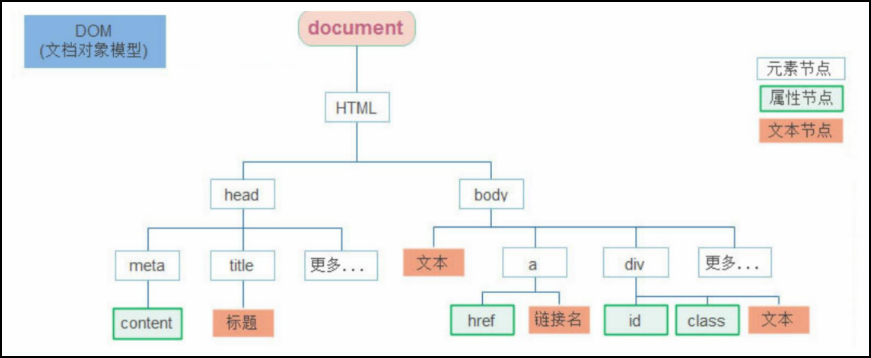

### 2.19.2、查找节点

查找父节点，关闭二维码案例：

```html
  <script>
    const box1 = document.querySelectorAll('.box1');
    for (let i = 0; i < box1.length; i++) {
      box1[i].addEventListener('click', function () {
        // 获取最近一级的父节点，找不到返回null
        this.parentNode.style.display = 'none';
      })
    }
  </script>
```

子节点查找：

- **childNodes：**获得所有子节点、包括文本节点（空格、换行）、注释节点等；
- **children属性（重点）：**仅获得所有元素节点，返回的还是一个伪数组。

兄弟节点查找：

- nextElementSibling：下一个兄弟节点；
- previousElementSibling：上一个兄弟节点。

### 2.19.3、增加节点

```html
<body>
  <ul>
    <li>AAA</li>
    <li>BBB</li>
  </ul>
  <button id="add">增加节点</button>
  <button id="insert">插入节点</button>
  <script>
    const ul = document.querySelector('ul');
    const addBtn = document.querySelector('#add');
    const insertBtn = document.querySelector('#insert');
    addBtn.addEventListener('click', function () {
      // 创建一个新的元素节点('标签名')
      const li = document.createElement('li');
      li.innerHTML = 'CCC';
      // 在父元素ul的最后一个子元素后追加
      ul.appendChild(li);
    })
    insertBtn.addEventListener('click', function () {
      const li = document.createElement('li');
      li.innerHTML = '111';
      // 在父元素ul的某个子元素前插入
      ul.insertBefore(li, ul.children[0]);
    })
  </script>
</body>
```

学成在线重构案例：

```html
        const ul = document.querySelector('.box-bd .clearfix');
        for (let i = 0; i < data.length; i++) {
            const li = document.createElement('li');
            li.innerHTML = `
                            <li>
                                <a href="#">
                                    
                                    <h4>
                                        ${data[i].title}
                                    </h4>
                                    <div class="info">
                                        <span>高级</span> • <span>${data[i].num}</span>人在学习
                                    </div>
                                </a>
                            </li>
                            `
            ul.appendChild(li);
        }
```

克隆节点：

```html
<body>
  <ul>
    <li>
      <p>pppp</p>
      111
    </li>
    <li>222</li>
    <li>333</li>
  </ul>
  <script>
    const ul = document.querySelector('ul');
    const li = document.querySelector('ul li:first-child');
    // 克隆时会不包含后代节点，默认为false
    ul.appendChild(li.cloneNode(false));
    // 克隆时会包含后代节点一起克隆
    ul.appendChild(li.cloneNode(true));
  </script>
</body>
```

### 2.19.4、删除节点

在JS原生DOM操作中，要删除元素必须通过父元素删除：

```html
  <script>
    const ul = document.querySelector('ul');
    const li = document.querySelector('ul li:first-child');
    // 父元素.removeChild(要删除的元素)
    ul.removeChild(li)
  </script>
```

**注意：**

- 如果不存在父子关系则删除不成功；
- 隐藏节点（display:none）不是删除，虽然不显示，但是还是存在于文档中。

## 2.20、M端事件

移动端也有自己独特的地方。比如触屏事件touch（也称触摸事件），Android和IOS都有。

| 触屏touch事件 | 说明                          |
| ------------- | ----------------------------- |
| touchstart    | 手指触摸到一个DOM元素时触发   |
| touchmove     | 手指在一个DOM元素上滑动时触发 |
| touchend      | 手指从一个DOM元素上移开时触发 |

## 2.21、swiper插件使用

官网：https://www.swiper.com.cn/

```html
  <!-- Link Swiper's CSS -->
  <link rel="stylesheet" href="./css/swiper-bundle.min.css" />
  <!-- Swiper JS -->
  <script src="./js/swiper-bundle.min.js"></script>
  <!-- Initialize Swiper -->
  <script>
    const swiper = new Swiper(".mySwiper", {
      pagination: {
        el: ".swiper-pagination",
      },
      autoplay: {
        delay: 1000,
        stopOnLastSlide: false,
        disableOnInteraction: false,
      },
      keyboard: true,
    });
  </script>
```

## 2.22、学生信息表综合案例

```html
  <script>
    const arr = [];
    const infoFm = document.querySelector('.info'); // 表单
    const nameIn = document.querySelectorAll('.info [name]'); // 所有输入框
    const uname = document.querySelector('[name=uname]'); // 姓名
    const age = document.querySelector('[name=age]'); // 年龄
    const gender = document.querySelector('[name=gender]'); // 性别
    const salary = document.querySelector('[name=salary]'); // 薪资
    const city = document.querySelector('[name=city]'); // 城市
    const tbody = document.querySelector('tbody'); // 表格内容
    let uno = 0;
    // 1、录入
    // 点击录入按钮，给表单注册submit事件，
    infoFm.addEventListener('submit', function (e) {
      // 意在阻止表单submit的默认提交行为
      e.preventDefault();
      // 检查录入内容，若有一个为空则提示错误消息
      for (let i = 0; i < nameIn.length; i++) {
        if (!nameIn[i].value) {
          return alert('内容填写不完整，请检查！');
        }
      }
      // 将输入内容装配成对象添加在学生信息数组中
      const student = {
        uno: ++uno,
        uname: uname.value,
        age: age.value,
        gender: gender.value,
        salary: salary.value,
        city: city.value
      }
      arr.push(student);
      // 清空输入框
      infoFm.reset();
      // 渲染表格
      render();
    })
    // 2、渲染
    // 渲染前先清空tbody
    function render() {
      tbody.innerHTML = '';
      for (let i = 0; i < arr.length; i++) {
        // 遍历数组，依次创建tr元素节点，然后添加到tbody中
        const tr = document.createElement('tr');
        tr.innerHTML = `
                        <td>${arr[i].uno}</td>
                        <td>${arr[i].uname}</td>
                        <td>${arr[i].age}</td>
                        <td>${arr[i].gender}</td>
                        <td>${arr[i].salary}</td>
                        <td>${arr[i].city}</td>
                        <td>
                          <a href="javascript:" data-id="${i}">删除</a>
                        </td>
                      `;
        tbody.appendChild(tr);
      }
    }
    // 3、删除
    // 为每个a标签附上自定义属性
    // 通过事件委托为tbody添加点击事件
    tbody.addEventListener('click', function (e) {
      // 若事件对象是a标签，则获取对象自定义属性id，通过id对数组做splice操作
      if (e.target.nodeName === 'A') {
        const id = e.target.dataset.id;
        arr.splice(id, 1);
        // 调用渲染操作
        render();
      }
    })
  </script>
```

## 2.23、Window对象

### 2.23.1、BOM(浏览器对象模型)

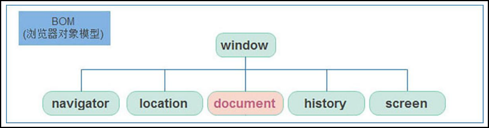

- window对象是一个全局对象，也可以说是JavaScript中的顶级对象；
- 像document、alert()、console.log()这些都是window的属性，基本BOM的属性和方法都是window的；
- 所有通过var定义在全局作用域中的变量、函数都会变成window对象的属性和方法；
- window对象下的属性和方法调用的时候可以省略window。

### 2.23.2、定时器-延时器

```HTML
  <script>
    // JS内置函数，调用时可省略window
    // 每一次调用延时器都会产生一个新的延时器
    let timer = setTimeout(() => {
      console.log(222);
    }, 3000);
    // 清除延时函数
    // clearTimeout(timer);
  </script>
```

两种定时器对比：

- 延时函数：执行一次；
- 间歇函数：每隔一段时间就执行一次，除非手动清除。

### 2.23.3、JS执行机制

**经典面试题：**

```js
    // 执行顺序：111->333->222
    console.log(111);
    setTimeout(() => {
      console.log(222)
    }, 1000);
    console.log(333);
```

```js
    // 执行顺序：111->333->222
    console.log(111);
    setTimeout(() => {
      console.log(222)
    }, 0);
    console.log(333);
```

JavaScript 语言的一大特点就是单线程，也就是说，同一个时间只能做一件事。

这是因为 Javascript 这门脚本语言诞生的使命所致——JavaScript 是为处理页面中用户的交互，以及操作

DOM 而诞生的。比如我们对某个 DOM 元素进行添加和删除操作，不能同时进行。 应该先进行添加，之

后再删除。

单线程就意味着，所有任务需要排队，前一个任务结束，才会执行后一个任务。这样所导致的问题是：

如果 JS 执行的时间过长，这样就会造成页面的渲染不连贯，导致页面渲染加载阻塞的感觉。

**同步任务：**

同步任务都在主线程上执行，形成一个执行栈。

**异步任务：**

JS 的异步是通过回调函数实现的。

一般而言，异步任务有以下三种类型：

1. 普通事件，如 click、resize 等；
2. 资源加载，如 load、error 等；
3. 定时器，包括 setInterval、setTimeout 等。

异步任务相关添加到**任务队列**中（任务队列也称为消息队列）。

**事件循环：**

1. 先执行执行栈中的同步任务；

2. 异步任务放入任务队列中；

3. 一旦执行栈中的所有同步任务执行完毕，系统就会按次序读取任务队列中的异步任务，于是被读取的异步任务结束等待

   状态，进入执行栈，开始执行。

   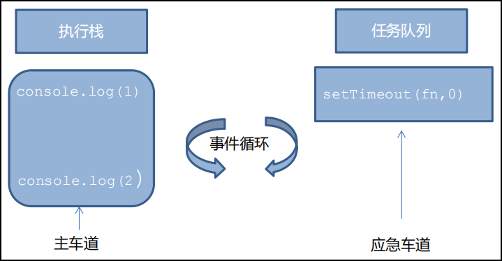

   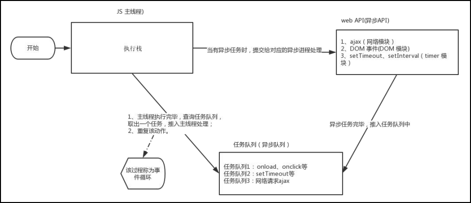

   由于主线程不断的重复获得任务、执行任务、再获取任务、再执行，所以这种机制被称为**事件循环（event loop）**。

### 2.23.4、location对象

location的数据类型是对象，它拆分并保存了URL地址的各个组成部分。

**常用属性和方法：**

- href：获取完整的URL地址，对其赋值时用于地址的跳转；

- search：获取地址中携带的参数，符号?后面部分；

- hash：获取地址中的哈希值，符号#后买你部分。候签vue路由的铺垫，经常用于不刷新页面，显示不同页面，比如：网易云音乐；

- reload：刷新当前页面，传入参数 true时表示强制刷新（从服务器请求资源）。

  ```js
  // 强制刷新，类似CTRL + F5
  location.reload(true)
  ```

### 2.23.5、navigator对象

navigator的数据类型是对象，该对象下记录了浏览器自身的相关信息。

常用属性和方法：

- userAgent：检测浏览器的版本及平台；

  ```js
      // 检测 userAgent（浏览器信息）
      !(function () {
        const userAgent = navigator.userAgent
        // 验证是否为Android或iPhone
        const android = userAgent.match(/(Android);?[\s\/]+([\d.]+)?/)
        const iphone = userAgent.match(/(iPhone\sOS)\s([\d_]+)/)
        // 如果是Android或iPhone，则跳转至移动站点
        if (android || iphone) {
          location.href = 'http://www.bilibili.com'
        }
      })()
  ```

### 2.23.6、histroy对象

histroy的数据类型是对象，主要管理历史记录，该对象与浏览器地址栏的操作相对应，如前进、后退、历史记录等。

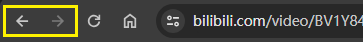

常用属性和方法：

- back()：后退功能；
- forward()：前进功能；
- go(参数)：前进后退功能。参数如果是1前进1个页面；如果是-1后退1个页面。

## 2.24、本地存储

**本地存储-localStorage：**

1. 可以将数据永久存储再本地（用户的电脑），除非手动删除，否则关闭页面也会存在；

2. 可以多窗口（页面）共享（同一浏览器可以共享）；

3. 数据操作：

   ```js
   localStorage.setItem(key, value);
   localStorage.getItem(key, value);
   localStorage.removeItem(key, value);
   ```

**本地存储-sessionStorage：**

1. 生命周期为关闭浏览器窗口；
2. 在同一个窗口（页面）共享；
3. 数据操作同localStorage；

**存储复杂数据类型：**

1. 复杂数据类型 -> JSON字符串：JSON.stringify(复杂数据类型)；
2. 取出来的字符串 -> 对象：JSON.parse(JSON字符串)。

**学生就业信息表综合案例：**

```js
    // 0、获取数据，如果为空，则设置空数组
    const data = localStorage.getItem('data');
    const arr = data ? JSON.parse(data) : [];
    const tbody = document.querySelector('tbody');
    // 1、渲染
    function render() {
      const tr = arr.map((ele, idx) => {
        return `<tr>
                  <td>${ele.stuId}</td>
                  <td>${ele.uname}</td>
                  <td>${ele.age}</td>
                  <td>${ele.gender}</td>
                  <td>${ele.salary}</td>
                  <td>${ele.city}</td>
                  <td>
                    <a href="javascript:" data-id="${idx}">删除</a>
                  </td>
                </tr>`
      }).join('');
      tbody.innerHTML = tr;
    }
    render();
    // 2、录入
    const info = document.querySelector('.info');
    const items = info.querySelectorAll('[name]');
    info.addEventListener('submit', function (e) {
      e.preventDefault();
      const obj = {};
      for (let i = 0; i < items.length; i++) {
        const item = items[i];
        if (!item.value) {
          return alert('请输入完整信息！');
        }
        obj[item.name] = item.value;
      }
      obj.stuId = arr.length ? arr[arr.length - 1].stuId + 1 : 1;
      arr.push(obj);
      render();
      localStorage.setItem('data', JSON.stringify(data));
      this.reset();
    })
    // 3、删除
    tbody.addEventListener('click', function (e) {
      if (e.target.nodeName !== 'A') {
        return;
      }
      if (!confirm('确认删除吗？')) {
        return;
      }
      arr.splice(e.target.dataset.id, 1);
      render();
      localStorage.setItem('data', JSON.stringify(arr));
    })
```

## 2.25、正则表达式

### 2.25.1、使用

```js
    // 1、定制规则
    const reg = /哈/; // 规则是字符中含有一个‘哈’
    // 2、验证
    console.log(reg.test('哈')); // true
    console.log(reg.test('哈哈')); // true
    console.log(reg.test('A')); // false
    // 3、查找匹配
    // 成功返回一个数组：['哈', index: 8, input: 'aabbdadf哈哈sdfadfaA哈哈', groups: undefined]
    // 失败返回null
    console.log(reg.exec('aabbdadf哈哈sdfadfaA哈哈'));

	console.log(/abc/.test('cmabc')); // true
```

### 2.25.2、边界符

```js
    const reg1 = /^A/;
    console.log(reg1.test('A')); // true
    console.log(reg1.test('AB')); // true
    console.log(reg1.test('CA')); // false

    const reg2 = /A$/;
    console.log(reg2.test('A')); // true
    console.log(reg2.test('AB')); // false
    console.log(reg2.test('CA')); // true

    const reg3 = /^A$/;
    console.log(reg3.test('A')); // true
    console.log(reg3.test('AB')); // false
    console.log(reg3.test('CA')); // false

    const reg4 = /^AB$/;
    console.log(reg4.test('A')); // false
    console.log(reg4.test('AB')); // true
    console.log(reg4.test('CA')); // false
```

### 2.25.3、量词

```js
    const reg1 = /^A*$/;
    console.log(reg1.test('BB')); // false
    console.log(reg1.test('')); // true
    console.log(reg1.test('A')); // true
    console.log(reg1.test('AA')); // true

    const reg2 = /^A+$/;
    console.log(reg2.test('BB')); // false
    console.log(reg2.test('A')); // true
    console.log(reg2.test('AA')); // true
    console.log(reg2.test('AB')); // false

    const reg3 = /^A?$/;
    console.log(reg3.test('')); // true
    console.log(reg3.test('A')); // true
    console.log(reg3.test('AA')); // false
    console.log(reg3.test('BA')); // false

    const reg4 = /^A{2}$/;
    console.log(reg4.test('')); // false
    console.log(reg4.test('A')); // false
    console.log(reg4.test('AA')); // true
    console.log(reg4.test('AAA')); // false

    const reg5 = /^A{2,}$/;
    console.log(reg5.test('A')); // false
    console.log(reg5.test('AA')); // true
    console.log(reg5.test('AAA')); // false

    const reg6 = /^A{2,4}$/;
    console.log(reg6.test('A')); // false
    console.log(reg6.test('AA')); // true
    console.log(reg6.test('AAA')); // true
    console.log(reg6.test('AAAA')); // true
    console.log(reg6.test('AAAAA')); // false
```

### 2.25.4、字符集

```js
    const reg1 = /[a-z]/;
    console.log(reg1.test('a')); // true
    console.log(reg1.test('A')); // false
    console.log(reg1.test('1')); // false

    const reg2 = /[a-z0-9]/;
    console.log(reg2.test('A')); // false
    console.log(reg2.test('!')); // false
    console.log(reg2.test('1')); // true
    console.log(reg2.test('a')); // true

    const reg3 = /[^a-z]/;
    console.log(reg3.test('a')); // false
    console.log(reg3.test('1')); // true
    console.log(reg3.test('A')); // true

    const reg4 = /./; // 匹配换行符之外的任何一个字符
    console.log(reg4.test('a1')); // true
    console.log(reg4.test('1A')); // true
    console.log(reg4.test('\r\n')); // false
    console.log(reg4.test('\r\n1')); // true

    const reg5 = /[.]/;
    console.log(reg5.test('.')); // true
    console.log(reg5.test('1')); // false
    console.log(reg5.test('A')); // false
```

**验证用户名案例：**

```html
    <style>
        span {
            display: inline-block;
            width: 250px;
            height: 30px;
            vertical-align: middle;
            line-height: 30px;
            padding-left: 15px;
        }

        .error {
            color: red;
            background: url(./images/error1.png) no-repeat left center;
        }

        .right {
            color: green;
            background: url(./images/right.png) no-repeat left center;
        }
    </style>
    
    <script>
        const text = document.querySelector('input');
        const span = text.nextElementSibling;
        text.addEventListener('blur', function () {
            const reg = /^[a-zA-Z0-9_]{6,16}$/
            if (reg.test(this.value)) {
                span.innerHTML = '输入正确';
                span.className = 'right';
            } else {
                span.innerHTML = '输入有误';
                span.className = 'error';
            }
        })
    </script>
```

### 2.25.5、预定类

预定类：某些常见模式的简写方式。

| 预定类 | 说明                                                         |
| ------ | ------------------------------------------------------------ |
| \d     | 匹配0-9之间的任一数字，相当于[0-9]                           |
| \D     | 匹配所有0-9以外的字符，相当于\[^0-9\]                        |
| \w     | 匹配任意的字母、数字和下划线，相当于[A-Za-z0-9_]             |
| \W     | 除所有字母、数字和下划线以外的字符，相当于\[^A-Za-z0-9_\]    |
| \s     | 匹配所有空格（包括换行符、制表符、空格符等），相等于[\t\r\n\v\f] |
| \S     | 匹配非空格的字符，相当于\[^\t\r\n\v\f\]                      |

### 2.25.6、修饰符

i：ignore，正则匹配时字母不区分大小写。

g：global，全局匹配。

```js
    const str = 'aAaBaCaD';
    console.log(str.replace(/a/ig, '嗨')); // 嗨嗨嗨B嗨C嗨D
```

## 2.26、注册页面案例

```html
  <script>
    (function () {
      // 发送验证码
      const code = document.querySelector('.code');
      // 是否已发送验证码
      let send = false;
      // 点击发送验证码
      code.addEventListener('click', function () {
        // 防止连续点击，若已发送，则不执行倒计时显示
        if (send) {
          return;
        }
        // 5秒倒计时
        let count = 5;
        // 将状态设置成已发送
        send = true;
        // 初始倒计时显示
        this.innerHTML = `0${count}秒后重新发送`;
        // 开始倒计时
        let timer = setInterval(() => {
          count--;
          this.innerHTML = `0${count}秒后重新发送`;
          if (count === 0) {
            // 取消倒计时
            this.innerHTML = '发送验证码';
            // 将连接恢复可发送状态
            send = false;
            clearInterval(timer);
          }
        }, 1000);
      })
    })();

    // 用户名验证
    const username = document.querySelector('[name=username]');
    // 不用blur，用change，当鼠标离开表单，并且表单值发生变化的时候触发
    username.addEventListener('change', verifyUsername);
    function verifyUsername() {
      const span = username.nextElementSibling;
      const reg = /^[a-zA-Z0-9-_]{6,10}$/;
      if (!reg.test(username.value)) {
        span.innerText = '请输入6~10的字符';
        return false;
      }
      span.innerText = '';
      return true;
    }

    // 手机号验证
    const phone = document.querySelector('[name=phone]');
    phone.addEventListener('change', verifyPhone);
    function verifyPhone() {
      const span = phone.nextElementSibling;
      const reg = /^1(3\d|4[5-9]|5[0-35-9]|6[567]|7[0-8]|8\d|9[0-35-9])\d{8}$/;
      if (!reg.test(phone.value)) {
        span.innerText = '请输入11位有效手机号';
        return false;
      }
      span.innerText = '';
      return true;
    }

    // 验证码验证
    const code = document.querySelector('[name=code]');
    code.addEventListener('change', verifyCode);
    function verifyCode() {
      const span = code.nextElementSibling;
      const reg = /^\d{6}$/;
      if (!reg.test(code.value)) {
        span.innerText = '请输入6位数字验证码';
        return false;
      }
      span.innerText = '';
      return true;
    }

    // 密码验证
    const password = document.querySelector('[name=password]');
    password.addEventListener('change', verifyPassword);
    function verifyPassword() {
      const span = password.nextElementSibling;
      const reg = /^[a-zA-Z0-9-_]{6,20}$/;
      if (!reg.test(password.value)) {
        span.innerText = '请输入6~20的字符';
        return false;
      }
      span.innerText = '';
      return true;
    }

    // 确认密码验证
    const cnfm = document.querySelector('[name=confirm]');
    cnfm.addEventListener('change', verifyConfirm);
    function verifyConfirm() {
      const span = cnfm.nextElementSibling;
      if (password.value !== cnfm.value) {
        span.innerText = '两次输入密码不一致';
        return false;
      }
      span.innerText = '';
      return true;
    }

    // 同意协议验证
    const agree = document.querySelector('.icon-queren');
    agree.addEventListener('click', function () {
      this.classList.toggle('icon-queren2');
    });

    // 提交
    const form = document.querySelector('form');
    form.addEventListener('submit', function (e) {
      if (!agree.classList.contains('icon-queren2')) {
        alert('请勾选同意协议');
        e.preventDefault();
      }

      if (!verifyUsername()) e.preventDefault();
      if (!verifyPhone()) e.preventDefault();
      if (!verifyCode()) e.preventDefault();
      if (!verifyPassword()) e.preventDefault();
      if (!verifyConfirm()) e.preventDefault();
    })
  </script>
```

## 2.27、登录页面案例

```html
  <script>
    localStorage.removeItem('user');
    // 切换tab
    const tabNav = document.querySelector('.tab-nav');
    tabNav.addEventListener('click', function (e) {
      if (e.target.tagName !== 'A') {
        return;
      }
      // 获取所有tab
      const tab = tabNav.querySelectorAll('a');
      // 获取所有tab-pane
      const tabPanel = document.querySelectorAll('.tab-pane');
      // 获取所有
      for (let i = 0; i < tab.length; i++) {
        // 清除active样式
        tab[i].classList.remove('active');
        tabPanel[i].style.display = 'none';
      }
      // 通过e.target获取对应元素，添加active样式
      e.target.classList.add('active');
      tabPanel[e.target.dataset.id].style.display = 'block';
    })

    // 点击登录
    const form = document.querySelector('form');
    form.addEventListener('submit', function (e) {
      e.preventDefault();
      const agree = document.querySelector('[name=agree]');
      if (!agree.checked) {
        return alert('请勾选已同意');
      }
      const username = document.querySelector('[name=username]');
      const password = document.querySelector('[name=password]');
      const user = {
        username: username.value,
        password: password.value
      }
      localStorage.setItem('user', JSON.stringify(user));
      this.reset();
      location.href = './02-62-首页页面案例.html';
    })
  </script>
```

## 2.28、首页页面案例

```html
  <script>
    render();
    function render() {
      const user = JSON.parse(localStorage.getItem('user'));
      const li1 = document.querySelector('.xtx_navs li:first-Child');
      const li2 = li1.nextElementSibling;
      if (user && user.username) {
        // <a href="javascript:;"><i class="iconfont icon-user"> pink老师</i></a>
        // <a href="javascript:;">退出登录</a>
        li1.innerHTML = `<a href="javascript:;"><i class="iconfont icon-user">${user.username}</i></a>`
        li2.innerHTML = `<a href="javascript:;">退出登录</a>`
      } else {
        li1.innerHTML = `<a href="./02-61-登录页面案例.html">请先登录</a>`
        li2.innerHTML = `<a href="./02-60-注册页面案例.html">免费注册</a>`
      }
    }

    // 退出登录
    const xtxNavs = document.querySelector('.xtx_navs');
    xtxNavs.addEventListener('click', function (e) {
      if (e.target.tagName === 'A' && e.target.innerText === '退出登录') {
        localStorage.removeItem('user');
        render();
      }
    })
  </script>
```

## 2.29、放大镜效果案例

```html
  <script>
    const small = document.querySelector('.small');
    const middle = document.querySelector('.middle');
    const large = document.querySelector('.large');
    let timer = 0;

    // 鼠标经过小盒子的时候，添加边框，并且在中盒子中显示
    // mouseover和mouseout会有冒泡效果，mouseenter和mouseleave没有冒泡效果
    small.addEventListener('mouseover', function (e) {
      if (e.target.nodeName === 'IMG') {
        // 清除现有active样式
        const active = small.querySelector('.active');
        active.classList.remove('active');
        // 给img的父元素li添加active样式
        e.target.parentNode.classList.add('active');
        // 给middle下的img元素更换src
        middle.querySelector('img').src = e.target.src;
        // 给大盒子设置背景图片
        large.style.backgroundImage = `url(${e.target.src})`;
        /**
         * 注意：页面初始化的时候，大盒子的背景图片是空的
         * 所以在刚进页面鼠标进入中盒子就显示大盒子的时候，背景图片是空的，不太友好
         * 所以在css或者在js里初始加载的时候给大盒子设置一个初始img比较好
         */
      }
    })

    // 显示
    function show() {
      clearTimeout(timer);
      large.style.display = 'block';
    }
    // 隐藏
    function hide() {
      timer = setTimeout(() => {
        large.style.display = 'none';
      }, 200);
    }
    // 鼠标进入中盒子的时候，显示大盒子
    middle.addEventListener('mouseenter', show);
    // 鼠标离开中盒子的时候，隐藏大盒子，延迟隐藏
    middle.addEventListener('mouseleave', hide);
    // 鼠标进入大盒子的时候，显示大盒子
    large.addEventListener('mouseenter', show);
    // 鼠标离开大盒子的时候，隐藏大盒子，延迟隐藏
    large.addEventListener('mouseleave', hide);

    const layer = document.querySelector('.layer');
    // 鼠标进入中盒子的时候，显示遮罩
    middle.addEventListener('mouseenter', function () {
      layer.style.display = 'block';
    })
    // 鼠标离开中盒子的时候，隐藏遮罩
    middle.addEventListener('mouseleave', function () {
      layer.style.display = 'none';
    })

    // 鼠标移动，遮罩跟随
    middle.addEventListener('mousemove', function (e) {
      // pageY随着页面的滚动不变，clientY则是始终相对导航栏的距离
      // middle.getBoundingClientRect(); 相对于视口
      // 获取鼠标位置
      let x = e.pageX - middle.getBoundingClientRect().left;
      let y = e.pageY - middle.getBoundingClientRect().top - document.documentElement.scrollTop;
      if (x >= 0 && x <= 400 && y >= 0 && y <= 400) {
        // 黑色盒子不是一直移动的
        let mx = 0, my = 0;
        if (x < 100) mx = 0;
        if (x >= 100 && x <= 300) mx = x - 100;
        if (x > 300) mx = 200;
        if (y < 100) my = 0;
        if (y >= 100 && y <= 300) my = y - 100;
        if (y > 300) my = 200;

        layer.style.left = mx + 'px';
        layer.style.top = my + 'px';
        // 大盒子的背景图片要跟随 中等盒子移动  存在的关系是 2倍
        large.style.backgroundPositionX = -2 * mx + 'px';
        large.style.backgroundPositionY = -2 * my + 'px';
      }
    })
  </script>
```

# 3、JS进阶

## 3.1、垃圾回收机制

生命周期：内存分配，内存使用，内存回收（使用完毕，由垃圾回收器自动回收不再使用的内存）。

说明：

- 全局变量一般不会回收（关闭页面回收）；
- 一般情况下局部变量的值，不用了，会被自动回收掉。

内存泄漏：程序中分配的内存由于某种原因程序未释放或无法释放叫做内存泄漏。

### 3.1.1、引用计数法

IE采用的引用计数算法，定义“内存不再使用”，就是看一个对象是否有指向它的引用，没有引用了就回收对象。

算法：

1. 跟踪记录被引用的次数；
2. 如果被用了就+1，多次引用就累加++；
3. 如果减少引用就-1；
4. 如果引用次数是0，则释放内存；

但它却存在一个致命问题：嵌套引用（循环引用）。如果两个对象相互引用，尽管他们已不再使用，垃圾回收器不会进行回收，导致内存泄漏。

```js
function fn() {
	let o1 = {};
	let o2 = {};
	o1.a = o2;
	o2.a = o1;
	return 'any';
}
fn();
```

因为他们的引用次数永远不会是0。这样的相互引用如果说很大量的存在就会导致大量的内存泄漏。

### 3.1.2、标记清除法

现代的浏览器已经不再使用引用计数算法了。

核心：

1. 将“不再使用的对象”定义为“无法达到的对象”；
2. 就是从根部（在JS中就是全局对象）出发定时扫描内存中的对象。凡是能从根部到达的对象，都是还需要使用的；
3. 那些无法由根部出发无法触及到的对象被标记为不再使用，稍后进行回收。

引用计数法中说到的循环引用的例子，因为是在函数内部的对象，根部已经访问不到，所以自动清除。

## 3.2、闭包

### 3.2.1、什么是闭包

内层函数使用外层函数的变量，如下：

```js
    function outer() {
      const i = 0;
      function inner() {
        console.log(i);
      }
      inner();
    }
    outer();
```

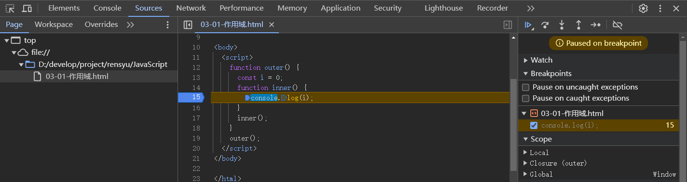

### 3.2.2、常用形式

保护变量，提供操作：

```Js
    function outer() {
      const i = 0;
      function inner() {
        console.log(i);
      }
      return inner();
    }
    outer();
```

### 3.2.3、计数器案例

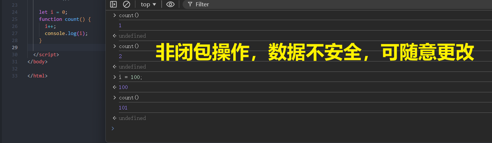

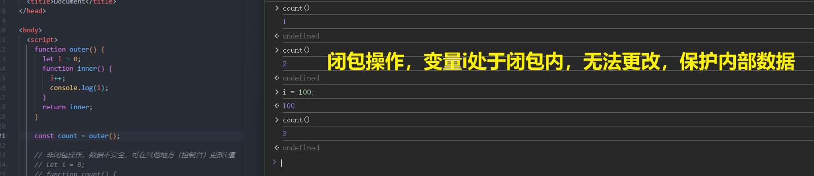

### 3.2.4、闭包的作用

封闭数据，实现数据私有，外部也可以访问函数内部的变量。

闭包很有用，因为它允许将函数与其所操作的某些数据（环境）关联起来。

### 3.2.5、内存泄漏

垃圾回收机制（标记清除法）中提到的，由根部(window)出发无法触及到的对象被标记为不再使用，稍后进行回收。

而在闭包当中，从根部出发由于函数的引用，一层一层往回找，是可以触及到外层函数的变量对象的，所以就不会进行垃圾回收，因此存在内存泄漏的问题。

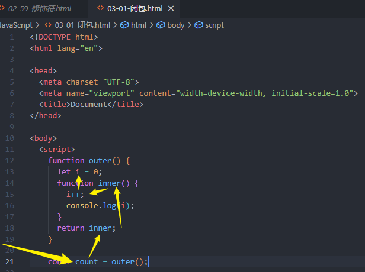

## 3.3、变量提升

变量提升流程：

1. 先把var变量提升到当前作用域最前面；
2. 只提升变量声明，不提升变量赋值；
3. 然后依次执行代码。

因此，不建议使用var声明变量。ES6引入了块级作用域，用let或者const声明变量。

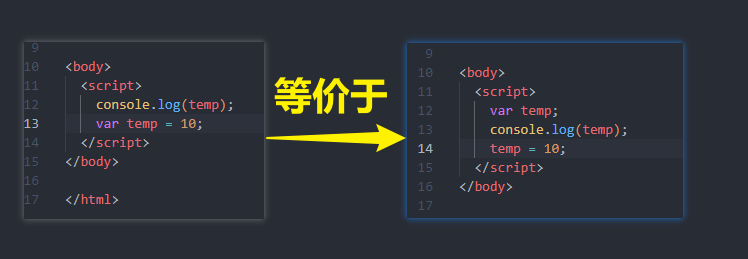

## 3.4、函数进阶

### 3.4.1、函数提升

函数提升与变量提升比较类似，是指函数在声明之前即可被调用。

总结：

1. 函数提升能够使函数的声明调用更灵活；
2. 函数表达式不存在提升的现象；
3. 函数提升出现在相同作用域当中。

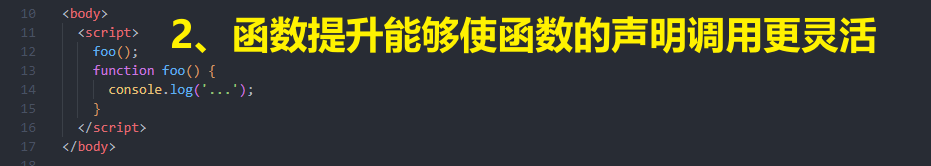

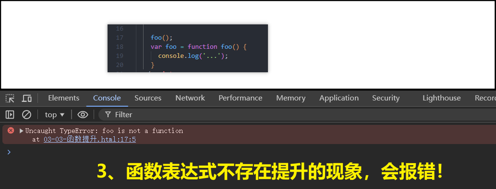

### 3.4.2、动态参数

arguments是函数内部内置的伪数组变量，它包含了调用函数时传入的所有实参。

```js
    function getSum() {
      console.log('arguments => ', arguments);
      console.log('arguments.length => ', arguments.length);
      let sum = 0;
      for (let i = 0; i < arguments.length; i++) {
        sum += arguments[i];
      }
      console.log('sum => ', sum);
    }

    getSum();//打印args不报错，0，0
    getSum(1, 2);//打印args，2，3
    getSum(1, 2, 3);//打印args，3，6
```

总结：

1. arguments是一个伪数组，只存在于函数中；
2. arguments的作用是动态获取函数的实参；
3. 可以通过for循环依次得到传递过来的实参。

### 3.4.3、剩余参数

...是语法符号，置于最末参数之前，用于获取多余的实参。

```js
    function getSum(...arr) {
      console.log('...arr => ', arr);
      console.log('...arr.length => ', arr.length);
      let sum = 0;
      for (let i = 0; i < arr.length; i++) {
        sum += arr[i];
      }
      console.log('sum => ', sum);
    }

    getSum();//打印空数组不报错，0，0
    getSum(1, 2);//打印arr，2，3
    getSum(1, 2, 3);//打印arr，3，6
```

借助...获取的剩余实参，是个真数组。

```js
    function getSum(first, ...arr) {
      console.log('first => ', first);
      console.log('...arr.length => ', arr);
    }

    getSum(1, 2, 3);//1，[2, 3]
```

总结：

1. 剩余参数主要的使用场景：用于获取多余的实参；
2. 剩余参数和动态参数区别是什么？开发中提倡使用哪一个？
   - 动态参数是伪数组；
   - 剩余参数是真数组；
   - 开发中使用剩余参数想必也是极好的。

### 3.4.4、展开运算符

展开数组，不会修改原数组：

```js
const arr = [1, 2, 3];
    console.log(Math.max(...arr));
    console.log(Math.min(...arr));
```

合并数组，不会修改原数组：

```js
    const arr1 = [1, 2, 3];
    const arr2 = [4, 5, 6];
    const arr = [...arr1, ...arr2];
    console.log(arr);
```

### 3.4.5、箭头函数

1. 箭头函数属于表达式函数，因此不存在函数提升；

2. 箭头函数只有一个参数时可以省略圆括号()：

   ```js
   const func = x => console.log(x);
   ```

3. 箭头函数函数体只有一行代码时可以省略花括号{}，并自动作为返回值被返回：

   ```js
   const func = x => x + 1;
   ```

4. 加括号的函数体返回对象字面量表达式：

   ```js
   const func = name => ({ uname : name });
   ```

5. 箭头函数里面不能使用动态参数，只能使用剩余参数；

6. 箭头函数不会自己创建自己的this，它只会从自己的作用域的上一层沿用this：

   ```js
       const fn1 = {
         name: 'xx',
         sayHi: function () {
           console.log(this);// fn1
           const fn2 = () => {
             console.log(this);// fn1
           }
           fn2();
         }
       }
       fn1.sayHi();
   
       const fn3 = {
         name: 'xx',
         sayHi: () => {
           console.log(this);// window
           const fn4 = () => {
             console.log(this);// window
           }
           fn4();
           const fn5 = function () {
             console.log(this);// windows
           }
           fn5();
         }
       }
       fn3.sayHi();
   ```

7. 事件回调函数使用箭头函数时，this为全局的window，因此DOM事件回调函数不推荐使用箭头函数：

   ```js
       btn.addEventListener('click', function () {
         console.log(this);// window
       })
       btn.addEventListener('click', () => {
         console.log(this);// btn
       })
   ```

## 3.5、数组解构

批量将数组中的元素赋值给变量：

```js
    // const [first, last] = [1, 2];
    // console.log(first); // 1
    // console.log(last); // 2

    // 1、值多，变量少
    // const [first, mid, ...others] = [1, 2, 3, 4, 5];
    // console.log(first); // 1
    // console.log(mid); // 2
    // console.log(others); // [3, 4, 5]

    // 2、变量多，值少
    // const [first, mid, last] = [1, 2];
    // console.log(first); // 1ss
    // console.log(mid); // 2
    // console.log(last); // undefined

    // 3、默认值
    // const [first, mid, last = 0] = [1, 2];
    // console.log(first); // 1
    // console.log(mid); // 2
    // console.log(last); // 0

    // 4、按需导入
    // const [first, , third, , last] = [1, 2, 3, 4, 5];
    // console.log(first); // 1
    // console.log(third); // 3
    // console.log(last); // 5

    // 5、多维数组
    const [a, b, [c, d]] = [1, 2, [3, 4]];
    console.log(a);
    console.log(b);
    console.log(c);
    console.log(d);
```

##  3.6、对象解构

```js
    const msg = {
      'code': 200,
      'msg': '获取成功',
      'data': [{
        'id': 1,
        'title': 'AAA',
        'count': 10
      }, {
        'id': 2,
        'title': 'BBB',
        'count': 20
      }, {
        'id': 3,
        'title': 'CCC',
        'count': 30
      }]
    }

    // 需求1：只选出data
    const { data } = msg;
    console.log(data);// [{}, {}, {}]

    const { data: myData1 } = msg;
    console.log(myData1);// [{}, {}, {}]

    function render({ data: myData2 }) {
      console.log(myData2);// [{}, {}, {}]
    }

    render(msg);
```

