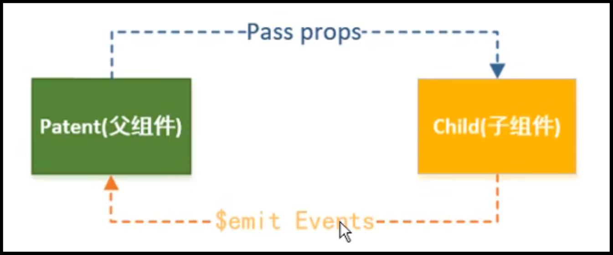
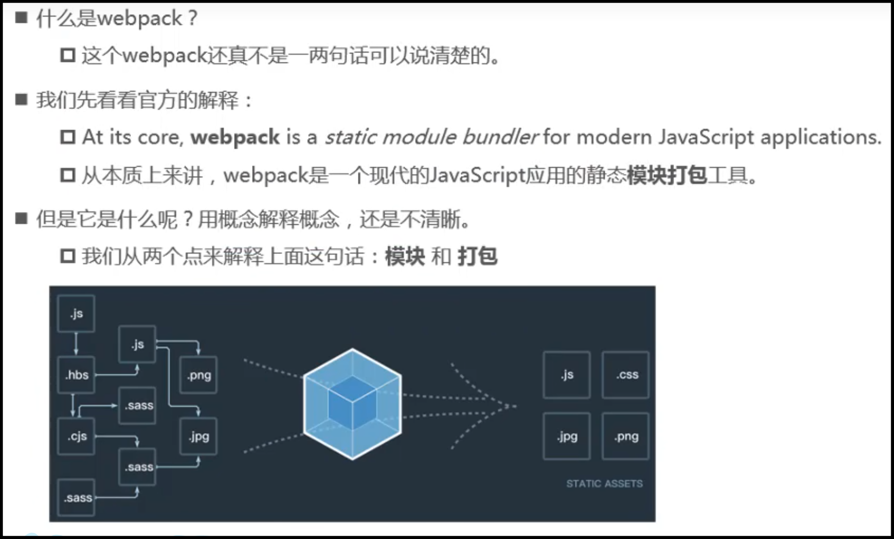
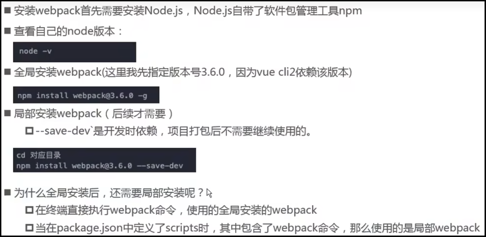
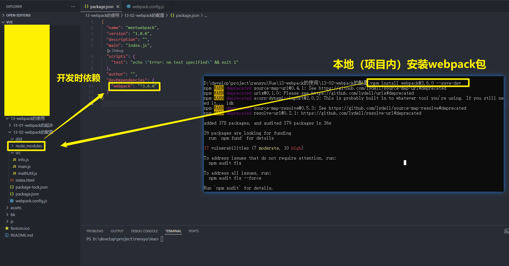
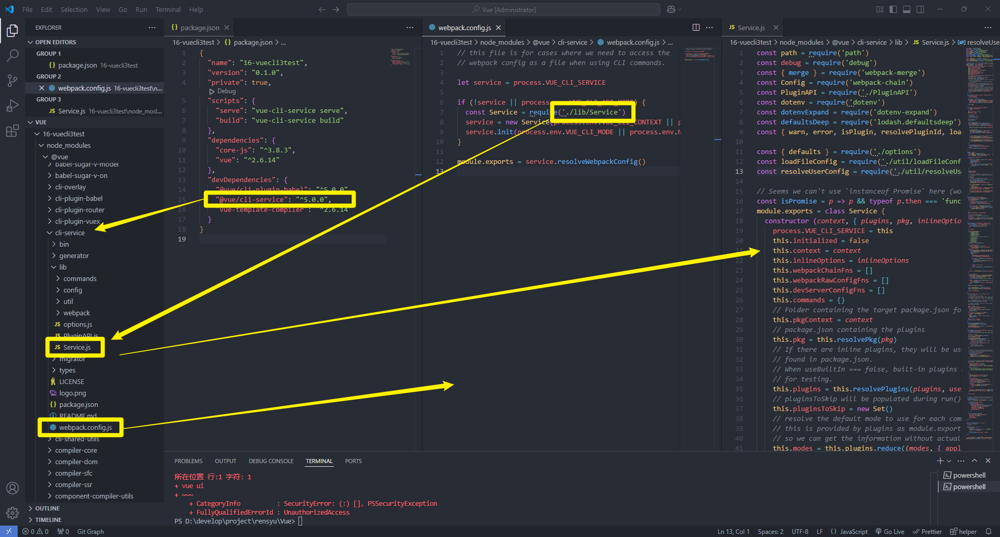
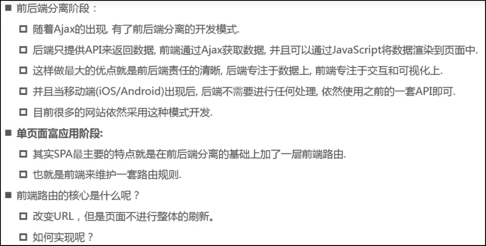
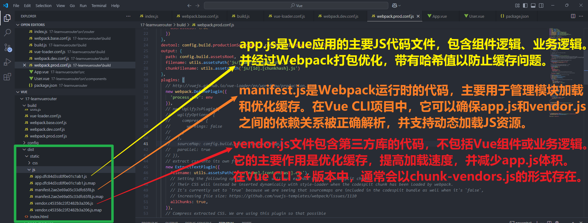

# MVVM模型


1. data中所有的属性，最后都出现在了vm身上；
2. vm身上所有的属性，及Vue原型上所有属性，在Vue模板中都可以直接使用。

# 数据代理


# 组件的key属性


# 注册组件的基本步骤


# 父子组件的通信



# 什么是Webpack



# 前端模块化

      

# Webpack安装





# Node.js相关


```json
{
  "name": "meetwebpack",
  "version": "1.0.0",
  "description": "",
  "main": "index.js",
  "scripts": {
    "test": "echo \"Error: no test specified\" && exit 1"
  },
  "author": "",
  "license": "ISC" // 项目开源才需要写这个
}
```


# 什么是loader


# 什么是Vue CLI


# Vue CLI的使用

这里安装的是Vue CLI3的版本，如果需要想按照Vue CLI2的方式初始化项目是不可以的。

也就是说，只能通过脚手架3来创建vue项目，但是在创建的时候可以通过选择模板的方式指定是vue2的项目还是vue3的项目。

```bash
# 安装最新版本
npm install -g @vue/cli
# 安装指定版本
npm install -g @vue/cli@<version>
# 查看版本
vue --version
# Vue CLI3和旧版使用了相同的vue命令，所以Vue CLI2（vue-cli）被覆盖了。如果你仍然需要使用旧版本的vue init功能，你可以全局安装一个桥接工具
npm install -g @vue/cli-init
# Vue CLI2初始化项目
vue init webpack <project name>
# Vue CLI3初始化项目
vue create <project name>
```


# Vue程序运行过程


# npm run build


# npm run dev


# Vue CLI3配置文件的查看和修改

> 图形化界面

```bash
# GUI
vue ui
```

> 实际配置文件




# 后端路由阶段


# 前端路由阶段



# 打包文件解析



# 路由的懒加载


# Vue2生命周期


# Promise的三种状态


# Vuex状态管理


- 组件之间如何改变共享状态？
  - 通过提交mutation的方式，而非直接改变state中的数据。
- 为什么官方不推荐在组件中直接修改state中的数据？
  1. 状态追踪困难：直接修改state导致状态变化难以追踪，调试和排查问题困难；
  2. 破坏单相数据流：Vuex推崇单向数据流：View -> Actions -> Mutations -> State -> View。直接修改state会破坏这一流程，增加代码的不可预测性；
  3. 失去Vuex工具支持：Vuex提供的开发工具（如Vue Devtools）依赖于mutations来记录状态变化，直接修改state会导致这些工具无法正常工作，影响调试效率。
