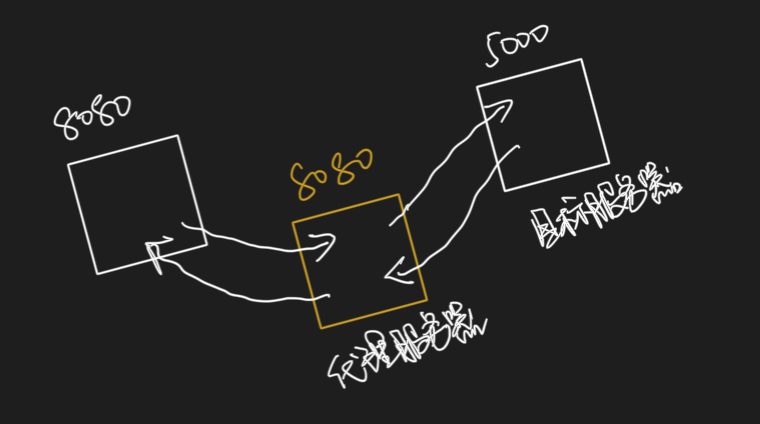
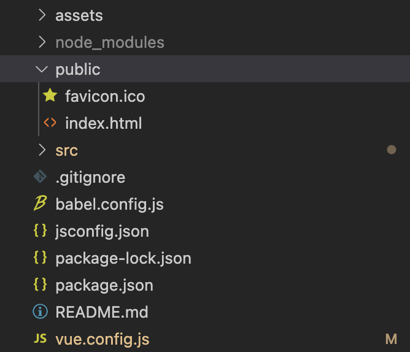

# 一、常用发送ajax请求的方式

## 1、xhr

```javascript
var xhr = new XMLHttpRequest();
xhr.open(); // 配置请求信息
xhr.send(); // 发送请求
...
```

## 2、jQuery

```javascript
$.get(url, callback);
$.post(url, data, callback);
...
```

## 3、axios

**与jQuery相比：**

- axios是promise风格，并且支持请求拦截器和响应拦截器；
- 体积小，大约只是jQuery的1/4；
- 一般在react和vue项目中很少去使用jQuery去发送请求，因为：
  - jQuery库确实封装了ajax请求。但是jQuery的核心是帮你封装DOM操作，我们使用react或者vue就是减少自己操作DOM，那就没必要去引入专业操作DOM的jQuery库了；
  - 而且jQuery库中80%都是封装DOM操作，剩下的20%才是包括封装ajax请求以及其他一些周边；

## 4、fetch

**与jQuery和axios相比：**

- jQuery和axios都是对xhr的封装，但是fetch和xhr是平级的；
- xhr是js内置的，也就是在windows身上就有的。同样，在window上也有一个fetch方法可以拿来直接用；
- fetch也是promise风格；
- fetch不用像axios需要导入；
- fetch致命问题：
  - 会将返回的数据包两层promise；
  - 有兼容性问题，在IE上兼容性稍差；

## 5、vue-resource

```sh
npm i vue-resource
```

> main.js

```javascript
import App from "./App.vue";
import Vue from "vue";
// vue-resource为默认暴露，所以名字自由命名
// vue-resource官方已不怎么维护了
import xxx from "vue-resource";

Vue.config.productionTip = false;
// 使用插件
Vue.use(xxx);
new Vue({
  el: "#app",
  render: (h) => h(App),
  beforeCreate() {
    Vue.prototype.$bus = this;
  },
});
```

> Search.vue

```vue
<template>
  <section class="jumbotron">
    <h3 class="jumbotron-heading">Search Github Users</h3>
    <div>
      <input
        type="text"
        placeholder="enter the name you search"
        v-model="keyWord"
      />&nbsp;<button @click="searchUsers">Search</button>
    </div>
  </section>
</template>

<script>
import axios from "axios";
export default {
  name: "Search",
  data() {
    return {
      keyWord: "",
    };
  },
  methods: {
    searchUsers() {
      this.$bus.$emit("updateListData", {
        isFirst: false,
        isLoading: true,
        errMsg: "",
        users: [],
      });
      // axios -> this.$http
      this.$http
        .get(`https://api.github.com/search/users?q=${this.keyWord}`)
        .then(
          (response) => {
            this.$bus.$emit("updateListData", {
              isLoading: false,
              errMsg: "",
              users: response.data.items,
            });
          },
          (error) => {
            this.$bus.$emit("updateListData", {
              isLoading: false,
              errMsg: error.message,
              users: [],
            });
          }
        );
    },
  },
};
</script>

<style>
input[type="text"] {
  width: 180px;
}
</style>
```

# 二、跨域请求解决

.png)

 **以上为跨域请求错误，违背了同源策略，何为同源策略：**

- 协议名，主机名，端口号，三者一致；

> ajax请求过程分析

- http://localhost:8080 **浏览器**发起请求，请求也确实送到了 http://localhost:5000 **服务器**，并且5000**服务器**也把数据交给了**浏览器**，但是**浏览器**没有进一步地把数据交给8080，因为**浏览器**发现跨域了，就把数据握在手里不给了；

> 解决策略

## 1、cors解决跨域

- 不用前端人员去做任何事情，只需要后端人员在编写服务器响应的时候，给你加几个特殊的响应头；
- 这样浏览器看见这些特殊的响应头就知道服务器确认要把这些数据返回给你，就会放行；
- cors解决跨域才是真正意义上的解决跨域；
- 真正开发当中，这个响应头不是随便配置的。配置之后容易造成的问题就是任何人都能找你这台服务器要数据；

## 2、jsonp

- 借助script标签里的src属性，在引入外部资源的时候不受同源策略的限制；
- jsonp虽然巧妙，但是在真正开发中用的微乎其微，因为：
  - 前端人员得用点巧妙的写法，后端人员也得去配合前端人员；
  - 而且，jsonp只能解决get请求的跨域问题；

## 3、代理服务器



- 8080向代理服务器发送ajax请求，代理服务器向目标服务器发送请求，目标服务器将数据返回给代理服务器，代理服务器再将数据返回给8080，因为8080和代理服务器之间符合同源策略，所以可以成功接收数据；
- 代理服务器和目标服务器之间打交道传数据不用ajax，用的就是http请求，不用考虑同源策略；

# 三、配置代理服务器

## 1、nginx

## 2、vue-cli

### 方式一：

- https://cli.vuejs.org/zh/config/#devserver-proxy

> App.vue

```javascript
export default {
  name: "App",
  methods: {
    getStudents() {
      axios.get("http://localhost:8080/students").then(
        (response) => {
          console.log("请求成功了！ -- " + response.data);
        },
        (error) => {
          console.log("请求失败了！ -- " + error.message);
        }
      );
    },
  },
};
```

> vue.config.js

```javascript
const { defineConfig } = require("@vue/cli-service");
module.exports = defineConfig({
  transpileDependencies: true,
  lintOnSave: false,
  // 开启代理服务器，这种方式不能开启多台代理
  devServer: {
    proxy: 'http://localhost:5000'
  }
});
```

- **代理服务器8080并不是把所有的数据都转发给目标服务器5000**
  - 当请求的资源本身就有，就不会转发请求给5000；
  - public文件夹就相当于8080这台服务器的根路径。public中有的内容都算是这台服务器的，如果请求的是public文件夹里就有的内容，则不会转发请求给5000；



- 使用这种方式配置代理服务器有两个不足：
  - 不能配置多个代理；
  - 不能灵活控制走不走代理，只能在请求的内容是在根目录public中不存在的情况下才走代理；

### 方式二：

> vue.config.js

```javascript
module.exports = {
	devServer: {
      proxy: {
      '/api1': {// 匹配所有以 '/api1'开头的请求路径
        target: 'http://localhost:5000',// 代理目标的基础路径
        changeOrigin: true,
        pathRewrite: {'^/api1': ''}
      },
      '/api2': {// 匹配所有以 '/api2'开头的请求路径
        target: 'http://localhost:5001',// 代理目标的基础路径
        changeOrigin: true,
        pathRewrite: {'^/api2': ''}
      }
    }
  }
}
/*
   changeOrigin设置为true时，服务器收到的请求头中的host为：localhost:5000
   changeOrigin设置为false时，服务器收到的请求头中的host为：localhost:8080
   changeOrigin默认值为true
*/
```

- 优点：可以配置多个代理，且可以灵活的控制请求是否走代理；
- 缺点：配置略微繁琐，请求资源时必须加前缀；