# 1、从2.2.x和H版开始说起

## 1.1、springcloud版本命名规则

springcloud采用英国伦敦地铁站的名称来命名，并由地铁站名称字母A-Z依次类推的形式来发布迭代版本。

springcloud是一个由许多子项目组成的综合项目，各子项目有不同的发布节奏。为了管理springcloud与各子项目的版本依赖关系，发布了一个清单，其中包括了某个springcloud版本对应的子项目版本。为了避免springcloud版本号与子项目版本号混淆，springcloud版本采用了名称而非版本号的命名，这些版本的名字采用了伦敦地铁站的名字，根据字母表的顺序来对应版本时间顺序。例如Angel是第一个版本，Brixton是第二个版本。

当springcloud的发布内容积累到临界点或者一个重大bug被解决后，会发布一个”service release“版本，简称SRX版本，比如Greenwich.SR2就是springcloud发布的Greenwich版本的第2个SRX版本。

## 1.2、版本选择

> 官网查看

https://spring.io/projects/spring-cloud#overview

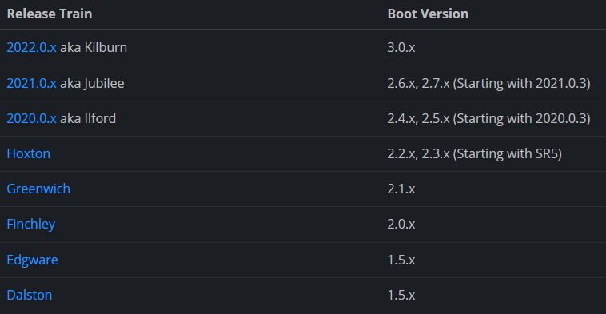

> 更详细的版本对应查看方法

https://start.spring.io/actuator/info

```json
"spring-cloud": {
    "Hoxton.SR12": "Spring Boot >=2.2.0.RELEASE and <2.4.0.M1",
    "2020.0.6": "Spring Boot >=2.4.0.M1 and <2.6.0-M1",
    "2021.0.0-M1": "Spring Boot >=2.6.0-M1 and <2.6.0-M3",
    "2021.0.0-M3": "Spring Boot >=2.6.0-M3 and <2.6.0-RC1",
    "2021.0.0-RC1": "Spring Boot >=2.6.0-RC1 and <2.6.1",
    "2021.0.5": "Spring Boot >=2.6.1 and <3.0.0-M1",
    "2022.0.0-M1": "Spring Boot >=3.0.0-M1 and <3.0.0-M2",
    "2022.0.0-M2": "Spring Boot >=3.0.0-M2 and <3.0.0-M3",
    "2022.0.0-M3": "Spring Boot >=3.0.0-M3 and <3.0.0-M4",
    "2022.0.0-M4": "Spring Boot >=3.0.0-M4 and <3.0.0-M5",
    "2022.0.0-M5": "Spring Boot >=3.0.0-M5 and <3.0.0-RC1",
    "2022.0.0-RC1": "Spring Boot >=3.0.0-RC1 and <3.0.0-RC2",
    "2022.0.0-RC2": "Spring Boot >=3.0.0-RC2 and <3.0.0",
    "2022.0.0": "Spring Boot >=3.0.0 and <3.1.0-M1"
}
```

> 当前选择

| springcloud | springboot    |
| ----------- | ------------- |
| Hoxton.SR1  | 2.2.2.RELEASE |

# 2、关于Cloud各种组件的停更/升级/替换

> 以前


> 2020

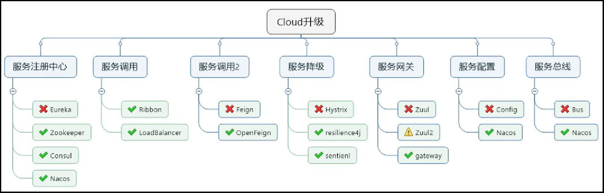

# 3、微服务架构编码构建

## 3.1、父工程

1. maven版本：

   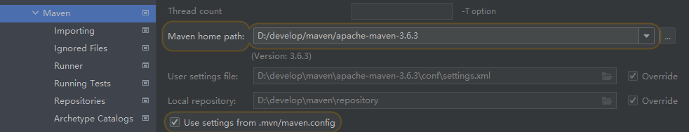

2. 字符编码：

   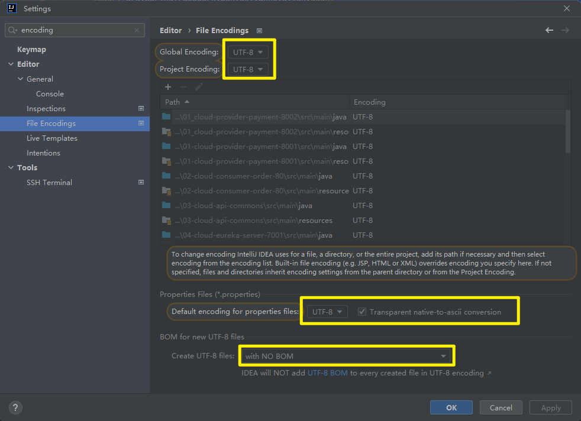

3. 注解生效激活：

   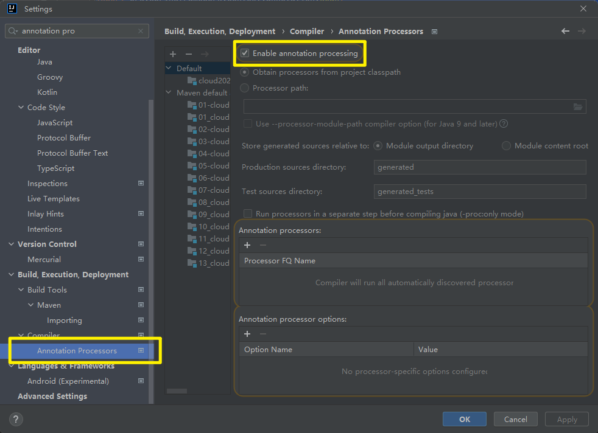

4. 编译版本选择：

   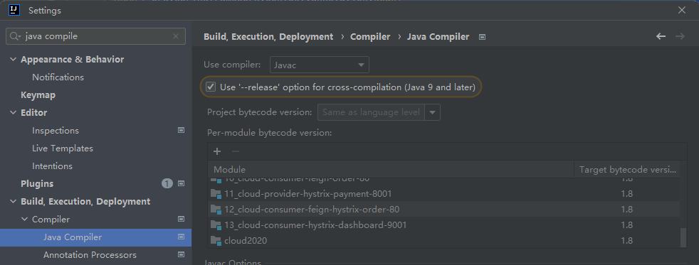

5. File Types过滤；

6. pom.xml

   ```xml
   <?xml version="1.0" encoding="UTF-8"?>
   <project xmlns="http://maven.apache.org/POM/4.0.0" xmlns:xsi="http://www.w3.org/2001/XMLSchema-instance"
            xsi:schemaLocation="http://maven.apache.org/POM/4.0.0 http://maven.apache.org/xsd/maven-4.0.0.xsd">
       <modelVersion>4.0.0</modelVersion>
   
       <groupId>org.yeahicode.springcloud</groupId>
       <artifactId>cloud2020</artifactId>
       <version>1.0-SNAPSHOT</version>
       <modules>
           <module>01-cloud-provider-payment-8001</module>
       </modules>
       <packaging>pom</packaging>
   
       <!-- 统一管理jar包版本 -->
       <properties>
           <project.build.sourceEncoding>UTF-8</project.build.sourceEncoding>
           <maven.compiler.source>1.8</maven.compiler.source>
           <maven.compiler.target>1.8</maven.compiler.target>
           <junit.version>4.12</junit.version>
           <log4j.version>1.2.17</log4j.version>
           <lombok.version>1.16.18</lombok.version>
           <mysql.version>5.1.47</mysql.version>
           <druid.version>1.1.16</druid.version>
           <mybatis.spring.boot.version>1.3.0</mybatis.spring.boot.version>
       </properties>
   
       <!-- 子模块继承之后，提供作用：锁定版本+子modlue不用写groupId和version  -->
       <dependencyManagement>
           <dependencies>
               <!--spring boot 2.2.2-->
               <dependency>
                   <groupId>org.springframework.boot</groupId>
                   <artifactId>spring-boot-dependencies</artifactId>
                   <version>2.2.2.RELEASE</version>
                   <type>pom</type>
                   <scope>import</scope>
               </dependency>
               <!--SpringCloud Hoxton.SR1-->
               <dependency>
                   <groupId>org.springframework.cloud</groupId>
                   <artifactId>spring-cloud-dependencies</artifactId>
                   <version>Hoxton.SR1</version>
                   <type>pom</type>
                   <scope>import</scope>
               </dependency>
               <!--SpringCloud alibaba 2.1.0.RELEASE-->
               <dependency>
                   <groupId>com.alibaba.cloud</groupId>
                   <artifactId>spring-cloud-alibaba-dependencies</artifactId>
                   <version>2.1.0.RELEASE</version>
                   <type>pom</type>
                   <scope>import</scope>
               </dependency>
               <dependency>
                   <groupId>mysql</groupId>
                   <artifactId>mysql-connector-java</artifactId>
                   <version>${mysql.version}</version>
               </dependency>
               <dependency>
                   <groupId>com.alibaba</groupId>
                   <artifactId>druid</artifactId>
                   <version>${druid.version}</version>
               </dependency>
               <dependency>
                   <groupId>org.mybatis.spring.boot</groupId>
                   <artifactId>mybatis-spring-boot-starter</artifactId>
                   <version>${mybatis.spring.boot.version}</version>
               </dependency>
               <dependency>
                   <groupId>junit</groupId>
                   <artifactId>junit</artifactId>
                   <version>${junit.version}</version>
               </dependency>
               <dependency>
                   <groupId>log4j</groupId>
                   <artifactId>log4j</artifactId>
                   <version>${log4j.version}</version>
               </dependency>
               <dependency>
                   <groupId>org.projectlombok</groupId>
                   <artifactId>lombok</artifactId>
                   <version>${lombok.version}</version>
                   <optional>true</optional>
               </dependency>
           </dependencies>
       </dependencyManagement>
   
       <!--
       热部署Devtools
       -->
       <build>
           <finalName>cloud2020</finalName>
           <plugins>
               <plugin>
                   <groupId>org.springframework.boot</groupId>
                   <artifactId>spring-boot-maven-plugin</artifactId>
                   <configuration>
                       <fork>true</fork>
                       <addResources>true</addResources>
                   </configuration>
               </plugin>
           </plugins>
       </build>
   </project>
   ```

## 3.2、Rest微服务子工程

### 3.2.1、构建01-cloud-provider-payment-8001模块

#### 3.2.1.1、建工程；

#### 3.2.1.2、写pom.xml

```xml
    <dependencies>
        <dependency>
            <groupId>org.springframework.boot</groupId>
            <artifactId>spring-boot-starter-web</artifactId>
        </dependency>
        <dependency>
            <groupId>org.springframework.boot</groupId>
            <artifactId>spring-boot-starter-actuator</artifactId>
        </dependency>
        <dependency>
            <groupId>org.mybatis.spring.boot</groupId>
            <artifactId>mybatis-spring-boot-starter</artifactId>
        </dependency>
        <dependency>
            <groupId>com.alibaba</groupId>
            <artifactId>druid-spring-boot-starter</artifactId>
            <version>1.1.10</version>
        </dependency>
        <!--mysql-connector-java-->
        <dependency>
            <groupId>mysql</groupId>
            <artifactId>mysql-connector-java</artifactId>
        </dependency>
        <!--jdbc-->
        <dependency>
            <groupId>org.springframework.boot</groupId>
            <artifactId>spring-boot-starter-jdbc</artifactId>
        </dependency>
        <dependency>
            <groupId>org.springframework.boot</groupId>
            <artifactId>spring-boot-devtools</artifactId>
            <scope>runtime</scope>
            <optional>true</optional>
        </dependency>
        <dependency>
            <groupId>org.projectlombok</groupId>
            <artifactId>lombok</artifactId>
            <optional>true</optional>
        </dependency>
        <dependency>
            <groupId>org.springframework.boot</groupId>
            <artifactId>spring-boot-starter-test</artifactId>
            <scope>test</scope>
        </dependency>
    </dependencies>
```

#### 3.2.1.3、写application.yml

```yaml
server:
  port: 8001

spring:
  application:
    name: cloud-payment-service
  datasource:
    type: com.alibaba.druid.pool.DruidDataSource            # 当前数据源操作类型
    driver-class-name: com.mysql.jdbc.Driver              # mysql驱动包 com.mysql.jdbc.Driver
    url: jdbc:mysql://localhost:3306/db2019?useUnicode=true&characterEncoding=UTF-8&useSSL=false
    username: root
    password: xxx

mybatis:
  mapperLocations: classpath:mapper/*.xml
  type-aliases-package: org.yeahicode.springcloud.entities    # 所有Entity别名类所在包
```

#### 3.2.1.4、写主启动类

#### 3.2.1.5、业务类编写

1. 建表：

   ```sql
   CREATE TABLE `payment` (
     `id` bigint(20) NOT NULL AUTO_INCREMENT COMMENT 'ID',
     `serial` varchar(200) DEFAULT '',
     PRIMARY KEY (`id`)
   ) ENGINE=InnoDB AUTO_INCREMENT=1 DEFAULT CHARSET=utf8
   ```

2. 建主实体：

   ```java
   //Serializable，用于服务间数据的序列化传输
   @Data
   @NoArgsConstructor
   @AllArgsConstructor
   public class Payment implements Serializable {
       private Long id;
       private String serial;
   }
   ```

3. 建统一返回类：

   ```java
   @Data
   @AllArgsConstructor
   @NoArgsConstructor
   public class CommonResult<T>
   {
       private Integer code;
       private String  message;
       private T data;
   
       public CommonResult(Integer code, String message)
       {
           this(code,message,null);
       }
   }
   ```

4. 编写dao：

   ```java
   @Mapper
   public interface PaymentDao {
       int create(Payment payment);
       Payment getPaymentById(@Param("id") Long id);
   }
   ```

5. 编写dao映射文件resources/mapper/PaymentMapper.xml

   ```xml
   <?xml version="1.0" encoding="UTF-8" ?>
   <!DOCTYPE mapper PUBLIC "-//mybatis.org//DTD Mapper 3.0//EN" "http://mybatis.org/dtd/mybatis-3-mapper.dtd" >
   
   <mapper namespace="org.yeahicode.springcloud.dao.PaymentDao">
   <!--
   useGeneratedKeys：这会令 MyBatis 使用 JDBC 的 getGeneratedKeys 方法来取出由数据库内部生成的主键
   keyProperty：指定能够唯一识别对象的属性，MyBatis 会使用 getGeneratedKeys 的返回值或 insert 语句的 selectKey 子元素设置它的值，默认值：未设置（unset）。
       如果生成列不止一个，可以用逗号分隔多个属性名称。
   -->
       <insert id="create" parameterType="Payment" useGeneratedKeys="true" keyProperty="id">
           insert into payment(serial) values(#{serial})
       </insert>
   
       <resultMap id="myResultMap" type="org.yeahicode.springcloud.entities.Payment">
           <id column="id" property="id" jdbcType="BIGINT"/>
           <result column="serial" property="serial" jdbcType="VARCHAR"/>
       </resultMap>
       <select id="getPaymentById" parameterType="Long" resultMap="myResultMap">
           select * from payment where id=#{id}
       </select>
   </mapper>
   ```

6. 编写service：

   ```java
   public interface PaymentService {
       int create(Payment payment);
       Payment getPaymentById(Long id);
   }
   ```

   ```java
   @Service
   public class PaymentServiceImpl implements PaymentService {
       /**
        * @Autowired
        *  org.springframework.beans.factory.annotation.Autowired（spring下的注解）
        *  默认byType，多个Bean再byName（name即为方法名），
        *  所以最好使用@Qualifier来显示指定name会比较好
        * @Resource
        *  javax.annotation.Resource（jdk下的注解）
        *  默认byName，也可指定byType，或者byName+byType（不推荐），
        *  如果有多个Bean，可用byName显示指定（name即为方法名）
        */
       @Resource
       PaymentDao paymentDao;
   
       @Override
       public int create(Payment payment) {
           return paymentDao.create(payment);
       }
   
       @Override
       public Payment getPaymentById(Long id) {
           return paymentDao.getPaymentById(id);
       }
   }
   ```

7. 编写controller；

### 3.2.2、开启RunDashboard

> .idea/workspace.xml

```xml
<component name="RunDashboard">
  <option name="configurationTypes">
    <set>
      <option value="SpringBootApplicationConfigurationType" />
    </set>
  </option>
</component>
```

### 3.2.3、热部署Devtools

1. 添加依赖：

   ```xml
   <dependency>
       <groupId>org.springframework.boot</groupId>
       <artifactId>spring-boot-devtools</artifactId>
       <scope>runtime</scope>
       <optional>true</optional>
   </dependency>
   ```

2. 添加插件聚合至父工程：

   ```xml
   <build>
       <finalName>cloud2020</finalName>
       <plugins>
           <plugin>
               <groupId>org.springframework.boot</groupId>
               <artifactId>spring-boot-maven-plugin</artifactId>
               <configuration>
                   <fork>true</fork>
                   <addResources>true</addResources>
               </configuration>
           </plugin>
       </plugins>
   </build>
   ```

3. 开启自动编译：

   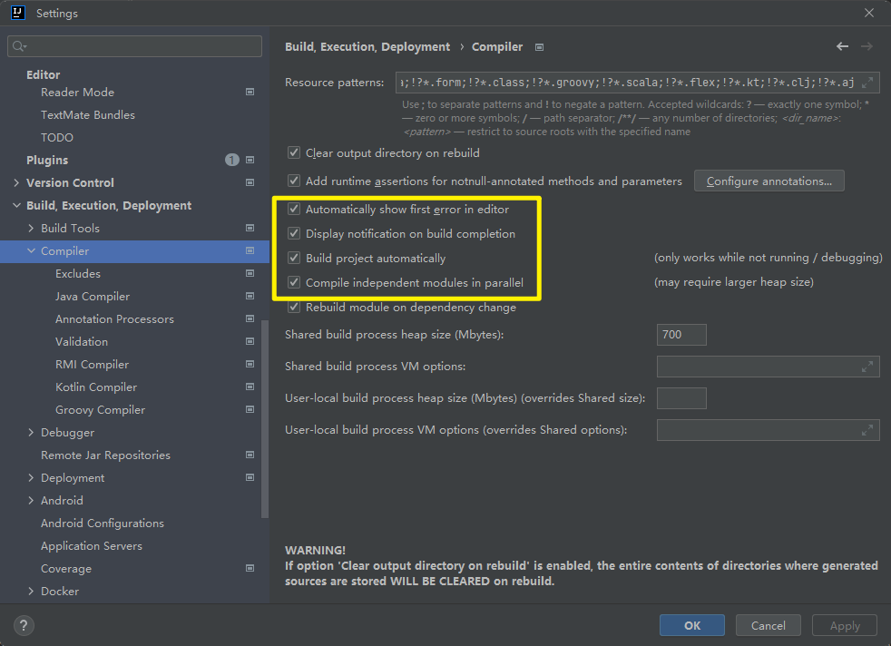

4. ctrl+shift+alt+/

   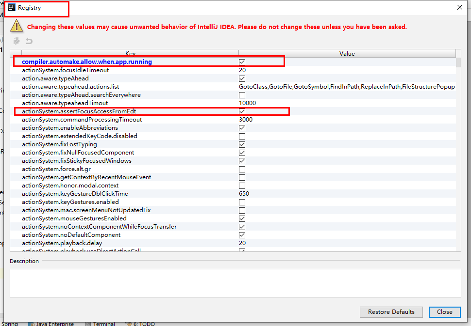

5. 高级设置：

   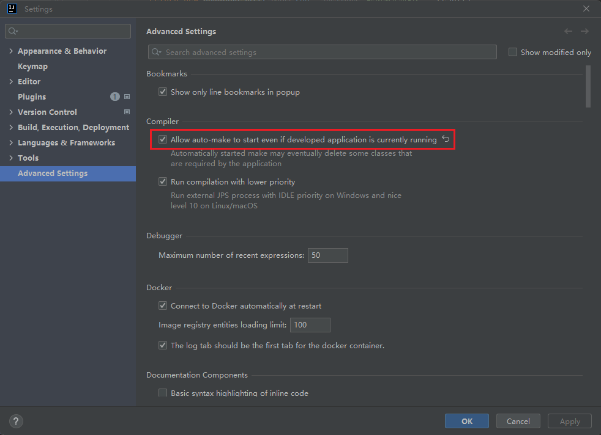

6. 重启idea；

### 3.2.4、构建02-cloud-consumer-order-80模块

1. 建工程；

2. 写pom.xml：

   ```xml
       <dependencies>
           <dependency>
               <groupId>org.springframework.boot</groupId>
               <artifactId>spring-boot-starter-web</artifactId>
           </dependency>
           <dependency>
               <groupId>org.springframework.boot</groupId>
               <artifactId>spring-boot-starter-actuator</artifactId>
           </dependency>
   
           <dependency>
               <groupId>org.springframework.boot</groupId>
               <artifactId>spring-boot-devtools</artifactId>
               <scope>runtime</scope>
               <optional>true</optional>
           </dependency>
           <dependency>
               <groupId>org.projectlombok</groupId>
               <artifactId>lombok</artifactId>
               <optional>true</optional>
           </dependency>
           <dependency>
               <groupId>org.springframework.boot</groupId>
               <artifactId>spring-boot-starter-test</artifactId>
               <scope>test</scope>
           </dependency>
       </dependencies>
   ```

3. 写application.yml：

   ```yaml
   server:
     port: 80
   ```

4. 写主启动类；

5. 业务类编写：

   - 主实体Payment；

   - 统一返回类；

   - 在配置类中注入RestTemplate；

   - controller：

     ```java
     @RestController
     public class OrderController
     {
         // 单机的情况下，可以直接写明接口服务地址，即主机和端口写死
         public static final String PaymentSrv_URL = "http://localhost:8001";
     
         @Autowired
         private RestTemplate restTemplate;
     
         @GetMapping("/consumer/payment/create") //客户端用浏览器是get请求，但是底层实质发送post调用服务端8001
         public CommonResult create(Payment payment)
         {
             return restTemplate.postForObject(PaymentSrv_URL + "/payment/create",payment,CommonResult.class);
         }
     
     
         @GetMapping("/consumer/payment/get/{id}")
         public CommonResult getPayment(@PathVariable Long id)
         {
             return restTemplate.getForObject(PaymentSrv_URL + "/payment/get/"+id, CommonResult.class, id);
         }
     }
     ```

### 3.2.5、RestTemplate

> 是什么

RestTemplate提供了多种便捷访问远程Http服务的方法，是一种简单便捷的访问restful服务模板类，是Spring提供的而用于访问Rest服务的客户端模板工具集；

> 官网

https://docs.spring.io/spring-framework/docs/5.2.2.RELEASE/javadoc-api/org/springframework/web/client/RestTemplate.html

> 使用

使用RestTemplate访问restful接口非常的简单粗暴无脑。(url, requestMap, ResponseBean.class)这三个参数分别代表rest请求地址、请求参数、Http响应转换成的对象类型；

### 3.2.6、工程重构

构建03-cloud-api-commons，将共通实体类以及统一返回类提取到这个工程。在之后，还会出现一些共通的工具包，也可以放在这个共通工程中，接着其他工程再引用这个共通工程；

# 4、Eureka服务注册与发现

## 4.1、Eureka基础知识

> 什么是服务治理

springcloud封装了netflix公司开发的eureka模块来实现服务治理。

在传统的rpc远程调用框架中，管理每个服务与服务之间依赖关系比较复杂，所以需要使用服务治理，管理服务与服务之间依赖关系，可以实现服务调用、负载均衡、容错等，实现服务注册与发现；

> 什么是服务注册与发现

eureka采用了cs的设计架构，eureka server作为服务注册功能的服务器，它是服务注册中心。而系统中的其他微服务，使用eureka的客户端连接到eureka server并维持心跳连接。这样系统的维护人员就可以通过eureka server来监控系统中各个微服务是否正常运行。

在服务注册与发现中，有一个注册中心。当服务器启动的时候，会把当前自己服务器的信息，比如：服务地址、通讯地址等以别名方式注册到注册中心上。另一方（消费者or服务提供者），以该别名的方式去注册中心上获取到实际的服务通讯地址，然后再实现本地rpc调用。rpc远程调用框架核心设计思想在于注册中心，使用注册中心管理每个服务与服务之间的一个依赖关系（服务治理概念）。在任何rpc远程框架中，都会有一个注册中心（存放服务地址相关信息，即接口地址）；


> eureka两组件

eureka包含两个组件：eureka server和eureka client；

1. eureka server提供服务注册服务；
   - 各个微服务节点通过配置启动后，会在eureka server中进行注册，这样eureka server的服务注册表中将会存储所有可用服务节点的信息，服务节点的信息可以在界面中直观看到；
2. eureka client通过注册中心进行访问；
   - 是一个java客户端，用于简化eureka server的交互，客户端同时也具备一个内置的、使用轮询（round-robin）负载算法的负载均衡器。在应用启动后，将会向eureka server发送心跳（默认周期为30秒）。如果eureka server在多个心跳周期内没有接收到某个节点的心跳，eureka server将会从服务注册表中把这个服务节点移除（默认90秒）；

## 4.2、单机Eureka构建步骤

### 4.2.1、Eureka Server端（类似物业公司）

1. 构建04-cloud-eureka-server-7001模块；

2. 改pom.xml：

   ```xml
   <!--eureka-server-->
   <dependency>
       <groupId>org.springframework.cloud</groupId>
       <artifactId>spring-cloud-starter-netflix-eureka-server</artifactId>
   </dependency>
   ```

   - 1.x和2.x的对比说明：

     ```xml
     <!--以前的老版本（当前使用2018）-->
     <dependency>
             <groupId>org.springframework.cloud</groupId>
             <artifactId>spring-cloud-starter-eureka</artifactId>
     </dependency>
      
     <!--现在新版本（当前使用2020.2）-->
     <dependency>
         <groupId>org.springframework.cloud</groupId>
         <artifactId>spring-cloud-starter-netflix-eureka-server</artifactId>
     </dependency>
     ```

3. 写application.yml：

   ```yaml
   server:
     port: 7001
   
   eureka:
     instance:
       hostname: localhost #eureka服务端的实例名称
     client:
       #false表示不向注册中心注册自己，本身就作为服务，所以不需要注册自己
       register-with-eureka: false
       #false表示自己端就是注册中心，我的职责就是维护服务实例，并不需要去检索服务
       fetch-registry: false
       service-url:
       #设置与Eureka Server交互的地址查询服务和注册服务都需要依赖这个地址。
         defaultZone: http://${eureka.instance.hostname}:${server.port}/eureka/
   ```

4. 写主启动类，标记@EnableEurekaServer；

5. 测试：通过http://localhost:7001访问服务注册中心可视化界面；

### 4.2.2、Eureka Client的服务提供者（类似业主）

1. 构建01-cloud-provider-payment-8001模块；

2. 改pom.xml：

   ```xml
   <!--eureka-client-->
   <dependency>
       <groupId>org.springframework.cloud</groupId>
       <artifactId>spring-cloud-starter-netflix-eureka-client</artifactId>
   </dependency>
   ```

   - 1.x和2.x的对比说明：

     ```xml
     <!--以前老版本，别再使用-->
     <dependency>
             <groupId>org.springframework.cloud</groupId>
             <artifactId>spring-cloud-starter-eureka</artifactId>
     </dependency>
      
     <!--现在新版本，当前使用-->
     <dependency>
         <groupId>org.springframework.cloud</groupId>
         <artifactId>spring-cloud-starter-netflix-eureka-client</artifactId>
     </dependency>
     ```

3. 写application.yml

   ```yaml
   server:
     port: 8001
   
   spring:
     application:
     	#在注册中心上显示的服务名
       name: cloud-payment-service
     datasource:
       type: com.alibaba.druid.pool.DruidDataSource            # 当前数据源操作类型
       driver-class-name: com.mysql.jdbc.Driver              # mysql驱动包 com.mysql.jdbc.Driver
       url: jdbc:mysql://localhost:3306/db2019?useUnicode=true&characterEncoding=UTF-8&useSSL=false
       username: root
       password: xxx
   
   mybatis:
     mapperLocations: classpath:mapper/*.xml
     type-aliases-package: org.yeahicode.springcloud.entities    # 所有Entity别名类所在包
   
   eureka:
     client:
       #表示是否将自己注册进EurekaServer，默认为true，当前作为服务提供者，必须注册到eureka server，别的服务才可调用
       register-with-eureka: true
       #是否从EurekaServer抓取已有的注册信息，默认为true。单节点无所谓，集群必须设置为true才能配合ribbon使用负载均衡
       fetchRegistry: true
       service-url:
   #单机
         defaultZone: http://localhost:7001/eureka
   ```

4. 写主启动类，标记@EnableEurekaClient；

### 4.2.3、Eureka Client的消费者（类似学生）

1. 构建02-cloud-consumer-order-80模块；

2. 改pom.xml：

   ```xml
   <!--eureka-client-->
   <dependency>
       <groupId>org.springframework.cloud</groupId>
       <artifactId>spring-cloud-starter-netflix-eureka-client</artifactId>
   </dependency>
   ```

3. 写application.yml：

   ```yaml
   server:
     port: 80
   
   spring:
     application:
       name: cloud-order-service
   
   eureka:
     client:
       #表示是否将自己注册进EurekaServer，默认为true。
       register-with-eureka: true
       #是否从EurekaServer抓取已有的注册信息，默认为true。单节点无所谓，集群必须设置为true才能配合ribbon使用负载均衡
       fetchRegistry: true
       service-url:
   #单机
         defaultZone: http://localhost:7001/eureka
   ```

4. 写主启动类，标记@EnableEurekaClient；

5. 测试：

   - 启动eureka server端04-cloud-eureka-server-7001；
   - 启动eureka client的服务提供者01-cloud-provider-payment-8001；
   - 调用测试；

## 4.3、集群Eureka构建步骤

### 4.3.1、Eureka集群原理 说明


问题：微服务RPC远程服务调用最核心的是什么？

高可用。试想你的注册中心只有一个，它出故障就会导致整个微服务环境不可用。所以，解决办法就是搭建eureka注册中心集群，实现负载均衡+故障容错；

### 4.3.2、Eureka Server端集群环境构建步骤

1. 参考04-cloud-eureka-server-7001模块构建05-cloud-eureka-server-7002模块；

2. 改pom.xml：

   ```xml
   <!--eureka-server-->
   <dependency>
       <groupId>org.springframework.cloud</groupId>
       <artifactId>spring-cloud-starter-netflix-eureka-server</artifactId>
   </dependency>
   ```

3. 修改映射配置：

   ```tex
   127.0.0.1 eureka7001.com
   127.0.0.1 eureka7002.com
   ```

4. 修改04-cloud-eureka-server-7001以及05-cloud-eureka-server-7002的application.yml，让他们实现相互注册：

   ```yaml
   server:
     port: 7001
     
   eureka:
     instance:
       hostname: eureka7001.com #eureka服务端的实例名称
     client:
       #false表示不向注册中心注册自己。
       register-with-eureka: false
       #false表示自己端就是注册中心，我的职责就是维护服务实例，并不需要去检索服务
       fetch-registry: false
       service-url:
         #设置与Eureka Server交互的地址查询服务和注册服务都需要依赖这个地址。
         defaultZone: http://eureka7002.com:7002/eureka/
   ```

   ```yaml
   server:
     port: 7002
   
   eureka:
     instance:
       hostname: eureka7002.com #eureka服务端的实例名称
     client:
       #false表示不向注册中心注册自己。
       register-with-eureka: false
       #false表示自己端就是注册中心，我的职责就是维护服务实例，并不需要去检索服务
       fetch-registry: false
       service-url:
         #设置与Eureka Server交互的地址查询服务和注册服务都需要依赖这个地址。
         defaultZone: http://eureka7001.com:7001/eureka/
   ```

5. 写主启动类，标记@EnableEurekaServer；

6. 将01-cloud-provider-payment-8001服务提供者发布到上面两个eureka server节点：

   ```yaml
   eureka:
     client:
       #表示是否将自己注册进EurekaServer，默认为true。
       register-with-eureka: true
       #是否从EurekaServer抓取已有的注册信息，默认为true。单节点无所谓，集群必须设置为true才能配合ribbon使用负载均衡
       fetchRegistry: true
       service-url:
   #      defaultZone: http://localhost:7001/eureka #单机
         defaultZone: http://eureka7001.com:7001/eureka, http://eureka7002.com:7002/eureka #集群
   ```

7. 同样，将02-cloud-consumer-order-80消费者发布到上面两个eureka server节点：

   ```yaml
   eureka:
     client:
       #表示是否将自己注册进EurekaServer，默认为true。
       register-with-eureka: true
       #是否从EurekaServer抓取已有的注册信息，默认为true。单节点无所谓，集群必须设置为true才能配合ribbon使用负载均衡
       fetchRegistry: true
       service-url:
   #      defaultZone: http://localhost:7001/eureka #单机
         defaultZone: http://eureka7001.com:7001/eureka, http://eureka7002.com:7002/eureka #集群
   ```

8. 测试：

   - 启动eureka server端集群04-cloud-eureka-server-7001和05-cloud-eureka-server-7002；
   - 启动eureka client的服务提供者01-cloud-provider-payment-8001；
   - 启动eureka clent的消费者02-cloud-consumer-order-80；
   - 调用测试；

### 4.3.3、Eureka Client端服务提供者集群环境构建

1. 参考01-cloud-provider-payment-8001模块构建01_cloud-provider-payment-8002模块；

2. 改pom.xml：

   ```xml
   <!--eureka-client-->
   <dependency>
       <groupId>org.springframework.cloud</groupId>
       <artifactId>spring-cloud-starter-netflix-eureka-client</artifactId>
   </dependency>
   ```

3. 修改application.yml：

   ```yaml
   eureka:
     client:
       #表示是否将自己注册进EurekaServer，默认为true。
       register-with-eureka: true
       #是否从EurekaServer抓取已有的注册信息，默认为true。单节点无所谓，集群必须设置为true才能配合ribbon使用负载均衡
       fetchRegistry: true
       service-url:
   #      defaultZone: http://localhost:7001/eureka #单机
         defaultZone: http://eureka7001.com:7001/eureka, http://eureka7002.com:7002/eureka #集群
   ```

   ```yaml
   eureka:
     client:
       #表示是否将自己注册进EurekaServer，默认为true。
       register-with-eureka: true
       #是否从EurekaServer抓取已有的注册信息，默认为true。单节点无所谓，集群必须设置为true才能配合ribbon使用负载均衡
       fetchRegistry: true
       service-url:
   #      defaultZone: http://localhost:7001/eureka #单机
         defaultZone: http://eureka7001.com:7001/eureka, http://eureka7002.com:7002/eureka #集群
   ```

4. 写主启动类，标记@EnableEurekaClient；

5. 业务类：通过获取配置属性中的端口信息，在接口中返回；

### 4.3.4、负载均衡

> bug

在通过订单服务80调用支付服务8001，8002集群的时候，支付服务地址不能写死，不能和调用单机支付服务一样，将地址和端口写死：

```java
// private static final String PAYMENT_URL = "http://localhost:8001"; // 单机
private static final String PAYMENT_URL = "http://CLOUD-PAYMENT-SERVICE"; // 集群：服务别名
```

> @LoadBalanced

那么，当通过服务别名去调用支付集群的时候，我们已经不用去关心地址和端口号的差异，那怎么才能调用到具体的服务实例呢？可以通过@LoadBalanced完成负载均衡调用：

```java
@Configuration
public class ApplicationContextConfig {
    @Bean
    @LoadBalanced
    RestTemplate restTemplate() {
        return new RestTemplate();
    }
}
```

> 测试

支付服务8001，8002集群被订单服务80调用的时候返回端口信息，此时8001和8002端口会交替出现；

## 4.4、actuator微服务信息完善

### 4.4.1、主机名称:服务名称修改

> 当前问题

服务实例中含有主机名称：

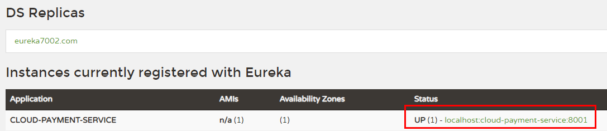

> 修改

```yaml
eureka:
  client:
    #表示是否将自己注册进EurekaServer，默认为true。
    register-with-eureka: true
    #是否从EurekaServer抓取已有的注册信息，默认为true。单节点无所谓，集群必须设置为true才能配合ribbon使用负载均衡
    fetchRegistry: true
    service-url:
#单机
#      defaultZone: http://localhost:7001/eureka
      defaultZone: http://eureka7001.com:7001/eureka, http://eureka7002.com:7002/eureka #集群
  instance:
    #配置之前：LAPTOP-1FN99F9S:cloud-payment-service:8001，配置之后：payment8001
    instance-id: payment8001
```

> 效果

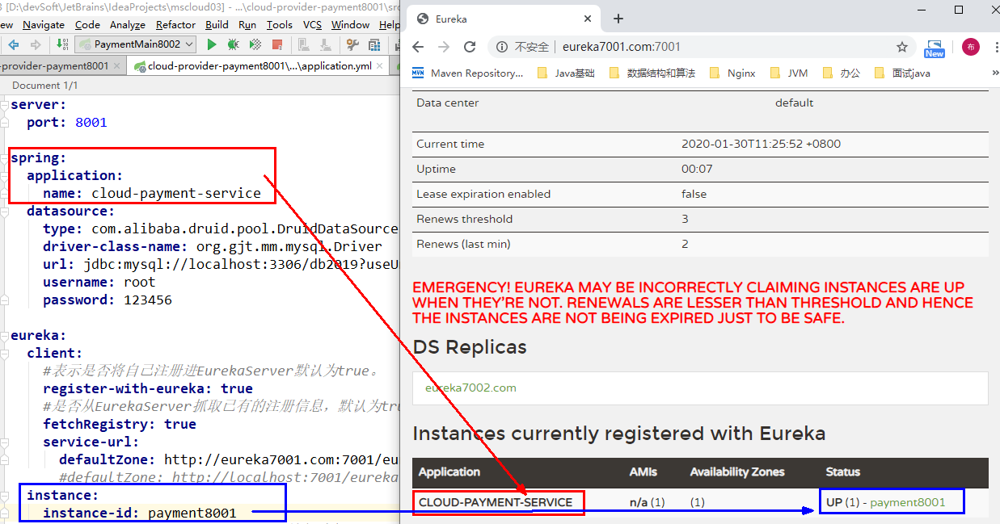

### 4.4.2、访问信息有IP信息提示

> 当前问题

鼠标悬停，或者点击进入的时候，没有IP显示；

> 修改

```yaml
eureka:
  client:
    #表示是否将自己注册进EurekaServer，默认为true。
    register-with-eureka: true
    #是否从EurekaServer抓取已有的注册信息，默认为true。单节点无所谓，集群必须设置为true才能配合ribbon使用负载均衡
    fetchRegistry: true
    service-url:
#单机
#      defaultZone: http://localhost:7001/eureka
      defaultZone: http://eureka7001.com:7001/eureka, http://eureka7002.com:7002/eureka #集群
  instance:
    #配置之前：LAPTOP-1FN99F9S:cloud-payment-service:8001，配置之后：payment8001
    instance-id: payment8001
    #访问路径可以显示IP地址
    prefer-ip-address: true
```

> 效果


## 4.5、服务发现Discovery

> 是什么

对于注册进eureka server端里的微服务，可以通过服务发现来获得指定的服务信息；

> 怎么用

1. 写主启动类，标记@EnableDiscoveryClient，开启服务发现功能；

2. 注入DiscoveryClient，通过DiscoveryClient获取服务信息或者服务下的实例信息：

   ```java
   @Resource
   DiscoveryClient discoveryClient;
   
   @GetMapping("/payment/getServiceInfo")
   public Object getServiceInfo() {
       // 获取所有服务
       List<String> services = discoveryClient.getServices();
       for (String service : services) {
           System.out.println(">>> 服务名：" + service);
       }
       // 通过服务名获取该服务下的所有服务实例
       List<ServiceInstance> instances = discoveryClient.getInstances("CLOUD-PAYMENT-SERVICE");
       for (ServiceInstance instance : instances) {
           System.out.println("serviceId：" + instance.getServiceId() + "\t" + "instanceId：" + instance.getInstanceId() + "\t" + "scheme：" + instance.getScheme() + "\t" +
                   "host：" + instance.getHost() + "\t" + "port：" + instance.getPort() + "\t" + "uri：" + instance.getUri());
       }
       return services;
   }
   ```

## 4.6、Eureka自我保护

### 4.6.1、故障现象

> 是什么

保护模式主要用于一组客户端和eureka server之间存在网络分区场景下的保护（即分布式服务下）。一旦进入保护模式，eureka server将会尝试保护其服务注册表中的信息，不再删除服务注册表中的数据，也就是不会注销任何微服务。如果在eureka server的首页看到以下信息，则说明eureka进入了保护模式；


### 4.6.2、导致原因

> 为什么会产生eureka自我保护机制

为了防止eureka client可以正常运行，但是与eureka server网络不通情况下，eureka server不会立刻将eureka client服务剔除；

> 什么是自我保护模式

默认情况下，如果eureka server在一定时间内没有接收到某个微服务实例的心跳，eureka server将会注销实例（默认90秒）。但是当网络分区故障发生（延时、卡顿、拥挤）时，微服务与eureka server之间无法正常通信，以上行为可能变得非常危险了。因为微服务本身其实是健康的，此时不应该注销这个微服务。eureka通过"自我保护模式"来解决这个问题。当eureka server节点在短时间内丢失过多客户端时（可能发生了网络分区故障），那么这个节点就会进入自我保护模式。

在自我保护模式中，eureka server会保护服务注册表中的信息，不再注销任何服务实例。

它的设计哲学就是宁可保留错误的服务注册信息，也不盲目注销任何可能健康的服务实例。一句话讲解：好死不如赖活着。

综上，自我保护模式是一种应对网络异常的安全保护措施。它的架构哲学是宁可同时保留所有微服务（健康的微服务和不健康的微服务都会保留）也不盲目注销任何健康的微服务。使用自我保护模式，可以让eureka集群更加的健壮、稳定；


### 4.6.3、怎么禁止自我保护

> eureka server端

出厂默认，自我保护机制是开启的，可以将其禁用：

```properties
eureka.server.enable-self-preservation = false
```

禁用后的效果：

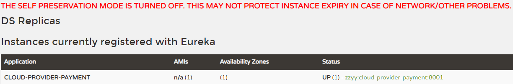

> eureka client端

出厂默认，可自行更改：

```properties
eureka.instance.lease-renewal-interval-in-seconds=30
eureka.instance.lease-expiration-duration-in-seconds=90
```

> 测试

1. eureka的客户端和服务端都配置完成后，先启动服务端，后启动客户端；
2. 接着关闭客户端服务，
3. 最后查看服务端中的服务信息，可以发现客户端服务被立马剔除了：
   

# 5、Zookeeper服务注册与发现

## 5.1、Eureka停止更新

https://github.com/Netflix/eureka/wiki

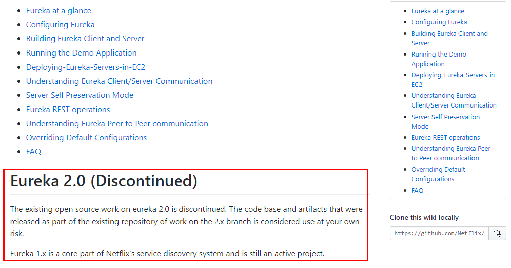

## 5.2、SpringCloud整合Zookeeper代替Eureka

### 5.2.1、注册中心Zookeeper

1. 下载zookeeper-3.4.9.tar.gz；

2. 解压，拷贝配置文件；

3. 开启端口，重启防火墙；

4. 启动：

   ```shell
   [root@ryualvin100 zookeeper-3.4.9]# ./bin/zkServer.sh start ./conf/zoo.cfg
   ```

### 5.2.2、服务提供者

1. 构建06-cloud-zookeeper-provider-payment-8004模块；

2. 改pom.xml，客户端依赖版本必须和zookeeper服务的版本一致，springboot本身已整合zookeeper客户端依赖，所以需要先排除再引进正确的依赖版本：

   ```xml
   <!-- SpringBoot整合zookeeper客户端 -->
   <dependency>
       <groupId>org.springframework.cloud</groupId>
       <artifactId>spring-cloud-starter-zookeeper-discovery</artifactId>
       <!--先排除自带的zookeeper3.5.3-->
       <exclusions>
           <exclusion>
               <groupId>org.apache.zookeeper</groupId>
               <artifactId>zookeeper</artifactId>
           </exclusion>
       </exclusions>
   </dependency>
   <!--添加zookeeper3.4.9版本，与服务端版本保持一致-->
   <dependency>
       <groupId>org.apache.zookeeper</groupId>
       <artifactId>zookeeper</artifactId>
       <version>3.4.9</version>
   </dependency>
   ```

3. 修改application.yml：

   ```yaml
   #8004表示注册到zookeeper服务器的支付服务提供者端口号
   server:
     port: 8004
   #服务别名，注册到zookeerper注册中心的名称
   spring:
     application:
       name: zookeeper-provider-payment
     cloud:
       zookeeper:
         connect-string: 192.168.182.100:2181
   ```

4. 写主启动类，标记@EnableDiscoveryClient，该注解用于向使用consul或者zookeeper作为注册中心时注册服务；

5. 启动测试，在通过服务器上的zookeeper客户端获取服务信息：

   ```
   [zk: localhost:2181(CONNECTED) 10] ls /services/zookeeper-provider-payment
   [c9af8710-2ba6-4ac3-9272-9775d18eb9de]
   [zk: localhost:2181(CONNECTED) 11] get /services/zookeeper-provider-payment/c9af8710-2ba6-4ac3-9272-9775d18eb9de
   {"name":"zookeeper-provider-payment","id":"c9af8710-2ba6-4ac3-9272-9775d18eb9de","address":"LAPTOP-1FN99F9S","port":8004,"sslPort":null,"payload":{"@class":"org.springframework.cloud.zookeeper.discovery.ZookeeperInstance","id":"application-1","name":"zookeeper-provider-payment","metadata":{}},"registrationTimeUTC":1673924644107,"serviceType":"DYNAMIC","uriSpec":{"parts":[{"value":"scheme","variable":true},{"value":"://","variable":false},{"value":"address","variable":true},{"value":":","variable":false},{"value":"port","variable":true}]}}
   cZxid = 0x38
   ctime = Mon Jan 16 22:04:05 EST 2023
   mZxid = 0x38
   mtime = Mon Jan 16 22:04:05 EST 2023
   pZxid = 0x38
   cversion = 0
   dataVersion = 0
   aclVersion = 0
   ephemeralOwner = 0x185bdac81cd0001
   dataLength = 544
   numChildren = 0
   ```

   ```json
   {
     "name": "zookeeper-provider-payment",
     "id": "c9af8710-2ba6-4ac3-9272-9775d18eb9de",
     "address": "LAPTOP-1FN99F9S",
     "port": 8004,
     "sslPort": null,
     "payload": {
       "@class": "org.springframework.cloud.zookeeper.discovery.ZookeeperInstance",
       "id": "application-1",
       "name": "zookeeper-provider-payment",
       "metadata": {}
     },
     "registrationTimeUTC": 1673924644107,
     "serviceType": "DYNAMIC",
     "uriSpec": {
       "parts": [
         { "value": "scheme", "variable": true },
         { "value": "://", "variable": false },
         { "value": "address", "variable": true },
         { "value": ":", "variable": false },
         { "value": "port", "variable": true }
       ]
     }
   }
   ```

6. 思考：服务节点是临时节点还是永久节点？

### 5.2.3、服务消费者

1. 构建07-cloud-zookeeper-consumer-order-80模块；

2. 改pom.xml：

   ```xml
   <!-- SpringBoot整合zookeeper客户端 -->
   <dependency>
       <groupId>org.springframework.cloud</groupId>
       <artifactId>spring-cloud-starter-zookeeper-discovery</artifactId>
       <!--先排除自带的zookeeper3.5.3-->
       <exclusions>
           <exclusion>
               <groupId>org.apache.zookeeper</groupId>
               <artifactId>zookeeper</artifactId>
           </exclusion>
       </exclusions>
   </dependency>
   <!--添加zookeeper3.4.9版本，与服务端版本保持一致-->
   <dependency>
       <groupId>org.apache.zookeeper</groupId>
       <artifactId>zookeeper</artifactId>
       <version>3.4.9</version>
   </dependency>
   ```

3. 改application.yml：

   ```yaml
   server:
     port: 80
   spring:
     application:
       name: zookeeper-order-service
   #服务别名，注册到zookeerper注册中心的名称
     cloud:
       zookeeper:
         connect-string: 192.168.182.100:2181
   ```

4. 写主启动类，标记@EnableDiscoveryClient；

5. 业务类：注入RestTemplate，通过服务名请求接口；

# 6、Consul服务注册与发现

## 6.1、Consul简介

> 是什么

https://www.consul.io/intro/index.html

> 能干嘛

- 服务发现：提供http和dns两种发现方式；
- 健康监测：支持多种方式，http、tcp、docker、shell脚本定制化监控；
- kv存储：Key、Value的存储方式；
- 多数据中心：Consul支持多数据中心；
- 可视化Web界面；

> 去哪下

https://www.consul.io/downloads.html

> 怎么玩

https://www.springcloud.cc/spring-cloud-consul.html

## 6.2、安装并运行Consul

- 官网安装说明：https://learn.hashicorp.com/consul/getting-started/install.html

- 下载后解压，用开发模式启动：

  ```shell
  ./consul agent -dev -ui -node=consul-dev -client=192.168.182.100
  ```

- 访问：http://localhost:8500

  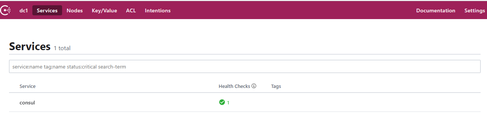

## 6.3、服务提供者

1. 构建08_cloud-consul-provider-payment-8006模块；

2. 改pom.xml：

   ```xml
   <!--SpringCloud consul-server -->
   <dependency>
       <groupId>org.springframework.cloud</groupId>
       <artifactId>spring-cloud-starter-consul-discovery</artifactId>
   </dependency>
   ```

3. 改application.yml：

   ```yaml
   server:
     port: 8006
   spring:
     application:
       name: consul-provider-payment
     ####consul注册中心地址
     cloud:
       consul:
         host: 192.168.182.100
         port: 8500
         discovery:
           #hostname: 127.0.0.1
           service-name: ${spring.application.name}
   ```

4. 写启动类，标记@EnableDiscoveryClient；

5. 写服务接口；

## 6.4、服务消费者

1. 构建09_cloud-consul-consumer-order-80模块；

2. 改pom.xml：

   ```xml
   <!--SpringCloud consul-server -->
   <dependency>
       <groupId>org.springframework.cloud</groupId>
       <artifactId>spring-cloud-starter-consul-discovery</artifactId>
   </dependency>
   ```

3. 改application.yml：

   ```yaml
   server:
     port: 80
   spring:
     application:
       name: consul-order-service
     ####consul注册中心地址
     cloud:
       consul:
         host: 192.168.182.100
         port: 8500
         discovery:
           #hostname: 127.0.0.1
           service-name: ${spring.application.name}
   ```

4. 写启动类，标记@EnableDiscoveryClient；

5. 注入RestTemplate，并通过服务名，然后负载均衡地请求服务接口；

# 7、三个注册中心异同点

## 7.1、CAP理论

C：Consistency（强一致性）；

A：Availability（可用性）；

P：Partition tolerance（分区容错性）；

CAP理论关注粒度是数据，而不是整体系统设计的策略；

## 7.2、CAP图


最多只能较好的满足两个。

CAP理论的核心是：一个分布式系统不可能同时很好的满足一致性，可用性和分区容错性这三个需求。

因此，根据CAP原理将NoSQL数据库分成了满足CA原则、满足CP原则和满足AP原则三个大类：

- CA：单点集群，满足一致性，可用性的系统，通常在可扩展性上不太强大；
- CP：满足一致性，分区容忍性的系统，通常性能不是特别高；
- AP：满足可用性，分区容忍性的系统，通常可能对一致性要求低一些；

## 7.3、三个注册中心比较

### 7.3.1、AP（eureka）

AP架构：当网络分区出现后，为了保证可用性，系统B可以返回旧值，保证系统的可用性；

结论：违背了一致性C的要求，只满足可用性和分区容错，即AP；


### 7.3.2、CP（zookeeper/consul）

CP架构：当网络分区出现后，为了保证一致性，就必须拒接请求，否则无法保持一致性；

结论：违背了可用性A的要求，只满足一致性和分区容错，即CP；


### 7.3.3、三个注册中心异同点


# 8、Ribbon负载均衡服务调用

## 8.1、概述

> 是什么

SpringCloud Ribbon是基于Netflix Ribbon实现的一套客户端负载均衡的工具。

简单的说，Ribbon是Netflix发布的开源项目，主要功能是提供客户端的软件负载均衡算法和服务调用。Ribbon客户端组件提供一系列完善的配置项如连接超时，重试等。简单的说，就是在配置文件中列出Load Balancer（简称LB）后面所有的机器，Ribbon会自动的帮助你基于某种规则（如简单轮询，随机连接等）去连接这些机器。我们很容易使用Ribbon实现自定义的负载均衡算法；

> 官网资料

https://github.com/Netflix/ribbon/wiki/Getting-Started

Ribbon目前也进入维护模式，未来的替换方案：

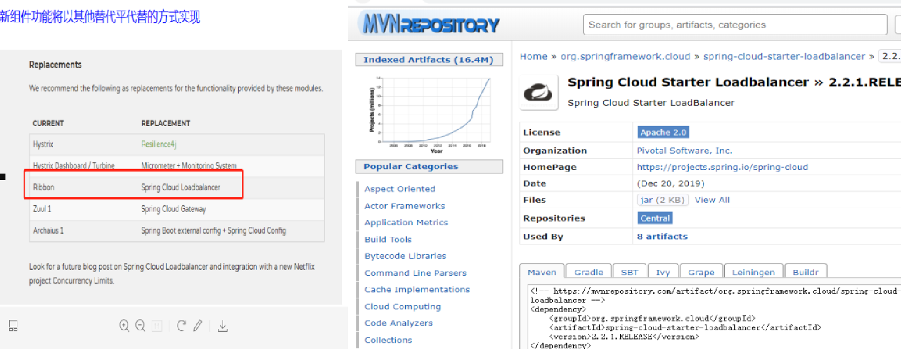

> 能干嘛

LB负载均衡(Load Balance)是什么？简单的说就是将用户的请求平摊的分配到多个服务上，从而达到系统的HA（高可用）。
常见的负载均衡有软件Nginx，LVS，硬件 F5等。

Ribbon本地负载均衡客户端和Nginx服务端负载均衡区别：

- Nginx是服务器负载均衡，客户端所有请求都会交给nginx，然后由nginx实现转发请求。即负载均衡是由服务端实现的；

- Ribbon本地负载均衡，在调用微服务接口时候，会在注册中心上获取注册信息服务列表之后缓存到JVM本地，从而在本地实现RPC远程服务调用技术；

集中式LB：

- 即在服务的消费方和提供方之间使用独立的LB设施(可以是硬件，如F5, 也可以是软件，如nginx), 由该设施负责把访问请求通过某种策略转发至服务的提供方；

进程内LB：

- 将LB逻辑集成到消费方，消费方从服务注册中心获知有哪些地址可用，然后自己再从这些地址中选择出一个合适的服务器；
- Ribbon就属于进程内LB，它只是一个类库，集成于消费方进程，消费方通过它来获取到服务提供方的地址；

> 一句话

负载均衡+RestTemplate调用；

## 8.2、Ribbon负载均衡演示

> 架构说明

Ribbon在工作时分成两步：

1. 第一步先选择eureka server，它优先选择在同一个区域内负载较少的server；
2. 第二步再根据用户指定的策略，在从server取到的服务注册列表中选择一个地址；
3. 其中Ribbon提供了多种策略：比如轮询、随机和根据响应时间加权；


总结：Ribbon其实就是一个软负载均衡的客户端组件。他可以和其他所需请求的客户端结合使用，和eureka结合只是其中的一个实例；

> pom.xml

之前写样例时候没有引入spring-cloud-starter-ribbon也可以使用ribbon，因为spring-cloud-starter-netflix-eureka-client确实引入了ribbon：

```xml
<dependency>
    <groupId>org.springframework.cloud</groupId>
    <artifactId>spring-cloud-starter-netflix-ribbon</artifactId>
</dependency>
```

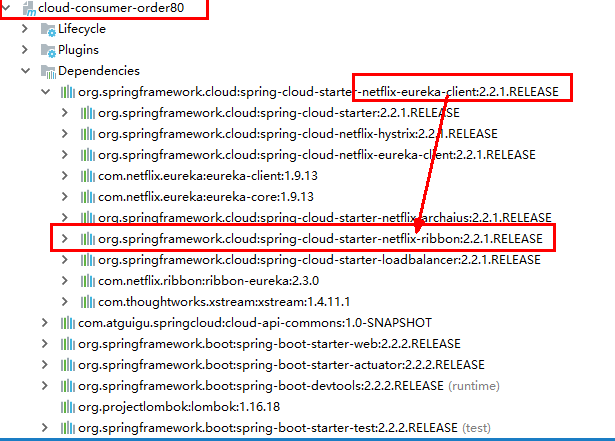

> 二说RestTemplate的使用

- 官网：https://docs.spring.io/spring-framework/docs/5.2.2.RELEASE/javadoc-api/org/springframework/web/client/RestTemplate.html
- getForObject方法/getForEntity方法；
- postForObject/postForEntity方法；
- GET请求方法；
- POST请求方法；

## 8.3、Ribbon核心组件IRule

### 8.3.1、各种轮询算法

IRule：根据特定算法中从服务列表中选取一个要访问的服务


- com.netflix.loadbalancer.RoundRobinRule：轮询；
- com.netflix.loadbalancer.RandomRule：随机；
- com.netflix.loadbalancer.RetryRule：先按照RoundRobinRule的策略获取服务，如果获取服务失败则在指定时间内会进行重试，获取可用的服务；
- WeightedResponseTimeRule：对RoundRobinRule的扩展，响应速度越快的实例选择权重越大，越容易被选择；
- BestAvailableRule：会先过滤掉由于多次访问故障而处于断路器跳闸状态的服务，然后选择一个并发量最小的服务；
- AvailabilityFilteringRule：先过滤掉故障实例，再选择并发较小的实例；
- ZoneAvoidanceRule：默认规则,复合判断server所在区域的性能和server的可用性选择服务器；

### 8.3.2、如何替换轮询组件

1. 在消费者80端新建包，该包不能与启动类在同一包下；

   - 官方文档明确给出了警告：这个自定义配置类不能放在@ComponentScan所扫描的当前包下以及子包下，否则我们自定义的这个配置类就会被所有的Ribbon客户端所共享，达不到特殊化定制的目的了；

     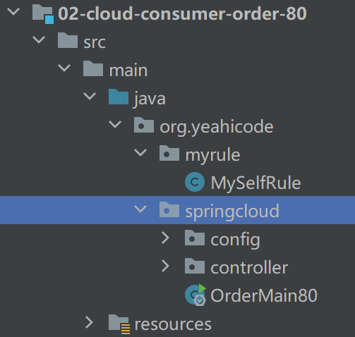

2. 在新建包下创建自定义配置类，并注入IRule的组件：

   ```java
   /**
    * 这个自定义配置类不能放在@ComponentScan所扫描的当前包下以及子包下，
    * 否则我们自定义的这个配置类就会被所有的Ribbon客户端所共享，达不到特殊化定制的目的了。
    */
   @Configuration
   public class MySelfRule {
       @Bean
       public IRule myRule(){
           return new RandomRule();//负载均衡策略定义为随机
       }
   }
   ```

3. 在主启动类上开启ribbon客户端扫描功能：

   ```java
   @SpringBootApplication
   @EnableEurekaClient
   /**
    * 在启动该微服务的时候就能去加载我们的自定义Ribbon配置类，从而使配置生效
    *  限定该负载均衡策略只适用于请求服务”CLOUD-PAYMENT-SERVICE“
    */
   @RibbonClient(configuration = MySelfRule.class, name = "CLOUD-PAYMENT-SERVICE")
   public class OrderMain80 {
       public static void main(String[] args) {
           SpringApplication.run(OrderMain80.class);
       }
   }
   ```

## 8.4、负载均衡算法

> 原理


负载均衡算法：rest接口第几次请求数 % 服务器集群总数量 = 实际调用服务器位置下标，每次服务重启动后rest接口计数从1开始；

List<ServiceInstance> instances = discoveryClient.getInstances("CLOUD-PAYMENT-SERVICE");

如：   List [0] instances = 127.0.0.1:8002
　　　List [1] instances = 127.0.0.1:8001

8001+ 8002 组合成为集群，它们共计2台机器，集群总数为2， 按照轮询算法原理：

当总请求数为1时： 1 % 2 =1 对应下标位置为1 ，则获得服务地址为127.0.0.1:8001
当总请求数位2时： 2 % 2 =0 对应下标位置为0 ，则获得服务地址为127.0.0.1:8002
当总请求数位3时： 3 % 2 =1 对应下标位置为1 ，则获得服务地址为127.0.0.1:8001
当总请求数位4时： 4 % 2 =0 对应下标位置为0 ，则获得服务地址为127.0.0.1:8002
如此类推......

> RoundRobinRule源码

> 手写

# 9、OpenFeign服务接口调用

## 9.1、概述

> OpenFeign是什么

官网解释：
https://cloud.spring.io/spring-cloud-static/Hoxton.SR1/reference/htmlsingle/#spring-cloud-openfeign

Feign是一个声明式WebService客户端。

使用Feign能让编写Web Service客户端更加简单。

它的使用方法是定义一个服务接口然后在上面添加注解。

Feign也支持可拔插式的编码器和解码器。

SpringCloud对Feign进行了封装，使其支持了Spring MVC标准注解HttpMessageConverters。

Feign可以与Eureka和Ribbon组合使用以支持负载均衡；

> 能干嘛

Feign旨在使编写Java Http客户端变得更容易。

前面在使用Ribbon+RestTemplate时，利用RestTemplate对http请求的封装处理，形成了一套模版化的调用方法。但是在实际开发中，由于对服务依赖的调用可能不止一处，往往一个接口会被多处调用，所以通常都会针对每个微服务自行封装一些客户端类来包装这些依赖服务的调用。所以，Feign在此基础上做了进一步封装，由他来帮助我们定义和实现依赖服务接口的定义。在Feign的实现下，我们只需创建一个接口并使用注解的方式来配置它(以前是Dao接口上面标注Mapper注解,现在是一个微服务接口上面标注一个Feign注解即可)，即可完成对服务提供方的接口绑定，简化了使用SpringCloud Ribbon时，自动封装服务调用客户端的开发量。

Feign集成了Ribbon。利用Ribbon维护了Payment的服务列表信息，并且通过轮询实现了客户端的负载均衡。而与Ribbon不同的是，通过feign只需要定义服务绑定接口且以声明式的方法，优雅而简单的实现了服务调用；

> Feign和OpenFeign两者区别

| Feign                                                        | OpenFeign                                                    |
| ------------------------------------------------------------ | ------------------------------------------------------------ |
| Feign是SpringCloud组件中的一个轻量级RESTful的HTTP服务客户端。<br/>Feign内置了Ribbon，用来做客户端负载均衡，去调用服务注册中心的服务。<br/>Feign的使用方式是：使用Feign的注解定义接口，调用这个接口，就可以调用服务注册中心的服务。 | OpenFeign是SpringCloud 在Feign的基础上支持了SpringMVC的注解，<br/>如@RequesMapping等等。<br/>OpenFeign的@FeignClient可以解析SpringMVC的@RequestMapping注解下的接口，<br/>并通过动态代理的方式产生实现类，实现类中做负载均衡并调用其他服务。 |
| <dependency><br/>    <groupId>org.springframework.cloud</groupId><br/>    <artifactId>spring-cloud-starter-feign</artifactId><br/></dependency> | <dependency><br/>    <groupId>org.springframework.cloud</groupId><br/>    <artifactId>spring-cloud-starter-openfeign</artifactId><br/></dependency> |

## 9.2、OpenFeign使用步骤

1. 构建10_cloud-consumer-feign-order-80模块；

2. 改pom.xml：

   ```xml
   <!--openfeign-->
   <dependency>
       <groupId>org.springframework.cloud</groupId>
       <artifactId>spring-cloud-starter-openfeign</artifactId>
   </dependency>
   ```

3. 改application.yml，实际上没有额外的配置，只需要配置eureka server的信息就可以了：

   ```yaml
   server:
     port: 80
   
   eureka:
     client:
       register-with-eureka: false
       service-url:
         defaultZone: http://eureka7001.com:7001/eureka/,http://eureka7002.com:7002/eureka/
   ```

4. 写主启动类，并标注@EnableFeignClients；

5. 编写业务接口，通过@FeignClient指定服务：

   ```java
   @FeignClient(value="CLOUD-PAYMENT-SERVICE")
   @Component
   public interface PaymentOpenFeignService {
       @GetMapping("/payment/get/{id}")
       CommonResult get(@PathVariable("id") Long id);
   
       @GetMapping("/payment/timeout")
       String paymentTimeout();
   }
   ```

6. 在控制层中调用业务接口：

   ```java
   /**
   * Feign调用服务自带负载均衡配置项
   */
   @Resource
   PaymentOpenFeignService paymentOpenFeignService;
   
   @GetMapping("/consumer/payment/get/{id}")
   public CommonResult get(@PathVariable("id") Long id) {
   	return paymentOpenFeignService.get(id);
   }
   ```

7. 测试：

   - 先启动eureka server集群7001和7002节点；
   - 再启动微服务提供者集群8001和8002节点；
   - 调用测试，Feign自带负载均衡配置项；

8. 总结：

   

## 9.3、OpenFeign超时控制

> 超时设置，故意设置超时演示出错情况

1. 服务提供端8001添加睡眠超时接口；

2. 服务消费端80调用8001睡眠超时接口，实际上OpenFeign在调用服务的时候会默认等待1秒钟，超过后报错：

   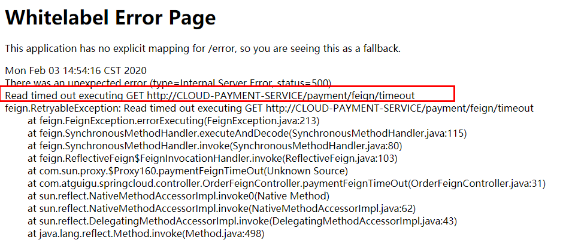

> OpenFeign超时控制是什么

默认Feign客户端只等待1秒钟，但是服务提供端处理需要超过1秒钟，导致Feign客户端不想等待了，直接返回报错。为了避免这样的情况，有时候我们需要设置Feign客户端的超时控制；

> OpenFeign默认支持ribbon


> 在消费端开启超时控制

```yaml
server:
  port: 80

eureka:
  client:
    register-with-eureka: false
    service-url:
      defaultZone: http://eureka7001.com:7001/eureka/,http://eureka7002.com:7002/eureka/

#设置feign客户端超时时间(OpenFeign默认支持ribbon)
ribbon:
#指的是建立连接所用的时间，适用于网络状况正常的情况下,两端连接所用的时间
  ReadTimeout: 5000
#指的是建立连接后从服务器读取到可用资源所用的时间
  ConnectTimeout: 5000
```

## 9.4、OpenFeign日志打印功能

> 是什么

Feign 提供了日志打印功能，我们可以通过配置来调整日志级别，从而了解 Feign 中 Http 请求的细节。说白了就是对Feign接口的调用情况进行监控和输出；

> 日志级别

NONE：默认的，不显示任何日志；

BASIC：仅记录请求方法、URL、响应状态码及执行时间；

HEADERS：除了 BASIC 中定义的信息之外，还有请求和响应的头信息；

FULL：除了 HEADERS 中定义的信息之外，还有请求和响应的正文及元数据。

> 开启日志打印功能

1. 配置日志bean：

   ```java
   @Configuration
   public class OpenFeignConfig {
   
       @Bean
       Logger.Level feignLoggerLevel()
       {
           return Logger.Level.FULL;
       }
   }
   ```

2. 在配置文件中开启日志打印功能：

   ```yaml
   logging:
     level:
       # feign日志以什么级别监控哪个接口
       org.yeahicode.springcloud.service.PaymentOpenFeignService: debug
   ```

3. 运行，调用，可在控制台查看详细的调用日志；

# 10、Hystrix断路器

## 10.1、概述

### 10.1.1、分布式系统面临的问题


复杂分布式体系结构中的应用程序有数十个依赖关系，每个依赖关系在某些时候将不可避免地失败；

> 服务雪崩

多个微服务之间调用的时候，假设微服务A调用微服务B和微服务C，微服务B和微服务C又调用其它的微服务，这就是所谓的“扇出”。如果扇出的链路上某个微服务的调用响应时间过长或者不可用，对微服务A的调用就会占用越来越多的系统资源，进而引起系统崩溃，所谓的“雪崩效应”；

对于高流量的应用来说，单一的后端依赖可能会导致所有服务器上的所有资源都在几秒钟内饱和。比失败更糟糕的是，这些应用程序还可能导致服务之间的延迟增加，备份队列，线程和其他系统资源紧张，导致整个系统发生更多的级联故障。这些都表示需要对故障和延迟进行隔离和管理，以便单个依赖关系的失败，不能取消整个应用程序或系统；

所以，通常当你发现一个模块下的某个实例失败后，这时候这个模块依然还会接收流量，然后这个有问题的模块还调用了其他的模块，这样就会发生级联故障，或者叫雪崩；

### 10.1.2、Hystrix是什么

官网资料：https://github.com/Netflix/Hystrix/wiki/How-To-Use

Hystrix是一个用于处理分布式系统的延迟和容错的开源库，在分布式系统里，许多依赖不可避免的会调用失败，比如超时、异常等，Hystrix能够保证在一个依赖出问题的情况下，不会导致整体服务失败，避免级联故障，以提高分布式系统的弹性；

“断路器”本身是一种开关装置，当某个服务单元发生故障之后，通过断路器的故障监控（类似熔断保险丝），向调用方返回一个符合预期的、可处理的备选响应（FallBack），而不是长时间的等待或者抛出调用方无法处理的异常，这样就保证了服务调用方的线程不会被长时间、不必要地占用，从而避免了故障在分布式系统中的蔓延，乃至雪崩；

### 10.1.3、Hystrix能干嘛

- 服务降级；
- 服务熔断；
- 接近实时的监控；
- ...；

### 10.1.4、Hystrix现状

Hystrix官宣，停更进维：

- 被动修复bugs；
- 不再接受合并请求；
- 不再发布新版本；

## 10.2、Hystrix重要概念

### 10.2.1、服务降级

- 服务器忙，请稍后再试，不让客户端等待并立刻返回一个友好提示，fallback兜底操作；
- 哪些情况会触发降级：
  - 程序运行异常；
  - 超时；
  - 服务熔断触发服务降级；
  - 线程池/信号量打满也会导致服务降级；

### 10.2.2、服务熔断

类比保险丝达到最大服务访问后，直接拒绝访问，拉闸限电，然后调用服务降级的方法并返回友好提示；

服务的降级->进而熔断->恢复调用链路

### 10.2.3、服务限流

秒杀高并发等操作，严禁一窝蜂的过来拥挤。

大家排队，1秒钟N个，有序进行；

## 10.3、Hystrix案例

### 10.3.1、构建

1. 构建11_cloud-provider-hystrix-payment-8001模块；

2. 改pom.xml：

   ```xml
   <!--hystrix-->
   <dependency>
       <groupId>org.springframework.cloud</groupId>
       <artifactId>spring-cloud-starter-netflix-hystrix</artifactId>
   </dependency>
   ```

3. 改application.yml，没有什么特殊配置，只想要将服务注册到注册中心；

4. 写主启动类，标记@EnableEurekaClient；

5. 业务类编写：

   - service：

     ```java
     @Service
     public class PaymentService
     {
         /**
          * 正常访问，一切OK
          * @param id
          * @return
          */
         public String paymentInfo_OK(Integer id)
         {
             return "线程池:"+Thread.currentThread().getName()+"paymentInfo_OK,id: "+id+"\t"+"O(∩_∩)O";
         }
     
         /**
          * 超时访问，演示降级
          * @param id
          * @return
          */
         public String paymentInfo_TimeOut(Integer id)
         {
             try { TimeUnit.SECONDS.sleep(5); } catch (InterruptedException e) { e.printStackTrace(); }
             return "线程池:"+Thread.currentThread().getName()+"paymentInfo_TimeOut,id: "+id+"\t"+"O(∩_∩)O，耗费3秒";
         }
     }
     ```

   - controller：

     ```java
     @RestController
     @Slf4j
     public class PaymentController
     {
         @Autowired
         private PaymentService paymentService;
     
         @Value("${server.port}")
         private String serverPort;
     
     
         @GetMapping("/payment/hystrix/ok/{id}")
         public String paymentInfo_OK(@PathVariable("id") Integer id)
         {
             String result = paymentService.paymentInfo_OK(id);
             log.info("****result: "+result);
             return result;
         }
     
         @GetMapping("/payment/hystrix/timeout/{id}")
         public String paymentInfo_TimeOut(@PathVariable("id") Integer id) throws InterruptedException
         {
             String result = paymentService.paymentInfo_TimeOut(id);
             log.info("****result: "+result);
             return result;
         }
     }
     ```

6. 启动服务注册中心，启动11_cloud-provider-hystrix-payment-8001，分别测试正常调用和超时调用，超时调用等待5秒响应；

### 10.3.2、高并发测试

> Jmeter压测测试

1. 开启Jmeter，来2000个并发压死8001，20000个请求都去访问paymentInfo_TimeOut服务；
2. 再来一个访问http://localhost:8001/payment/hystrix/ok/31；
3. 演示结果：两个请求页签都在转圈圈响应中。此时，tomcat默认的工作线程数都被打满了，没有多余的线程来分解压力和处理；

> Jmeter压测结论

上面还是服务提供者8001自己测试，假如此时外部的消费者80也来访问，那消费者只能干等，最终导致消费端80报超时错误，服务端8001直接被拖死；

### 10.3.3、故障现象和导致原因

8001同一层次的其它接口服务被困死，因为tomcat线程池里面的工作线程已经被挤占完毕。

80此时调用8001，客户端访问响应缓慢，转圈圈。

正因为有上述故障或不佳表现才有我们的降级/容错/限流等技术诞生。

### 10.3.4、如何解决

> 期望

- 超时导致服务器变慢（转圈）=> 超时不再等待；
- 出错（宕机或程序运行出错）=> 出错要有兜底；

> 解决

-  对方服务8001超时了，调用者80不能一直卡死等待，必须有服务降级；

- 对方服务8001宕机了，调用者80不能一直卡死等待，必须有服务降级；
- 对方服务8001OK，调用者80自己出故障或有自我要求（自己的等待时间小于服务提供者），自己处理降级；

## 10.4、服务降级

### 10.4.1、服务提供端配置

1. 改pom.xml：

   ```xml
   <!--hystrix-->
   <dependency>
       <groupId>org.springframework.cloud</groupId>
       <artifactId>spring-cloud-starter-netflix-hystrix</artifactId>
   </dependency>
   ```

2. 在启动类上通过注解@EnableCircuitBreaker开启断路器功能；

3. 在业务类上通过注解@HystrixCommand+降级方法配置兜底方案：

   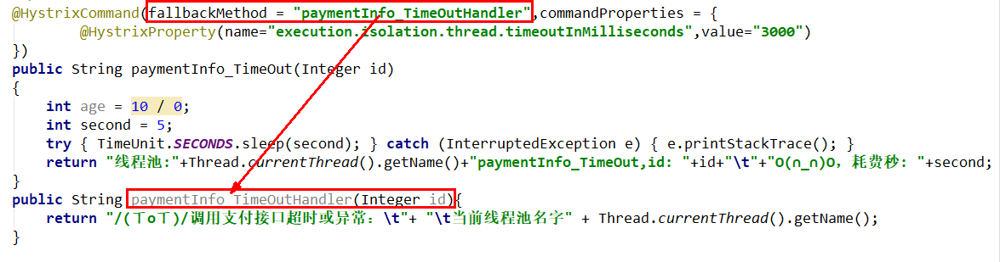

### 10.4.2、服务消费端配置

1. 改pom.xml：

   ```xml
   <!--hystrix-->
   <dependency>
       <groupId>org.springframework.cloud</groupId>
       <artifactId>spring-cloud-starter-netflix-hystrix</artifactId>
   </dependency>
   ```

2. 改application.yml：

   ```yaml
   feign:
     hystrix:
       enabled: true
   ```

3. controller：

   ```java
   @RestController
   @Slf4j
   public class PaymentHystirxController
   {
       @Resource
       private PaymentHystrixService paymentHystrixService;
   
       @GetMapping("/consumer/payment/hystrix/ok/{id}")
       public String paymentInfo_OK(@PathVariable("id") Integer id) {
           String result = paymentHystrixService.paymentInfo_OK(id);
           return result;
       }
   
       @GetMapping("/consumer/payment/hystrix/timeout/{id}")
       @HystrixCommand(fallbackMethod = "paymentTimeOutFallbackMethod",commandProperties = {
               @HystrixProperty(name="execution.isolation.thread.timeoutInMilliseconds",value="1500")
       })
       public String paymentInfo_TimeOut(@PathVariable("id") Integer id) {
           String result = paymentHystrixService.paymentInfo_TimeOut(id);
           return result;
       }
       public String paymentTimeOutFallbackMethod(@PathVariable("id") Integer id) {
           return "我是消费者80,对方支付系统繁忙请10秒钟后再试或者自己运行出错请检查自己,o(╥﹏╥)o";
       }
   
   }
   ```

4. 在启动类上，开启Hystrix功能：

   ```java
   @SpringBootApplication
   @EnableFeignClients
   @EnableHystrix
   public class OrderMainHystrix80 {
       public static void main(String[] args) {
           SpringApplication.run(OrderMainHystrix80.class);
       }
   }
   ```

### 10.4.3、目前问题

- 每个业务方法对应一个兜底的方法，代码膨胀；
- 统一和自定义的分开；

### 10.4.4、解决问题

> 每个方法配置一个？？？膨胀

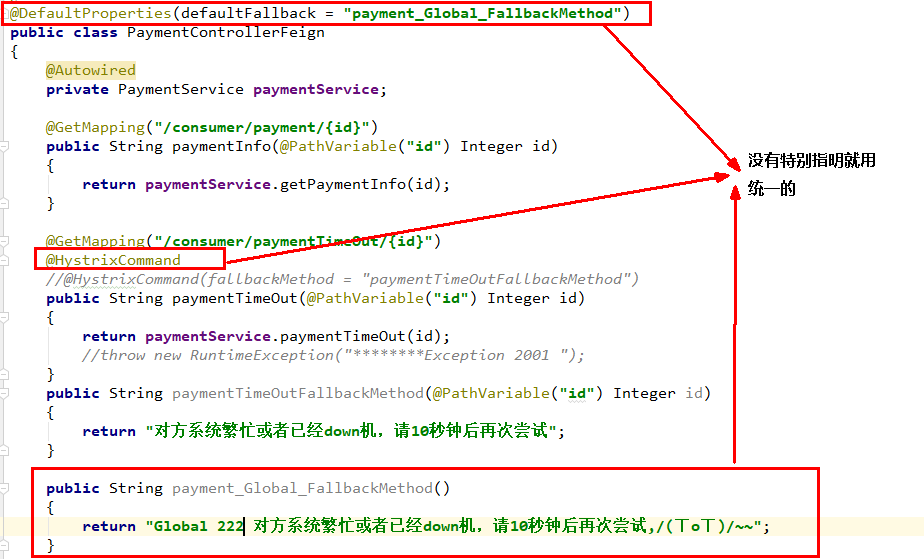

- 1:1 => 每个方法配置一个服务降级方法，技术上可以，实际上很傻；

- 1:N => 除了个别核心业务有专属，其他普通的可以通过@DefaultProperties(defaultFallback = "")  统一跳转到统一处理结果页面；
- 通用的和独享的各自分开，避免了代码膨胀，合理减少了代码量；

> 和业务逻辑混一起？？？混乱

在服务降级中，客户端去调用服务端，碰上服务端宕机或关闭。

本次案例中，服务降级处理是在客户端80实现完成的，与服务端8001没有关系，只需要为Feign客户端定义的接口添加一个服务降级处理的实现类即可实现解耦。

但是在未来我们要面对的异常，可能有运行时异常、超时异常、以及服务宕机。那么是不是所有的业务类都需要加一个@DefaultProperties(defaultFallback = "") 定义统一的降级方法呢？是否能够做成一个全局的降级方法？

通过在80服务中的的@FeignClient标记的服务提供端接口中，定义降级处理的实现类：

```java
@FeignClient(value = "CLOUD-PROVIDER-HYSTRIX", fallback = PaymentFallbackHystrixService.class)
@Component
public interface PaymentHystrixService {
    @GetMapping("/payment/hystrix/timeout/{id}")
    String paymentInfo_TimeOut(@PathVariable("id") Integer id);
}
```

然后在实现类中，可以统一对服务提供端所提供的服务接口做统一的降级处理：

```java
@Component
public class PaymentFallbackHystrixService implements PaymentHystrixService{
    @Override
    public String paymentInfo_TimeOut(Integer id) {
        return "PaymentFallbackHystrixService 统一异常处理";
    }
}
```

测试：

1. 启动eureka server单个节点7001；
2. 启动服务提供端8001；
3. 正常访问测试；
4. 故意关闭服务提供端8001；
5. 客户端再调用，此时服务端已经宕机了，但是我们做了服务降级处理，让客户端在服务端不可用时也会获得提示信息而不会挂起耗死服务器；

## 10.5、服务熔断

### 10.5.1、熔断是什么

> 断路器

断路器是什么？一句话，就是家里的保险丝

> 熔断机制概述

熔断机制是应对雪崩效应的一种微服务链路保护机制。

当扇出链路的某个微服务出错不可用或者响应时间太长时，会进行服务的降级，进而熔断该节点微服务的调用，快速返回错误的响应信息。当检测到该节点微服务调用响应正常后，恢复调用链路。

在SpringCloud框架里，熔断机制通过Hystrix实现。Hystrix会监控微服务间调用的状况，当失败的调用到一定阈值，缺省是5秒内20次调用失败，就会启动熔断机制。

熔断机制的注解是@HystrixCommand。

大神论文：https://martinfowler.com/bliki/CircuitBreaker.html

### 10.5.2、实操

修改服务提供端8001：

1. PaymentService.java：在10秒内的10次请求中，错误发生率超过60%的话，则先进行服务降级，接着服务熔断。当请求发生错误率低于60%的时候，则关闭熔断，恢复服务；

   ```java
    
   //=========服务熔断
   @HystrixCommand(fallbackMethod = "paymentCircuitBreaker_fallback",commandProperties = {
           @HystrixProperty(name = "circuitBreaker.enabled",value = "true"),
           @HystrixProperty(name = "circuitBreaker.requestVolumeThreshold",value = "10"), 
           @HystrixProperty(name = "circuitBreaker.sleepWindowInMilliseconds",value = "10000"),
           @HystrixProperty(name = "circuitBreaker.errorThresholdPercentage",value = "60"),
   })
   public String paymentCircuitBreaker(@PathVariable("id") Integer id) {
       if(id < 0)
       {
           throw new RuntimeException("******id 不能负数");
       }
       String serialNumber = IdUtil.simpleUUID();
       return Thread.currentThread().getName()+"\t"+"调用成功，流水号: " + serialNumber;
   }
   
   public String paymentCircuitBreaker_fallback(@PathVariable("id") Integer id) {
       return "id 不能负数，请稍后再试，/(ㄒoㄒ)/~~   id: " +id;
   }
   ```

### 10.5.3、熔断类型

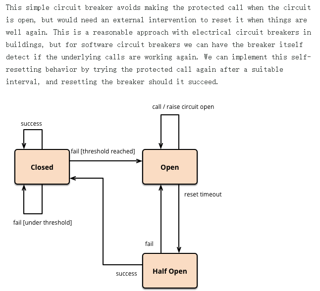

> 熔断打开

请求不再进行调用当前服务，内部设置时钟一般为MTTR（平均故障处理时间)，当打开时长达到所设时钟则进入半熔断状态；

> 熔断关闭

熔断关闭不会对服务进行熔断；

> 熔断半开

部分请求根据规则调用当前服务，如果请求成功且符合规则则认为当前服务恢复正常，关闭熔断；

### 10.5.4、涉及到断路器的三个重要参数

1. 快照时间窗：断路器确定是否打开需要统计一些请求和错误数据，而统计的时间范围就是快照时间窗，默认为最近的10秒；

2. 请求总数阈值：在快照时间窗内，必须满足请求总数阀值才有资格熔断。默认为20，意味着在10秒内，如果该hystrix命令的调用次数不足20次，即使所有的请求都超时或其他原因失败，断路器都不会打开；

   ```java
   @HystrixProperty(name = "circuitBreaker.requestVolumeThreshold", value = "10")
   ```

3. 错误百分比阀值：当请求总数在快照时间窗内超过了阀值，比如发生了30次调用，如果在这30次调用中，有15次发生了超时异常，也就是超过50%的错误百分比，在默认设定50%阀值情况下，这时候就会将断路器打开；

   ```java
   @HystrixProperty(name = "circuitBreaker.errorThresholdPercentage", value = "60")
   ```

### 10.5.5、断路器开启或关闭的条件（工作流程）

1. 当满足一定的阈值的时候（默认10秒内超过20个请求数）；
2. 当失败率达到一定的阈值的时候（默认10秒内超过50%的请求失败）；
3. 到达以上阈值，断路器将会开启；
4. 当开启的时候，所有请求都不会进行转发；
5. 一段时间之后（默认是5秒），这个时候断路器的状态会转换为半开状态，会让其中一个请求进行转发。如果成功，断路器会关闭。如果失败，继续开启。重复4到5次；

### 10.5.6、断路器打开之后

1. 再有请求调用的时候，将不会调用主逻辑，而是直接调用降级fallback。通过断路器，实现了自动地发现错误并将主逻辑切换为降级逻辑，减少响应延迟的效果；
2. 原来的主逻辑要如何恢复呢？对于这一问题，hystrix也为我们实现了自动恢复功能。当断路器打开，对主逻辑进行熔断之后，hystrix会启动一个休眠时间窗，在这个时间窗内，降级逻辑是临时的成为主逻辑，当休眠时间窗到期，断路器将进入半开状态，释放一次请求到原来的主逻辑上，如果此次请求正常返回，那么断路器将闭合，主逻辑恢复，如果这次请求依然有问题，断路器继续进入打开状态，休眠时间窗重新计时；

### 10.5.7、所有配置

```java
//========================All
@HystrixCommand(fallbackMethod = "str_fallbackMethod",
        groupKey = "strGroupCommand",
        commandKey = "strCommand",
        threadPoolKey = "strThreadPool",

        commandProperties = {
                // 设置隔离策略，THREAD 表示线程池 SEMAPHORE：信号池隔离
                @HystrixProperty(name = "execution.isolation.strategy", value = "THREAD"),
                // 当隔离策略选择信号池隔离的时候，用来设置信号池的大小（最大并发数）
                @HystrixProperty(name = "execution.isolation.semaphore.maxConcurrentRequests", value = "10"),
                // 配置命令执行的超时时间
                @HystrixProperty(name = "execution.isolation.thread.timeoutinMilliseconds", value = "10"),
                // 是否启用超时时间
                @HystrixProperty(name = "execution.timeout.enabled", value = "true"),
                // 执行超时的时候是否中断
                @HystrixProperty(name = "execution.isolation.thread.interruptOnTimeout", value = "true"),
                // 执行被取消的时候是否中断
                @HystrixProperty(name = "execution.isolation.thread.interruptOnCancel", value = "true"),
                // 允许回调方法执行的最大并发数
                @HystrixProperty(name = "fallback.isolation.semaphore.maxConcurrentRequests", value = "10"),
                // 服务降级是否启用，是否执行回调函数
                @HystrixProperty(name = "fallback.enabled", value = "true"),
                // 是否启用断路器
                @HystrixProperty(name = "circuitBreaker.enabled", value = "true"),
                // 该属性用来设置在滚动时间窗中，断路器熔断的最小请求数。例如，默认该值为 20 的时候，
                // 如果滚动时间窗（默认10秒）内仅收到了19个请求， 即使这19个请求都失败了，断路器也不会打开。
                @HystrixProperty(name = "circuitBreaker.requestVolumeThreshold", value = "20"),
                // 该属性用来设置在滚动时间窗中，表示在滚动时间窗中，在请求数量超过
                // circuitBreaker.requestVolumeThreshold 的情况下，如果错误请求数的百分比超过50,
                // 就把断路器设置为 "打开" 状态，否则就设置为 "关闭" 状态。
                @HystrixProperty(name = "circuitBreaker.errorThresholdPercentage", value = "50"),
                // 该属性用来设置当断路器打开之后的休眠时间窗。 休眠时间窗结束之后，
                // 会将断路器置为 "半开" 状态，尝试熔断的请求命令，如果依然失败就将断路器继续设置为 "打开" 状态，
                // 如果成功就设置为 "关闭" 状态。
                @HystrixProperty(name = "circuitBreaker.sleepWindowinMilliseconds", value = "5000"),
                // 断路器强制打开
                @HystrixProperty(name = "circuitBreaker.forceOpen", value = "false"),
                // 断路器强制关闭
                @HystrixProperty(name = "circuitBreaker.forceClosed", value = "false"),
                // 滚动时间窗设置，该时间用于断路器判断健康度时需要收集信息的持续时间
                @HystrixProperty(name = "metrics.rollingStats.timeinMilliseconds", value = "10000"),
                // 该属性用来设置滚动时间窗统计指标信息时划分"桶"的数量，断路器在收集指标信息的时候会根据
                // 设置的时间窗长度拆分成多个 "桶" 来累计各度量值，每个"桶"记录了一段时间内的采集指标。
                // 比如 10 秒内拆分成 10 个"桶"收集这样，所以 timeinMilliseconds 必须能被 numBuckets 整除。否则会抛异常
                @HystrixProperty(name = "metrics.rollingStats.numBuckets", value = "10"),
                // 该属性用来设置对命令执行的延迟是否使用百分位数来跟踪和计算。如果设置为 false, 那么所有的概要统计都将返回 -1。
                @HystrixProperty(name = "metrics.rollingPercentile.enabled", value = "false"),
                // 该属性用来设置百分位统计的滚动窗口的持续时间，单位为毫秒。
                @HystrixProperty(name = "metrics.rollingPercentile.timeInMilliseconds", value = "60000"),
                // 该属性用来设置百分位统计滚动窗口中使用 “ 桶 ”的数量。
                @HystrixProperty(name = "metrics.rollingPercentile.numBuckets", value = "60000"),
                // 该属性用来设置在执行过程中每个 “桶” 中保留的最大执行次数。如果在滚动时间窗内发生超过该设定值的执行次数，
                // 就从最初的位置开始重写。例如，将该值设置为100, 滚动窗口为10秒，若在10秒内一个 “桶 ”中发生了500次执行，
                // 那么该 “桶” 中只保留 最后的100次执行的统计。另外，增加该值的大小将会增加内存量的消耗，并增加排序百分位数所需的计算时间。
                @HystrixProperty(name = "metrics.rollingPercentile.bucketSize", value = "100"),
                // 该属性用来设置采集影响断路器状态的健康快照（请求的成功、 错误百分比）的间隔等待时间。
                @HystrixProperty(name = "metrics.healthSnapshot.intervalinMilliseconds", value = "500"),
                // 是否开启请求缓存
                @HystrixProperty(name = "requestCache.enabled", value = "true"),
                // HystrixCommand的执行和事件是否打印日志到 HystrixRequestLog 中
                @HystrixProperty(name = "requestLog.enabled", value = "true"),
        },
        threadPoolProperties = {
                // 该参数用来设置执行命令线程池的核心线程数，该值也就是命令执行的最大并发量
                @HystrixProperty(name = "coreSize", value = "10"),
                // 该参数用来设置线程池的最大队列大小。当设置为 -1 时，线程池将使用 SynchronousQueue 实现的队列，
                // 否则将使用 LinkedBlockingQueue 实现的队列。
                @HystrixProperty(name = "maxQueueSize", value = "-1"),
                // 该参数用来为队列设置拒绝阈值。 通过该参数， 即使队列没有达到最大值也能拒绝请求。
                // 该参数主要是对 LinkedBlockingQueue 队列的补充,因为 LinkedBlockingQueue
                // 队列不能动态修改它的对象大小，而通过该属性就可以调整拒绝请求的队列大小了。
                @HystrixProperty(name = "queueSizeRejectionThreshold", value = "5"),
        }
)
public String strConsumer() {
    return "hello 2020";
}
public String str_fallbackMethod()
{
    return "*****fall back str_fallbackMethod";
}
```

## 10.6、服务限流

高级篇的时候Alibaba的Sentinel再说明。

## 10.7、工作流程&原理

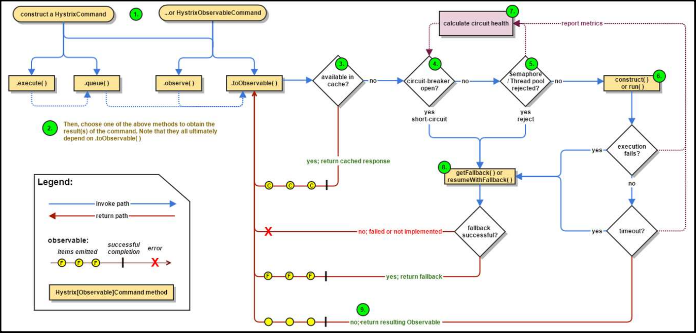

1. 创建 HystrixCommand（用在依赖的服务返回单个操作结果的时候） 或 HystrixObserableCommand（用在依赖的服务返回多个操作结果的时候） 对象；
2. 命令执行。其中 HystrixComand 实现了下面前两种执行方式；而 HystrixObservableCommand 实现了后两种执行方式：execute()：同步执行，从依赖的服务返回一个单一的结果对象， 或是在发生错误的时候抛出异常。queue()：异步执行， 直接返回 一个Future对象， 其中包含了服务执行结束时要返回的单一结果对象。observe()：返回 Observable 对象，它代表了操作的多个结果，它是一个 Hot Obserable（不论 "事件源" 是否有 "订阅者"，都会在创建后对事件进行发布，所以对于 Hot Observable 的每一个 "订阅者" 都有可能是从 "事件源" 的中途开始的，并可能只是看到了整个操作的局部过程）。toObservable()： 同样会返回 Observable 对象，也代表了操作的多个结果，但它返回的是一个Cold Observable（没有 "订阅者" 的时候并不会发布事件，而是进行等待，直到有 "订阅者" 之后才发布事件，所以对于 Cold Observable 的订阅者，它可以保证从一开始看到整个操作的全部过程）；
3. 若当前命令的请求缓存功能是被启用的， 并且该命令缓存命中， 那么缓存的结果会立即以 Observable 对象的形式 返回；
4. 检查断路器是否为打开状态。如果断路器是打开的，那么Hystrix不会执行命令，而是转接到 fallback 处理逻辑（第 8 步）；如果断路器是关闭的，检查是否有可用资源来执行命令（第 5 步）；
5. 线程池/请求队列/信号量是否占满。如果命令依赖服务的专有线程池和请求队列，或者信号量（不使用线程池的时候）已经被占满， 那么 Hystrix 也不会执行命令， 而是转接到 fallback 处理逻辑（第8步）；
6. Hystrix 会根据我们编写的方法来决定采取什么样的方式去请求依赖服务。HystrixCommand.run() ：返回一个单一的结果，或者抛出异常。HystrixObservableCommand.construct()： 返回一个Observable 对象来发射多个结果，或通过 onError 发送错误通知；
7. Hystrix会将 "成功"、"失败"、"拒绝"、"超时" 等信息报告给断路器， 而断路器会维护一组计数器来统计这些数据。断路器会使用这些统计数据来决定是否要将断路器打开，来对某个依赖服务的请求进行 "熔断/短路"；
8. 当命令执行失败的时候， Hystrix 会进入 fallback 尝试回退处理， 我们通常也称该操作为 "服务降级"。而能够引起服务降级处理的情况有下面几种：第4步： 当前命令处于"熔断/短路"状态，断路器是打开的时候。第5步： 当前命令的线程池、 请求队列或 者信号量被占满的时候。第6步：HystrixObservableCommand.construct() 或 HystrixCommand.run() 抛出异常的时候；
9. 当Hystrix命令执行成功之后， 它会将处理结果直接返回或是以Observable 的形式返回；

**注意**：如果我们没有为命令实现降级逻辑或者在降级处理逻辑中抛出了异常， Hystrix 依然会返回一个 Observable 对象， 但是它不会发射任何结果数据， 而是通过 onError 方法通知命令立即中断请求，并通过onError()方法将引起命令失败的异常发送给调用者。

## 10.8、服务监控

### 10.8.1、服务消费端监控配置

1. 改pom.xml：

   ```xml
   <dependency>
       <groupId>org.springframework.cloud</groupId>
       <artifactId>spring-cloud-starter-netflix-hystrix-dashboard</artifactId>
   </dependency>
   ```

2. application.yml：

   ```yaml
   server:
     port: 9001
   ```

3. 开启hystrix仪表盘：

   ```java
   @SpringBootApplication
   @EnableHystrixDashboard
   public class HystrixDashboardMain9001 {
       public static void main(String[] args) {
           SpringApplication.run(HystrixDashboardMain9001.class);
       }
   }
   ```

4. 启动；

5. 访问：http://localhost:9001/hystrix

   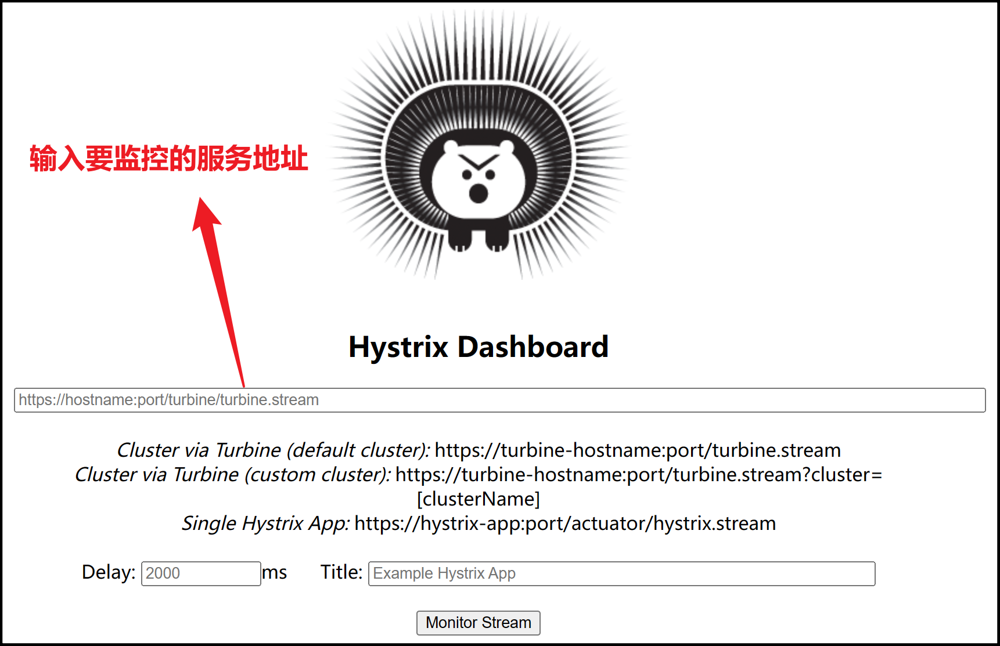

### 10.8.2、服务消费端被监控配置

```java
@SpringBootApplication
@EnableEurekaClient
@EnableCircuitBreaker
public class PaymentMainHystrix8001 {
    public static void main(String[] args) {
        SpringApplication.run(PaymentMainHystrix8001.class);
    }

    /**
     * 此配置是为了服务监控而配置，与服务容错本身无关，springcloud升级后的坑
     * ServletRegistrationBean因为springboot的默认路径不是"/hystrix.stream"，
     * 只要在自己的项目里配置上下面的servlet就可以了
     */
    @Bean
    public ServletRegistrationBean getServlet() {
        HystrixMetricsStreamServlet streamServlet = new HystrixMetricsStreamServlet();
        ServletRegistrationBean registrationBean = new ServletRegistrationBean(streamServlet);
        registrationBean.setLoadOnStartup(1);
        registrationBean.addUrlMappings("/hystrix.stream");
        registrationBean.setName("HystrixMetricsStreamServlet");
        return registrationBean;
    }
}
```

### 10.8.3、测试

1. 启动一个Eureka Server（04-cloud-eureka-server-7001）：

   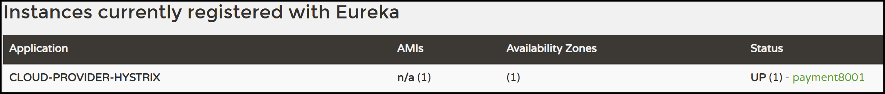

2. 启动一个服务提供端（11_cloud-provider-hystrix-payment-8001）：

3. 正常访问：[localhost:8001/payment/circuit/31](http://localhost:8001/payment/circuit/31)

4. 降级访问：[localhost:8001/payment/circuit/-31](http://localhost:8001/payment/circuit/-31)

5. 监控：http://localhost:8001/hystrix.stream

   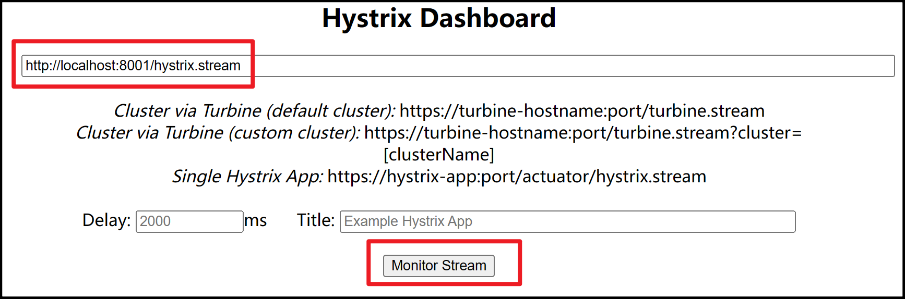

   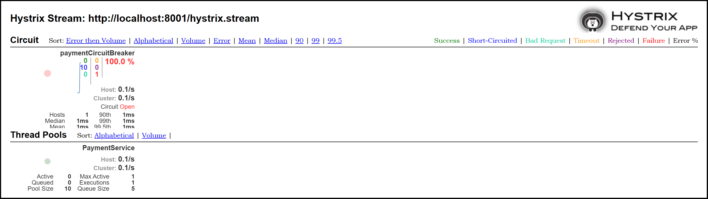

### 10.8.4、监控仪表盘说明

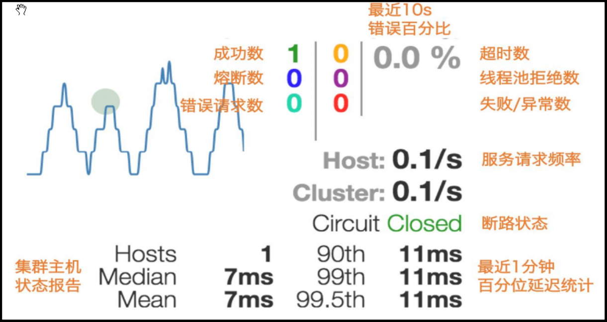

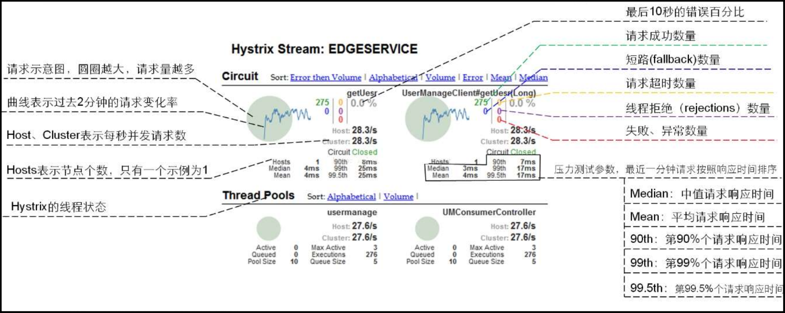

# 11、Zuul路由网关

技术太老，略。

# 12、Gateway服务网关

## 12.1、概述简介

### 12.1.1、概述

[cloud.sprinq.io](https://cloud.sprinq.io/spring-cloud-static/spring-cloud-gateway/2.2.1.RELEASE/reference/html)

SpringCloud Gateway 是 SpringCloud 的一个全新项目，基于 Spring 5.0+Spring Boot 2.0 和 Project Reactor 等技术开发的网关，它旨在为微服务架构提供一种简单有效的统一的 API 路由管理方式。

SpringCloud Gateway 作为 SpringCloud 生态系统中的网关，目标是替代 Zuul，在SpringCloud 2.0以上版本中，没有对新版本的Zuul 2.0以上最新高性能版本进行集成，仍然还是使用的Zuul 1.x非Reactor模式的老版本。而为了提升网关的性能，SpringCloud Gateway是基于WebFlux框架实现的，而WebFlux框架底层则使用了高性能的Reactor模式通信框架Netty。一句话概括：SpringCloud Gateway 使用的Webflux中的reactor-netty响应式编程组件，底层使用了Netty通讯框架。

SpringCloud Gateway的目标提供统一的路由方式且基于 Filter 链的方式提供了网关基本的功能，例如：安全，监控/指标，和限流。

### 12.1.2、源码架构


### 12.1.3、网关架构图

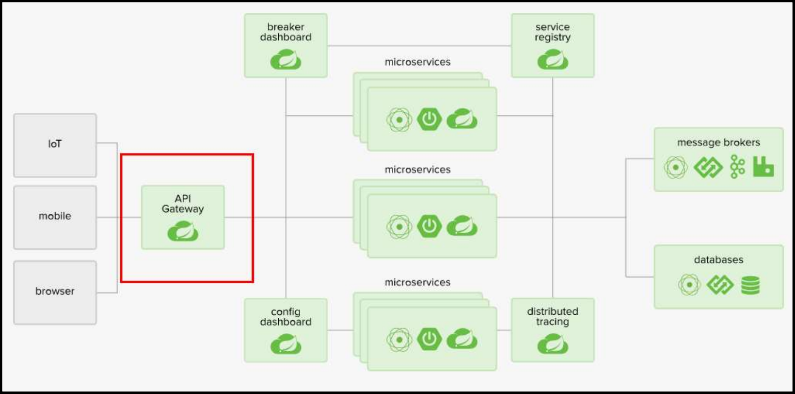

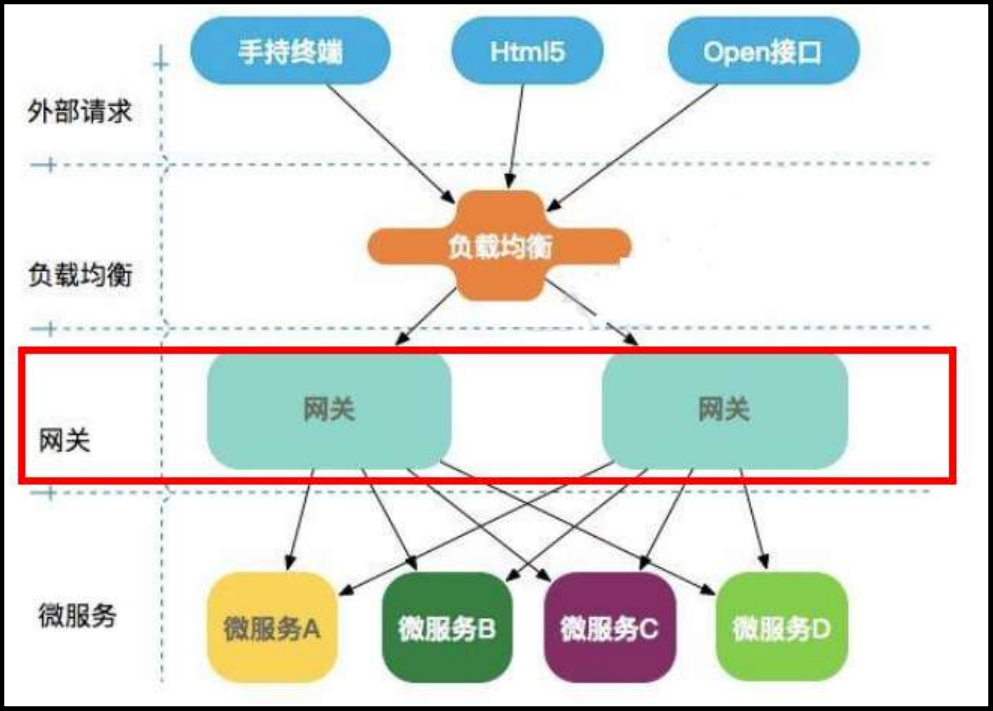

### 12.1.4、能做什么

1. 反向代理；
2. 鉴权；
3. 流量控制；
4. 熔断；
5. 日志监控；

### 12.1.5、为什么有Zuul又有Gateway

1. zuul一直跳票：一方面因为Zuul1.0已经进入了维护阶段，而且Gateway是SpringCloud团队研发的，是亲儿子产品，值得信赖。而且很多功能Zuul都没有用起来也非常的简单便捷。Gateway是基于**异步非阻塞模型**上进行开发的，性能方面不需要担心。虽然Netflix早就发布了最新的 Zuul 2.x，但 SpringCloud 貌似没有整合计划。而且Netflix相关组件都宣布进入维护期；不知前景如何？多方面综合考虑Gateway是很理想的网关选择；
2. SpringCloud Gateway具有如下特性：
   - 基于Spring Framework 5, Project Reactor 和 Spring Boot 2.0 进行构建；
   - 动态路由：能够匹配任何请求属性；
   - 可以对路由指定 Predicate（断言）和 Filter（过滤器）；
   - 集成Hystrix的断路器功能；
   - 集成 SpringCloud 服务发现功能；
   - 易于编写的 Predicate（断言）和 Filter（过滤器）；
   - 请求限流功能；
   - 支持路径重写；
3. SpringCloud Gateway与Zuul的区别：
   - Zuul 1.x，是一个基于阻塞 I/ O 的 API Gateway；
   - Zuul 1.x **基于Servlet 2. 5使用阻塞架构**它不支持任何长连接(如 WebSocket) Zuul 的设计模式和Nginx较像，每次 I/ O 操作都是从工作线程中选择一个执行，请求线程被阻塞到工作线程完成，但是差别是Nginx 用C++ 实现，Zuul 用 Java 实现，而 JVM 本身会有第一次加载较慢的情况，使得Zuul 的性能相对较差；
   - Zuul 2.x理念更先进，想基于Netty非阻塞和支持长连接，但SpringCloud目前还没有整合。 Zuul 2.x的性能较 Zuul 1.x 有较大提升。在性能方面，根据官方提供的基准测试， SpringCloud Gateway 的 RPS（每秒请求数）是Zuul 的 1. 6 倍；
   - SpringCloud Gateway 建立 在 Spring Framework 5、 Project Reactor 和 Spring Boot 2 之上， 使用非阻塞 API；
   - SpringCloud Gateway 还 支持 WebSocket， 并且与Spring紧密集成拥有更好的开发体验；

### 12.1.6、WebFlux是什么

传统的Web框架，比如说：struts2，springmvc等都是基于Servlet API与Servlet容器基础之上运行的。但是在Servlet3.1之后有了异步非阻塞的支持。而WebFlux是一个典型非阻塞异步的框架，它的核心是基于Reactor的相关API实现的。相对于传统的web框架来说，它可以运行在诸如Netty，Undertow及支持Servlet3.1的容器上。非阻塞式+函数式编程（Spring5必须让你使用java8）。Spring WebFlux 是 Spring 5.0 引入的新的响应式框架，区别于 Spring MVC，它不需要依赖Servlet API，它是完全异步非阻塞的，并且基于 Reactor 来实现响应式流规范。

## 12.2、三大核心概念

### 12.2.1、Route（路由）

路由是构建网关的基本模块，它由ID，目标URI，一系列的断言和过滤器组成，如果断言为true则匹配该路由。

### 12.2.2、Predicate（断言）

参考的是Java8的java.util.function.Predicate。

开发人员可以匹配Http请求中的所有内容（例如请求头或请求参数），如果请求与断言相匹配则进行路由。

### 12.2.3、Filter（过滤）

指的是Spring框架中GatewayFilter的实例，使用过滤器，可以再请求被路由前或者路由后对请求进行修改。

### 12.2.4、总结

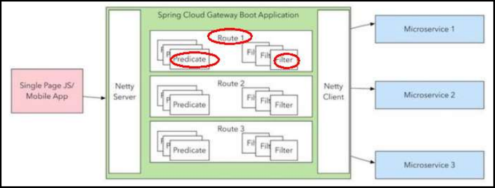

Web请求通过一些匹配条件，定位到真正的服务节点。并在这个转发过程的前后，进行一些精细化控制。Predicate就是我们的匹配条件。而Filter就可以理解为一个无所不能的拦截器。有了这两个元素，再加上目标URI，就可以实现一个具体的路由了。

## 12.3、Gateway工程流程

### 12.3.1、官网总结

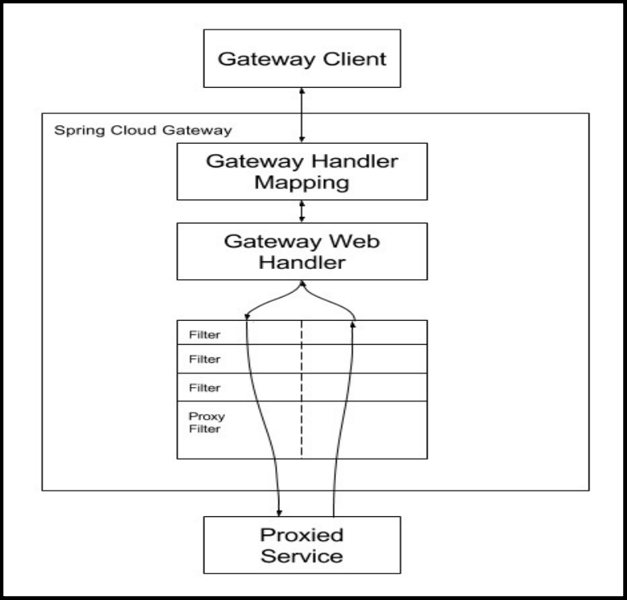

客户端向SpringCloud Gateway发出请求。然后在Gateway Handler Mapping中找到与请求相匹配的路由，将其发送到Gateway Web Handler。

Handler再通过指定的过滤器链来将请求发送到我们实际的服务执行业务逻辑，然后返回。

过滤器之间用虚线分开是因为过滤器可能会在发送代理请求之前（pre）或之后（post）执行业务逻辑。

Filter在pre类型的过滤器中可以做参数校验、权限校验、流量监控、日志输出、协议转换等。在post类型的过滤器中可以做响应内容、响应头的修改、日志的输出、流量监控等有着非常重要的作用。

### 12.3.2、核心逻辑

路由转发+执行过滤器链。

## 12.4、Gateway入门案例

1. pom.xml，不需要web和actuator依赖：

   ```xml
   <!--gateway-->
   <dependency>
       <groupId>org.springframework.cloud</groupId>
       <artifactId>spring-cloud-starter-gateway</artifactId>
   </dependency>
   <!--eureka-client-->
   <dependency>
       <groupId>org.springframework.cloud</groupId>
       <artifactId>spring-cloud-starter-netflix-eureka-client</artifactId>
   </dependency>
   ```

2. application.yml：

   ```yaml
   server:
     port: 9527
   
   spring:
     application:
       name: cloud-gateway-service
     cloud:
       gateway:
         routes:
           - id: paymentInfo_route       #路由ID，没有固定规则但要求唯一，建议配合服务名
             uri: http://localhost:8001  #匹配后提供服务的路由地址
             predicates:
               - Path=/payment/get/**,/payment/getServiceInfo   #断言，请求路径和这个相匹配的话则进行路由
   
   eureka:
     instance:
       #配置之前：LAPTOP-1FN99F9S:cloud-gateway:9527，配置之后：gateway9527
       instance-id: gateway9527
       #访问路径可以显示IP地址
       prefer-ip-address: true
     client: #服务提供者provider注册进eureka服务列表内
       service-url:
         register-with-eureka: true
         fetch-registry: true
         defaultZone: http://eureka7001.com:7001/eureka
   
   ```

3. 主启动类：

   ```java
   @SpringBootApplication
   // 因为gateway也是微服务中的一个，所以也需要注册到eureka上
   @EnableEurekaClient
   public class GatewayMain9527 {
       public static void main(String[] args) {
           SpringApplication.run(GatewayMain9527.class, args);
       }
   }
   ```

4. 测试：启动Eureka Server端7001，再启动服务提供端8001，以及网关服务9527；

5. 效果：原来直接调用服务接口`localhost:8001/payment/get/1`和`localhost:8001/payment/getServiceInfo`，现在通过网关转发调用`localhost:9527/payment/get/1`和`localhost:9527/payment/getServiceInfo`

## 12.5、通过RouteLocator配置路由（不推荐）

```java
@Configuration
public class GatewayConfig {

    @Bean
    public RouteLocator customRouteLocator(RouteLocatorBuilder builder)
    {
        RouteLocatorBuilder.Builder routes = builder.routes();

        routes.route("path_route_ryu1", r -> r.path("/baidu").uri("https://www.baidu.com/")).build();

        return routes.build();

    }
    @Bean
    public RouteLocator customRouteLocator2(RouteLocatorBuilder builder)
    {
        RouteLocatorBuilder.Builder routes = builder.routes();
        routes.route("path_route_ryu2", r -> r.path("/qq").uri("https://www.qq.com/")).build();
        return routes.build();
    }
}
```

## 12.6、通过微服务名实现动态路由

默认情况下Gateway会根据注册中心上注册服务列表，以注册中心上微服务名为路径创建动态路由进行转发，从而实现动态路由的功能。

1. 启动服务提供端8002；

2. 更改网关路由配置：

   ```yaml
   spring:
     application:
       name: cloud-gateway-service
     cloud:
       gateway:
         routes:
           - id: paymentInfo_route
             uri: lb://cloud-payment-service  #匹配后提供服务的路由地址，通过服务名实现动态路由
             predicates:
               - Path=/payment/get/**,/payment/getServiceInfo
         discovery:
           locator:
             enabled: true #开启从注册中心动态创建路由的功能，利用微服务名进行路由
   ```

3. 测试：

   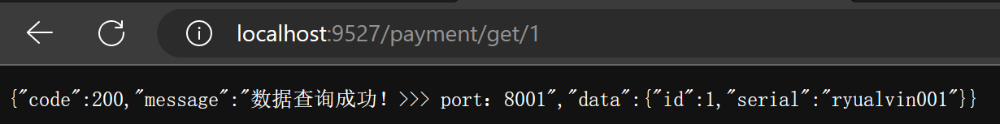

   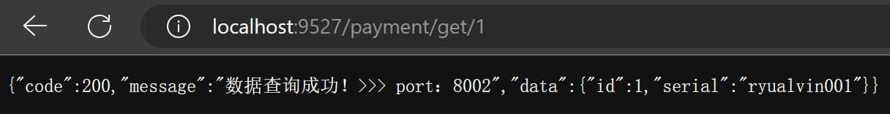

## 12.5、Predicate的使用

### 12.5.1、Predicate是什么

1. 启动我们的Gateway9527服务：

   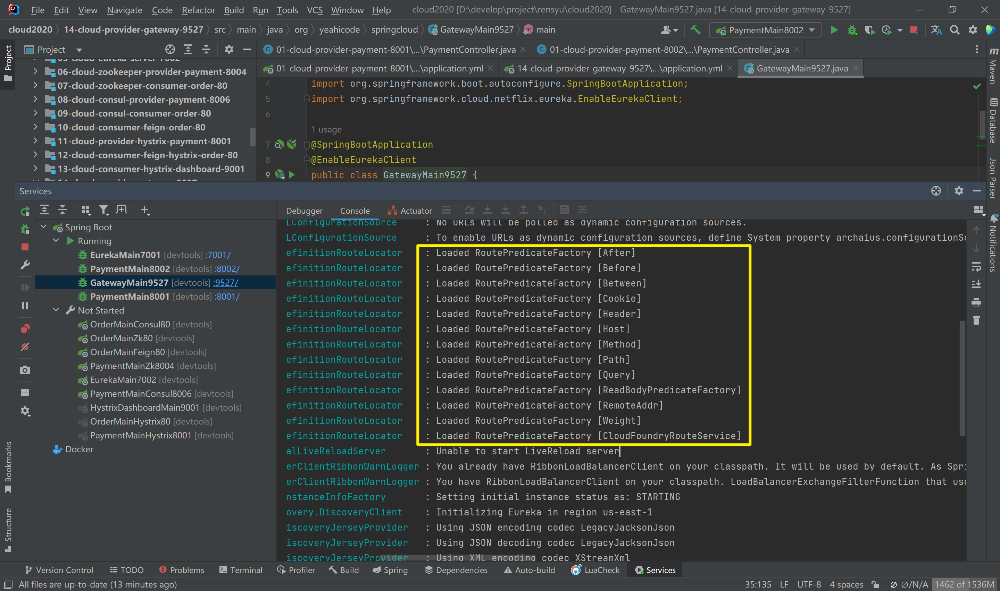

2. SpringCloud Gateway将路由匹配作为Spring WebFlux HandlerMapping基础架构的一部分；

3. SpringCloud Gateway包括许多内置的**RoutePredicateFactory**。所有这些Predicate都与HTTP请求的不同属性匹配。多个**RoutePredicateFactory**可以进行组合；

4. SpringCloud Gateway 创建 Route 对象时， 使用 RoutePredicateFactory 创建 Predicate 对象，Predicate 对象可以赋值给 Route；

### 12.5.2、Route Predicate Factories

[SpringCloud Gateway](https://docs.spring.io/spring-cloud-gateway/docs/3.0.8/reference/html/#gateway-request-predicates-factories)

#### 举例：After Route Predicate Factory

> 如何获取带时区时间

```java
ZonedDateTime zdt = ZonedDateTime.now();
// 2021-02-20T17:05:58.068+08:00[Asia/Shanghai]
System.out.println(zdt);
```

> 断言

```yaml
routes:
  - id: paymentInfo_route
    uri: lb://cloud-payment-service
    predicates:
      - Path=/payment/get/**,/payment/getServiceInfo
      - After=2021-02-21T17:05:58.068+08:00[Asia/Shanghai] #请求时间必须在此之后
```

### 12.5.3、总结

说白了，Predicate就是为了实现一组匹配规则，让请求过来找到对应的Route进行处理。

## 12.6、Filter的使用

### 12.6.1、Filter是什么

路由过滤器可用于修改进入的Http请求和返回的Http响应，路由过滤器只能指定路由进行使用。

SpringCloud Gateway 内置了多种路由过滤器，他们都由**GatewayFilter Factories**工厂类来产生。

### 12.6.2、GatewayFilter的生命周期

只有两个，pre和post。

### 12.6.3、GatewayFilter的种类

#### 12.6.3.1、GatewayFilter Factories

[SpringCloud Gateway](https://docs.spring.io/spring-cloud-gateway/docs/3.0.8/reference/html/#gatewayfilter-factories)

#### 12.6.3.2、Global Filters

[SpringCloud Gateway](https://docs.spring.io/spring-cloud-gateway/docs/3.0.8/reference/html/#global-filters)

### 12.6.4、常用的GatewayFilter

```yaml
spring:
  application:
    name: cloud-gateway-service
  cloud:
    gateway:
      routes:
        - id: paymentInfo_route
          uri: lb://cloud-payment-service
          predicates:
            - Path=/payment/get/**,/payment/getServiceInfo
            - After=2023-02-19T17:05:58.068+08:00[Asia/Shanghai]
          filters:
            - AddRequestParameter=x-request-name,ryualvin #AddRequestParameter过滤器
      discovery:
        locator:
          enabled: true
```

### 12.6.5、自定义过滤器

```java
@Component
public class MyGlobalFilter implements GlobalFilter, Ordered {
    @Override
    public Mono<Void> filter(ServerWebExchange exchange, GatewayFilterChain chain) {
        System.out.println("time:" + new Date() + "\t 执行了自定义的全局过滤器: " + "MyLogGateWayFilter" + "hello");

        String uname = exchange.getRequest().getQueryParams().getFirst("uname");
        if (uname == null) {
            System.out.println("****用户名为null，无法登录");
            exchange.getResponse().setStatusCode(HttpStatus.NOT_ACCEPTABLE);
            return exchange.getResponse().setComplete();
        }
        return chain.filter(exchange);
    }

    @Override
    public int getOrder() {
        // 数字越小，优先级越高
        return 0;
    }
}
```

# 13、Config分布式配置中心

## 13.1、概述

### 13.1.1、配置问题

微服务中每个服务都需要必要的配置信息才能运行，所以一套集中式的、动态的配置管理设施是必不可少的。

SpringCloud提供了ConfigServer来解决这个问题，我们每一个微服务自己带着一个application.yml，上百个配置文件的管理是灾难性的。

### 13.1.2、是什么

SpringCloud Config为微服务架构中的微服务提供集中化的外部配置支持，配置服务器为**各个不同微服务应用**的所有环境提供了一个**中心化的外部配置**。

SpringCloud Config分为**服务端和客户端两部分**。

服务端也称为**分布式配置中心，它是一个独立的微服务应用**，用来连接配置服务器并为客户端提供获取配置信息，加密/解密信息等访问接口。

客户端则是通过指定的配置中心来管理应用资源，以及与业务相关的配置内容，并在启动的时候从配置中心获取和加载配置信息。配置服务器默认采用git来存储配置信息，这样就有助于对环境配置进行版本管理，并且可以通过git客户端工具来方便地管理和访问配置内容。

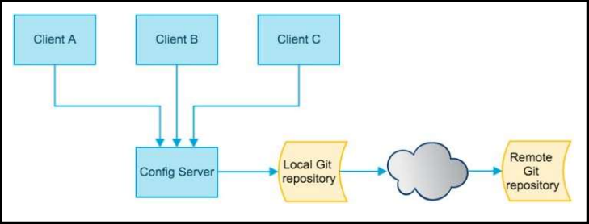

### 13.1.3、能干嘛

- 集中管理配置文件；
- 不同环境不同配置，动态化的配置更新，分环境部署比如dev/test/prod/beta/release；
- 运行期间动态调整配置，不再需要在每个服务部署的机器上编写配置文件，服务会向配置中心统一拉取配置自己的信息；
- 当配置发生变动时，服务不需要重启即可感知到配置的变化并应用新的配置；
- 将配置信息以REST接口的形式暴露（post、curl访问刷新均可）；

### 13.1.4、与GitHub整合配置

由于SpringCloud Config默认使用Git来存储配置文件（也有其他方式，比如支持SVN和本地文件），但是最推荐的还是Git，而且使用的是Http/Https访问的形式。

## 13.2、Config服务端配置与测试

### 13.2.1、创建外部配置中心仓库

在个人gitee上创建一个仓库，编写3个配置文件（保存格式必须为UTF-8），并拉取到本地。

### 13.2.2、创建Config服务端模块

1. 创建配置中心服务端模块`16-cloud-config-server-center-3344`；

2. pom.xml：

   ```xml
   <!--配置中心服务端依赖-->
   <dependency>
       <groupId>org.springframework.cloud</groupId>
       <artifactId>spring-cloud-config-server</artifactId>
   </dependency>
   <!--配置中心也是一个服务，所以需要注册到eureka上-->
   <dependency>
       <groupId>org.springframework.cloud</groupId>
       <artifactId>spring-cloud-starter-netflix-eureka-client</artifactId>
   </dependency>
   <dependency>
       <groupId>org.springframework.boot</groupId>
       <artifactId>spring-boot-starter-web</artifactId>
   </dependency>
   <dependency>
       <groupId>org.springframework.boot</groupId>
       <artifactId>spring-boot-starter-actuator</artifactId>
   </dependency>
   ```

3. 修改hosts文件：

   ```shell
   127.0.0.1 configserver3344.com
   ```

4. application.yml：

   ```yaml
   server:
     port: 3344
   
   spring:
     application:
       name:  cloud-config-server-center #注册进Eureka服务器的微服务名
     cloud:
       config:
         server:
           git:
             uri: https://gitee.com/ryualvin/springcloud-config.git #GitHub上面的git仓库名字
             ####搜索目录
             search-paths:
               - springcloud-config
             password: xxxxx
             username: RyuAlvin
         ####读取分支
         label: master
   
   #服务注册到eureka地址
   eureka:
     client:
       service-url:
         defaultZone: http://localhost:7001/eureka
   
     instance:
       instance-id: configserver3344
       prefer-ip-address: true
       hostname: configserver3344.com
   ```

   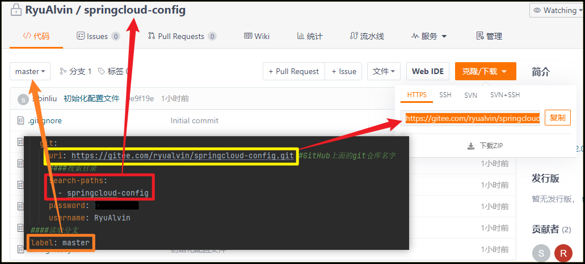

5. 测试：[configserver3344.com:3344/master/config-dev.yml](http://configserver3344.com:3344/master/config-dev.yml)，成功实现，SpringCloud Config通过Gitee获取配置信息；

   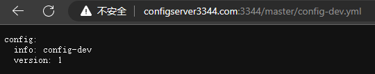

### 13.2.3、配置读取规则

> /{label}/{application}-{profile}.yml

- master分支：configserver3344.com:3344/master/config-dev.yml
- dev分支：configserver3344.com:3344/dev/config-dev.yml

> /{application}-{profile}.yml

- configserver3344.com:3344/config-dev.yml

> /{application}/{profile}[/{label}]

- configserver3344.com:3344/config/dev/master.yml

### 13.2.4、配置总结

- labe：分支（branch）；

- name：服务名；

- profiles：环境（dev/test/prod）；

## 13.3、Config客户端配置与测试

### 13.3.1、创建Config客户端模块

1. 创建配置中心服务端模块`17-cloud-config-server-center-3355`；

2. pom.xml：

   ```xml
   <!--配置中心客户端依赖，只有config，后面没有跟server-->
   <dependency>
       <groupId>org.springframework.cloud</groupId>
       <artifactId>spring-cloud-starter-config</artifactId>
   </dependency>
   <dependency>
       <groupId>org.springframework.cloud</groupId>
       <artifactId>spring-cloud-starter-netflix-eureka-client</artifactId>
   </dependency>
   <dependency>
       <groupId>org.springframework.boot</groupId>
       <artifactId>spring-boot-starter-web</artifactId>
   </dependency>
   <dependency>
       <groupId>org.springframework.boot</groupId>
       <artifactId>spring-boot-starter-actuator</artifactId>
   </dependency>
   ```

3. bootstrap.yml：

   ```yaml
   server:
     port: 3355
   
   spring:
     application:
       name: cloud-config-client
     cloud:
       #Config客户端配置
       config:
         label: master #分支名称
         name: config #配置文件名称
         profile: dev #读取后缀名称   上述3个综合：master分支上config-dev.yml的配置文件被读取http://config-3344.com:3344/master/config-dev.yml
         uri: http://localhost:3344 #配置中心地址k
   
   #服务注册到eureka地址
   eureka:
     client:
       service-url:
         defaultZone: http://localhost:7001/eureka
   ```

4. 主启动类：

   ```java
   @SpringBootApplication
   @EnableEurekaClient
   public class ConfigClient3355 {
       public static void main(String[] args) {
           SpringApplication.run(ConfigClient3355.class, args);
       }
   }
   ```

5. 业务类：

   ```java
   @RestController
   public class ConfigController {
   
       @Value("${config.info}")
       private String info;
   
       @GetMapping("/config")
       public String config() {
           return info;
       }
   }
   ```

6. 测试：[localhost:3355/config](http://localhost:3355/config)，成功实现客户端3355访问SpringCloud Config3344通过Gitee获取配置信息；

### 13.3.2、分布式配置的动态刷新问题

1. Linux运维修改Gitee上的配置文件内容做调整；
2. 刷新3344，发现ConfigServer服务端配置中心立刻响应；
3. 刷新3355，发现ConfigClient客户端没有任何响应；
4. 3355没有变化除非自己重启或者重新加载；
5. 难道每次运行修改配置文件，客户端都需要重启？

### 13.3.3、bootstrap.yml

`application.yml`是用户级的资源配置项，而`bootstrap.yml`是系统级的，优先级更高。

SpringCloud会创建一个`Bootstrap Context`，作为Spring应用的`Application Context`的**父上下文**。初始化的时候，`Bootstrap Context`负责从**外部源**加载配置属性并解析配置。这两个上下文共享一个从外部获取的`Environment`。

`BootStrap`属性有高优先级，默认情况下，它们不会被本地配置覆盖。`Bootstrap Context`和`Application Context`有着不同的约定，所以新增了一个`bootstrap.yml`文件，保证`Bootstrap Context`和`Application Context`配置的分离。

要将配置客户端3355模块下的`application.yml`文件改为`bootstrap.yml`，因为`bootstrap.yml`是比`applicatioin.yml`先加载，`bootstrap.yml`优先级高于`application.yml`。

## 13.4、Config客户端之动态刷新（手动）

### 13.4.1、修改Config客户端配置

1. pom.xml中引入actuator监控依赖：

   ```yaml
   <dependency>
       <groupId>org.springframework.boot</groupId>
       <artifactId>spring-boot-starter-actuator</artifactId>
   </dependency>
   ```

2. application.yml中暴露监控端口：

   ```yaml
   # 暴露监控端点
   management:
     endpoints:
       web:
         exposure:
           include: "*"
   ```

3. 修改业务类，在Controller上添加`@RefreshScope`注解；

### 13.4.2、手动刷新

1. 修改Gitee上的配置文件；

2. 刷新3344，ConfigServer服务端配置中心立刻响应；

3. 刷新3355，ConfigClient客户端仍然还没有改变；

4. 此时，需要通过运维人员手动操作，发送Post请求刷新3355：

   ```shell
   C:\Users\ryualvin>curl -X POST "http://localhost:3355/actuator/refresh"
   ["config.client.version","config.info"]
   ```

5. 接着，不需要重启3355，刷新页面，就可以看到新的配置信息了；

### 13.4.3、手动刷新的问题

1. 假如有多个微服务客户端3355、3366、3377...
2. 每个微服务都要执行一次Post请求进行手动刷新？
3. 可否广播，一次通知，处处生效？
4. 是否有大范围的自动刷新方法？

# 14、Bus消息总线

## 14.1、概述

### 14.1.1、是什么

SpringCloud Bus配合SpringCloud Config使用可以实现配置的动态刷新。

SpringCloud Bus是用来将分布式系统的节点与轻量级消息系统连接起来的框架，它整合了Java的事件处理机制和消息中间件的功能。

SpringCloud Bus目前只支持两种消息代理：RabbitMQ和Kafka。

### 14.1.2、能干嘛

SpringCloud Bus能管理和传播分布式系统间的消息，就像一个分布式执行器，可用于广播状态更改、事件推送等，也可以当作微服务间的通信通道。

### 14.1.3、为何被称为总线

在微服务架构的系统中，通常会使用**轻量级的消息代理**（例如RabbitMQ）来构建一个**共用的消息主题**，并让系统中所有微服务实例都连接上来。由于**该主题中产生的消息会被所有实例监听和消费，所以称它为消息总线**。在总线上的各个实例，都可以方便地广播一些需要让其他连接在该主题上的实例都知道的消息。

### 14.1.4、总线原理

ConfigClient实例都监听MQ中同一个TOPIC（相当于模糊匹配，默认是`springCloudBus`）。当一个服务刷新数据的时候，它会把这个信息放入到TOPIC中，这样其他监听同一个TOPIC的服务就能得到通知，然后去更新自身的配置。

## 14.2、Bus动态刷新全局广播

### 14.2.1、广播方式

方式一：利用消息总线触发一个客户端/bus/refresh，而通过这个客户端去刷新所有客户端的配置；

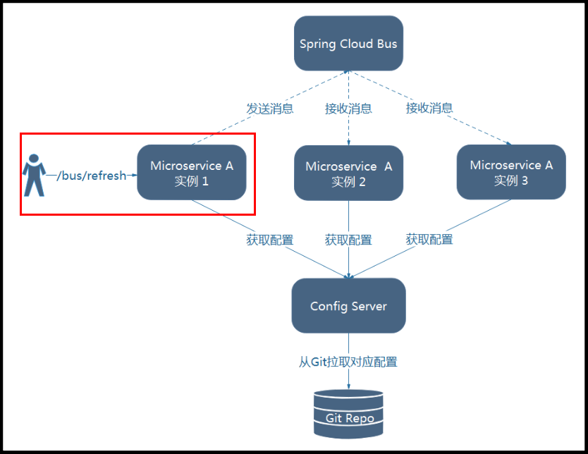

方式二：利用消息总线触发一个服务端ConfigServer的/bus/refresh端点，而刷新所有客户端的配置；

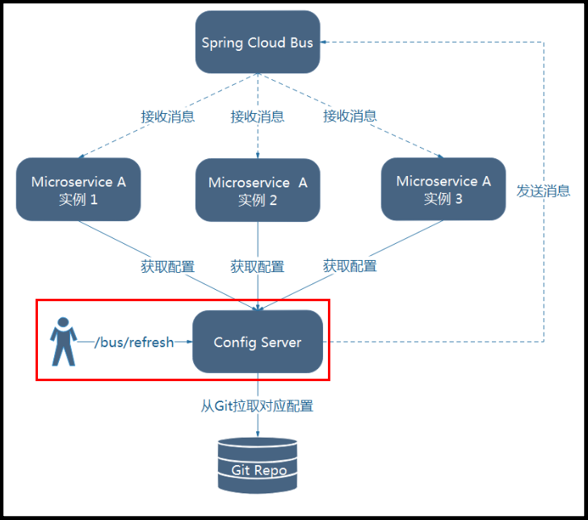

以上，方式二的架构显然更加适合，方式一不适合的原因如下：

1. 打破了微服务的职责单一性，因为微服务本身是业务模块，它本不应该承担配置刷新的职责；
2. 破坏了微服务各节点的对等性；
3. 有一定的局限性。例如：微服务在迁移时，它的网路地址常常会发生变化，此时如果想要做到自动刷新，那就会增加更多的修改；

### 14.2.2、实现步骤

1. 再仿照Config客户端3355创建另一个Config客户端模块3366；

2. 给Config服务端配置中心3344添加消息总线支持；

   - pom.xml：

     ```xml
     <!--添加消息总线RabbitMQ支持-->
     <dependency>
         <groupId>org.springframework.cloud</groupId>
         <artifactId>spring-cloud-starter-bus-amqp</artifactId>
     </dependency>
     <dependency>
         <groupId>org.springframework.boot</groupId>
         <artifactId>spring-boot-starter-actuator</artifactId>
     </dependency>
     ```

   - application.yml：

     ```yaml
       #在spring节点下添加rabbitmq相关配置，15672是Web管理界面的端口；5672是MQ访问的端口
       rabbitmq:
         host: ryualvin100
         port: 5672
         username: guest
         password: guest
         
     ##rabbitmq相关配置,暴露bus刷新配置的端点
     management:
       endpoints: #暴露bus刷新配置的端点
         web:
           exposure:
             include: 'bus-refresh'
     ```

3. 给Config客户端3355和3366添加消息总线支持；

   - pom.xml：

     ```xml
     <!--添加消息总线RabbitMQ支持-->
     <dependency>
         <groupId>org.springframework.cloud</groupId>
         <artifactId>spring-cloud-starter-bus-amqp</artifactId>
     </dependency>
     <dependency>
         <groupId>org.springframework.boot</groupId>
         <artifactId>spring-boot-starter-actuator</artifactId>
     </dependency>
     ```

   - application.yml：

     ```yaml
     #在spring节点下添加rabbitmq相关配置，15672是Web管理界面的端口；5672是MQ访问的端口
     rabbitmq:
       host: ryualvin100
       port: 5672
       username: guest
       password: guest
     ```

### 14.2.3、测试步骤

1. 运维工程师修改Gitee上的配置文件；

2. 访问Config服务端3344：[configserver3344.com:3344/master/config-dev.yml](http://configserver3344.com:3344/master/config-dev.yml)，新的配置信息已生效；

3. 访问Config客户端3355：[localhost:3355/config](http://localhost:3355/config)，Config客户端3366：[localhost:3355/config](http://localhost:3355/config)，新的配置信息未生效；

4. 运维工程师发送POST请求：

   ```shell
   C:\Users\ryualvin>curl -X POST "http://localhost:3355/actuator/bus-refresh"
   ```

5. 再次访问Config客户端3355和3366，新的配置信息已生效；

### 14.2.4、总结

一次修改，广播通知，处处生效。

## 14.3、Bus动态刷新定点通知

### 14.3.1、需求

修改完Gitee上的外部配置之后，指定具体某一个Config客户端实例生效，而不是全部生效，例如：现在有Config客户端3355和3366，指定只有3355生效。

### 14.3.2、实现步骤

```shell
C:\Users\ryualvin>curl -X POST "http://localhost:3355/actuator/bus-refresh/cloud-config-client:3355"
```

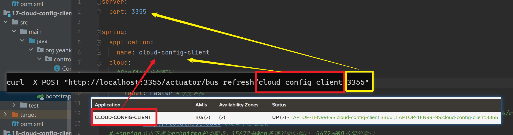

## 14.4、通知总结

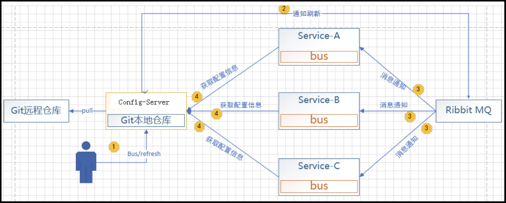

1. 当远程仓库中保存的配置信息发生更改；
2. 用Post方式请求Config服务端，服务端则会下发通知刷新的消息至MQ；
3. 使用消息总线的其他Config客户端节点，由于订阅了由消息总线在MQ中生成的消息队列，则会收到来自MQ的消息通知；
4. 当Config客户端节点收到来自MQ的消息通知后，则会重新去Config服务端获取新的配置信息，从而实现自动刷新；

# 15、Stream消息驱动

## 15.1、概述

### 15.1.1、是什么

屏蔽底层消息中间件的差异，降低切换成本，统一消息的编程模型。

[SpringCloud Stream中文指导手册 (wang1314.com)](https://m.wang1314.com/doc/webapp/topic/20971999.html)

### 15.1.2、为什么

比方说我们用到了RabbitMQ和Kafka，由于这两个消息中间件的架构上的不同，像RabbitMQ有exchange，kafka有Topic和Partitions分区，这些中间件的差异性导致我们实际项目开发给我们造成了一定的困扰，我们如果用了两个消息队列的其中一种，后面的业务需求，我想往另外一种消息队列进行迁移，这时候无疑就是一个灾难性的，一大堆东西都要重新推倒重新做，因为它跟我们的系统耦合了，这时候SpringCloud Stream给我们提供了一种解耦合的方式。

通过定义绑定器作为中间层，完美地实现了应用程序与消息中间件细节之间的隔离。通过向应用程序暴露统一的Channel通道，使得应用程序不需要再考虑各种不同的消息中间件实现。

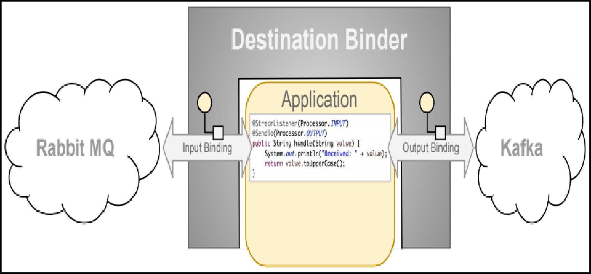

### 15.1.3、处理架构

在没有绑定器这个概念的情况下，我们的SpringBoot应用要直接与消息中间件进行信息交互的时候，由于各消息中间件构建的初衷不同，它们的实现细节上会有较大的差异性，通过定义绑定器作为中间层，完美地实现了应用程序与消息中间件细节之间的隔离。Stream对消息中间件的进一步封装，可以做到代码层面对中间件的无感知，甚至于动态的切换中间件(RabbitMQ切换为Kafka)，使得微服务开发的高度解耦，服务可以关注更多自己的业务流程。

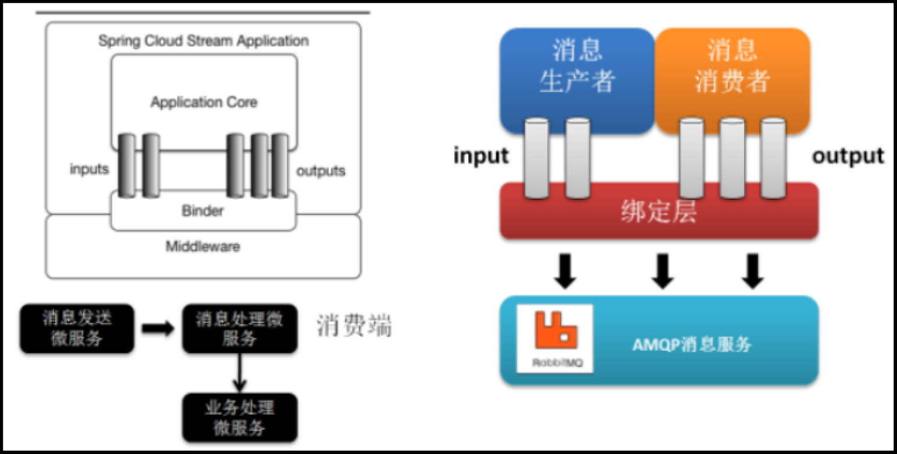

### 15.1.4、编码流程

#### 15.1.4.1、各名词介绍

Binder：为了连接应用和消息中间件，屏蔽差异。

Channel：通道，是队列Queue的一种抽象，在消息通讯系统中就是实现存储和转发的媒介，通过Channel对队列进行配置。

Source和Sink：简单的可理解为参照对象是SpringCloud Stream自身，从Stream发布消息就是输出，接收消息就是输入。

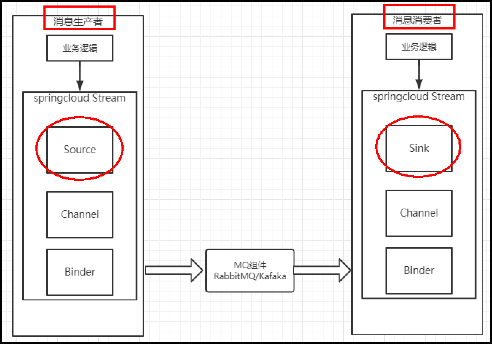

#### 15.1.4.2、各注解介绍

@Input：标识输入通道，通过该输入通道接收到的消息进入应用程序。

@Output：标识输出通道，发布的消息将通过该通道离开应用程序。

@StreamListener：监听队列，用于消费者的队列的消息接收。

@EnableBinding：指信道Channel和Exchange绑定在一起。

## 15.2、消息驱动之生产者

1. pom.xml：

   ```xml
   <dependency>
       <groupId>org.springframework.cloud</groupId>
       <artifactId>spring-cloud-starter-stream-rabbit</artifactId>
   </dependency>
   ```

2. application.yml：

   ```yaml
   server:
     port: 8801
   
   spring:
     application:
       name: cloud-stream-provider
     cloud:
       stream:
         binders: # 在此处配置要绑定的rabbitmq的服务信息；
           defaultRabbit: # 表示定义的名称，用于于binding整合
             type: rabbit # 消息组件类型
             environment: # 设置rabbitmq的相关的环境配置
               spring:
                 rabbitmq:
                   host: ryualvin100
                   port: 5672
                   username: guest
                   password: guest
         bindings: # 服务的整合处理
           output: # 这个名字是一个通道的名称
             destination: studyExchange # 表示要使用的Exchange名称定义
             content-type: application/json # 设置消息类型，本次为json，文本则设置“text/plain”
             binder: defaultRabbit # 设置要绑定的消息服务的具体设置
             
   eureka:
     client:
       service-url:
         defaultZone: http://localhost:7001/eureka
     instance:
       lease-renewal-interval-in-seconds: 2
       lease-expiration-duration-in-seconds: 5
       instance-id: streamprovider8801
       prefer-ip-address: true
   ```

3. 主程序：

   ```java
   @SpringBootApplication
   public class StreamRabbitMQProvider8801 {
       public static void main(String[] args) {
           SpringApplication.run(StreamRabbitMQProvider8801.class, args);
       }
   }
   ```

4. 业务类：

   ```java
   // 从上往下：source => channel => binder
   @EnableBinding(Source.class) // 可以理解为是一个消息的发送管道的定义
   public class MessageProviderImpl implements IMessageProvider {
       @Resource
       private MessageChannel output; // 消息的发送管道
   
       @Override
       public String send() {
           String serial = UUID.randomUUID().toString();
           this.output.send(MessageBuilder.withPayload(serial).build()); // 创建并发送消息
           System.out.println("***serial: " + serial);
           return serial;
       }
   }
   ```

5. 控制层：

   ```java
   @RestController
   public class SendMessageController {
   
       @Resource
       private IMessageProvider messageProvider;
   
       @GetMapping("/send")
       public String send() {
           return messageProvider.send();
       }
   }
   ```

## 15.3、消息驱动之消费者

1. pom.xml和主程序类与生产者一致；

2. application.yml：

   ```yaml
   server:
     port: 8802
   
   spring:
     application:
       name: cloud-stream-consumer
     cloud:
       stream:
         binders: # 在此处配置要绑定的rabbitmq的服务信息；
           defaultRabbit: # 表示定义的名称，用于于binding整合
             type: rabbit # 消息组件类型
             environment: # 设置rabbitmq的相关的环境配置
               spring:
                 rabbitmq:
                   host: ryualvin100
                   port: 5672
                   username: guest
                   password: guest
         bindings: # 服务的整合处理
           input: # 这个名字是一个通道的名称
             destination: studyExchange # 表示要使用的Exchange名称定义
             content-type: application/json # 设置消息类型，本次为对象json，如果是文本则设置“text/plain”
             binder: defaultRabbit # 设置要绑定的消息服务的具体设置
   
   eureka:
     client: # 客户端进行Eureka注册的配置
       service-url:
         defaultZone: http://localhost:7001/eureka
     instance:
       lease-renewal-interval-in-seconds: 2 # 设置心跳的时间间隔（默认是30秒）
       lease-expiration-duration-in-seconds: 5 # 如果现在超过了5秒的间隔（默认是90秒）
       instance-id: streamconsumer8802  # 在信息列表时显示主机名称
       prefer-ip-address: true     # 访问的路径变为IP地址
   ```

3. 业务类：

   ```java
   // 从上往下：sink => channel => binder
   @EnableBinding(Sink.class)
   public class ReceiveMessageListener {
   
       @Value("${server.port}")
       private String serverPort;
   
       // 监听队列
       @StreamListener(Sink.INPUT)
       public void input(Message<String> message) {
           System.out.println("消费者1号，------->接收到的消息：" + message.getPayload() + "\t port: " + serverPort);
       }
   }
   ```

4. 创建消费者8802和8803；

## 15.5、配置文件解析

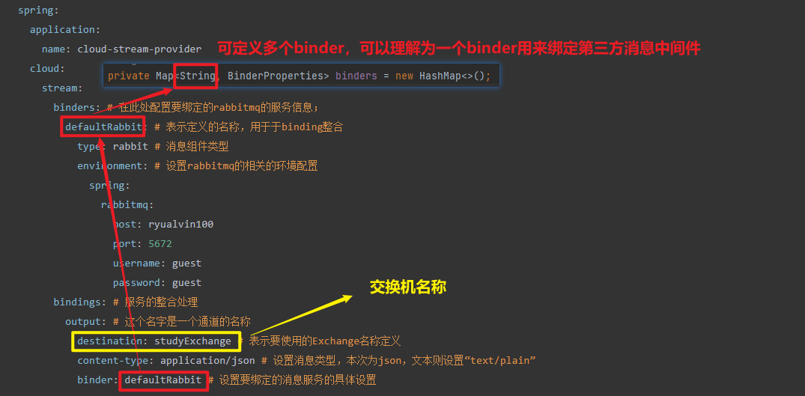

## 15.4、重复消费问题

> 没有指定分组

现在我们启动生产者8801，消费者8802和8803，三者都指向同一个交换机`studyExchange`，在没有指定分组的情况下，SpringCloud Stream会为默认分配两个匿名分组，即为我们在RabbitMQ中生成一个交换机`studyExchange`和两个匿名队列，并且这两个匿名队列都绑定交换机`studyExchange`：

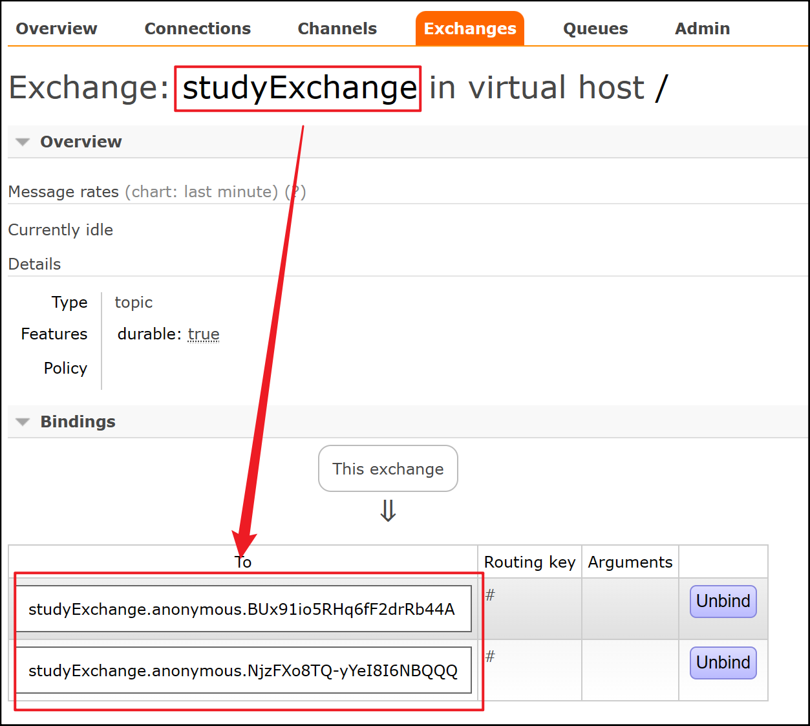

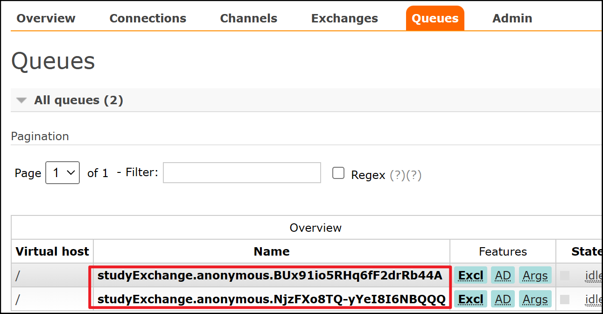

> 指定不同分组

消费者8802：

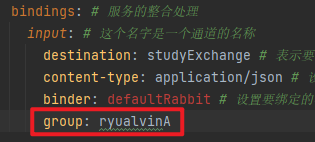

消费者8803：

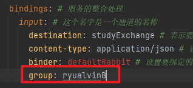

最终SpringConfig Stream也会为我们在RabbitMQ中生成两个不同的有名队列，并都绑定在交换机`studyExchange`上。

> 重复消费

上面两种情况，都会产生重复消费问题。即生产者8801发送一条消息，都会被消费者8802和8803消费。

> 问题解决

要解决重复消费的问题，要让多个消费者都位于同一个分组内，这样一来SpringCloud Stream会在RabbitMQ中生成一个交换机，并且这个交换机只绑定一个队列。多个消费者在消费的时候，都是去同一个队列中取消息，处于竞争关系，就不会出现重复消费的问题。

> 应用场景

比如在如下场景中，为了提升高可用性，订单系统做集群部署，那么多个订单系统节点都会从RabbitMQ中获取订单信息进行消费。那如果一个订单消息同时被多个节点消费，那么就会造成数据错误（一个用户下单一次，有多个订单，或者支付多次等问题）。为了避免这种情况的发生，这时我们就可以使用分组的概念来解决。

在SpringCloud Stream中，处于同一个分组的多个消费者属于竞争关系，能够保证生产者发送的消息只被消费一次。

处于不同组的话，可以重复消费，相当于广播。

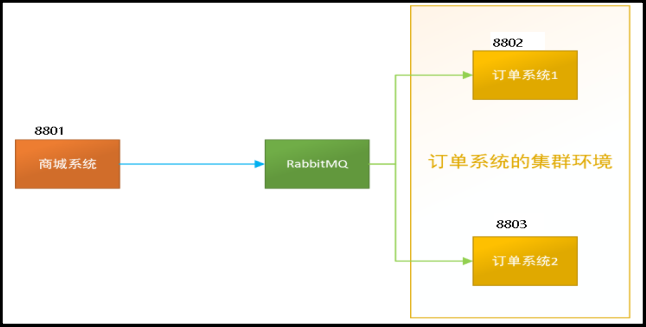

## 15.5、持久化问题

1. 启动生产者8801，关闭消费者8802和8803；
2. 生产者8801发送4条消息；
3. 将消费者8803启动，可以接收到这4条消息；

# 16、Sleuth分布式请求链路跟踪

## 16.1、概述

在微服务框架中，一个由客户端发起的请求在后端系统中会经过多个不同的的服务节点调用来协同产生最后的请求结果，每一个前段请求都会形成一条复杂的分布式服务调用链路，链路中的任何一环出现高延时或错误都会引起整个请求最后的失败。

SpringCloud Sleuth提供了一套完整的服务跟踪的解决方案，在分布式系统中提供追踪解决方案并且兼容支持了zipkin。

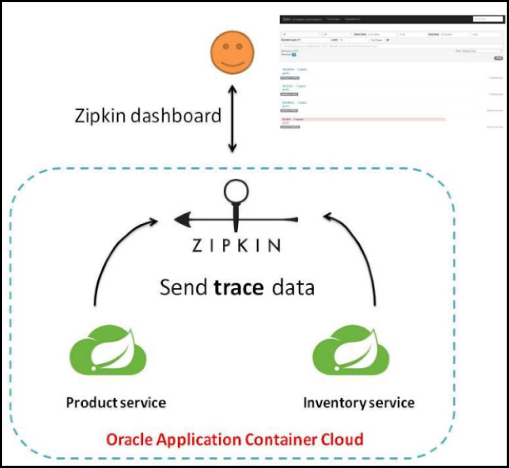

## 16.2、搭建链路监控步骤

### 16.2.1、Zipkin

> 下载

SpringCloud从F版起已不再需要自己构建Zipkin Server了，只需调用jar包即可。

[Central Repository: io/zipkin/java/zipkin-server (maven.org)](https://repo1.maven.org/maven2/io/zipkin/java/zipkin-server/)

> 运行

```shell
D:\develop\project\rensyu\cloud2020>java -jar zipkin-server-2.12.9-exec.jar
```

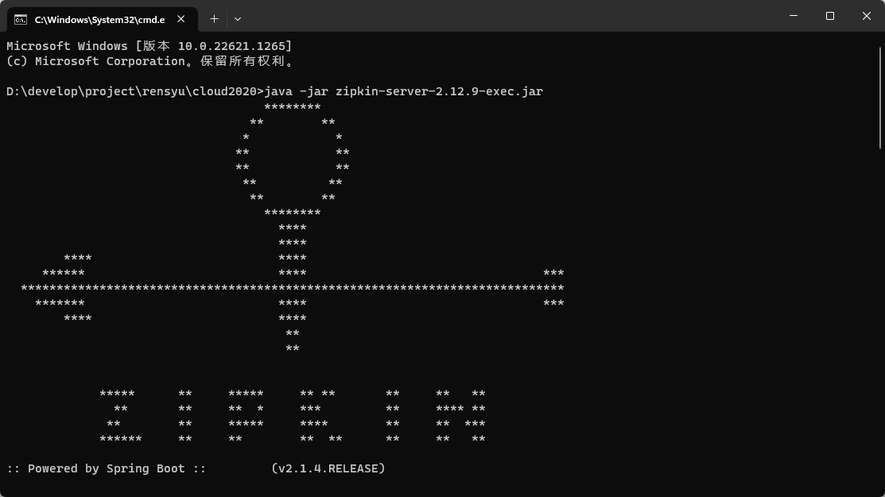

> 控制台访问

[Zipkin - Index](http://localhost:9411/zipkin/)

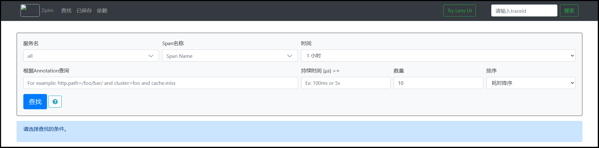

> 名词解释

一条链路通过`Trace Id`做唯一标识，`Span Id`表示发起的请求信息，各Span通过`Parent Id`关联起来。

通俗的理解一个Span就是一次请求信息。

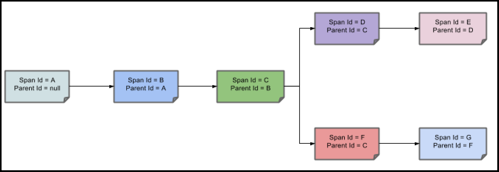

### 16.2.2、服务提供者

在`01-cloud-provider-payment-8001`服务上修改：

1. pom.xml：

   ```xml
   <!--包含了sleuth+zipkin-->
   <dependency>
       <groupId>org.springframework.cloud</groupId>
       <artifactId>spring-cloud-starter-zipkin</artifactId>
   </dependency>
   ```

2. application.yml：

   ```yaml
   spring:
     application:
       name: cloud-payment-service
     zipkin:
       base-url: http://localhost:9411
     sleuth:
       sampler:
         #采样率值介于 0 到 1 之间，1 则表示全部采集
         probability: 1
   ```

3. 控制层：

   ```java
   @GetMapping("/payment/zipkin")
   public String paymentZipkin() {
       return "Hello, Zipkin!";
   }
   ```

### 16.2.3、服务消费者

在`02-cloud-consumer-order-80`服务上修改：

1. pom.xml和application.yml配置同上；

2. 控制层：

   ```java
   @GetMapping("/consumer/payment/zipkin")
   public String consumerPaymentZipkin() {
       String result = restTemplate.getForObject("http://localhost:8001/payment/zipkin", String.class);
       return result;
   }
   ```

### 16.2.4、测试

1. 分别启动EurekaServer7001，服务提供端8001和消费端80；

2. 消费端80多次调用服务提供端8001：[localhost/consumer/payment/zipkin](http://localhost/consumer/payment/zipkin)

3. [Zipkin - Index](http://localhost:9411/zipkin/)

   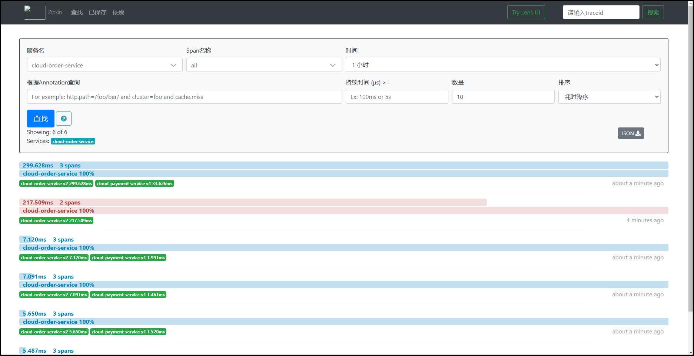

# 17、SpringCloud Alibaba Nacos服务注册和配置中心

## 17.1、概述

### 17.1.1、是什么

https://github.com/alibaba/Nacos

https://nacos.io/zh-cn/

Nacos：Dynamic **Na**ming and **Co**nfiguration **S**ervice

### 17.1.2、能干嘛

Nacos=Eureka（服务注册中心）+Config（服务配置中心）+Bus（消息总线：用来动态刷新配置全局广播）

### 17.1.3、怎么用

#### 17.1.3.1、确认Java环境

```shell
#确认Java环境
#清除已安装的与java相关的rpm包
[root@ryualvin100 java]# rpm -qa | grep java | xargs rpm -e --nodeps
#将jdk安装包放在/usr/local/java，并解压
[root@ryualvin100 java]# tar -zxvf jdk-8u361-linux-x64.tar.gz
#配置Java环境
[root@ryualvin100 java]# vim /etc/profile
JAVA_HOME=/usr/local/java/jdk1.8.0_361
CLASSPATH=.:$JAVA_HOME/lib:$JAVA_HOME/jre/lib
PATH=$PATH:$JAVA_HOME/bin:$JAVA_HOME/jre/bin
export JAVA_HOME CLASSPATH PATH
```

#### 17.1.3.2、开放8848端口

```shell
#开放8848端口
[root@ryualvin100 java]# firewall-cmd --add-port=8848/tcp --permanent
[root@ryualvin100 java]# firewall-cmd --reload
[root@ryualvin100 java]# firewall-cmd --list-ports
```

#### 17.1.3.3、下载安装并运行Nacos

https://github.com/alibaba/nacos/releases

```shell
#将Nacos安装包放在/home/ryualvin/nacos
[root@ryualvin100 nacos]# tar -zxvf nacos-server-2.2.0.tar.gz
[root@ryualvin100 nacos]# cd nacos/bin/
#启动Nacos
[root@ryualvin100 bin]# sh startup.sh -m standalone
```

访问：http://ryualvin100:8848/nacos，

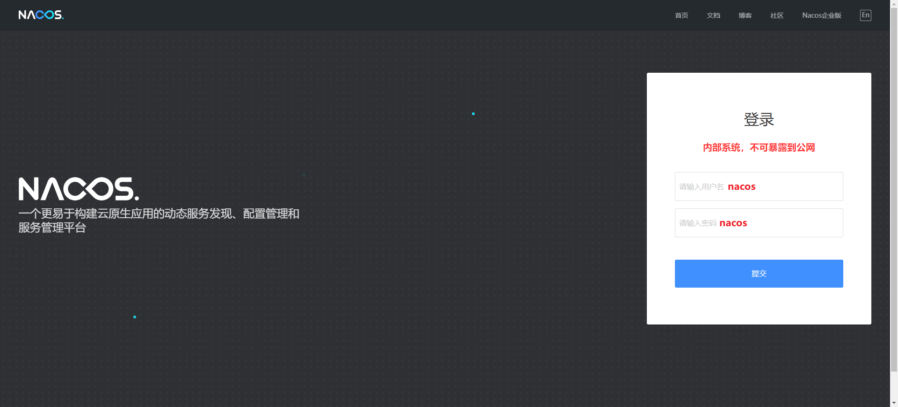

## 17.2、Nacos作为服务注册中心演示

### 17.2.1、基于Nacos的服务提供者

创建服务提供端9001和9002：

1. 父pom.xml：

   ```xml
   <!--spring cloud alibaba 2.1.0.RELEASE-->
   <dependency>
       <groupId>com.alibaba.cloud</groupId>
       <artifactId>spring-cloud-alibaba-dependencies</artifactId>
       <version>2.1.0.RELEASE</version>
       <!--指明该依赖为聚合工程，聚合多个依赖-->
       <type>pom</type>
       <!--解决maven工程的单继承问题，就是在本工程内将spring-cloud-alibaba中用到的所有依赖都导入进来-->
       <scope>import</scope>
   </dependency>
   ```

2. 本模块pom.xml：

   ```xml
   <!--SpringCloud ailibaba nacos -->
   <dependency>
       <groupId>com.alibaba.cloud</groupId>
       <artifactId>spring-cloud-starter-alibaba-nacos-discovery</artifactId>
   </dependency>
   ```

3. application.yml：

   ```yaml
   server:
     port: 9001
   
   spring:
     application:
       name: nacos-payment-provider
     cloud:
       nacos:
         discovery:
           server-addr: ryualvin100:8848 #配置Nacos地址
   
   management:
     endpoints:
       web:
         exposure:
           include: '*'
   ```

4. 主启动类：

   ```java
   @EnableDiscoveryClient
   @SpringBootApplication
   public class NacosPaymentMain9001 {
       public static void main(String[] args) {
           SpringApplication.run(NacosPaymentMain9001.class, args);
       }
   }
   ```

5. 提供服务的控制层：

   ```java
   @RestController
   public class PaymentController {
       @Value("${server.port}")
       private String serverPort;
   
       @GetMapping(value = "/payment/nacos/{id}")
       public String getPayment(@PathVariable("id") Integer id) {
           return "nacos registry, serverPort: " + serverPort + "\t id" + id;
       }
   }
   ```

通过拷贝虚拟端口映射创建9011服务：


### 17.2.2、基于Nacos的服务消费者

1. pom.xml同上；

2. application.yml：

   ```yaml
   server:
     port: 83
   
   spring:
     application:
       name: nacos-order-consumer
     cloud:
       nacos:
         discovery:
           server-addr: ryualvin100:8848 #配置Nacos地址
   
   service-url:
     nacos-payment-service: http://nacos-payment-provider
   ```

3. 主启动类：

   ```java
   @SpringBootApplication
   @EnableDiscoveryClient
   public class NacosOrderMain83 {
       public static void main(String[] args) {
           SpringApplication.run(NacosOrderMain83.class, args);
       }
   
       @Bean
       @LoadBalanced
       public RestTemplate restTemplate() {
           return new RestTemplate();
       }
   }
   ```

4. 控制层，消费服务：

   ```java
   @RestController
   public class NacosOrderController {
   
       @Autowired
       RestTemplate restTemplate;
   
   //    private static final String SERVICE = "http://nacos-payment-provider";
   
       @Value("${service-url.nacos-payment-service}")
       String serviceUrl;
   
       @GetMapping("/order/nacos/getPayment/{id}")
       public String getPayment(@PathVariable("id") String id) {
           String result = restTemplate.getForObject(serviceUrl + "/payment/nacos/" + id, String.class);
           return result;
       }
   }
   ```

### 17.2.3、为什么Nacos支持负载均衡

以上配置完成之后，进行测试：用消费端83调用服务接口，返回的端口信息在9001和9002之间切换，实现了轮询负载。

在Nacos的依赖当中很好的集成了Netfilx的Ribbon依赖，所以具有负载均衡的功能。

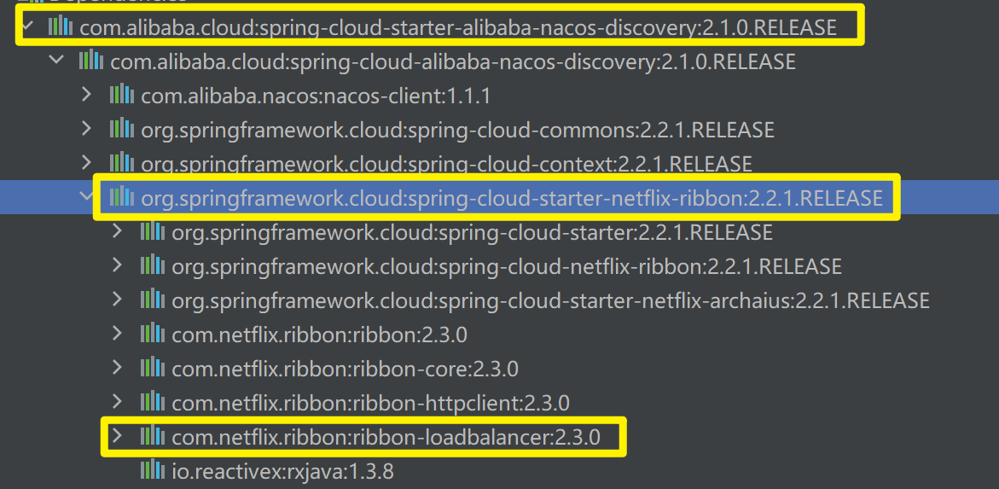

### 17.2.4、服务注册中心对比

#### 17.2.4.1、Nacos和CAP


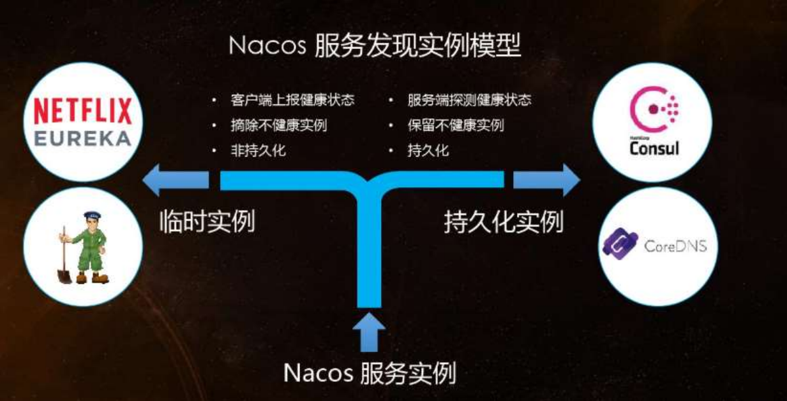

#### 17.2.4.2、Nacos支持AP和CP模式切换

##### 17.2.4.2.1、C A 定义

C（一致性）是所有节点在同一时间看到的数据是一致的，而A（高可用）定义是所有的请求都会收到响应。

##### 17.2.4.2.2、何时选择使用何种模式

一般来说，如果不需要存储服务级别的信息且服务实例是通过Nacos-Client注册，并能过够保持心跳上报，那么久可以选择AP模式。当前主流的服务如SpringCloud和Dubbo服务，都适用于AP模式，AP模式为了服务的可能性而减弱了一致性，因此AP模式下只支持注册临时实例。

如果需要在服务级别编辑或者存储配置信息，那么CP是必须的，K8S服务和DNS服务则适用于CP模式。CP模式下则支持注册持久化实例，此时则是以Raft协议为集群运行模式，该模式下注册实例之前必须先注册服务，如果服务不存在，则会返回错误。

##### 17.2.4.2.3、Nacos如何在AP和CP中切换

```shell
curl -X PUT '$NACOS_SERVER:8848/nacos/v1/ns/operator/switches?entry=serverMode&value=CP'
```

## 17.3、Nacos作为服务配置中心演示

### 17.3.1、基础配置

#### 17.3.1.1、实例代码

创建模块`25-alibaba-nacos-config-client-3377`：

1. pom.xml：

   ```xml
   <!--nacos-config-->
   <dependency>
       <groupId>com.alibaba.cloud</groupId>
       <artifactId>spring-cloud-starter-alibaba-nacos-config</artifactId>
   </dependency>
   <!--nacos-discovery-->
   <dependency>
       <groupId>com.alibaba.cloud</groupId>
       <artifactId>spring-cloud-starter-alibaba-nacos-discovery</artifactId>
   </dependency>
   ```

2. bootstrap.yml：

   ```yaml
   server:
     port: 3377
   
   spring:
     application:
       name: nacos-config-client
     cloud:
       nacos:
         discovery:
           server-addr: ryualvin100:8848
         config:
           server-addr: ryualvin100:8848
           file-extension: yaml
   ```

3. application.yml：

   ```yaml
   spring:
     profiles:
       active: dev
   ```

4. 主启动类标注`@EnableDiscoveryClient`，注册服务；

5. 业务类：

   ```java
   @RestController
   @RefreshScope//实现配置自动刷新
   public class ConfigController {
   
       @Value("${config.info}")
       String configInfo;
   
       @GetMapping("/config")
       public String config() {
           return configInfo;
       }
   }
   ```

#### 17.3.1.2、实现分析

> 官方文档

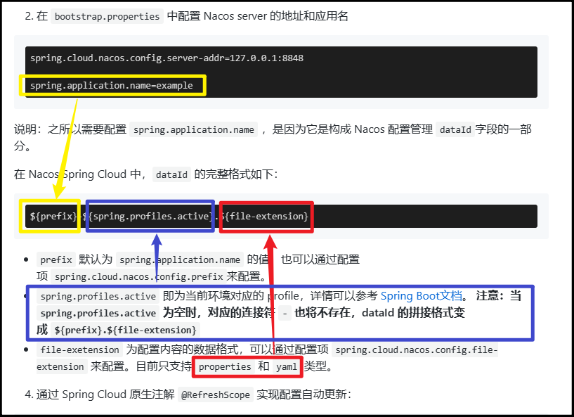

> 代码分析

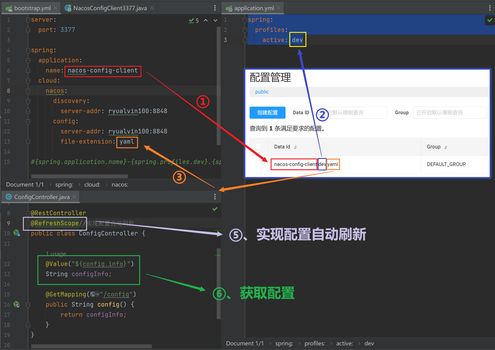

### 17.3.2、分类配置

#### 17.3.2.1、问题

1. 问题1：实际开发中，通常一个系统会准备dev开发环境、test测试环境、prod生产环境。如何保证指定环境启动时服务能正确读取到Nacos上相应环境的配置文件呢？
2. 问题2：一个大型分布式微服务系统会有很多微服务子项目，每个微服务项目又都会有相应的开发环境、测试环境、预发环境、正式环境...那怎么对这些微服务配置进行管理呢？

#### 17.3.2.2、架构

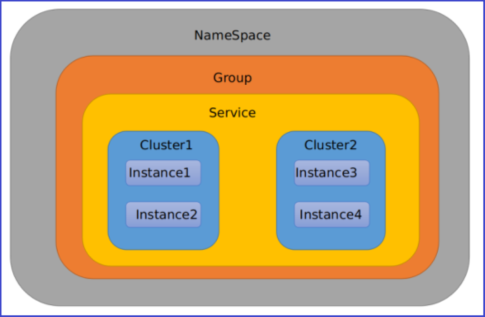

##### 17.3.2.2.1、Namespace

Namespace主要用来实现隔离。比方说我们现在有三个环境：开发、测试、生产环境，我们就可以创建三个Namespace，不同的Namespace之间是隔离的。Nacos默认的命名空间是public。

##### 17.3.2.2.2、Group

Group可以把不同的微服务划分到同一个分组里面。Group默认是DEFAULT_GROUP。

##### 17.3.2.2.3、Service

Service就是微服务。一个Service可以包含多个Cluster（集群），Nacos默认Cluster是DEFAULT，Cluster是对指定微服务的一个虚拟划分。
比方说为了容灾，将Service微服务分别部署在了杭州机房和广州机房，这时就可以给杭州机房的Service微服务起一个集群名称（HZ），
给广州机房的Service微服务起一个集群名称（GZ），还可以尽量让同一个机房的微服务互相调用，以提升性能。

##### 17.3.2.2.4、Instance

Instance就是微服务的实例。

##### 17.3.2.2.5、示例

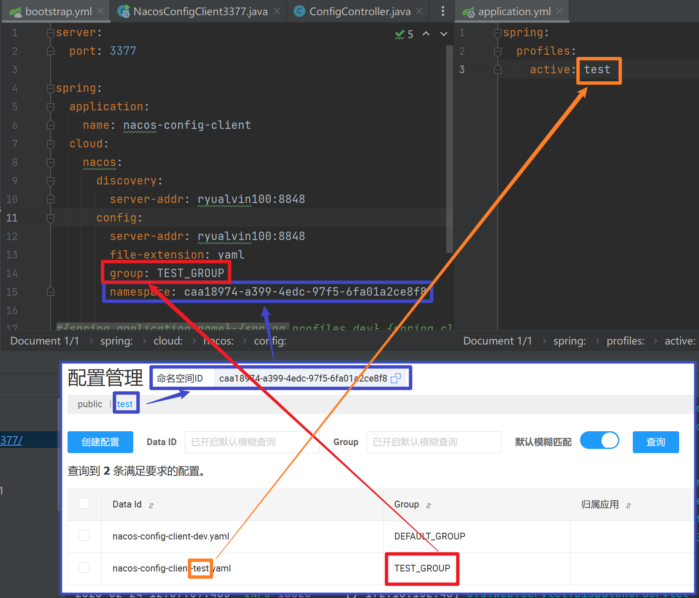

### 17.3.3、持久化和集群配置

#### 17.3.3.1、Nacos持久化配置

##### 17.3.3.1.1、是什么

在0.7版本之前，在单机模式时Nacos默认使用嵌入式数据库derby实现数据的存储，不方便观察数据存储的基本情况。所以，如果启动多个默认配置下的Nacos节点，数据存储是存在一致性问题的。为了解决这个问题，Nacos采用了集中式存储的方式来支持集群化部署，目前只支持MySQL的存储（0.7版本增加了支持MySQL数据源能力）。

##### 17.3.3.1.2、怎么配

1. 首先需要安装MySQL环境；

2. Nacos安装包下已经为我们提供了SQL脚本，只要在Nacos所在的服务的MySQL上执行：

   ```shell
   #用2.x的Nacos配置持久化一致配置不起来（应该是MySQL新老版本和Nacos里驱动的问题导致），为了不浪费时间改用1.x进行持久化配置
   [root@ryualvin100 bin]# cd /home/ryualvin/nacos/nacos-1.1.4/conf
   #SQL脚本存放位置
   [root@ryualvin100 conf]# ls
   application.properties  application.properties.example  cluster.conf.example  nacos-logback.xml  nacos-mysql.sql  schema.sql
   ```

3. derby切换至MySQL：

   ```shell
   #首先备份一下原来的配置文件
   [root@ryualvin100 conf]# cp application.properties application.properties.bk
   #编辑配置文件，添加以下数据库配置信息
   [root@ryualvin100 conf]# vim application.properties
   
   ######################################################
   spring.datasource.platform=mysql
   
   db.num=1
   db.url.0=jdbc:mysql://127.0.0.1:3306/nacos_config?characterEncoding=utf8&connectTimeout=1000&socketTimeout=3000&autoReconnect=true
   db.user=root
   db.password=xxxx@ryuaxxx
   ```

4. 再重新登录Nacos控制台页面，之前在derby上保存的配置已经不会显示了，然后任意新增一个配置，MySQL数据库就会有相应的记录：

   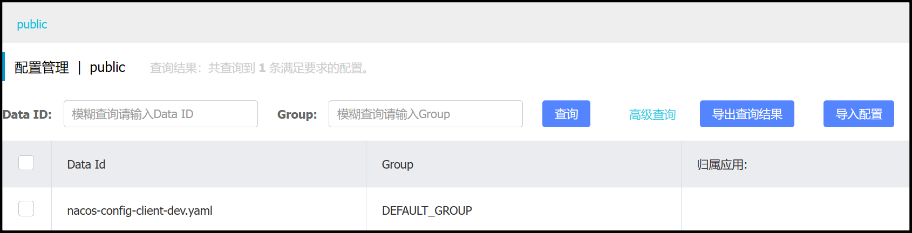

   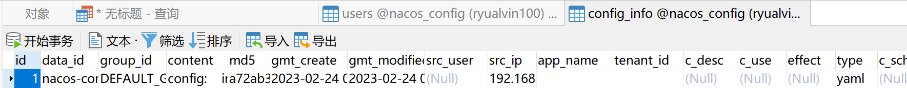

#### 17.3.3.2、集群配置

##### 17.3.3.2.1、架构

1个Nginx做代理请求转发，3个Nacos注册中心，1个MySQL统一持久化配置信息。

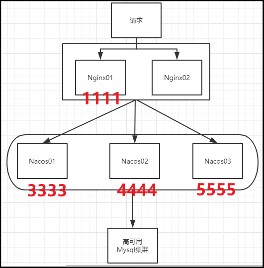

##### 17.3.3.2.2、配置步骤

###### 17.3.3.2.2.1、Nacos持久化配置

参照`17.3.3.1`

###### 17.3.3.2.2.2、Nacos集群配置

```shell
[root@ryualvin100 bin]# cd /home/ryualvin/nacos/nacos-1.1.4/conf
#改之前，先备份
[root@ryualvin100 conf]# cp cluster.conf.example cluster.conf
#cluster.conf中的IP不能写127.0.0.1，必须是Linux命令hostname -i能够识别的IP
[root@ryualvin100 conf]# hostname -i
192.168.182.100
[root@ryualvin100 conf]# vim cluster.conf
#配置三个Nacos节点在不同的端口：
192.168.182.100:3333
192.168.182.100:4444
192.168.182.100:5555
```

###### 17.3.3.2.2.3、Nacos启动脚本修改

> 脚本修改

```shell
[root@ryualvin100 conf]# cd ../bin
#改之前，先备份
[root@ryualvin100 bin]# cp startup.sh startup.sh.bk
[root@ryualvin100 bin]# vim startup.sh
#修改一：新增：参数p
while getopts ":m:f:s:p:" opt
#db.password.0=nacos
do
    case $opt in
        m)
            MODE=$OPTARG;;
        f)
            FUNCTION_MODE=$OPTARG;;
        s)
            SERVER=$OPTARG;;
        #新增：执行命令传入-p port
        p)
            PORT=$OPTARG;;
        ?)
#修改二：修改：启动参数
#nohup $JAVA ${JAVA_OPT} nacos.nacos >> ${BASE_DIR}/logs/start.out 2>&1 &
nohup $JAVA -Dserver.port=${PORT} ${JAVA_OPT} nacos.nacos >> ${BASE_DIR}/logs/start.out 2>&1 &
```

> 启动

```shell
#开放Nacos各节点对应端口
[root@ryualvin100 bin]# firewall-cmd --add-port=3333/tcp --permanent
success
[root@ryualvin100 bin]# firewall-cmd --add-port=4444/tcp --permanent
success
[root@ryualvin100 bin]# firewall-cmd --add-port=5555/tcp --permanent
success
[root@ryualvin100 bin]# firewall-cmd --reload
success
[root@ryualvin100 bin]# ./startup.sh -p 3333
[root@ryualvin100 bin]# ./startup.sh -p 4444
[root@ryualvin100 bin]# ./startup.sh -p 5555
```

> 测试

分别用端口3333、4444、5555登录Nacos控制台，登录成功则说明集群各节点配置成功。另外，可在Nacos控制台中的集群管理查看节点列表：

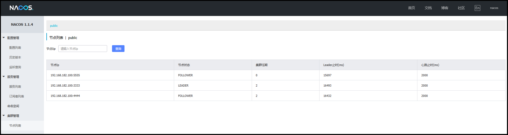

###### 17.3.3.2.2.4、Nginx配置文件修改

```nginx
[root@ryualvin100 ~]# cd /usr/local/nginx/conf
[root@ryualvin100 conf]# vim nginx.conf
worker_processes  1;
events {
    worker_connections  1024;
}
http {
    include       mime.types;
    default_type  application/octet-stream;
    sendfile        on;
    keepalive_timeout  65;
    
    #配置一：节点配置
    upstream myserver {
        server 127.0.0.1:3333;
        server 127.0.0.1:4444;
        server 127.0.0.1:5555;
    }
    #配置二：Nginx对外暴露1111端口
    server {
        listen       1111;
        #配置三：服务器地址
        server_name  192.168.182.100;
        #配置四：代理设置
        location / {
            # 这里的myserver和上面的upstream的命名对应
            proxy_pass http://myserver;
        }
```

###### 17.3.3.2.2.5、启动Nginx

```shell
[root@ryualvin100 conf]# cd ../sbin
[root@ryualvin100 sbin]# cd ../sbin
#启动
[root@ryualvin100 sbin]# ./nginx -c /usr/local/nginx/conf/nginx.conf
#查看版本号
[root@ryualvin100 sbin]# ./nginx -v
nginx version: nginx/1.12.2
#关闭nginx
[root@ryualvin100 sbin]# ./nginx -s stop
#启动nginx
[root@ryualvin100 sbin]# ./nginx
#如果修改配置文件，可以不用重启nginx服务而重加载配置文件
#热部署
[root@ryualvin100 sbin]# ./nginx -s reload
```

> 测试

通过`http://ryualvin100:1111/nacos`访问Nacos控制台，并插入一个新的配置，可以持久化到MySQL中，则证明集群配置成功。

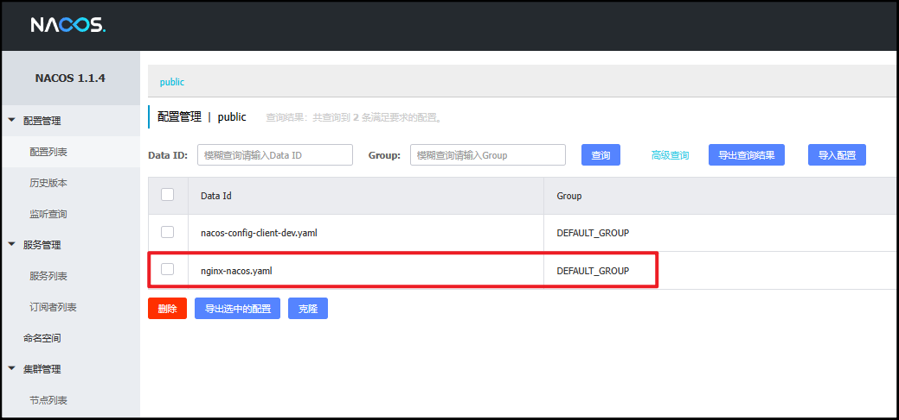

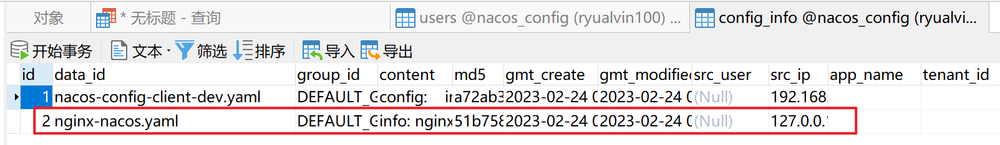

###### 17.3.3.2.2.6、客户端连接集群

```yaml
server:
  port: 3377
spring:
  application:
    name: nacos-config-client
  cloud:
    nacos:
      discovery:
      	#指向Nginx地址
        server-addr: ryualvin100:1111
      config:
      	#指向Nginx地址
        server-addr: ryualvin100:1111
        file-extension: yaml
```

# 18、SpringCloud Alibaba Sentinel实现熔断与限流

## 18.1、Sentinel概述

### 18.1.1、是什么

官网：https://github.com/alibaba/Sentinel

Wiki：https://github.com/alibaba/Sentinel/wiki

轻量级的流量控制、熔断降级的组件，能够实现的功能与Hystrix一样，但是更强于Hystrix，因为大多数功能可以在仪表盘上配置。

Sentinel分为两个部分：

1. 核心库（Java客户端）不依赖任何框架/库，能够运行于所有Java运行时环境，同时对Dubbo/SpringCloud等框架也有较好的支持；
2. 控制台（Dashboard）基于SpringBoot开发，打包后可以直接运行，不需要额外的Tomcat等应用容器；

### 18.1.2、能干嘛

解决微服务中的各种问题：服务雪崩、服务降级、服务熔断、服务限流。

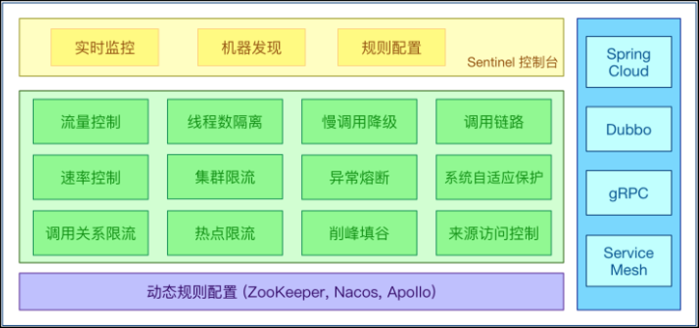

## 18.2、安装Sentinel控制台

1. 下载：

   https://github.com/alibaba/Sentinel/releases

   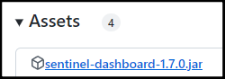

2. 前提：具有Java8环境，以及确保8080端口不能被占用；

3. 运行命令：

   ```shell
   D:\develop\project\rensyu\cloud2020>java -jar sentinel-dashboard-1.7.0.jar
   ```

4. 访问：[Sentinel Dashboard](http://localhost:8080/#/login)

   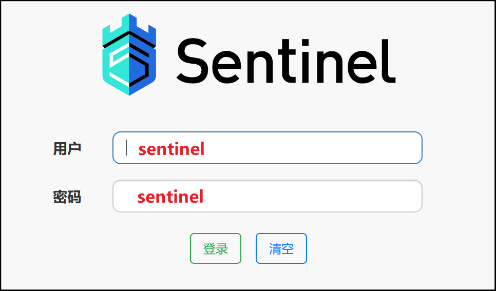

## 18.3、初始化演示工程

创建`26-alibaba-sentinel-service-8401`模块：

1. 添加Nacos、Sentinel、以及Sentinel用作持久化的依赖：

   ```xml
   <!--SpringCloud ailibaba nacos -->
   <dependency>
       <groupId>com.alibaba.cloud</groupId>
       <artifactId>spring-cloud-starter-alibaba-nacos-discovery</artifactId>
   </dependency>
   <!--SpringCloud ailibaba sentinel-datasource-nacos 后续做持久化用到-->
   <dependency>
       <groupId>com.alibaba.csp</groupId>
       <artifactId>sentinel-datasource-nacos</artifactId>
   </dependency>
   <!--SpringCloud ailibaba sentinel -->
   <dependency>
       <groupId>com.alibaba.cloud</groupId>
       <artifactId>spring-cloud-starter-alibaba-sentinel</artifactId>
   </dependency>
   ```

2. 添加Nacos注册服务中心地址、Sentinel仪表盘访问地址、以及与仪表盘做交互的HttpServer地址：

   ```yaml
   server:
     port: 8401
   
   spring:
     application:
       name: sentinel-service
     cloud:
       nacos:
         discovery:
           #Nacos服务注册中心地址
           server-addr: ryualvin100:1111
       sentinel:
         transport:
           #配置Sentinel dashboard地址
           dashboard: localhost:8080
           #默认8719端口，假如被占用会自动从8719开始依次+1扫描,直至找到未被占用的端口
           #这个端口配置会在应用对应的机器上启动一个Http Server，该Server会与Sentinel控制台做交互。比如Sentinel控制台添加了一个限流规则，会把规则数据push给这个HttpServer接收，HttpServer再将规则注册到Sentinel中
           port: 8719
   
   management:
     endpoints:
       web:
         exposure:
           include: '*'
   ```

3. 启动类标注`@EnableDiscoveryClient`；

4. 控制层：随便写两个API，返回不同的字符串；

5. 测试：先登录Sentinel仪表盘，由于Sentinel采用的懒加载机制，刚开始一片空白什么都没有显示。启动8401服务，接着分别对两个API进行调用，此时Sentinel仪表盘开始显示图表数据；

## 18.4、流控规则

### 18.4.1、基本介绍

资源名：唯一名称，默认请求路径。

针对来源：Sentinel可以针对调用者进行限流，填写微服务名，默认default（不区分来源）。

阈值类型/单机阈值：

1. QPS（每秒钟的请求数量）：当调用该API的QPS达到阈值的时候，进行限流【御敌于国门之外】；
2. 线程数：当调用该API的线程数达到阈值的时候，进行限流【关门打狗】。阈值可看成银行网点开放的办理窗口；

是否集群：不需要集群。

流控模式：

1. 直接：API达到限流条件时，直接限流；
2. 关联：当关联的资源达到阈值时，就限流自己【支付接口达到阈值以后就限流下订单的接口】；
3. 链路：只记录指定链路上的流量（指定资源从入口资源进来的流量，如果达到阈值，就进行限流）【API级别的针对来源】；

流控效果：

1. 快速失败：直接失败，抛异常；
2. Warm Up：根据codeFactor（冷加载因子，默认3）的值，从阈值/codeFactor，经过预热时长，才达到设置的QPS阈值；
3. 排队等待：匀速排队，让请求以匀速的速度通过，阈值类型必须设置为QPS，否则无效；

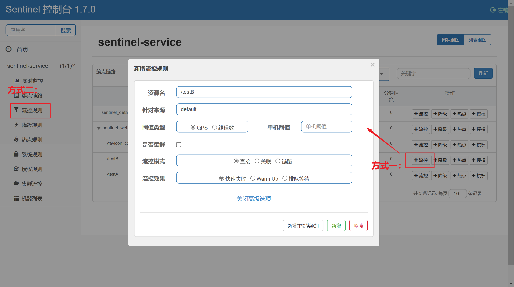

### 18.4.2、流控模式

#### 18.4.2.1、直接-QPS-快速失败

> 配置

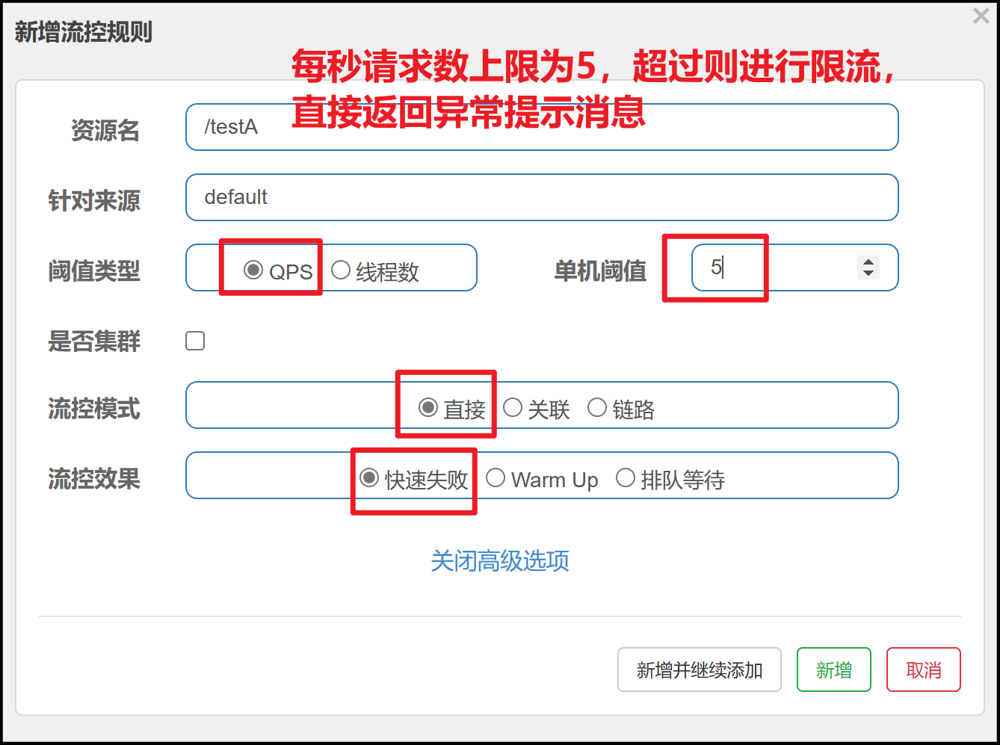

> 测试

1. 当快速点击请求API接口`/testA`，每秒请求数超过阈值5，则会直接返回异常信息：

   

2. 当每秒请求数恢复正常（阈值以下），则放行调用；

> 问题

流控直接返回异常信息是不是不太友好？是不是应该有我们自己的后续处理，类似有个FallBack的兜底方法？

#### 18.4.2.2、直接-线程数-快速失败

> 配置

Sentinel：阈值类型选择为【线程数】，单机阈值设置为【1】：


代码里让每个线程睡上一段时间：

```java
@GetMapping("/testA")
public String testA() {
    try {
        System.out.println(Thread.currentThread().getName());
        // 当前线程还在睡眠状态中的时候，另一个线程又进入该API方法，则超过了阈值
        Thread.sleep(800);
    } catch (InterruptedException e) {
        throw new RuntimeException(e);
    }
    return "--------------testA";
}
```

> 测试

当访问API的线程数大于阈值，则会直接返回异常信息。

#### 18.4.2.3、关联-QPS-快速失败

> 配置

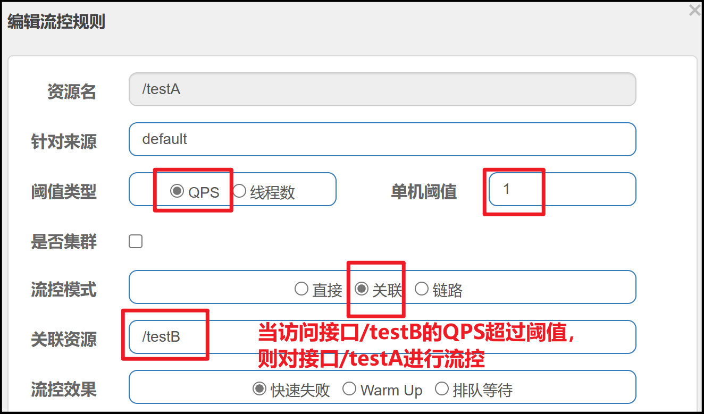

> 测试

用Postman对API接口`/testB`进行高并发访问：


此时访问`/testB`的QPS超过阈值，则资源`/testA`受到关联影响挂了，`/testB`不受影响，待访问`/testB`的QPS阈值降下来以后，`/testA`回归正常访问。

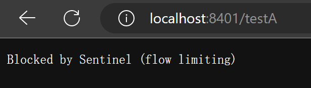

> 思考

可以将`/testA`看作订单接口，`/testB`看作支付接口。一般下完订单走支付，当支付接口流量高峰的时候，可以往前一步对订单接口进行流量控制【责任连坐】。

#### 18.4.2.4、链路-QPS-快速失败

[Sentinel限流规则-流控模式之链路模式 - Ruthless - 博客园 (cnblogs.com)](https://www.cnblogs.com/linjiqin/p/15369091.html)

简单理解：

C调用A，B也调用A。设置流控模式为【链路】，入口资源为【C】。当只有从C端来的请求，在A上的QPS阈值超过的情况下才会产生流控。

### 18.4.3、流控效果

#### 18.4.3.1、快速失败

> 效果

直接失败，抛出异常：Bocked by Sentinel（flow limiting）

> 源码

com.alibaba.csp.sentinel.slots.block.flow.controller.DefaultController

#### 18.4.3.2、Warm Up

> 概述

公式：阈值除以coldFactor（冷因子），默认coldFactor为3，即请求QPS从threshold/3开始，经预热时长逐渐升至设定的QPS阈值。

官网解释：[流量控制 · alibaba/Sentinel Wiki · GitHub](https://github.com/alibaba/Sentinel/wiki/流量控制)

Warm Up（`RuleConstant.CONTROL_BEHAVIOR_WARM_UP`）方式，即预热/冷启动方式。当系统长期处于低水位的情况下，当流量突然增加时，直接把系统拉升到高水位可能瞬间把系统压垮。通过"冷启动"，让通过的流量缓慢增加，在一定时间内逐渐增加到阈值上限，给冷系统一个预热的时间，避免冷系统被压垮。

通常冷启动的过程系统允许通过的 QPS 曲线如下图所示：

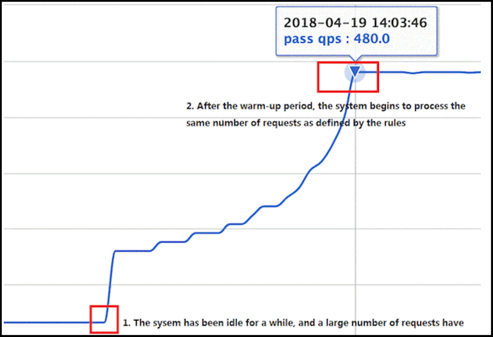

> 源码

com.alibaba.csp.sentinel.slots.block.flow.controller.WarmUpController

```java
// 这里的传入的3就是coldFactor
public WarmUpController(double count, int warmUpPeriodInSec) {
    construct(count, warmUpPeriodInSec, 3);
}
```

> 配置

QPS阈值为10，预热时间设置为5秒，系统初始化阈值刚开始为10/3≈3，然后过了5秒后阈值才慢慢升高恢复到10。

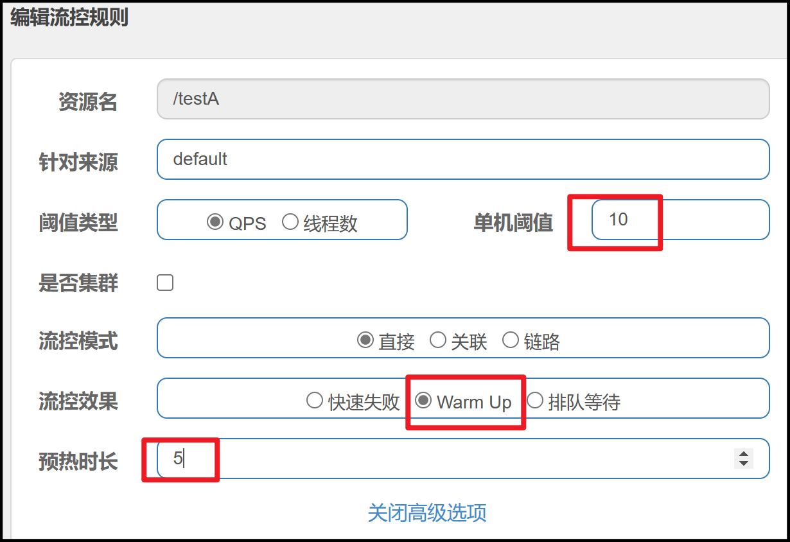

> 应用场景

秒杀系统在开启的瞬间，会有很多流量上来，很有可能把系统打死。预热方式就是为了保护系统，可慢慢地把流量放进来，慢慢地把阈值增长到设置的阈值。

#### 18.4.3.3、排队等候

> 概述

阈值必须设置为QPS！！！

官网解释：[流量控制 · alibaba/Sentinel Wiki · GitHub](https://github.com/alibaba/Sentinel/wiki/流量控制)

匀速排队（`RuleConstant.CONTROL_BEHAVIOR_RATE_LIMITER`）方式会严格控制请求通过的间隔时间，即是让请求以均匀的速度通过，对应的是漏桶算法。

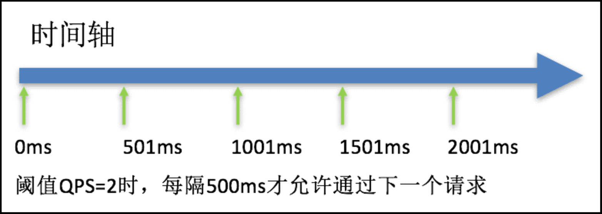

> 源码

com.alibaba.csp.sentinel.slots.block.flow.controller.RateLimiterController

> 配置

QPS阈值为1，也就是1秒钟只能处理1个请求上限，多了的话排队等候（排队等候时间为20000毫秒，超过等待时间则返回异常提示：Bocked by Sentinel（flow limiting）），所有请求以均匀的速度通过。

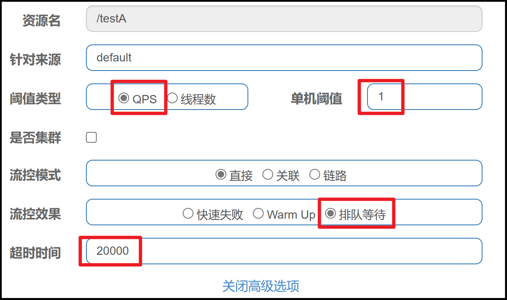

## 18.5、降级规则

### 18.5.1、基本介绍

Sentinel熔断降级会在调用链路中某个资源出现不稳定状态是（例如调用超时或异常比例升高），对这个资源的调用进行限制，让请求快速失败，避免影响到其他的资源而导致级联错误。

当资源被降级后，在接下来的降级时间窗口之内，对该资源的调用都自动熔断（默认行为是抛出DegradeException）。

Sentinel的断路器不像Hystrix，是**没有半开状态**的。

### 18.5.2、降级策略实战

#### 18.5.2.1、RT

> 概述

平均响应时间（DEGRADE_GRADE_RT）：当【QPS>=5 && 平均响应时间>阈值】，那么在接下来的时间窗口内，对这个资源的调用都会自动熔断（抛出DegradeException）。

注意：Sentinel默认统计的RT上限是4900ms，超出此阈值都会算作4900ms。但可通过启动配置项`-Dscp.sentinel.statistic.max.rt=xxx`来配置。

> 流程

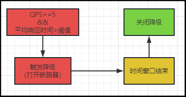

> 代码

```java
@GetMapping("/testC")
public String testC() {
    try {
        System.out.println(Thread.currentThread().getName());
        Thread.sleep(1000);
    } catch (InterruptedException e) {
        throw new RuntimeException(e);
    }
    return "--------------testC";
}
```

> 配置

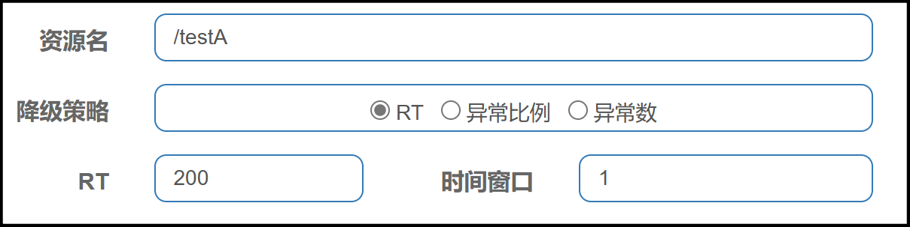

> 测试

用Jmeter做循环压测：

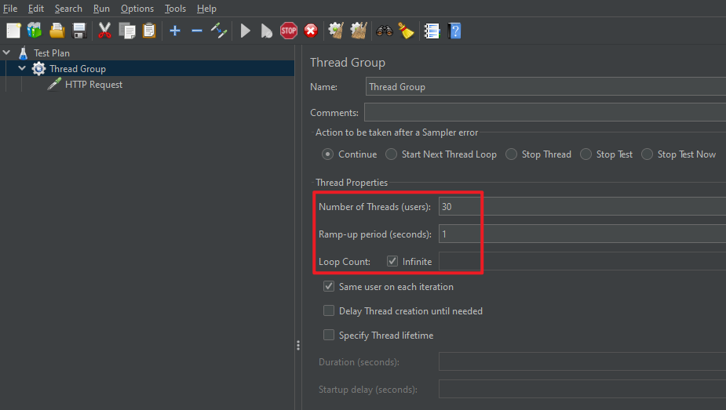

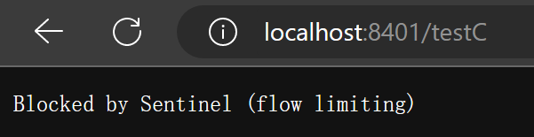

按照上述配置，Jmeter循环在1秒钟内打进30个线程请求资源，我们希望在1秒钟内处理这30个请求的平均响应时间在200毫秒以内，超过200毫秒，则在未来的1秒时间窗口内一直保持着断路器打开的状态，微服务不可用。后续停止Jmeter，没有那么大的访问量，【QPS>=5 && 平均响应时间>阈值】条件不成立，则微服务恢复正常状态，可以正常访问。

#### 18.5.2.2、异常比例

> 概述

异常比例（DEGRADE_GRADE_EXCEPTION_RATIO）：当【QPS>=5 && 异常比例>阈值】，资源进入降级状态，即在接下来的时间窗口之内，对这个方法的调用都会自动地返回异常信息。待时间窗口结束，才会关闭熔断器，恢复正常。

异常比率的阈值范围[0.0, 1.0]，代表0%~100%。

> 流程

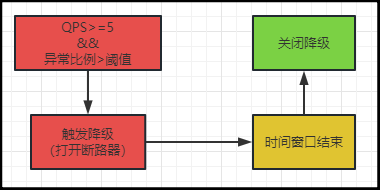

> 代码

```java
@GetMapping("/testD")
public String testD() {
    int i = 10 / 0;
    return "--------------testD";
}
```

> 配置

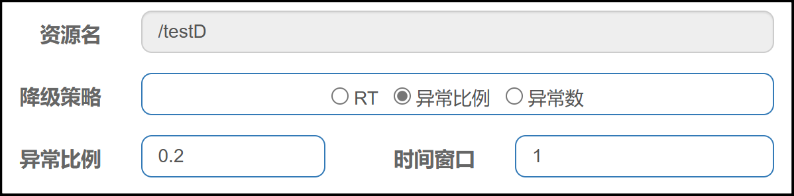

> 测试

Jmeter开始跑了之后，在浏览器请求资源返回异常信息：Bocked by Sentinel（flow limiting）。

当停止Jmeter压测后，在浏览器请求资源返回正常的错误白页：

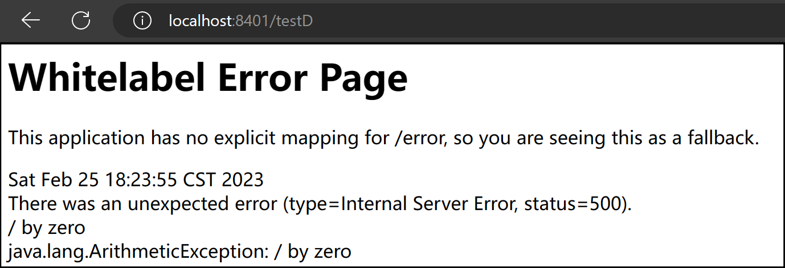

#### 18.5.2.3、异常数

> 概述

异常数（DEGRADE_GRADE_EXCEPTION_COUNT）：当【1分钟内异常数>阈值】，则进行熔断。

注意：由于统计时间窗口是分钟级别的，若时间窗口小于60秒，则结束熔断状态后仍可能再进入熔断状态。所以，**时间窗口一定要大于等于60秒**。

> 流程

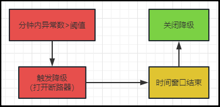

> 配置

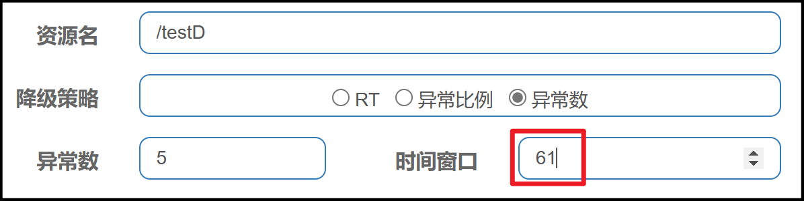

## 18.6、热点规则

### 18.6.1、概述

API上的某个或者某些参数Key被经常访问，我们可以对访问频次最高的几个热点Key设置限制，对其访问进行限流或者其他操作。

### 18.6.2、@SentinelResource预热

在之前的流控规则中，一旦限流后，则走Sentinel默认的异常机制（兜底方法），我们希望自定义兜底方法，则可以通过`@SentinelResource`注解来实现，它就相当于`@HystrixCommand`的使用。

### 18.6.2、热点Key限流配置

#### 18.6.2.1、配置步骤

1. 在Sentinel上定义热点规则；

2. 在API上添加`@SentinelResource`注解，指定注解元数据的资源名以及兜底方法；

3. 创建兜底方法，参数除了和API一致以外，还需要有一个`BlockException`类型的参数；

   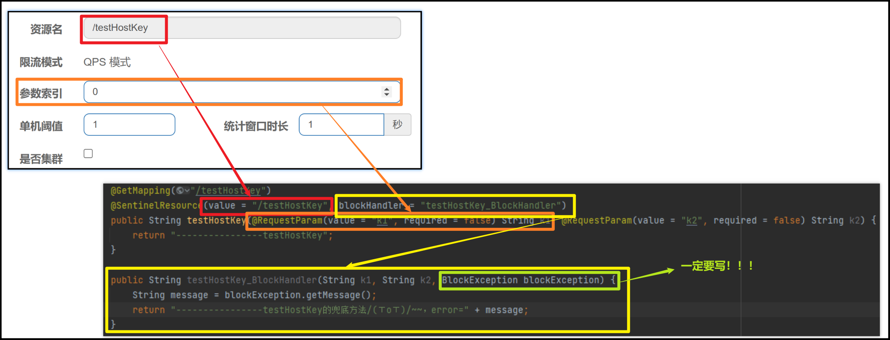

#### 18.6.2.2、测试

1. ✔：疯狂点击`http://localhost:8401/testHostKey`，请求正常；
2. ✔：疯狂点击`http://localhost:8401/testHostKey?k2=aaa`，请求正常；
3. ❌：疯狂点击`http://localhost:8401/testHostKey?k1=aaa`，请求异常，返回兜底方法结果；
4. ❌：疯狂点击`http://localhost:8401/testHostKey?k1=aaa&k2=bbb`，请求异常，返回兜底方法结果；

### 18.6.3、参数例外项

#### 18.6.3.1、配置规则

回顾上述热点Key限流配置，无论k1等于任何值，都会进行限流。

我们现在希望当k1等于某个值的时候，产生一个例外情况，就是对这个特殊值的限流阈值放宽。

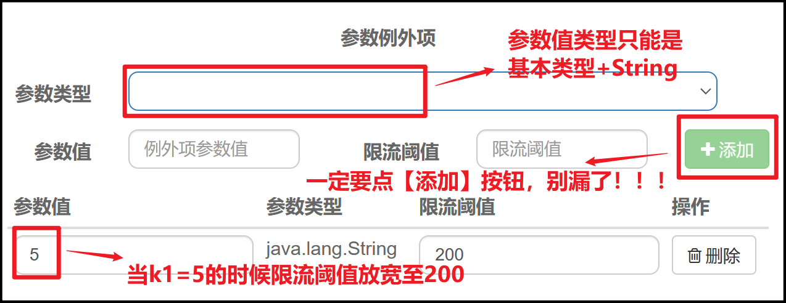

#### 18.6.3.2、测试

1. ❌：疯狂点击`http://localhost:8401/testHostKey?k1=aaa`，请求异常，返回兜底方法结果；
2. ✔：疯狂点击（但也不能超过阈值）`http://localhost:8401/testHostKey?k1=5`，请求正常；

### 18.6.4、异常情况

#### 18.6.4.1、让程序产生异常

```java
@GetMapping("/testHostKey")
@SentinelResource(value = "/testHostKey", blockHandler = "testHostKey_BlockHandler")
public String testHostKey(@RequestParam(value = "k1", required = false) String k1, @RequestParam(value = "k2", required = false) String k2) {
    // 让程序在运行的过程中产生运行时异常
    int i = 10 / 0;
    return "----------------testHostKey";
}
```

#### 18.6.4.2、测试

❌：点击一次`http://localhost:8401/testHostKey?k1=aaa`，请求异常，返回白页：

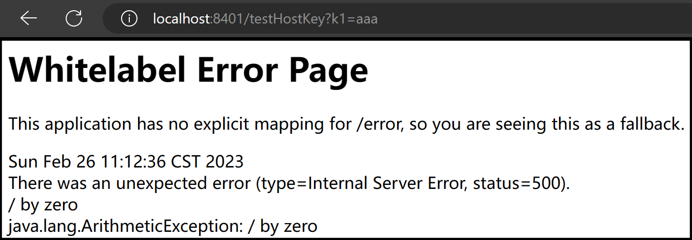

`@SentinelResource`处理的是Sentinel控制台配置的违规情况，有`blockHandler`属性配置的兜底方法。

`int age = 10/0;`这个是Java运行时报出的运行时异常，不归`@SentinelResource`管。

总结：`@Sentinel`主管配置出错，运行出错该走什么异常走什么异常。

## 18.7、系统规则

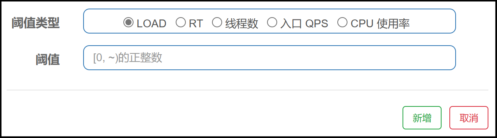

把每个API资源看作每一户人家的话，系统规则则是对整个小区大门的出入规则做限制。

官方对各阈值类型的解释：[系统自适应限流 · alibaba/Sentinel Wiki · GitHub](https://github.com/alibaba/Sentinel/wiki/系统自适应限流)

补充：

- 控制粒度不够细，习惯性配在网关层面，而不是配在系统规则；
- CPU使用率：假设写代码的时候没写好，写了个死循环，那么服务在运行的时候，CPU使用率一下子就飙上去了，整个服务也就不可用了，对用户来说不太友好；

## 18.8、@SentinelResource配置

### 18.8.1、默认配置的问题

1. 当我们没有指定`@SentinelResource`中的`blockHandler`时候，即没有指定自己的兜底方法。在发生流控的时候，则使用系统默认的兜底方法；
2. 当我们指定`@SentinelResource`中的`blockHandler`时候，又将兜底方法和业务代码耦合在一起，不直观；
3. 如果有众多的业务方法，那么为每一个方法都增加一个`blockHandler`的话，代码急剧膨胀；
4. 全局统一的处理方法没有体现；

### 18.8.2、客户自定义限流处理逻辑

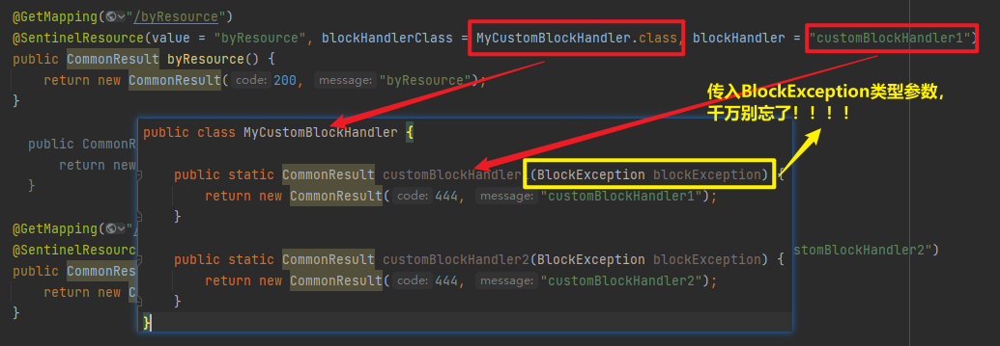

注意：

1. 客户自定义限流逻辑也可采用编码的方式来实现，但是实际生产中不推荐，因为所有代码都要通过try-catch-finally方式进行处理；
2. **注解方式埋点不支持private方法**；

## 18.9、服务熔断功能

### 18.9.1、服务提供端9003/9004构建

1. pom.xml：

   ```java
   <dependency>
       <artifactId>03-cloud-api-commons</artifactId>
       <groupId>org.yeahicode.springcloud</groupId>
       <version>1.0-SNAPSHOT</version>
   </dependency>
   <!--SpringCloud ailibaba nacos -->
   <dependency>
       <groupId>com.alibaba.cloud</groupId>
       <artifactId>spring-cloud-starter-alibaba-nacos-discovery</artifactId>
   </dependency>
   <!-- SpringBoot整合Web组件+actuator -->
   <dependency>
       <groupId>org.springframework.boot</groupId>
       <artifactId>spring-boot-starter-web</artifactId>
   </dependency>
   ```

2. application.yml：

   ```yaml
   server:
     port: 9003
   
   spring:
     application:
       name: sentinel-payment-provider
     cloud:
       nacos:
         discovery:
           #Nacos服务注册中心地址
           server-addr: ryualvin100:1111
   
   management:
     endpoints:
       web:
         exposure:
           include: '*'
   ```

3. 启动类用`@EnableDiscoveryClient`标注；

4. 控制层：

   ```java
   @RestController
   public class SentinelPaymentController {
   
       private static HashMap<Long, Payment> paymentInfos = new HashMap<Long, Payment>();
   
       static {
           paymentInfos.put(1L, new Payment(1L, UUID.randomUUID().toString().replace("-", "")));
           paymentInfos.put(2L, new Payment(2L, UUID.randomUUID().toString().replace("-", "")));
           paymentInfos.put(3L, new Payment(3L, UUID.randomUUID().toString().replace("-", "")));
       }
   
       @Value("${server.port}")
       String port;
   
       @GetMapping("/payment/sentinel/{id}")
       public CommonResult<Payment> getPayment(@PathVariable("id") Long id) {
           Payment payment = paymentInfos.get(id);
           return new CommonResult<>(200, "payment --- port:" + port + " --- Successful", payment);
       }
   }
   ```

### 18.9.2、服务消费端84构建

1. pom.xml：

   ```xml
   <!--SpringCloud ailibaba nacos -->
   <dependency>
       <groupId>com.alibaba.cloud</groupId>
       <artifactId>spring-cloud-starter-alibaba-nacos-discovery</artifactId>
   </dependency>
   <!--SpringCloud ailibaba sentinel -->
   <dependency>
       <groupId>com.alibaba.cloud</groupId>
       <artifactId>spring-cloud-starter-alibaba-sentinel</artifactId>
   </dependency>
   <!-- 引入自己定义的api通用包，可以使用Payment支付Entity -->
   <dependency>
       <groupId>org.yeahicode.springcloud</groupId>
       <artifactId>03-cloud-api-commons</artifactId>
       <version>1.0-SNAPSHOT</version>
   </dependency>
   <!-- SpringBoot整合Web组件 -->
   <dependency>
       <groupId>org.springframework.boot</groupId>
       <artifactId>spring-boot-starter-web</artifactId>
   </dependency>
   ```

2. application.yml：

   ```yaml
   server:
     port: 84
   
   spring:
     application:
       name: sentinel-order-consumer
     cloud:
       nacos:
         discovery:
           server-addr: ryualvin100:1111
       sentinel:
         transport:
           dashboard: localhost:8080
           port: 8719
   
   management:
     endpoints:
       web:
         exposure:
           include: '*'
   
   provider-service:
     url: http://sentinel-payment-provider
   ```

3. 启动类用`@EnableDiscoveryClient`标注，并注入用`@LoadBalanced`标注的`RestTemplate`；

4. 控制层：

   ```java
   @RestController
   public class CircuitBreakerOrderController {
   
       @Autowired
       RestTemplate restTemplate;
   
       @Value("${provider-service.url}")
       String providerServiceUrl;
   
       @GetMapping("/order/sentinel/{id}")
       @SentinelResource(value = "fallBack")
       public CommonResult<Payment> getPayment(@PathVariable("id") Long id) {
           if (id == 4) {
               throw new IllegalArgumentException();
           }
           if (id == 5) {
               throw new NullPointerException();
           }
           CommonResult<Payment> result = (CommonResult<Payment>) restTemplate.getForObject(providerServiceUrl + "/payment/sentinel/" + id, CommonResult.class);
           return result;
       }
   }
   ```

5. 测试：启动9003、9004、84，查看Nacos上服务是否注册成功，接着请求API`http://localhost:84/order/sentinel/1`，看是否请求成功，最后查看Sentinel仪表盘是否有流量数据；

   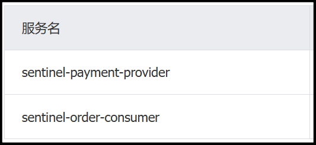

   


### 18.9.3、fallBack和blockHander配置测试

#### 18.9.3.1、两者都不配置

Sentinel上配置了流控规则，但是代码中`@SentinelResource`只指定了资源名，没有配置`blockHandler`，也没有配置`fallBack`：

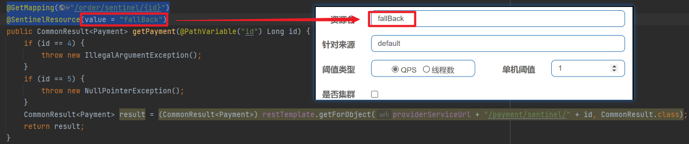

##### 18.9.3.1.1、请求空指针异常

请求`http://localhost:84/order/sentinel/5`，运行时报空指针异常，则直接返回白页：

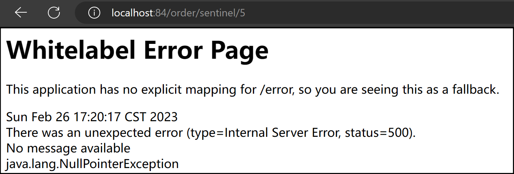

##### 18.9.3.1.2、QPS流控异常

快速点击`http://localhost:84/order/sentinel/1`，产生流控，则直接返回白页：

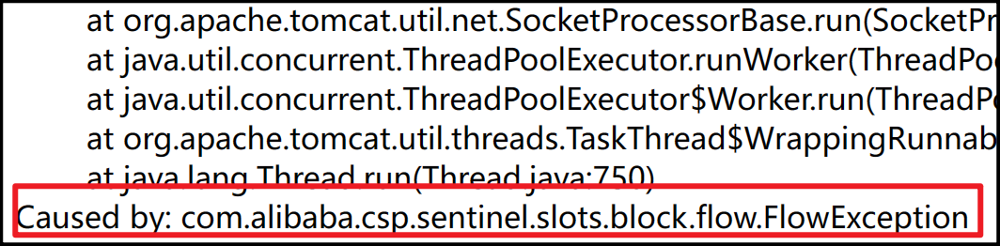

#### 18.9.3.2、只配置fallBack

> 代码

```java
@GetMapping("/order/sentinel/{id}")
@SentinelResource(value = "fallBack", fallback = "getPayment_FallBack")
public CommonResult<Payment> getPayment(@PathVariable("id") Long id) {
    if (id == 4) {
        throw new IllegalArgumentException();
    }
    if (id == 5) {
        throw new NullPointerException();
    }
    CommonResult<Payment> result = (CommonResult<Payment>) restTemplate.getForObject(providerServiceUrl + "/payment/sentinel/" + id, CommonResult.class);
    return result;
}

public CommonResult<Payment> getPayment_FallBack(@PathVariable("id") Long id, Throwable e) {
    return new CommonResult<Payment>(4444, "getPayment_FallBack --- " + e);
}
```

##### 18.9.3.2.1、Sentinel上无任何配置

当请求`http://localhost:84/order/sentinel/5`，运行时报空指针异常，返回自定义错误消息：

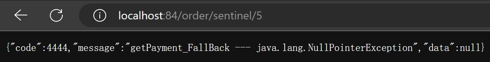

##### 18.9.3.2.2、Sentinel上设置流控规则

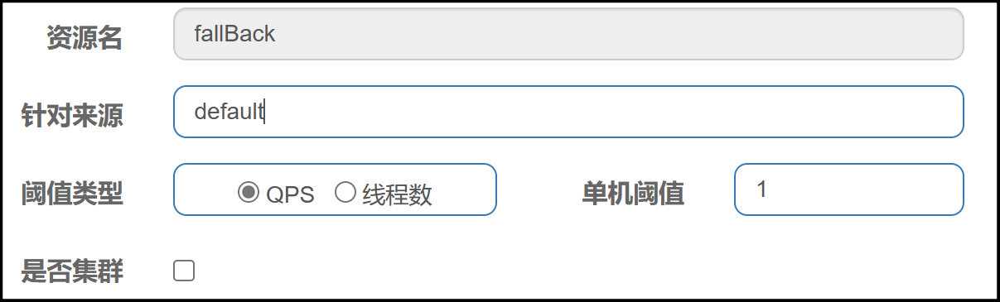

快速点击`http://localhost:84/order/sentinel/5`，产生流控，返回自定义错误消息，但是该异常信息是因为触发流控规则产生：

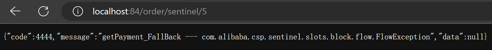

##### 18.9.3.2.3、Sentinel上设置降级规则

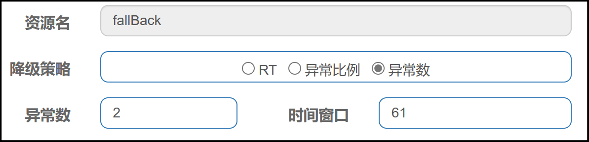

快速点击`http://localhost:84/order/sentinel/5`，产生异常，分钟内异常数大于阈值，返回自定义错误消息，但是该异常信息是因为触发降级规则产生：

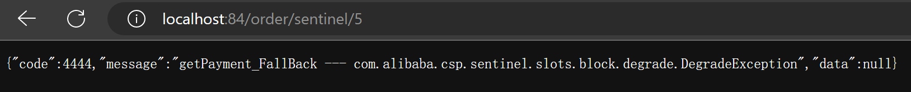

#### 18.9.3.3、只配置blockHandler

> 代码

```java
@GetMapping("/order/sentinel/{id}")
@SentinelResource(value = "fallBack", blockHandler = "getPayment_BlockHandler")
public CommonResult<Payment> getPayment(@PathVariable("id") Long id) {
    if (id == 4) {
        throw new IllegalArgumentException();
    }
    if (id == 5) {
        throw new NullPointerException();
    }
    CommonResult<Payment> result = (CommonResult<Payment>) restTemplate.getForObject(providerServiceUrl + "/payment/sentinel/" + id, CommonResult.class);
    return result;
}

public CommonResult<Payment> getPayment_BlockHandler(@PathVariable("id") Long id, BlockException e) {
    return new CommonResult<Payment>(4444, "getPayment_BlockHandler --- " + e);
}
```

##### 18.9.3.3.1、Sentinel上设置流控规则


单次请求`http://localhost:84/order/sentinel/5`，产生空指针异常，返回错误白页。

快速点击`http://localhost:84/order/sentinel/5`，产生流控异常，返回自定义错误信息：


##### 18.9.3.3.2、Sentinel上设置降级规则

快速点击`http://localhost:84/order/sentinel/5`，产生异常，分钟内异常数大于阈值，返回自定义错误消息：


#### 18.9.3.4、fallBack+blockHandler

> 代码

```java
@SentinelResource(value = "fallBack", fallback = "getPayment_FallBack", blockHandler = "getPayment_BlockHandler")
```

若两者都配置，则被限流降级而抛出`BlockException`时只会进入`blockHandler`处理逻辑。

### 18.9.4、忽略属性

```java
@SentinelResource(value = "fallBack", fallback = "getPayment_FallBack", blockHandler = "getPayment_BlockHandler",
        exceptionsToIgnore = {IllegalArgumentException.class})
```

当发生`IllegalArgumentException`类型异常的时候，直接返回错误白页，不友好。

当然，如果有设置流控规则的话，再违反流控规则的情况下，会走`blockHandler`处理。

### 18.9.5、Sentinel+OpenFeign

当服务提供端9003/9004突然宕机，通过OpenFeign可对服务提供端响应故障做降级处理。

OpenFeign组件一般在服务消费端使用，所以我们需要修改服务消费端84模块：

1. 添加对OpenFeign的依赖：

   ```xml
   <!--SpringCloud openfeign -->
   <dependency>
       <groupId>org.springframework.cloud</groupId>
       <artifactId>spring-cloud-starter-openfeign</artifactId>
   </dependency>
   ```

2. 在配置文件中，开启OpenFeign对Sentinel的支持：

   ```yaml
   feign:
     sentinel:
       enabled: true
   ```

3. 启动类通过`@EnableFeignClients`注解开启对OpenFeign客户端的功能支持；

4. 定义OpenFeign接口，指定服务名，以及降级处理类：

   ```java
   @FeignClient(value = "sentinel-payment-provider", fallback = SentinelPaymentFallBackService.class)
   public interface ISentinelPaymentService {
       @GetMapping("/payment/sentinel/{id}")
       CommonResult<Payment> getPayment(@PathVariable("id") Long id);
   }
   ```

   ```java
   @Component
   public class SentinelPaymentFallBackService implements ISentinelPaymentService {
       @Override
       public CommonResult<Payment> getPayment(Long id) {
           return new CommonResult<Payment>(4444, "openfeign fallback ...........................");
       }
   }
   ```

5. 控制层调用：

   ```java
   @Resource
   ISentinelPaymentService sentinelPaymentService;
   
   @GetMapping("/order/sentinel/openfeign/{id}")
   @SentinelResource(value = "fallBack", 
                     fallback = "getPayment_FallBack", 
                     blockHandler = "getPayment_BlockHandler")
   public CommonResult<Payment> getPaymentWithOpenFeign(@PathVariable("id") Long id) {
       if (id == 4) {
           throw new IllegalArgumentException();
       }
       if (id == 5) {
           throw new NullPointerException();
       }
       CommonResult<Payment> result = sentinelPaymentService.getPayment(id);
       return result;
   }
   ```

6. 启动服务提供端9003，消费端84，通过84调用9003成功返回消息。然后故意将9003服务停止，再调用，消费端84则自动降级，不会被耗死：

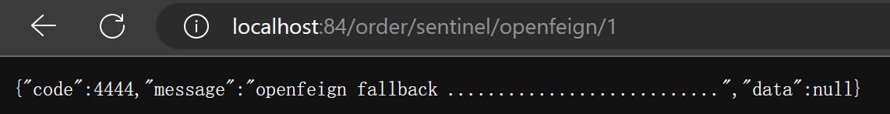

### 18.9.6、服务熔断框架比较

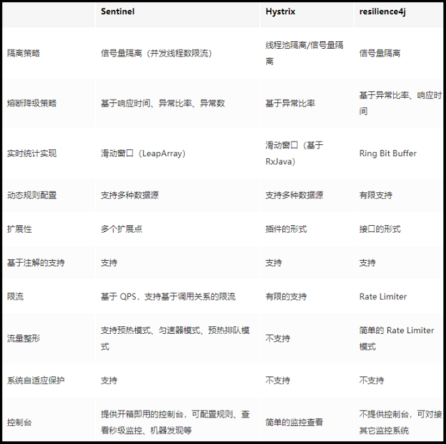

## 19.0、持久化规则

### 19.0.1、是什么

一旦我们重启应用，重启前在Sentinel上配置的规则将消失，所以生产环境必须将在Sentinel上的配置规则进行持久化。

### 19.0.2、怎么玩

修改`26-alibaba-sentinel-service-8401`模块：

1. 添加依赖：

   ```xml
   <!--SpringCloud ailibaba sentinel-datasource-nacos 后续做持久化用到-->
   <dependency>
       <groupId>com.alibaba.csp</groupId>
       <artifactId>sentinel-datasource-nacos</artifactId>
   </dependency>
   ```

2. 在配置文件中添加Sentinel需要持久化进Nacos的配置信息：

   ```yaml
   sentinel:
     transport:
       dashboard: localhost:8080
       port: 8719
     datasource:
       ds1:
         nacos:
           server-addr: ryualvin111:8848 #Nginx->3个Nacos节点
           dataId: cloudalibaba-sentinel-service
           groupId: DEFAULT_GROUP
           data-type: json
           rule-type: flow
   ```

3. 在Nacos中新建配置：

   ```json
   [
       {
           "resource": "byUrl",
           "limitApp": "default",
           "grade": 1,
           "count": 1,
           "strategy": 0,
           "controlBehavior": 0,
           "clusterMode": false
       }
   ]
   ```

   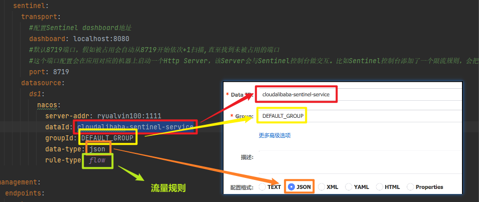

4. 启动服务8401，启动Sentinel，刚开始不显示，请求`http://localhost:8401/limit/byUrl`后，刷新Sentinel：

   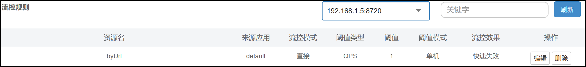

5. 停止服务8401，然后刷新Sentinel，可以看到流量规则没了：

   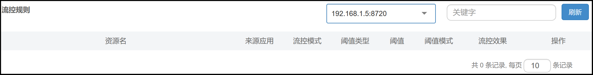

6. 重启服务8401，刷新Sentinel，流量规则没有显示，请求`http://localhost:8401/limit/byUrl`，再刷新Sentinel，流量规则就会显示出来了，持久化验证通过；

# 19、SpringCloud Alibaba Seata处理分布式事务

## 19.1、分布式事务问题

单体应用被拆分成微服务应用，原来的三个模块被拆分成三个独立的应用，分别使用三个独立的数据源，业务操作需要调用三个服务来完成。此时每个服务内部的数据一致性由本地事务来保证，但是全局的数据一致性问题没法保证。

用户购买商品的业务逻辑，整个业务逻辑由3个微服务提供支持：

1. 订单服务：根据采购需求创建订单；
2. 仓储服务：对给定的商品扣除仓储数量；
3. 账户服务：从用户账户中扣除余额；

一次业务操作需要跨多个数据源或需要跨多个系统进行远程调用，就会产生分布式事务问题。

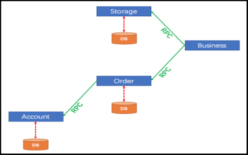

## 19.2、Seata简介

### 19.2.1、是什么

官网：[Seata](http://seata.io/zh-cn/)

Simple Extensible Autonomous Transaction Architecture，简单可扩展自治事务框架。

Seata是一款开源的分布式事务解决方案，致力于在微服务架构下提供高性能和简单易用的分布式事务服务。

2019年1月份蚂蚁金服和阿里巴巴共同开源的分布式事务解决方案。

2020年起，参加工作后用1.0以后的版本：

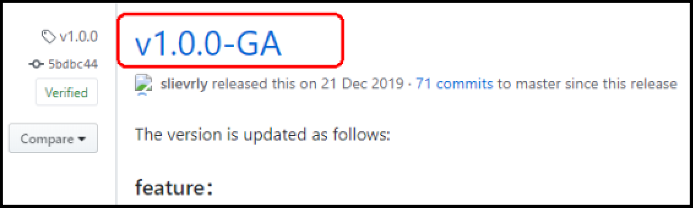

### 19.2.2、处理结构

分布式事务处理过程的一ID+三组件模型：

- Transaction ID（XID）：全局唯一的事务ID；
- Transaction Coordinator（TC）：事务协调器，维护全局事务的运行状态，负责协调并驱动全局事务的提交或者回滚；
- Transaction Manager（TM）：控制全局事务的边界，负责开启一个全局事务，并最终发起全局提交或全局回滚的决议；
- Resource Manager（RM）：控制分支事务，负责分支注册、状态汇报，并接收事务协调器的指令，驱动分支（本地）事务的提交和回滚；

### 19.2.3、处理过程

1. TM（全局事务管理者）向TC（全局事务协调器）申请开启一个全局事务，全局事务创建成功并生成一个全局唯一的XID；
2. XID在微服务调用链路的上下文中传播；
3. RM（本地资源管理器）向TC（全局事务协调器）注册分支事务，将其纳入XID对应全局事务的管辖；
4. TM（全局事务管理者）向TC（全局事务协调器）发起针对XID的全局提交或回滚决议；
5. TC（全局事务协调器）调度XID下管辖的全部分支事务完成提交或回滚请求；

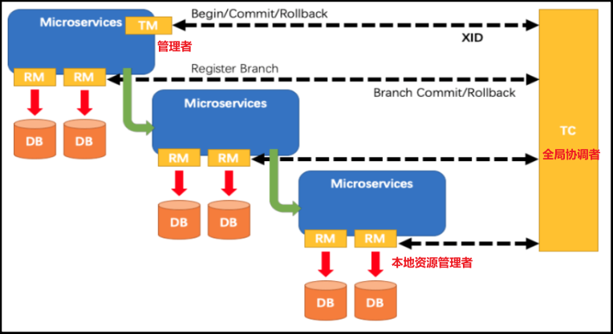

## 19.3、Seata-Server安装

### 19.3.1、下载&安装

1. 下载：[下载中心 (seata.io)](http://seata.io/zh-cn/blog/download.html)
2. 将`seata-server-0.9.0.zip`解压至指定目录；

### 19.3.2、更改file.conf文件

1. 先备份；

2. 在`service`块中修改自定义事务组名称：

   ```shell
   service {
     #vgroup->rgroup
     #修改
     vgroup_mapping.my_test_tx_group = "ryualvin_tx_group"
     #...
   }
   ```

3. 在`store`块中修改事务日志存储模式以及数据连接信息：

   ```shell
   store {
     ## store mode: file、db
     #修改：存储模式改为db
     mode = "db"
   
     ## file store
     file {
       #...
     }
   
     ## database store
     db {
       ## the implement of javax.sql.DataSource, such as DruidDataSource(druid)/BasicDataSource(dbcp) etc.
       datasource = "dbcp"
       ## mysql/oracle/h2/oceanbase etc.
       db-type = "mysql"
       driver-class-name = "com.mysql.jdbc.Driver"
       #修改：数据库连接信息
       url = "jdbc:mysql://127.0.0.1:3306/seata"
       user = "root"
       password = "xxx"
       min-conn = 1
       max-conn = 3
       global.table = "global_table"
       branch.table = "branch_table"
       lock-table = "lock_table"
       query-limit = 100
     }
   }
   ```

### 19.3.3、创建Seata数据库

1. 创建Seata数据库；

2. 执行`..conf/db_store.sql`文件；

   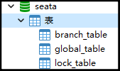

### 19.3.4、更改registry.conf文件

1. 先备份；

2. 更改服务注册中心的类型和连接地址：

   ```shell
   registry {
     # file 、nacos 、eureka、redis、zk、consul、etcd3、sofa
     type = "nacos"
   
     nacos {
       application = "seata-server"
       serverAddr = "ryualvin100:8848"
       namespace = ""
       cluster = "default"
     }
     
     #...
   }
   ```

### 19.3.5、启动Nacos

```shell
[root@ryualvin100 bin]# sh startup.sh -m standalone
```

### 19.3.6、启动Seata

```shell
D:\develop\seata\seata-server-0.9.0\seata\bin>seata-server.bat
```

检查是否成功启动Seata：

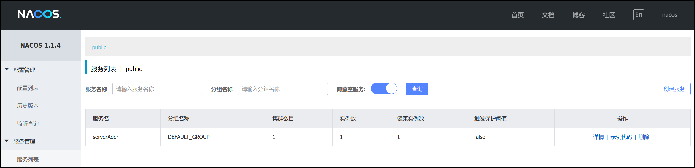

## 19.4、业务说明

创建三个服务：订单服务、库存服务、账户服务。

当用户下单时，会在订单服务中创建一个订单，然后通过远程调用库存服务来扣减下单商品的库存，再通过远程调用账户服务来扣减用户账户里面的余额，最后在订单服务中修改订单状态为已完成。（下订单 => 扣库存 => 减账户余额）

该操作跨越三个数据库，有两次远程调用，很明显会有分布式事务问题。

## 19.5、业务数据库准备

订单：

```sql
CREATE DATABASE seata_order;
USE seata_order;
CREATE TABLE t_order (
  `id` BIGINT(11) NOT NULL AUTO_INCREMENT PRIMARY KEY,
  `user_id` BIGINT(11) DEFAULT NULL COMMENT '用户id',
  `product_id` BIGINT(11) DEFAULT NULL COMMENT '产品id',
  `count` INT(11) DEFAULT NULL COMMENT '数量',
  `money` DECIMAL(11,0) DEFAULT NULL COMMENT '金额',
  `status` INT(1) DEFAULT NULL COMMENT '订单状态：0：创建中；1：已完结' 
) ENGINE=INNODB AUTO_INCREMENT=7 DEFAULT CHARSET=utf8;
 
SELECT * FROM t_order;
```

库存：

```sql
CREATE DATABASE seata_storage;
USE seata_storage;
CREATE TABLE t_storage (
 `id` BIGINT(11) NOT NULL AUTO_INCREMENT PRIMARY KEY,
 `product_id` BIGINT(11) DEFAULT NULL COMMENT '产品id',
 `total` INT(11) DEFAULT NULL COMMENT '总库存',
 `used` INT(11) DEFAULT NULL COMMENT '已用库存',
 `residue` INT(11) DEFAULT NULL COMMENT '剩余库存'
) ENGINE=INNODB AUTO_INCREMENT=2 DEFAULT CHARSET=utf8;
 
 
INSERT INTO seata_storage.t_storage(`id`, `product_id`, `total`, `used`, `residue`)
VALUES ('1', '1', '100', '0', '100');
 
SELECT * FROM t_storage;
```

账户：

```sql
CREATE DATABASE seata_account;
USE seata_account：
CREATE TABLE t_account (
  `id` BIGINT(11) NOT NULL AUTO_INCREMENT PRIMARY KEY COMMENT 'id',
  `user_id` BIGINT(11) DEFAULT NULL COMMENT '用户id',
  `total` DECIMAL(10,0) DEFAULT NULL COMMENT '总额度',
  `used` DECIMAL(10,0) DEFAULT NULL COMMENT '已用余额',
  `residue` DECIMAL(10,0) DEFAULT '0' COMMENT '剩余可用额度'
) ENGINE=INNODB AUTO_INCREMENT=2 DEFAULT CHARSET=utf8;
 
INSERT INTO seata_account.t_account(`id`, `user_id`, `total`, `used`, `residue`)  VALUES ('1', '1', '1000', '0', '1000');
 
SELECT * FROM t_account;
```

## 19.6、回滚日志表准备

用安装包中的`../conf/db_undo_log.sql`为每个业务数据库创建回滚日志表。

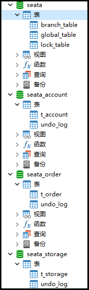

## 19.7、订单模块构建

1. pom.xml：

   ```xml
   <dependency>
       <groupId>org.yeahicode.springcloud</groupId>
       <artifactId>03-cloud-api-commons</artifactId>
       <version>1.0-SNAPSHOT</version>
   </dependency>
   <!--nacos-->
   <dependency>
       <groupId>com.alibaba.cloud</groupId>
       <artifactId>spring-cloud-starter-alibaba-nacos-discovery</artifactId>
   </dependency>
   <!--seata-->
   <dependency>
       <groupId>com.alibaba.cloud</groupId>
       <artifactId>spring-cloud-starter-alibaba-seata</artifactId>
       <exclusions>
           <exclusion>
               <artifactId>seata-all</artifactId>
               <groupId>io.seata</groupId>
           </exclusion>
       </exclusions>
   </dependency>
   <dependency>
       <groupId>io.seata</groupId>
       <artifactId>seata-all</artifactId>
       <version>0.9.0</version>
   </dependency>
   <!--feign-->
   <dependency>
       <groupId>org.springframework.cloud</groupId>
       <artifactId>spring-cloud-starter-openfeign</artifactId>
   </dependency>
   <!--web-actuator-->
   <dependency>
       <groupId>org.springframework.boot</groupId>
       <artifactId>spring-boot-starter-web</artifactId>
   </dependency>
   <dependency>
       <groupId>org.springframework.boot</groupId>
       <artifactId>spring-boot-starter-actuator</artifactId>
   </dependency>
   <!--mysql-druid-->
   <dependency>
       <groupId>mysql</groupId>
       <artifactId>mysql-connector-java</artifactId>
       <version>5.1.37</version>
   </dependency>
   <dependency>
       <groupId>com.alibaba</groupId>
       <artifactId>druid-spring-boot-starter</artifactId>
       <version>1.1.10</version>
   </dependency>
   <dependency>
       <groupId>org.mybatis.spring.boot</groupId>
       <artifactId>mybatis-spring-boot-starter</artifactId>
       <version>2.0.0</version>
   </dependency>
   <dependency>
       <groupId>org.springframework.boot</groupId>
       <artifactId>spring-boot-starter-test</artifactId>
       <scope>test</scope>
   </dependency>
   <dependency>
       <groupId>org.projectlombok</groupId>
       <artifactId>lombok</artifactId>
       <optional>true</optional>
   </dependency>
   ```

2. application.yml：

   ```yaml
   server:
     port: 2001
   
   spring:
     application:
       name: seata-order-service
     cloud:
       alibaba:
         seata:
           #自定义事务组名称需要与seata-server中的对应
           tx-service-group: ryualvin_tx_group
       nacos:
         discovery:
           server-addr: ryualvin100:8848
     datasource:
       driver-class-name: com.mysql.jdbc.Driver
       url: jdbc:mysql://ryualvin100:3306/seata_order
       username: root
       password: xxx@ryuxxx
   
   feign:
     hystrix:
       enabled: false
   
   logging:
     level:
       io:
         seata: info
   
   mybatis:
     mapperLocations: classpath:mapper/*.xml
   ```

3. Mybatis配置：

   ```java
   @Configuration
   @MapperScan({"org.yeahicode.springcloud.dao"})
   public class MyBatisConfig {
   }
   ```

4. 使用Seata对数据源进行代理配置：

   ```java
   @Configuration
   public class DataSourceProxyConfig {
   
       @Value("${mybatis.mapperLocations}")
       private String mapperLocations;
   
       @Bean
       @ConfigurationProperties(prefix = "spring.datasource")
       public DataSource druidDataSource() {
           return new DruidDataSource();
       }
   
       @Bean
       public DataSourceProxy dataSourceProxy(DataSource dataSource) {
           return new DataSourceProxy(dataSource);
       }
   
       @Bean
       public SqlSessionFactory sqlSessionFactoryBean(DataSourceProxy dataSourceProxy) throws Exception {
           SqlSessionFactoryBean sqlSessionFactoryBean = new SqlSessionFactoryBean();
           sqlSessionFactoryBean.setDataSource(dataSourceProxy);
           sqlSessionFactoryBean.setMapperLocations(new PathMatchingResourcePatternResolver().getResources(mapperLocations));
           sqlSessionFactoryBean.setTransactionFactory(new SpringManagedTransactionFactory());
           return sqlSessionFactoryBean.getObject();
       }
   }
   ```

5. Order.java：

   ```java
   @Data
   @AllArgsConstructor
   @NoArgsConstructor
   public class Order {
       private Long id;
       private Long userId;
       private Long productId;
       private Integer count;
       private BigDecimal money;
       /**
        * 订单状态：0：创建中；1：已完结
        */
       private Integer status;
   }
   ```

6. OrderDao.java：

   ```java
   @Mapper
   public interface OrderDao {
   
       /**
        * 创建订单
        */
       void create(Order order);
   
       /**
        * 修改订单金额
        */
       void update(@Param("userId") Long userId, @Param("status") Integer status);
   }
   ```

7. mapper/OrderMapper.xml：

   ```xml
   <?xml version="1.0" encoding="UTF-8" ?>
   <!DOCTYPE mapper PUBLIC "-//mybatis.org//DTD Mapper 3.0//EN" "http://mybatis.org/dtd/mybatis-3-mapper.dtd" >
   
   <mapper namespace="org.yeahicode.springcloud.dao.OrderDao">
   
       <resultMap id="BaseResultMap" type="org.yeahicode.springcloud.entity.Order">
           <id column="id" property="id" jdbcType="BIGINT"/>
           <result column="user_id" property="userId" jdbcType="BIGINT"/>
           <result column="product_id" property="productId" jdbcType="BIGINT"/>
           <result column="count" property="count" jdbcType="INTEGER"/>
           <result column="money" property="money" jdbcType="DECIMAL"/>
           <result column="status" property="status" jdbcType="INTEGER"/>
       </resultMap>
   
       <insert id="create">
           INSERT INTO `t_order` (`id`, `user_id`, `product_id`, `count`, `money`, `status`)
           VALUES (NULL, #{userId}, #{productId}, #{count}, #{money}, 0);
       </insert>
   
       <update id="update">
           UPDATE `t_order`
           SET status = 1
           WHERE user_id = #{userId} AND status = #{status};
       </update>
   </mapper>
   ```

8. OrderService.java：

   ```java
   public interface OrderService {
       void create(Order order);
   }
   ```

9. StorageService.java：

   ```java
   @FeignClient(value = "seata-storage-service")
   public interface StorageService {
   
       /**
        * 扣减库存
        */
       @PostMapping(value = "/storage/decrease")
       CommonResult decrease(@RequestParam("productId") Long productId, @RequestParam("count") Integer count);
   }
   ```

10. AccountService.java：

    ```java
    @FeignClient(value = "seata-account-service")
    public interface AccountService {
    
        /**
         * 扣减账户余额
         */
        //@RequestMapping(value = "/account/decrease", method = RequestMethod.POST, produces = "application/json; charset=UTF-8")
        @PostMapping("/account/decrease")
        CommonResult decrease(@RequestParam("userId") Long userId, @RequestParam("money") BigDecimal money);
    }
    ```

11. OrderServiceImpl.java：

    ```java
    @Service
    @Slf4j
    public class OrderServiceImpl implements OrderService {
        @Resource
        private OrderDao orderDao;
    
        @Resource
        private StorageService storageService;
    
        @Resource
        private AccountService accountService;
    
        /**
         * 创建订单->调用库存服务扣减库存->调用账户服务扣减账户余额->修改订单状态
         * 简单说：
         * 下订单->减库存->减余额->改状态
         */
        @Override
        @GlobalTransactional(name = "fsp-create-order", rollbackFor = Exception.class)
        public void create(Order order) {
            log.info("------->下单开始");
            //本应用创建订单
            orderDao.create(order);
    
            //远程调用库存服务扣减库存
            log.info("------->order-service中扣减库存开始");
            storageService.decrease(order.getProductId(),order.getCount());
            log.info("------->order-service中扣减库存结束");
    
            //远程调用账户服务扣减余额
            log.info("------->order-service中扣减余额开始");
            accountService.decrease(order.getUserId(),order.getMoney());
            log.info("------->order-service中扣减余额结束");
    
            //修改订单状态为已完成
            log.info("------->order-service中修改订单状态开始");
            orderDao.update(order.getUserId(),0);
            log.info("------->order-service中修改订单状态结束");
    
            log.info("------->下单结束");
        }
    }
    ```

12. OrderController.java：

    ```java
    @RestController
    public class OrderController {
    
        @Autowired
        private OrderService orderService;
    
        /**
         * 创建订单
         */
        @GetMapping("/order/create")
        public CommonResult create(Order order) {
            orderService.create(order);
            return new CommonResult(200, "订单创建成功!");
        }
    }
    ```

13. registry.conf：

    ```shell
    registry {
      # file 、nacos 、eureka、redis、zk、consul、etcd3、sofa
      type = "nacos"
    
      nacos {
        serverAddr = "ryualvin100:8848"
        namespace = ""
        cluster = "default"
      }
      eureka {
        serviceUrl = "http://localhost:8761/eureka"
        application = "default"
        weight = "1"
      }
      redis {
        serverAddr = "localhost:6379"
        db = "0"
      }
      zk {
        cluster = "default"
        serverAddr = "127.0.0.1:2181"
        session.timeout = 6000
        connect.timeout = 2000
      }
      consul {
        cluster = "default"
        serverAddr = "127.0.0.1:8500"
      }
      etcd3 {
        cluster = "default"
        serverAddr = "http://localhost:2379"
      }
      sofa {
        serverAddr = "127.0.0.1:9603"
        application = "default"
        region = "DEFAULT_ZONE"
        datacenter = "DefaultDataCenter"
        cluster = "default"
        group = "SEATA_GROUP"
        addressWaitTime = "3000"
      }
      file {
        name = "file.conf"
      }
    }
    
    config {
      # file、nacos 、apollo、zk、consul、etcd3
      type = "file"
    
      nacos {
        serverAddr = "localhost"
        namespace = ""
      }
      consul {
        serverAddr = "127.0.0.1:8500"
      }
      apollo {
        app.id = "seata-server"
        apollo.meta = "http://192.168.1.204:8801"
      }
      zk {
        serverAddr = "127.0.0.1:2181"
        session.timeout = 6000
        connect.timeout = 2000
      }
      etcd3 {
        serverAddr = "http://localhost:2379"
      }
      file {
        name = "file.conf"
      }
    }
    ```

14. file.conf：

    ```shell
    transport {
      # tcp udt unix-domain-socket
      type = "TCP"
      #NIO NATIVE
      server = "NIO"
      #enable heartbeat
      heartbeat = true
      #thread factory for netty
      thread-factory {
        boss-thread-prefix = "NettyBoss"
        worker-thread-prefix = "NettyServerNIOWorker"
        server-executor-thread-prefix = "NettyServerBizHandler"
        share-boss-worker = false
        client-selector-thread-prefix = "NettyClientSelector"
        client-selector-thread-size = 1
        client-worker-thread-prefix = "NettyClientWorkerThread"
        # netty boss thread size,will not be used for UDT
        boss-thread-size = 1
        #auto default pin or 8
        worker-thread-size = 8
      }
      shutdown {
        # when destroy server, wait seconds
        wait = 3
      }
      serialization = "seata"
      compressor = "none"
    }
    
    service {
    
      vgroup_mapping.ryualvin_tx_group = "default" #修改自定义事务组名称
    
      default.grouplist = "127.0.0.1:8091"
      enableDegrade = false
      disable = false
      max.commit.retry.timeout = "-1"
      max.rollback.retry.timeout = "-1"
      disableGlobalTransaction = false
    }
    
    
    client {
      async.commit.buffer.limit = 10000
      lock {
        retry.internal = 10
        retry.times = 30
      }
      report.retry.count = 5
      tm.commit.retry.count = 1
      tm.rollback.retry.count = 1
    }
    
    ## transaction log store
    store {
      ## store mode: file、db
      mode = "db"
    
      ## file store
      file {
        dir = "sessionStore"
    
        # branch session size , if exceeded first try compress lockkey, still exceeded throws exceptions
        max-branch-session-size = 16384
        # globe session size , if exceeded throws exceptions
        max-global-session-size = 512
        # file buffer size , if exceeded allocate new buffer
        file-write-buffer-cache-size = 16384
        # when recover batch read size
        session.reload.read_size = 100
        # async, sync
        flush-disk-mode = async
      }
    
      ## database store
      db {
        ## the implement of javax.sql.DataSource, such as DruidDataSource(druid)/BasicDataSource(dbcp) etc.
        datasource = "dbcp"
        ## mysql/oracle/h2/oceanbase etc.
        db-type = "mysql"
        driver-class-name = "com.mysql.jdbc.Driver"
        url = "jdbc:mysql://ryualvin100:3306/seata"
        user = "root"
        password = "xxx@ryuxxx"
        min-conn = 1
        max-conn = 3
        global.table = "global_table"
        branch.table = "branch_table"
        lock-table = "lock_table"
        query-limit = 100
      }
    }
    lock {
      ## the lock store mode: local、remote
      mode = "remote"
    
      local {
        ## store locks in user's database
      }
    
      remote {
        ## store locks in the seata's server
      }
    }
    recovery {
      #schedule committing retry period in milliseconds
      committing-retry-period = 1000
      #schedule asyn committing retry period in milliseconds
      asyn-committing-retry-period = 1000
      #schedule rollbacking retry period in milliseconds
      rollbacking-retry-period = 1000
      #schedule timeout retry period in milliseconds
      timeout-retry-period = 1000
    }
    
    transaction {
      undo.data.validation = true
      undo.log.serialization = "jackson"
      undo.log.save.days = 7
      #schedule delete expired undo_log in milliseconds
      undo.log.delete.period = 86400000
      undo.log.table = "undo_log"
    }
    
    ## metrics settings
    metrics {
      enabled = false
      registry-type = "compact"
      # multi exporters use comma divided
      exporter-list = "prometheus"
      exporter-prometheus-port = 9898
    }
    
    support {
      ## spring
      spring {
        # auto proxy the DataSource bean
        datasource.autoproxy = false
      }
    }
    ```

15. 主启动类：

    ```java
    @EnableDiscoveryClient
    @EnableFeignClients
    @SpringBootApplication(exclude = DataSourceAutoConfiguration.class)//取消数据源的自动创建
    public class SeataOrderMain2001 {
        public static void main(String[] args) {
            SpringApplication.run(SeataOrderMain2001.class, args);
        }
    }
    ```

## 19.8、库存模块构建

1. StorageDao.java：

   ```java
   @Mapper
   public interface StorageDao {
   
       /**
        * 扣减库存
        */
       void decrease(@Param("productId") Long productId, @Param("count") Integer count);
   }
   ```

2. mapper/StorageMapper.xml：

   ```xml
   <?xml version="1.0" encoding="UTF-8" ?>
   <!DOCTYPE mapper PUBLIC "-//mybatis.org//DTD Mapper 3.0//EN" "http://mybatis.org/dtd/mybatis-3-mapper.dtd" >
   
   
   <mapper namespace="org.yeahicode.springcloud.dao.StorageDao">
   
       <resultMap id="BaseResultMap" type="org.yeahicode.springcloud.entity.Storage">
           <id column="id" property="id" jdbcType="BIGINT"/>
           <result column="product_id" property="productId" jdbcType="BIGINT"/>
           <result column="total" property="total" jdbcType="INTEGER"/>
           <result column="used" property="used" jdbcType="INTEGER"/>
           <result column="residue" property="residue" jdbcType="INTEGER"/>
       </resultMap>
   
       <update id="decrease">
           UPDATE t_storage
           SET used    = used + #{count},
               residue = residue - #{count}
           WHERE product_id = #{productId}
       </update>
   
   </mapper>
   ```

3. StorageService.java：

   ```java
   public interface StorageService {
       /**
        * 扣减库存
        */
       void decrease(Long productId, Integer count);
   }
   ```

4. StorageServiceImpl.java：

   ```java
   @Service
   public class StorageServiceImpl implements StorageService {
   
       private static final Logger LOGGER = LoggerFactory.getLogger(StorageServiceImpl.class);
   
       @Resource
       private StorageDao storageDao;
   
       /**
        * 扣减库存
        */
       @Override
       public void decrease(Long productId, Integer count) {
           LOGGER.info("------->storage-service中扣减库存开始");
           storageDao.decrease(productId, count);
           LOGGER.info("------->storage-service中扣减库存结束");
       }
   }
   ```

5. StorageController.java：

   ```java
   @RestController
   public class StorageController {
   
       @Autowired
       private StorageService storageService;
   
       /**
        * 扣减库存
        */
       @RequestMapping("/storage/decrease")
       public CommonResult decrease(Long productId, Integer count) {
           storageService.decrease(productId, count);
           return new CommonResult(200, "扣减库存成功！");
       }
   }
   ```

## 19.9、账户模块构建

1. AccountDao.java：

   ```java
   @Mapper
   public interface AccountDao {
   
       /**
        * 扣减账户余额
        */
       void decrease(@Param("userId") Long userId, @Param("money") BigDecimal money);
   }
   ```

2. mapper/AccountMapper.xml：

   ```xml
   <?xml version="1.0" encoding="UTF-8" ?>
   <!DOCTYPE mapper PUBLIC "-//mybatis.org//DTD Mapper 3.0//EN" "http://mybatis.org/dtd/mybatis-3-mapper.dtd" >
   
   <mapper namespace="org.yeahicode.springcloud.dao.AccountDao">
   
       <resultMap id="BaseResultMap" type="org.yeahicode.springcloud.entity.Account">
           <id column="id" property="id" jdbcType="BIGINT"/>
           <result column="user_id" property="userId" jdbcType="BIGINT"/>
           <result column="total" property="total" jdbcType="DECIMAL"/>
           <result column="used" property="used" jdbcType="DECIMAL"/>
           <result column="residue" property="residue" jdbcType="DECIMAL"/>
       </resultMap>
   
       <update id="decrease">
           UPDATE t_account
           SET
               residue = residue - #{money},used = used + #{money}
           WHERE
               user_id = #{userId};
       </update>
   
   </mapper>
   ```

3. AccountService.java：

   ```java
   public interface AccountService {
   
       /**
        * 扣减账户余额
        * @param userId 用户id
        * @param money 金额
        */
       void decrease(@RequestParam("userId") Long userId, @RequestParam("money") BigDecimal money);
   }
   ```

4. AccountServiceImpl.java：

   ```java
   @Service
   public class AccountServiceImpl implements AccountService {
   
       private static final Logger LOGGER = LoggerFactory.getLogger(AccountServiceImpl.class);
   
   
       @Resource
       AccountDao accountDao;
   
       /**
        * 扣减账户余额
        */
       @Override
       public void decrease(Long userId, BigDecimal money) {
           LOGGER.info("------->account-service中扣减账户余额开始");
           //模拟超时异常，全局事务回滚
           //暂停几秒钟线程
           //try { TimeUnit.SECONDS.sleep(30); } catch (InterruptedException e) { e.printStackTrace(); }
           accountDao.decrease(userId,money);
           LOGGER.info("------->account-service中扣减账户余额结束");
       }
   }
   ```

5. AccountController.java：

   ```java
   @RestController
   public class AccountController {
   
       @Resource
       AccountService accountService;
   
       /**
        * 扣减账户余额
        */
       @RequestMapping("/account/decrease")
       public CommonResult decrease(@RequestParam("userId") Long userId, @RequestParam("money") BigDecimal money){
           accountService.decrease(userId,money);
           return new CommonResult(200,"扣减账户余额成功！");
       }
   }
   ```

## 20.0、测试

### 20.0.1、还原数据语句

```sql
USE seata_order;
DELETE FROM t_order;
USE seata_storage;
UPDATE `seata_storage`.`t_storage` SET `product_id` = 1, `total` = 100, `used` = 0, `residue` = 100 WHERE `id` = 1;
USE seata_account;
UPDATE `seata_account`.`t_account` SET `user_id` = 1, `total` = 1000, `used` = 0, `residue` = 1000 WHERE `id` = 1;
```

### 20.0.2、正常情况

API：http://localhost:2001/order/create?userId=1&productId=1&count=10&money=100

> 请求前

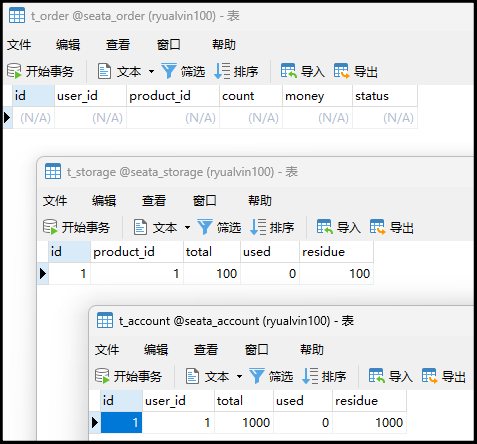

> 请求后

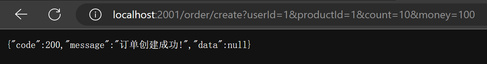

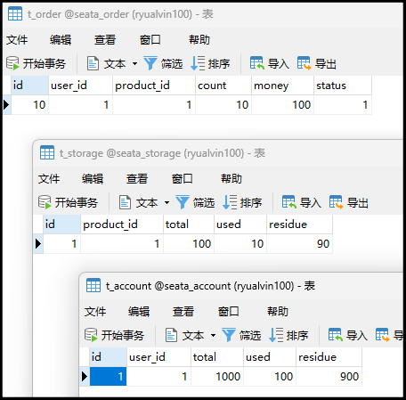

###  20.0.3、异常情况

在账户服务内设置断点，让请求超时（OpenFeign调用默认1秒超时），超时后放行，前台返回白页，数据库数据无改变，实现事务一致性。

### 20.0.4、总结

没加`@GlobalTransactional`的时候，超时异常：当库存和账户金额扣减后，订单状态并没有设置为已经完成（没有从0变为1），而且由于OpenFeign的重试机制，账户余额还有可能被多次扣减。

添加`@GlobalTransactional`的时候，超时异常，订单记录都添加不进来，其他数据也无改变。

## 20.1、Seata原理

### 20.1.1、分布式事务的执行流程

1. TM开启分布式事务（TM向TC注册全局事务记录）；
2. 按业务场景、编排数据库、服务等事务内资源（RM向TC汇报资源准备状态）；
3. TM结束分布式事务，事务一阶段结束（TM通知TC提交/回滚分布式事务）；
4. TC汇总事务信息，决定分布式事务是提交还是回滚；
5. TC通知所有RM提交/回滚资源，事务二阶段结束；

### 20.1.2、AT模式如何做到对业务的无侵入

#### 20.1.2.1、是什么

> 前提

- 基于支持本地ACID事务的关系型数据库；
- Java应用，通过JDBC访问数据库；

> 整体机制

两阶段提交协议的演变：

1. 一阶段：业务数据和回滚日志记录在同一个本地事务中提交，释放本地锁和连接资源；
2. 二阶段：
   - 提交异步化，非常快速地完成；
   - 回滚通过一阶段的回滚日志进行反向补偿；

#### 20.1.2.2、一阶段加载

在一阶段，Seata 会拦截"业务 SQL"：

1. 解析 SQL 语义，找到"业务 SQL"要更新的业务数据，在业务数据被更新前，将其保存成**before image**；

2. 执行"业务 SQL"更新业务数据，在业务数据更新之后；

3. 其保存成**after image**，最后生成行锁；

4. 以上操作全部在一个数据库事务内完成，这样保证了一阶段操作的原子性；

   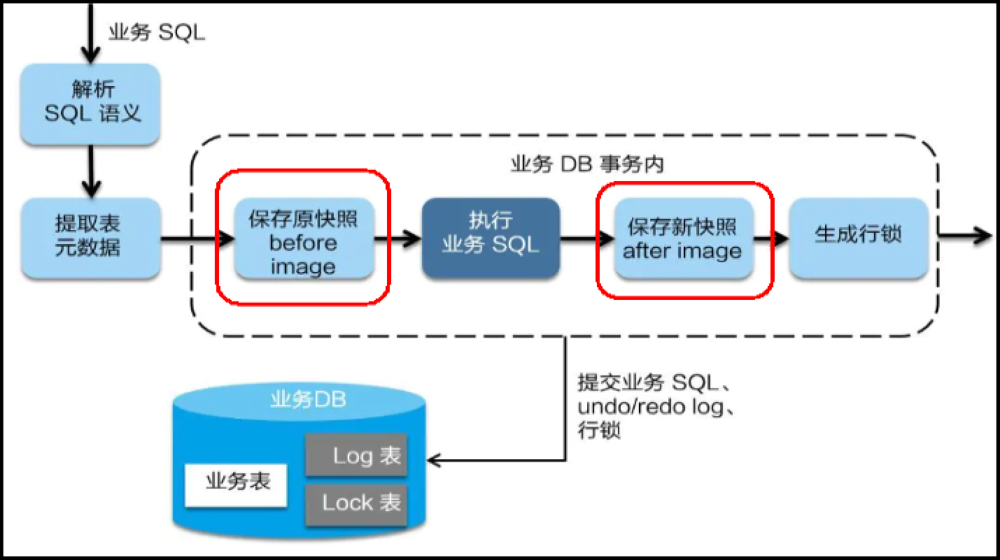

#### 20.1.2.3、二阶段提交

在二阶段，如果是顺利提交：

因为"业务 SQL"在一阶段已经提交至数据库，所以Seata框架只需将**一阶段保存的快照数据和行锁删掉，完成数据清理即可**。

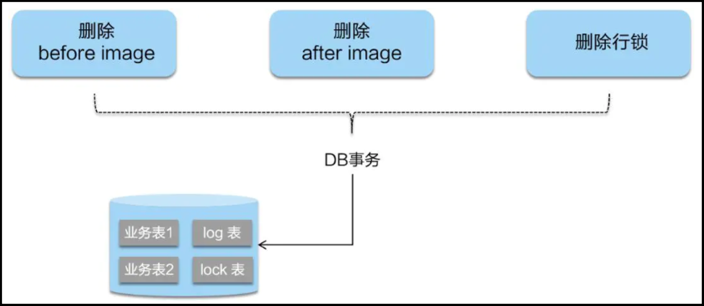

#### 20.1.2.4、二阶段回滚

在二阶段，如果是回滚：

Seata就需要回滚一阶段已经执行的"业务 SQL"，还原业务数据。

回滚方式便是用**before image**还原业务数据。

但在还原前首先要校验脏写，对比"数据库当前业务数据"和**after image**。如果两份数据完全一致就说明没有脏写，可以还原业务数据；如果不一致就说明有脏写，出现脏写就需要人工处理。

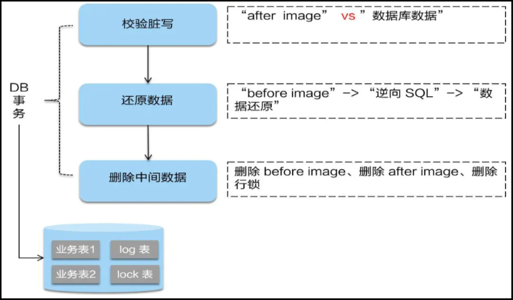

### 20.1.3、整体流程图

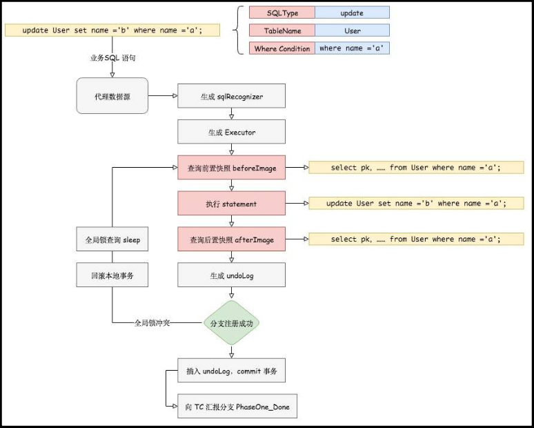

### 20.1.4、断点分析

调用流程：订单服务 => 库存服务 => 账户服务，在账户服务执行完SQL的地方打上断点，查看数据库中的数据。

#### 20.1.4.1、一阶段数据

> seata.global_table

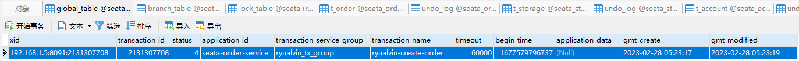

> seata.branch_table

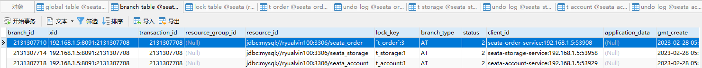

> seata.lock_table

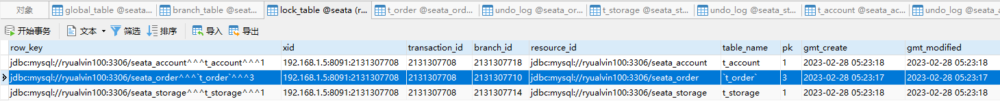

> seata_order.t_order

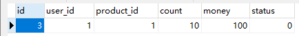

> seata_order.undo_log

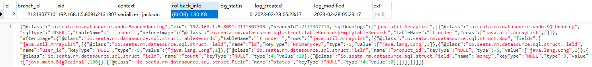

```json
{
  "@class": "io.seata.rm.datasource.undo.BranchUndoLog",
  "xid": "192.168.1.5:8091:2131307708",
  "branchId": 2131307710,
  "sqlUndoLogs": [
    "java.util.ArrayList",
    [
      {
        "@class": "io.seata.rm.datasource.undo.SQLUndoLog",
        "sqlType": "INSERT",
        "tableName": "`t_order`",
        "beforeImage": {
          "@class": "io.seata.rm.datasource.sql.struct.TableRecords$EmptyTableRecords",
          "tableName": "`t_order`",
          "rows": ["java.util.ArrayList", []]
        },
        "afterImage": {
          "@class": "io.seata.rm.datasource.sql.struct.TableRecords",
          "tableName": "`t_order`",
          "rows": [
            "java.util.ArrayList",
            [
              {
                "@class": "io.seata.rm.datasource.sql.struct.Row",
                "fields": [
                  "java.util.ArrayList",
                  [
                    {
                      "@class": "io.seata.rm.datasource.sql.struct.Field",
                      "name": "id",
                      "keyType": "PrimaryKey",
                      "type": -5,
                      "value": ["java.lang.Long", 3]
                    },
                    {
                      "@class": "io.seata.rm.datasource.sql.struct.Field",
                      "name": "user_id",
                      "keyType": "NULL",
                      "type": -5,
                      "value": ["java.lang.Long", 1]
                    },
                    {
                      "@class": "io.seata.rm.datasource.sql.struct.Field",
                      "name": "product_id",
                      "keyType": "NULL",
                      "type": -5,
                      "value": ["java.lang.Long", 1]
                    },
                    {
                      "@class": "io.seata.rm.datasource.sql.struct.Field",
                      "name": "count",
                      "keyType": "NULL",
                      "type": 4,
                      "value": 10
                    },
                    {
                      "@class": "io.seata.rm.datasource.sql.struct.Field",
                      "name": "money",
                      "keyType": "NULL",
                      "type": 3,
                      "value": ["java.math.BigDecimal", 100]
                    },
                    {
                      "@class": "io.seata.rm.datasource.sql.struct.Field",
                      "name": "status",
                      "keyType": "NULL",
                      "type": 4,
                      "value": 0
                    }
                  ]
                ]
              }
            ]
          ]
        }
      }
    ]
  ]
}
```

#### 20.1.4.2、一阶段数据分析

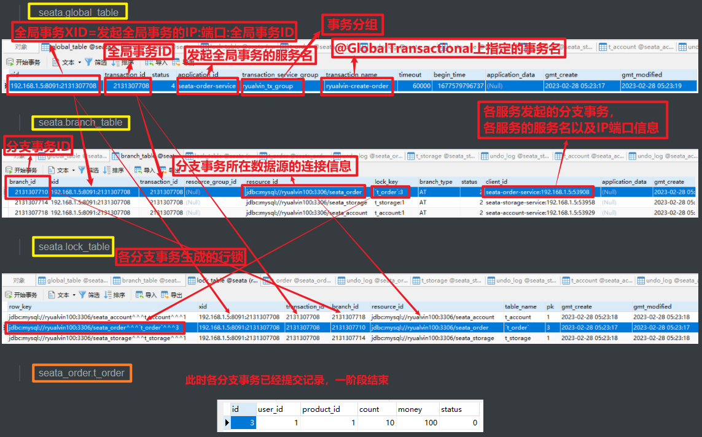

#### 20.1.4.3、undo_log.rollback_info


