# 1、MQ概述

- MQ，消息队列，存储消息的中间件；
- 分布式系统通信两种方式：直接远程调用和借助第三方完成间接通信；
- 发送方称为生产者，接收方称为消费者；

## 1.1、MQ的优势和劣势

### 1.1.1、MQ的优势

#### 应用解耦

> 问题

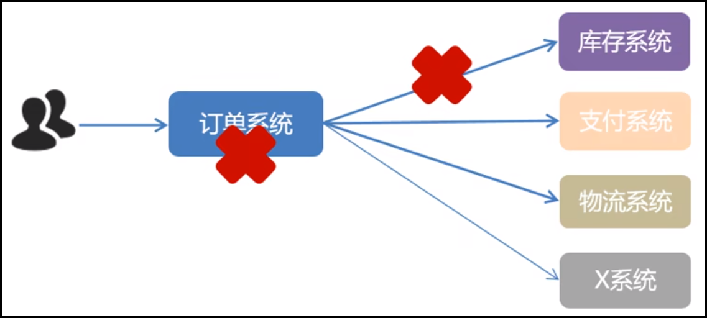

- 用户下单，订单系统依次调用库存系统、支付系统、物流系统。中间某个系统一旦发生故障，整个链路都会产生问题。环环相扣，应用系统之间耦合性高，容错性低；

- 如果某天需要增加一个X系统或者砍掉某个系统，那么在订单系统中又得去维护关于调用x系统的逻辑，可维护性低；
- 总结：系统的耦合性越高，容错性就越低，可维护性就越低； 

> 优势

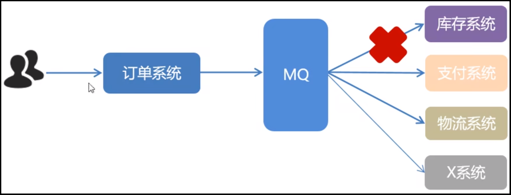

- 用户下单，订单系统处理完毕之后，将下单数据放入MQ中，其他系统只需要去MQ中获取下单数据进行消费（即完成各自系统的功能逻辑）。库存系统一旦发生故障，也不影响订单系统将消息下放MQ。待库存系统恢复后，会再去MQ中获取下单数据，完成库存系统的功能逻辑），整个链路的容错性大大降低，同时也提升了用户体验；
- 如果某天需要增加一个X系统，一点都不影响订单系统的开发。你要增加是你的事，反正订单系统只负责将下单数据下放MQ，你要增加X系统，只需要在X系统中从MQ获取数据即可进行别的功能逻辑的开发；
- 总结：使用MQ使得应用间解耦，提升容错性和可维护性；

#### 异步提速

> 问题

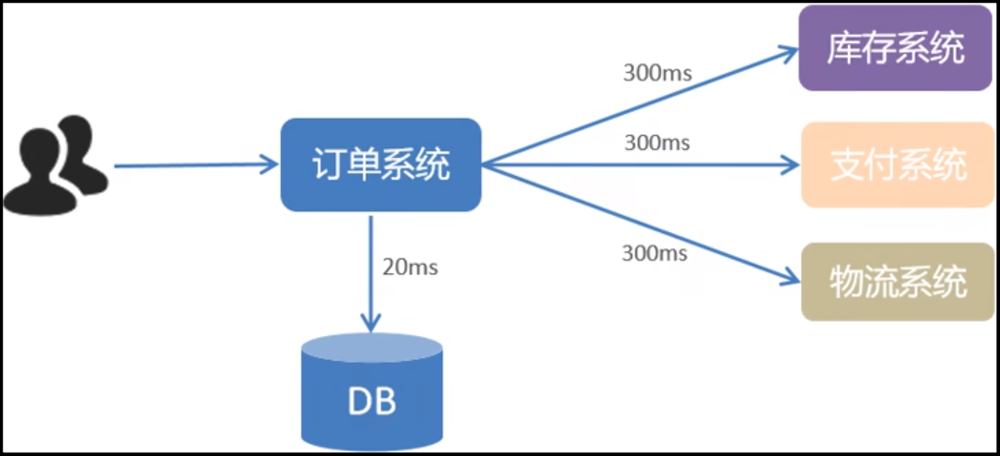

- 订单系统处理完数据后，需要保存至DB，接着调用库存系统，待库存系统响应结束再调用支付系统，待支付系统响应结束再调用物流系统，待整个下单链路完成之后，才响应给用户，非常的耗费时间。用户感知超过200ms，带来非常差的用户体验；

> 优势

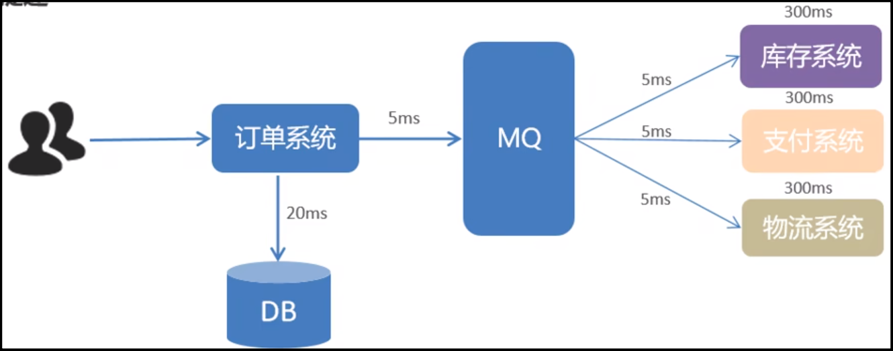

- 用户下单后，订单系统将数据保存至DB花费20ms，接着将数据下放MQ中花费5ms，然后响应给用户：下单成功or下单失败。用户感知总共25ms，大大提升用户体验和系统吞吐量（单位时间内处理请求的数目）。至于库存系统、支付系统、物流系统，只负责各自去MQ中获取下单数据再进行各自操作即可；

#### 削峰填谷

> 问题

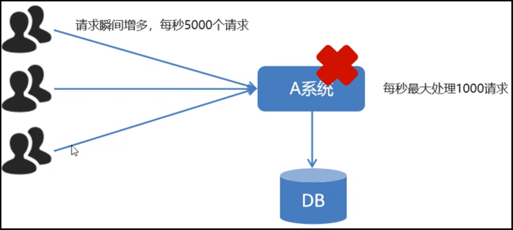

- A系统能够承受的最大负载为1000请求/每秒。A系统的产品经理要搞一个活动，1元抢购劳斯莱斯。还没到点，全国各地的用户都在等着了，每秒请求数瞬间增大，A系统只有一条路：跪了；

> 优势

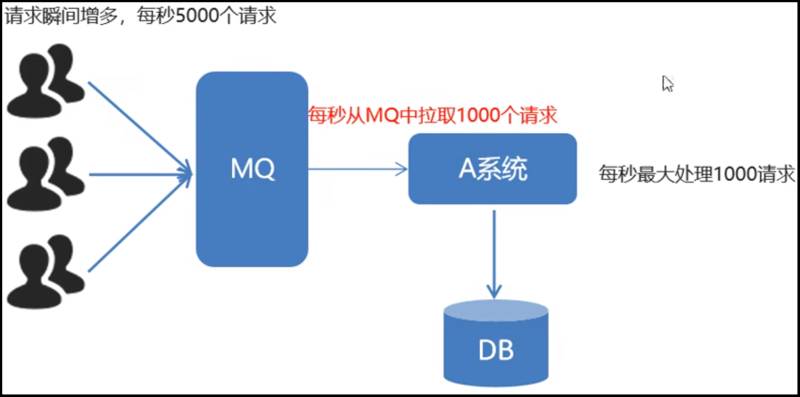

- 可将MQ作为缓冲带，用户请求直接数据直接下发MQ，有MQ挡在前，A系统只需要在后面慢慢地每秒从MQ拉取1000个请求处理即可，这就是所谓的削峰，即削除流量高峰；

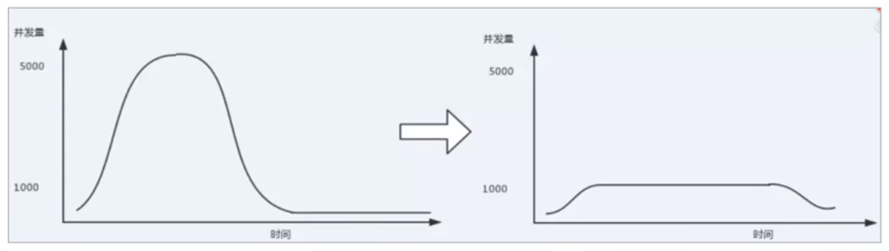

- 使用了MQ之后，限制消费消息的速度为1000，这样依赖，高峰期产生的数据势必会被积压在MQ中，高峰就被”削“掉了，但是因为消息积压，在高峰期过后的一段时间内，消费消息的速度还是会维持在1000，直到消费完积压的消息，这就叫做”填谷“。使用MQ后，可以提高系统稳定性；

#### 总结

- 应用解耦：提高系统容错性和可维护性；
- 异步提速：提升用户体验和系统吞吐量；
- 削峰填谷：提高系统稳定性；

### 1.1.2、MQ的劣势

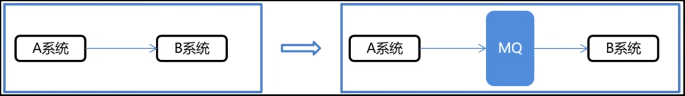

- 系统可用性降低：
  - 一个系统出现问题，那么整个链路都不可用。如果拥有的系统&服务越多（引入的外部依赖越多），系统稳定性越差。一旦MQ宕机，就会对业务造成影响。如何保证MQ的高可用？
- 系统的复杂度提高：
  - MQ的加入大大增加了系统的复杂度，以前系统间是同步的远程调用，现在是通过MQ进行异步调用。如何保证消息没有被重复消费？怎么处理消息丢失情况？如何保证消息传递的顺序性？
- 一致性问题：
  - A系统处理完业务，通过MQ给B、C、D三个系统发消息数据，如果B系统、C系统处理成功，D系统处理失败。如何保证消息数据处理的一致性？

#### 总结

既然MQ有优势也有劣势，那么使用MQ需要满足什么条件呢？

1. 生产者不需要从消费者处获得反馈。引入消息队列之前的直接调用，其接口的返回值应该为空，这才让明明下层的动作还没做，上层却当作动作做完了继续往后走，即所谓异步称为了可能：
   - 解释：A系统调用B系统，需要等待B系统反馈（即返回参数）后，再调用C系统。这种情况，就不适合使用MQ；
2. 容许短暂的不一致性：
   - 解释：前面说到的下单系统处理完后就给用户响应，不用理会库存系统、支付系统、物流系统去MQ获取数据然后进行各自的处理，那么数据状态就存在短暂的不一致性；
3. 确实是用了有效果。即解耦、提速、肖峰这些方面的收益，超过加入MQ，管理MQ这些成本。如果是小系统小应用，或者请求访问量没有那么大的情况下，使用MQ就得不偿失了；

## 1.2、常见MQ产品   

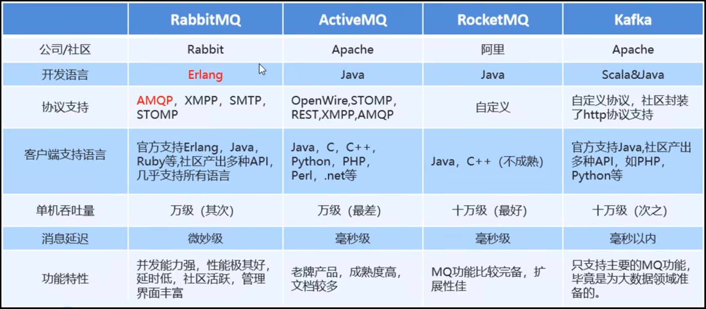

## 1.3、JMS

- JMS即Java消息服务（JavaMessage Service）应用程序接口，是一个Java平台中关于面向消息中间件的API；
- JMS是JavaEE规范中的一种，类比JDBC；
- 很多消息中间件都实现了JMS规范，例如：ActiveMQ。RabbitMQ官方没有提供JMS的实现包，但是开源社区有；

# 2、RabbitMQ简介

## 2.1、AMQP协议

AMQP，即Advanced Message Queuing Protocol（高级消息队列协议），是一个网络协议，是应用层协议的一个开放标准，为面向消息的中间件设计。基于此协议的客户端与消息中间件可传递消息，并不受客户端/中间件不同产品，不同的开发语言等条件的限制。2006年，AMQP规范发布。类比HTTP；

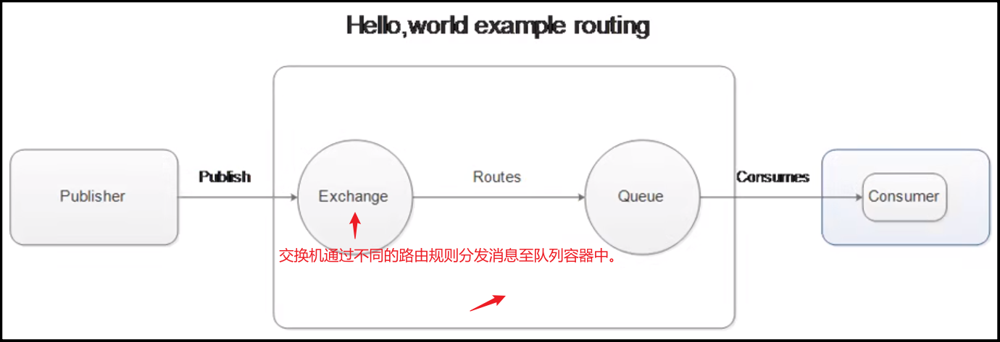

## 2.2、基础架构


## 2.3、名词介绍

### 2.3.1、Broker

- 接收和分发消息的应用，RabbitMQ Server就是Message Broker;

### 2.3.2、Virtual Host

- 出于多租户和安全因素设计的，把AMQP的基本组件划分到一个虚拟的分组中，类似于网络中的namespace概念。当多个不同的用户使用同一个RabbitMQ Server提供的服务时，可以划分出多个vhost，每个用户在自己的vhost创建exchange/queue等；

### 2.3.3、Connection

- publisher/consumer和broker之间的TCP连接；

### 2.3.4、Channel

- 如果每一次访问RabbitMQ都建立一个Connection，在消息量最大的时候建立TCP Connection的开销将是巨大的，效率也较低。Channel是在Connection内部建立的逻辑连接，如果应用程序支持多线程，通常每个Thread创建单独的Channel进行通讯，AMQP Method包含了Channel Id帮助客户端和message broker识别Channel，所以Channel之间是完全隔离的。Channel作为轻量级的Connection极大减少了操作系统建立TCP Connection的开销；

### 2.3.5、Exchange

- message到达broker的第一站，根据分发规则，匹配查询表中的routing key，分发消息到queue中去。常用的类型有：direct(point-to-point)，topic(publish-subscribe)，fanout(multicast)；

### 2.3.6、Queue

- 消息最终被送到这里等待consumer取走；

### 2.3.7、Binding

- exchange和queue之间的虚拟连接，bingding中可以包含routing key。Binding信息被保存到exchange中的查询表中，用于message的分发依据；

## 2.4、工作模式

- 简单模式、work queues、Publish/Subscribe发布与订阅模式、Routing路由模式、Topics主题模式、RPC远程调用模式（远程调用，不太算MQ；暂不做介绍）；
- 官网介绍：https://www.rabbitmq.com/getstarted.html

# 3、RabbitMQ的安装和配置

## 3.1、安装依赖环境

```sh
yum install build-essential openssl openssl-devel unixODBC unixODBC-devel make gcc gcc-c++ kernel-devel m4 ncurses-devel tk tc xz
```

## 3.2、安装Erlang

```sh
#上传
erlang-18.3-1.el7.centos.x86_64.rpm
socat-1.7.3.2-5.el7.lux.x86_64.rpm
rabbitmq-server-3.6.5-1.noarch.rpm
#安装
rpm -ivh erlang-18.3-1.el7.centos.x86_64.rpm
#如果出现glibc错误，说明版本太低，可以查看当前机器的glibc版本
strings /lib64/libc.so.6 | grep GLIBC
#当前最高版本2.12，需要2.15.x，所以需要升级glibc
#使用yum更新安装依赖
sudo yum install zlib-devel bzip2-devel openssl-devel ncurses-devel sqlite-devel readline-devel tk-devel gcc make -y
#下载rpm包
wget http://copr-be.cloud.fedoraproject.org/results/mosquito/myrepo-el6/epel-6-x86_64/glibc-2.17-55.fc20/glibc-utils-2.17-55.el6.x86_64.rpm &
wget http://copr-be.cloud.fedoraproject.org/results/mosquito/myrepo-el6/epel-6-x86_64/glibc-2.17-55.fc20/glibc-static-2.17-55.el6.x86_64.rpm &
wget http://copr-be.cloud.fedoraproject.org/results/mosquito/myrepo-el6/epel-6-x86_64/glibc-2.17-55.fc20/glibc-2.17-55.el6.x86_64.rpm &
wget http://copr-be.cloud.fedoraproject.org/results/mosquito/myrepo-el6/epel-6-x86_64/glibc-2.17-55.fc20/glibc-common-2.17-55.el6.x86_64.rpm &
wget http://copr-be.cloud.fedoraproject.org/results/mosquito/myrepo-el6/epel-6-x86_64/glibc-2.17-55.fc20/glibc-devel-2.17-55.el6.x86_64.rpm &
wget http://copr-be.cloud.fedoraproject.org/results/mosquito/myrepo-el6/epel-6-x86_64/glibc-2.17-55.fc20/glibc-headers-2.17-55.el6.x86_64.rpm &
wget http://copr-be.cloud.fedoraproject.org/results/mosquito/myrepo-el6/epel-6-x86_64/glibc-2.17-55.fc20/nscd-2.17-55.el6.x86_64.rpm &
#安装rpm包
sudo rpm -Uvh *-2.17-55.el6.x86_64.rpm --force --nodeps
#安装完毕后再查看glibc版本，发现glibc版本已经到2.17了
strings /lib64/libc.so.6 | grep GLIBC
```

## 3.3、安装RabbitMQ

```sh
rpm -ivh socat-1.7.3.2-5.el7.lux.x86_64.rpm
rpm -ivh rabbitmq-server-3.6.5-1.noarch.rpm
```

## 3.4、开启管理界面及配置

```shell
#开启管理界面
rabbitmq-plugins enable rabbitmq_management
#修改默认配置信息，比如修改密码、配置等等，例如：loopback_users中的<<"guest">>，只保留guest
vim /usr/lib/rabbitmq/lib/rabbitmq_server-3.6.5/ebin/rabbit.app
#关闭防火墙
service iptables stop
#or
systemctl disable firewalld
```

## 3.5、启动

```shell
#检查防火墙状态
systemctl status firewalld
#开启防火墙
systemctl start firewalld
#开放管理界面访问端口以及API连接端口
firewall-cmd --zone=public --add-port=5672/tcp --permanent
firewall-cmd --zone=public --add-port=15672/tcp --permanent
#重启防火墙
systemctl restart firewalld
#重新加载防火墙--立即生效
firewall-cmd --reload
#查看已开启的端口
firewall-cmd --zone=public --query-port=5672/tcp
firewall-cmd --zone=public --query-port=15672/tcp
#启动服务
service rabbitmq-server start
#停止服务
service rabbitmq-server stop
#重启服务
service rabbitmq-server restart
```

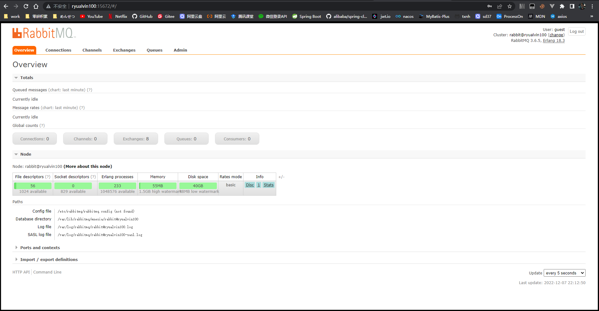

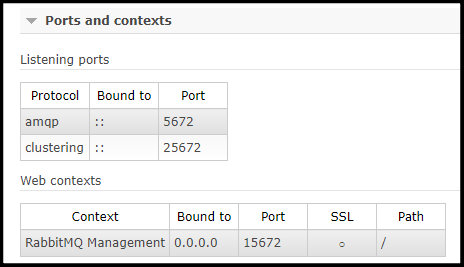

## 3.6、添加用户

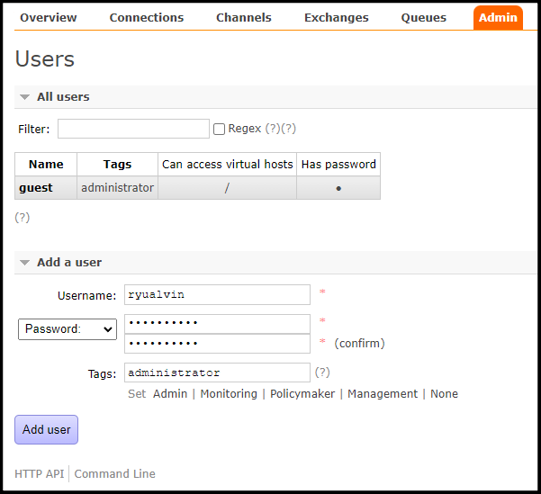

## 3.7、添加虚拟分区

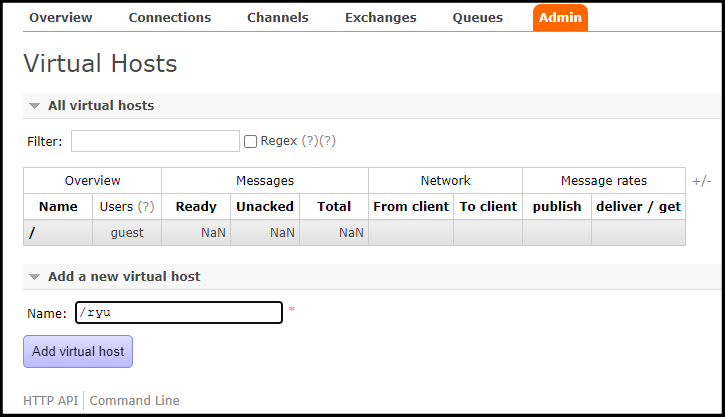

## 3.8、设置虚拟分区访问权限

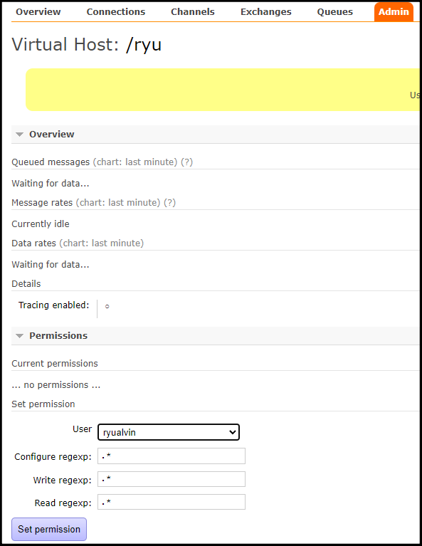

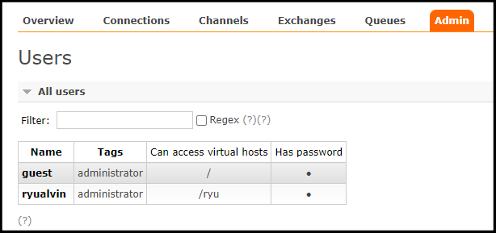

## 3.9、设置配置文件

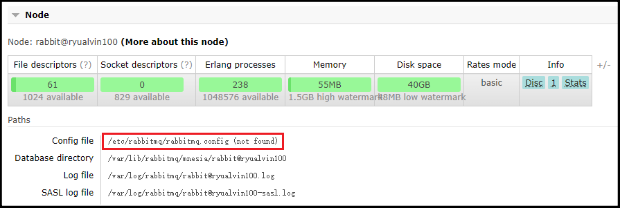

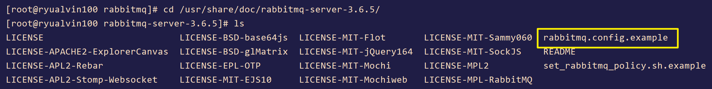

```shell
#拷贝配置文件到指定路径
cd /usr/share/doc/rabbitmq-server-3.6.5/
cp rabbitmq.config.example /etc/rabbitmq/rabbitmq.config
#重启服务
service rabbitmq-server restart
```

# 4、工作模式

## 4.1、简单模式

> 模式介绍

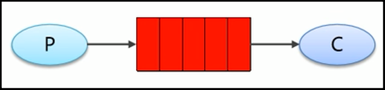

- 类似一个邮箱，可以缓存消息。邮递员向邮箱中投递报纸，住户可以去邮箱中取报纸；
- 交换机是不参与这种模式的；

> 应用场景

有一个oa系统，用户通过接收手机验证码进行注册。用户在页面上点击获取验证码后，将验证码放到消息队列，然后短信服务从队列中获取到验证码，并发送给用户；

实现：

> 依赖引入

```xml
<dependency>
  <groupId>com.rabbitmq</groupId>
  <artifactId>amqp-client</artifactId>
  <version>5.6.0</version>
</dependency>
```

> 生产者

```java
// 1、创建连接工厂
ConnectionFactory factory = new ConnectionFactory();
// 2、配置连接参数
factory.setHost("192.168.182.100");//主机
factory.setPort(5672);//端口
factory.setUsername("ryualvin");//用户名
factory.setPassword("xxxxxx");//密码
factory.setVirtualHost("/ryu");//虚拟分区（可理解为MySQL中库的概念）
// 3、创建连接
Connection connection = factory.newConnection();
// 4、创建频道
Channel channel = connection.createChannel();
// 5、创建队列
/**
 * (String queue, boolean durable, boolean exclusive, boolean autoDelete, Map<String, Object> arguments)
 * 1、queue：队列名称
 * 2、durable：是否持久化，当mq重启后还在
 * 3、exclusive：(为啥这里设置为true，无法生成队列？）
 *      * 是否独占，只能有一个消费者监听这队列
 *      * 当连接关闭时，是否删除队列
 * 4、autoDelete：是否自动删除，当没有消费者时，自动删除
 * 5、arguments：参数
 */
// 如果没有一个名字叫"hello_world"的队列，则会创建该队列，有的话不创建并使用
channel.queueDeclare("hello_world", true, false, false, null);
// 6、发送消息
/**
 * (String exchange, String routingKey, AMQP.BasicProperties props, byte[] body)
 * 1、exchange：交换机名称，简单模式下交换机会使用默认的 ""
 * 2、routingkey：路由名称
 * 3、props：配置信息
 * 4、body：消息数据
 */
channel.basicPublish("", "hello_world", null, "hello rabbitmq".getBytes());
// 7、关闭资源
// 如果不关闭连接，在MQ控制台的Connections标签里会显示，并且应用程序不停止
channel.close();
connection.close();
```

> 消费者

```java
// 1、创建连接工厂
ConnectionFactory factory = new ConnectionFactory();
// 2、配置连接参数
factory.setHost("192.168.182.100");//主机
factory.setPort(5672);//端口
factory.setUsername("ryualvin");//用户名
factory.setPassword("xxxxxx");//密码
factory.setVirtualHost("/ryu");//虚拟分区（可理解为MySQL中库的概念）
// 3、创建连接
Connection connection = factory.newConnection();
// 4、创建频道
Channel channel = connection.createChannel();
// 5、创建队列
/**
 * (String queue, boolean durable, boolean exclusive, boolean autoDelete, Map<String, Object> arguments)
 * 1、queue：队列名称
 * 2、durable：是否持久化，当mq重启后还在
 * 3、exclusive：(为啥这里设置为true，无法生成队列？）
 *      * 是否独占，只能有一个消费者监听这队列
 *      * 当连接关闭时，是否删除队列
 * 4、autoDelete：是否自动删除，当没有消费者时，自动删除
 * 5、arguments：参数
 */
// 如果没有一个名字叫"hello_world"的队列，则会创建该队列，有的话不创建并使用
channel.queueDeclare("hello_world", true, false, false, null);
// 6、接收消息
Consumer consumer = new DefaultConsumer(channel) {
    /**
     * @param consumerTag：唯一标识
     * @param envelope：可获取发送方的交换机、路由规则等信息
     * @param properties：配置信息
     * @param body：消息体
     * @throws IOException
     */
    @Override
    public void handleDelivery(String consumerTag, Envelope envelope, AMQP.BasicProperties properties, byte[] body) throws IOException {
        System.out.println(String.format("consumerTag = %s", consumerTag));
        System.out.println(String.format("envelope.RoutingKey = %s", envelope.getRoutingKey()));
        System.out.println(String.format("envelope.DeliveryTag = %s", envelope.getDeliveryTag()));
        System.out.println(String.format("envelope.Exchange = %s", envelope.getExchange()));
        System.out.println(String.format("properties = %s", properties));
        System.out.println(String.format("body = %s", new String(body)));
    }
};
/**
 * (String queue, boolean autoAck, Consumer callback)
 * 1、queue：接收消息的队列名称
 * 2、autoAck：是否自动确认
 * 3、callback：回调函数（消费后的处理）
 */
channel.basicConsume("hello_world", true, consumer);
```

## 4.2、工作队列模式（竞争）

> 模式介绍

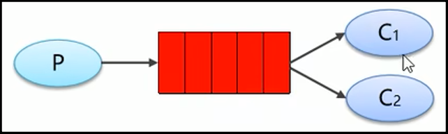

- 多个消费者监听者同一个队列，轮询消费的规则；
- 与简单模式相比，多了一个或者一些消费者。多个消费者共同消费同一个队列中的消息，并且多个消费者只能消费一个消息，互相争抢，但不会消费同一个消息；
- 对于任务过重或任务较多的场景可提供工作队列模式提高任务处理的速度；
- 生产者1秒钟生产1000个消息，消费者1秒钟只能处理500个消息，所以找来他的伙伴消费者2，一起处理这1000个消息；

> 应用场景

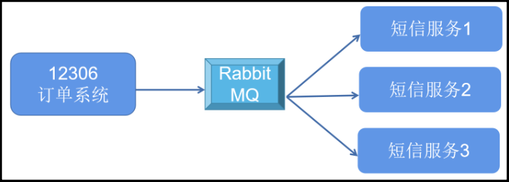

- 12306，实时发送短信，在短信量不大的情况下还好，但在节假日的时候，没有MQ发送短信的访问必然会撑不住大量的并发；
- 如果改为了MQ方式，就可以进行异步处理，且短信涉及到的网络情况时间还长，与第三方交互也会有些情况，改用 MQ 异步处理，就可以支持更多的并发，也可以根据业务的量进行随时扩容；

> 生产者

```java
channel.queueDeclare("work_queues", true, false, false, null);
for (int i = 0; i < 10; i++) {
    channel.basicPublish("", "work_queues", null, (i + " - hello rabbitmq").getBytes());
}
```

> 消费者1&消费者2

```java
channel.queueDeclare("work_queues", true, false, false, null);
Consumer consumer = new DefaultConsumer(channel) {
    @Override
    public void handleDelivery(String consumerTag, Envelope envelope, AMQP.BasicProperties properties, byte[] body) throws IOException {
        System.out.println(String.format("body = %s", new String(body)));
    }
};
channel.basicConsume("work_queues", true, consumer);
```

## 4.3、Pub/Sub订阅模式:FANOUT（重复）

> 模式介绍


在订阅模型中，多了一个Exchange角色，而且过程略有变化：

- 生产者：不再发送消息到队列中，而是发给X（交换机）；
- 消费者：还是一样，会一直等待消息的到来；
- 消息队列：接收由交换机分发而来的消息；
- 交换机：一方面，接收生产者发送的消息。另一方面，知道如何分发消息，例如：递交给某个特别队列、递交给所有队列、或是将消息丢弃。到底如何操作，取决于交换机的类型。交换机类型由常见以下3种类型：
  - Fanout：广播，将消息交给所有绑定到交换机的队列；
  - Direct：定向，把消息交给符合指定routing key的队列；
  - Topic：通配符，把消息交给符合routing pattern（路由模式）的队列；

交换机只负责转发消息，不具备存储消息的能力，因此如果没有任何队列与交换机绑定，或者没有符合路由规则的队列，那么消息会丢失！

> 应用场景

中国气象局提供"天气预报"送入交换机，网易、新浪、百度等门户各自通过队列接入此交换机，就可以自动获取气象局推送的气象数据；

电商平台，添加一个商品，需要同时去更新缓存和数据库；

> 生产者

```java
// 4、创建频道
Channel channel = connection.createChannel();
// 5、创建交换机
/**
 * (String exchange, BuiltinExchangeType type, boolean durable, boolean autoDelete, boolean internal, Map<String, Object> arguments)
 * exchange：交换机名称
 * type：交换机分发消息规则
 * durable：是否持久化
 * autoDelete：是否自动删除
 * internal：是否内部，一般false
 * arguments：参数
 */
channel.exchangeDeclare("test_exchange", BuiltinExchangeType.FANOUT, true, false, false, null);
// 6、创建队列
/**
 * (String queue, boolean durable, boolean exclusive, boolean autoDelete, Map<String, Object> arguments)
 * queue：队列名称
 * durable：是否持久化
 * exclusive：是否独占
 * autoDelete：是否自动删除
 * arguments：参数
 */
channel.queueDeclare("test_exchange_queue1", true, false, false, null);
channel.queueDeclare("test_exchange_queue2", true, false, false, null);
// 7、绑定交换机和队列
/**
 * (String queue, String exchange, String routingKey)
 * queue：绑定队列名称
 * exchange：绑定交换机名称
 * routingKey：按照什么规则绑定
 */
channel.queueBind("test_exchange_queue1", "test_exchange", "");
channel.queueBind("test_exchange_queue2", "test_exchange", "");
// 8、发送消息
/**
 * (String exchange, String routingKey, AMQP.BasicProperties props, byte[] body)
 * exchange：交换机名称
 * routingKey：分发消息规则
 * props：配置信息
 * body：消息内容
 */
String msg = "日志：调用了findAll方法，日志级别：info";
channel.basicPublish("test_exchange", "", null, msg.getBytes());
// 9、关闭资源
channel.close();
connection.close();
```

> 消费者

```java
// 4、创建频道
Channel channel = connection.createChannel();
// 5、创建队列
/**
 * (String queue, boolean durable, boolean exclusive, boolean autoDelete, Map<String, Object> arguments)
 * 1、queue：队列名称
 * 2、durable：是否持久化，当mq重启后还在
 * 3、exclusive：(为啥这里设置为true，无法生成队列？）
 *      * 是否独占，只能有一个消费者监听这队列
 *      * 当连接关闭时，是否删除队列
 * 4、autoDelete：是否自动删除，当没有消费者时，自动删除
 * 5、arguments：参数
 */
// 如果没有一个名字叫"hello_world"的队列，则会创建该队列，有的话不创建并使用
channel.queueDeclare("test_exchange_queue1", true, false, false, null);
// 6、接收消息
Consumer consumer = new DefaultConsumer(channel) {
    /**
     * @param consumerTag：唯一标识
     * @param envelope：可获取发送方的交换机、路由规则等信息
     * @param properties：配置信息
     * @param body：消息体
     * @throws IOException
     */
    @Override
    public void handleDelivery(String consumerTag, Envelope envelope, AMQP.BasicProperties properties, byte[] body) throws IOException {
        System.out.println(String.format("body = %s", new String(body)));
        System.out.println("test_exchange_queue1 ---> 将日志信息打印到控制台");
    }
};
/**
 * (String queue, boolean autoAck, Consumer callback)
 * 1、queue：接收消息的队列名称
 * 2、autoAck：是否自动确认
 * 3、callback：回调函数（消费后的处理）
 */
channel.basicConsume("test_exchange_queue1", true, consumer);
```

## 4.4、Routing:DIRECT（精准匹配）

> 模式介绍

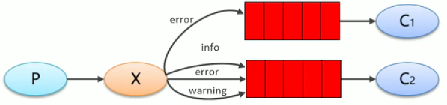

- 队列与交换机的绑定，不能是任意绑定了，而是要指定一个RoutingKey（路由key）；
- 消息的发送方在向Exchange发送消息时，也必须指定消息的RoutingKey；
- Exchange不再把消息交给每一个绑定的队列，而是根据消息的RoutingKey进行判断，只有队列的RoutingKey与消息的RoutingKey完全一致，才会接收到消息；

> 应用场景

还是一个电商平台，对于实时性没有要求那么高。当新添加一个商品的时候，只需要去更新数据库，不用刷新缓存；

> 生产者

```java
// 4、创建频道
Channel channel = connection.createChannel();
// 5、创建交换机
/**
 * test_exchange_routing：交换机名称
 * BuiltinExchangeType.DIRECT：交换机分发消息到队列的分发规则
 */
channel.exchangeDeclare("test_exchange_routing", BuiltinExchangeType.DIRECT, true, false, false, null);
// 6、创建队列
channel.queueDeclare("test_exchange_queue1", true, false, false, null);
channel.queueDeclare("test_exchange_queue2", true, false, false, null);
// 7、绑定交换机和队列
// 将error级别的日志信息分发给队列1处理，保存到数据库
channel.queueBind("test_exchange_queue1", "test_exchange_routing", "error");
// 将info、warning、error级别的日志信息分发给队列2处理，打印到控制台
channel.queueBind("test_exchange_queue2", "test_exchange_routing", "info");
channel.queueBind("test_exchange_queue2", "test_exchange_routing", "warning");
channel.queueBind("test_exchange_queue2", "test_exchange_routing", "error");
// 8、发送消息
// String msg = "日志：调用了findAll方法，日志级别：info";
String msg = "日志：调用了findAll方法，日志级别：error";
// 只将消息分发给队列2
// channel.basicPublish("test_exchange_routing", "info", null, msg.getBytes());
channel.basicPublish("test_exchange_routing", "error", null, msg.getBytes());
// 9、关闭资源
channel.close();
connection.close();
```

> 消费者

```java
// 4、创建频道
Channel channel = connection.createChannel();
// 5、创建队列
// 如果没有一个名字叫"hello_world"的队列，则会创建该队列，有的话不创建并使用
channel.queueDeclare("test_exchange_queue1", true, false, false, null);
// 6、接收消息
Consumer consumer = new DefaultConsumer(channel) {
    @Override
    public void handleDelivery(String consumerTag, Envelope envelope, AMQP.BasicProperties properties, byte[] body) throws IOException {
        System.out.println(String.format("body = %s", new String(body)));
        System.out.println("test_exchange_queue1 ---> 将错误日志信息保存到数据库");
    }
};
channel.basicConsume("test_exchange_queue1", true, consumer);
```

## 4.5、Topics:TOPIC（模糊匹配）

> 模式介绍

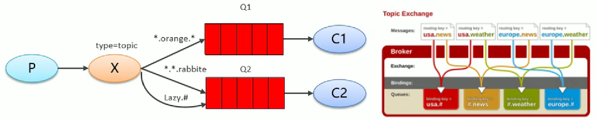

- 红色Queue：绑定的是usa.#，因此凡是以usa.开头的RoutingKey都会被匹配到；
- 黄色Queue：绑定的是#.news，因此凡是以.news结尾的RoutingKey都会被匹配到；
- Topic主题模式可以实现Pub/Sub发布与订阅模式喝Routing路由模式的功能，只是Topic砸配置RoutingKey的时候可以使用通配符，显得更加灵活；

> 应用场景

还是一个电商平台，对于实时性没有要求那么高。当新添加一个商品的时候，只需要去更新数据库，数据库包括主数据库mysql1和从数据库mysql2，不用刷新缓存；

> 生产者

```java
// 4、创建频道
Channel channel = connection.createChannel();
// 5、创建交换机
channel.exchangeDeclare("test_exchange_routing", BuiltinExchangeType.TOPIC, true, false, false, null);
// 6、创建队列
channel.queueDeclare("test_exchange_queue1", true, false, false, null);
channel.queueDeclare("test_exchange_queue2", true, false, false, null);
// 7、绑定交换机和队列
// * 代表一个单词，# 代表0个或者多个
// "*"：只能匹配一个，*.orange只能匹配a.orange，无法匹配a.b.orange
channel.queueBind("test_exchange_queue1", "test_exchange_routing", "#.error");
channel.queueBind("test_exchange_queue1", "test_exchange_routing", "order.*");
// "#"：匹配一个或者多个，lazy.#可以匹配lazy.a或者lazy.a.b
channel.queueBind("test_exchange_queue2", "test_exchange_routing", "*.*");
// 8、发送消息
String msg = "订单日志。。。";
// 只将消息分发给队列2
channel.basicPublish("test_exchange_routing", "order.info", null, msg.getBytes());
// 9、关闭资源
channel.close();
connection.close();
```

> 消费者

```java
// 4、创建频道
Channel channel = connection.createChannel();
// 5、创建队列
channel.queueDeclare("test_exchange_queue1", true, false, false, null);
// 6、接收消息
Consumer consumer = new DefaultConsumer(channel) {
    @Override
    public void handleDelivery(String consumerTag, Envelope envelope, AMQP.BasicProperties properties, byte[] body) throws IOException {
        System.out.println(String.format("body = %s", new String(body)));
        System.out.println("test_exchange_queue1 ---> 错误信息 & order信息，保存至数据库");
    }
};
channel.basicConsume("test_exchange_queue1", true, consumer);
```

# 5、Spring整合RabbitMQ

## 5.1、生产者

1. 导入依赖，pom.xml：

   ```xml
       <dependencies>
           <!--IOC容器-->
           <dependency>
               <groupId>org.springframework</groupId>
               <artifactId>spring-context</artifactId>
               <version>5.1.7.RELEASE</version>
           </dependency>
           <!--Spring整合RabbitMQ-->
           <dependency>
               <groupId>org.springframework.amqp</groupId>
               <artifactId>spring-rabbit</artifactId>
               <version>2.1.8.RELEASE</version>
           </dependency>
           <!--单元测试-->
           <dependency>
               <groupId>junit</groupId>
               <artifactId>junit</artifactId>
               <version>4.12</version>
           </dependency>
           <dependency>
               <groupId>org.springframework</groupId>
               <artifactId>spring-test</artifactId>
               <version>5.1.7.RELEASE</version>
           </dependency>
       </dependencies>
   
       <!--编译插件-->
       <build>
           <plugins>
               <plugin>
                   <groupId>org.apache.maven.plugins</groupId>
                   <artifactId>maven-compiler-plugin</artifactId>
                   <version>3.8.0</version>
                   <configuration>
                       <source>1.8</source>
                       <target>1.8</target>
                   </configuration>
               </plugin>
           </plugins>
       </build>
   ```

2. 编写连接配置文件，rabbitmq.properties：

   ```properties
   #IP地址
   rabbitmq.host=192.168.182.100
   #端口
   rabbitmq.port=5672
   #连接用户名
   rabbitmq.username=ryualvin
   #连接密码
   rabbitmq.password=xxxxxx
   #虚拟分区：类似MySQL中的库的概念
   rabbitmq.virtual-host=/ryu
   ```

3. 编写生产者配置文件，spring-rabbitmq-producer.xml：

   ```xml
   <?xml version="1.0" encoding="UTF-8"?>
   <beans xmlns="http://www.springframework.org/schema/beans"
          xmlns:xsi="http://www.w3.org/2001/XMLSchema-instance"
          xmlns:context="http://www.springframework.org/schema/context"
          xmlns:rabbit="http://www.springframework.org/schema/rabbit"
          xsi:schemaLocation="http://www.springframework.org/schema/beans
          http://www.springframework.org/schema/beans/spring-beans.xsd
          http://www.springframework.org/schema/context
          https://www.springframework.org/schema/context/spring-context.xsd
          http://www.springframework.org/schema/rabbit
          http://www.springframework.org/schema/rabbit/spring-rabbit.xsd">
       <!--加载配置文件-->
       <context:property-placeholder location="classpath*:rabbitmq.properties"/>
   
       <!-- 定义rabbitmq connectionFactory -->
       <rabbit:connection-factory id="connectionFactory" host="${rabbitmq.host}"
                                  port="${rabbitmq.port}"
                                  username="${rabbitmq.username}"
                                  password="${rabbitmq.password}"
                                  virtual-host="${rabbitmq.virtual-host}"/>
       <!--定义管理交换机、队列-->
       <rabbit:admin connection-factory="connectionFactory"/>
   
       <!--定义持久化队列，不存在则自动创建；不绑定到交换机则绑定到默认交换机
       默认交换机类型为direct，名字为：""，路由键为队列的名称
       -->
       <rabbit:queue id="spring_queue" name="spring_queue" auto-declare="true"/>
   
       <!-- ~~~~~~~~~~~~~~~~~~~~~~~~~~~~广播；所有队列都能收到消息~~~~~~~~~~~~~~~~~~~~~~~~~~~~ -->
       <!--定义广播交换机中的持久化队列，不存在则自动创建-->
       <rabbit:queue id="spring_fanout_queue_1" name="spring_fanout_queue_1" auto-declare="true"/>
   
       <!--定义广播交换机中的持久化队列，不存在则自动创建-->
       <rabbit:queue id="spring_fanout_queue_2" name="spring_fanout_queue_2" auto-declare="true"/>
   
       <!--定义广播类型交换机；并绑定上述两个队列-->
       <rabbit:fanout-exchange id="spring_fanout_exchange" name="spring_fanout_exchange" auto-declare="true">
           <rabbit:bindings>
               <rabbit:binding queue="spring_fanout_queue_1"/>
               <rabbit:binding queue="spring_fanout_queue_2"/>
           </rabbit:bindings>
       </rabbit:fanout-exchange>
   
       <!-- ~~~~~~~~~~~~~~~~~~~~~~~~~~~~通配符；*匹配一个单词，#匹配多个单词 ~~~~~~~~~~~~~~~~~~~~~~~~~~~~ -->
       <!--定义广播交换机中的持久化队列，不存在则自动创建-->
       <rabbit:queue id="spring_topic_queue_star" name="spring_topic_queue_star" auto-declare="true"/>
       <!--定义广播交换机中的持久化队列，不存在则自动创建-->
       <rabbit:queue id="spring_topic_queue_well" name="spring_topic_queue_well" auto-declare="true"/>
       <!--定义广播交换机中的持久化队列，不存在则自动创建-->
       <rabbit:queue id="spring_topic_queue_well2" name="spring_topic_queue_well2" auto-declare="true"/>
   
       <rabbit:topic-exchange id="spring_topic_exchange" name="spring_topic_exchange" auto-declare="true">
           <rabbit:bindings>
               <rabbit:binding pattern="ryualvin.*" queue="spring_topic_queue_star"/>
               <rabbit:binding pattern="ryulavin.#" queue="spring_topic_queue_well"/>
               <rabbit:binding pattern="yeahicode.#" queue="spring_topic_queue_well2"/>
           </rabbit:bindings>
       </rabbit:topic-exchange>
   
       <!--定义rabbitTemplate对象操作可以在代码中方便发送消息-->
       <rabbit:template id="rabbitTemplate" connection-factory="connectionFactory"/>
   </beans>
   ```

4. 发送消息：

   ```java
   @RunWith(SpringJUnit4ClassRunner.class)
   @ContextConfiguration(value = "classpath:spring-rabbitmq-producer.xml")
   public class SpringProducer {
   
       @Autowired
       RabbitTemplate rabbitTemplate;
   
       @Test
       public void test01() {
           rabbitTemplate.convertAndSend("spring_fanout_exchange", "", "Hello Spring Fanout！");
       }
   }
   ```

## 5.2、消费者

1. 导入依赖，pom.xml；

2. 编写连接配置文件，rabbitmq.properties；

3. 编写消费者配置文件，spring-rabbitmq-consumer.xml：

   ```xml
   <?xml version="1.0" encoding="UTF-8"?>
   <beans xmlns="http://www.springframework.org/schema/beans"
          xmlns:xsi="http://www.w3.org/2001/XMLSchema-instance"
          xmlns:context="http://www.springframework.org/schema/context"
          xmlns:rabbit="http://www.springframework.org/schema/rabbit"
          xsi:schemaLocation="http://www.springframework.org/schema/beans
          http://www.springframework.org/schema/beans/spring-beans.xsd
          http://www.springframework.org/schema/context
          https://www.springframework.org/schema/context/spring-context.xsd
          http://www.springframework.org/schema/rabbit
          http://www.springframework.org/schema/rabbit/spring-rabbit.xsd">
       <!--加载配置文件-->
       <context:property-placeholder location="classpath:rabbitmq.properties"/>
   
       <!-- 定义rabbitmq connectionFactory -->
       <rabbit:connection-factory id="connectionFactory" host="${rabbitmq.host}"
                                  port="${rabbitmq.port}"
                                  username="${rabbitmq.username}"
                                  password="${rabbitmq.password}"
                                  virtual-host="${rabbitmq.virtual-host}"/>
   
       <bean id="fanoutListener1" class="org.yeahicode.rabbitmq.listener.FanoutListener1"/>
   
       <rabbit:listener-container connection-factory="connectionFactory" auto-declare="true">
           <rabbit:listener ref="fanoutListener1" queue-names="spring_fanout_queue_1"/>
       </rabbit:listener-container>
   </beans>
   ```

4. **接收消息：在SpringIOC容器启动的时候，会加载组件fanoutListener1，由于fanoutListener1实现了MessageListener接口的onMessage方法，所以会自动监听接收消息**；

   ```java
   public class FanoutListener1 implements MessageListener {
       @Override
       public void onMessage(Message message) {
           System.out.println("队列FanoutListener1开始接收消息，消息为：" + new String(message.getBody()));
       }
   }
   ```

## 5.3、配置详解

### 5.3.1、队列声明参数

```xml
<!--
id：作为Bean注册在SpringIOC容器中的Bean ID；
name：队列名称
auto-declare：自动创建，没有该队列则自动创建
auto-delete：自动删除，最后一个消费者和该队列断开连接后，则自动删除
durable：是否持久化
exclusive：是否独占
    -->
<rabbit:queue id="spring_queue" name="spring_queue" auto-declare="true"/>
```

### 5.3.2、交换机声明参数

```xml
<!--
    FANOUT，广播
    id：Bean ID
    name：交换机名称
    bingds：指定绑定的队列，不用指定路由规则
    -->
<rabbit:fanout-exchange id="spring_fanout_exchange" name="spring_fanout_exchange" auto-declare="true">
    <rabbit:bindings>
        <rabbit:binding queue="spring_fanout_queue_1"/>
        <rabbit:binding queue="spring_fanout_queue_2"/>
    </rabbit:bindings>
</rabbit:fanout-exchange>

<!--
    DIRECT，精准匹配
    id：Bean ID
    name：交换机名称
    key：指定路由规则以及绑定队列
-->
<rabbit:direct-exchange id="spring_direct_exchange" name="spring_direct_exchange" auto-declare="true">
    <rabbit:bindings>
        <rabbit:binding key="cache" queue="spring_queue1"/>
        <rabbit:binding key="db" queue="spring_queue2"/>
    </rabbit:bindings>
</rabbit:direct-exchange>

<!--
    TOPIC，模糊匹配
    id：Bean ID
    name：交换机名称
    pattern：指定匹配规则
-->
<rabbit:topic-exchange id="spring_topic_exchange" name="spring_topic_exchange" auto-declare="true">
    <rabbit:bindings>
        <rabbit:binding pattern="ryualvin.*" queue="spring_topic_queue_star"/>
        <rabbit:binding pattern="ryulavin.#" queue="spring_topic_queue_well"/>
        <rabbit:binding pattern="yeahicode.#" queue="spring_topic_queue_well2"/>
    </rabbit:bindings>
</rabbit:topic-exchange>
```

# 6、SpringBoot整合RabbitMQ

## 6.1、生产者

1. 导入依赖：

   ```xml
   <parent>
     <groupId>org.springframework.boot</groupId>
     <artifactId>spring-boot-starter-parent</artifactId>
     <version>2.1.4.RELEASE</version>
   </parent>
   <dependencies>
     <dependency>
       <groupId>org.springframework.boot</groupId>
       <artifactId>spring-boot-starter-amqp</artifactId>
     </dependency>
     <dependency>
       <groupId>org.springframework.boot</groupId>
       <artifactId>spring-boot-starter-test</artifactId>
     </dependency>
   </dependencies>
   ```

2. 配置连接：

   ```yml
   spring:
     rabbitmq:
       host: 192.168.182.100
       port: 5672
       username: ryualvin
       password: xxxxxx
       virtual-host: /ryu
   ```

3. 创建配置文件，配置交换机、队列、绑定：

   ```java
   @Configuration
   public class RabbitMQConfig {
   
       public static final String EXCHANGE_NAME = "boot_topic_exchange";
       public static final String QUEUE_NAME = "boot_queue";
   
       // 1、交换机
       @Bean("bootExchange")
       public Exchange bootExchange() {
           return ExchangeBuilder.topicExchange(EXCHANGE_NAME).durable(true).build();
       }
   
       // 2、Queue队列
       @Bean("bootQueue")
       public Queue bootQueue() {
           return QueueBuilder.durable(QUEUE_NAME).build();
       }
   
       // 3、队列和交互绑定关系 Binding
       @Bean
       public Binding bindQueueExchange(@Qualifier("bootQueue") Queue queue, @Qualifier("bootExchange") Exchange exchange) {
           return BindingBuilder.bind(queue).to(exchange).with("boot.#").noargs();
       }
   }
   ```

4. 发送消息：

   ```java
   @SpringBootTest
   @RunWith(SpringRunner.class)
   public class SpringBootProducerTest {
   
       @Autowired
       RabbitTemplate rabbitTemplate;
   
       @Test
       public void test01() {
           rabbitTemplate.convertAndSend(RabbitMQConfig.EXCHANGE_NAME, "boot.info.log", "SpringBoot Topic Exchange Message。。。");
       }
   }
   ```

## 6.2、消费者

1. 导入依赖；

2. 配置连接；

3. **通过@RabbitListener监听队列：**

   ```java
   @Component
   public class MyRabbitMQListener {
   
       @RabbitListener(queues = "boot_queue")
       public void getMessage(Message message) {
           System.out.println(new String(message.getBody()));
       }
   }
   ```

# 7、RabbitMQ高级特性

## 7.1、消息的可靠投递-confirm

1. 在配置中开启确认模式：

   ```xml
   <rabbit:connection-factory id="connectionFactory" host="${rabbitmq.host}"
                              port="${rabbitmq.port}"
                              username="${rabbitmq.username}"
                              password="${rabbitmq.password}"
                              virtual-host="${rabbitmq.virtual-host}"
                              publisher-confirms="true"/>
   ```

2. 通过RabbitTemplate设置确认回调函数：

   ```java
   @Test
   public void testConfirm() {
       rabbitTemplate.setConfirmCallback(new RabbitTemplate.ConfirmCallback() {
           @Override
           public void confirm(CorrelationData correlationData, boolean ack, String cause) {
               if (ack) {
                   System.out.println("发送成功");
               } else {
                   // channel error; protocol method: #method<channel.close>(reply-code=404, reply-text=NOT_FOUND - no exchange 'producer2exchange_exchange11111' in vhost '/ryu', class-id=60, method-id=40)
                   System.out.println(String.format("发送失败，原因：%s", cause));
               }
           }
       });
       // 设置无效交换机
       rabbitTemplate.convertAndSend("producer2exchange_exchange11111", "info.mysql.log", "Hello producer2exchange confirm");
   }
   ```

## 7.2、消息的可靠投递-return

1. 在配置中开启回退模式：

   ```xml
   <rabbit:connection-factory id="connectionFactory" host="${rabbitmq.host}"
                              port="${rabbitmq.port}"
                              username="${rabbitmq.username}"
                              password="${rabbitmq.password}"
                              virtual-host="${rabbitmq.virtual-host}"
                              publisher-confirms="true"
                              publisher-returns="true"/>
   ```

2. 通过RabbitTemplate设置回退回调函数：

   - 设置Exchange处理消息的模式：
     - 如果消息没有路由到Queue，则丢弃消息（默认）；
     - 如果消息没有路由到Queue，则返回给消息发送方ReturnCallback

   ```java
   @Test
   public void testRetrun() {
       /**
        * 将Mandatory设置为true，发送失败就会将消息返回给发送者，发送者就可通过回调函数拿到发送失败信息
        */
       // 设置交换机处理失败消息的模式
       rabbitTemplate.setMandatory(true);//强制性设置为true
       rabbitTemplate.setReturnCallback(new RabbitTemplate.ReturnCallback() {
           @Override
           public void returnedMessage(Message message, int replyCode, String replyText, String exchange, String routingKey) {
               System.out.println(String.format("message：", new String(message.getBody())));
               System.out.println(String.format("replyCode：", replyCode));
               System.out.println(String.format("replyText：", replyText));
               System.out.println(String.format("exchange：", exchange));
               System.out.println(String.format("routingKey：", routingKey));
           }
       });
       // 设置无效路由
       rabbitTemplate.convertAndSend("producer2exchange_exchang", "1111info111111.mysql.log", "Hello producer2exchange confirm");
   }
   ```

## 7.3、消息的可靠投递-事务

- 在RabbitMQ中也提供了事务机制，但是性能较差，不推荐使用；
- 使用channel下列方法，完成事务控制：
  - txSelect()，用于将当前channel设置成transaction模式；
  - txCommit()，用于提交事务；
  - txRollback()，用于回滚事务；

## 7.4、消息的接收确认-ack

> 介绍

- ack指Acknowledge，确认。标识消费端收到消息后的确认方式；
- 有三种确认方式：
  - 自动确认：acknowledge="none"；
  - 手动确认：acknowledge="manual"；
  - 根据异常情况确认：acknowledge="auto"；（使用超麻烦，跳过）
- 其中，自动确认是指，当消息一旦被Consumer接收到，则自动确认收到，并将相应message从RabbitMQ的消息缓存中移除。可在实际业务处理中，很可能接收到了消息，但业务处理出现异常，那么该消息就会丢失；
- 如果设置了手动确认方式，则需要在业务处理成功后调用channel.basicAck()，手动签收；出现异常时，调用channel.basicNack()方法，让其自动更新发送消息；

> 实现

1. 开启包扫描，自动将消息监听器注入容器，并开启监听容器的手动确认属性：

   ```xml
   <?xml version="1.0" encoding="UTF-8"?>
   <beans xmlns="http://www.springframework.org/schema/beans"
          xmlns:xsi="http://www.w3.org/2001/XMLSchema-instance"
          xmlns:context="http://www.springframework.org/schema/context"
          xmlns:rabbit="http://www.springframework.org/schema/rabbit"
          xsi:schemaLocation="http://www.springframework.org/schema/beans
          http://www.springframework.org/schema/beans/spring-beans.xsd
          http://www.springframework.org/schema/context
          https://www.springframework.org/schema/context/spring-context.xsd
          http://www.springframework.org/schema/rabbit
          http://www.springframework.org/schema/rabbit/spring-rabbit.xsd">
       <!--加载配置文件-->
       <context:property-placeholder location="classpath:rabbitmq.properties"/>
   
       <!-- 定义rabbitmq connectionFactory -->
       <rabbit:connection-factory id="connectionFactory" host="${rabbitmq.host}"
                                  port="${rabbitmq.port}"
                                  username="${rabbitmq.username}"
                                  password="${rabbitmq.password}"
                                  virtual-host="${rabbitmq.virtual-host}"/>
       <!--开启包扫描-->
       <context:component-scan base-package="org.yeahicode.listener"/>
       <!--将自定义监听器自动注入容器，并开启手动确认-->
       <rabbit:listener-container connection-factory="connectionFactory" auto-declare="true" acknowledge="manual">
           <rabbit:listener ref="ackListener" queue-names="producer2broker_queue1"/>
       </rabbit:listener-container>
   </beans>
   ```

2. 自定义监听器：

   - 获取broker发送至该channel的消息的唯一标识deliveryTag；

   - 获取消息；

   - 处理业务逻辑

   - 手动签收消息；

   - 异常处理：消息重回队列，让broker重新发送消息给消费端；

     ```java
     @Component //配置中开启包扫描，可扫描到该组件并注册至SpringIOC容器中
     public class AckListener implements ChannelAwareMessageListener {
         @Override
         public void onMessage(Message message, Channel channel) throws Exception {
             Thread.sleep(1000);
             /**
              * deliveryTag：当一个消费者向 RabbitMQ 注册后，会建立起一个 Channel ，
              *              RabbitMQ 会用 basic.deliver 方法向消费者推送消息，这个方法携带了一个 delivery tag，
              *              它代表了 RabbitMQ 向该 Channel 投递的这条消息的唯一标识 ID，是一个单调递增的正整数，delivery tag 的范围仅限于 Channel
              */
             long deliveryTag = message.getMessageProperties().getDeliveryTag();
             try {
     
                 System.out.println("接收消息：" + new String(message.getBody()));
                 int i = 10 / 0;
                 /**
                  * deliveryTag：broker往channel内投递这条消息的唯一标识，范围仅限于这个channel
                  * multiple：是否手动确认签收多条
                  */
                 channel.basicAck(deliveryTag, true);//手动确认签收
                 System.out.println("接收消息成功");
             } catch (Exception e) {
                 /**
                  * deliveryTag：broker往channel内投递这条消息的唯一标识，范围仅限于这个channel
                  * multiple：是否手动确认签收多条
                  * requeue：消息重回队列，broker会重新发送消息给消费端
                  */
                 System.out.println("接收消息异常");
                 channel.basicNack(deliveryTag, true, true);
             }
         }
     }
     ```

## 7.5、消息可靠性总结

1. 持久化：
   - Exchange持久化；
   - Queue持久化；
   - Message持久化；
2. Producer To Broker：Confirm&Return；
3. Broker To Consumer：Ack；
4. Broker高可用（搭建集群，下面会说）；

## 7.6、消费端限流

> 前提条件

- 消费端的确认模式一定要为手动确认：`acknowledge="manual"`

- 并且开启每次从Broker拉取的消息数：`prefetch="2"`

- 简单理解为就是：你生产端怎么生产是你的事，我每次只拉取指定的消息数进行处理，并且直到手动确认一个消息消费完毕后`channel.basicAck(deliveryTag, true)`才会处理下一个。若消费端没有手动确认或者中途出现故障则消息会回退到Broker，如下图：

  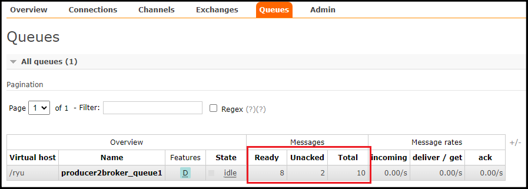

  

> 问题解决

- 可解决前面提到的流量高峰的问题；

  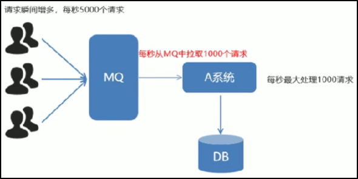

> 实现

1. 开启手动确认以及处理消息数：

   ```xml
   <!--开启包扫描-->
   <context:component-scan base-package="org.yeahicode.listener"/>
   <!--将自定义监听器自动注入容器-->
   <rabbit:listener-container connection-factory="connectionFactory" auto-declare="true" acknowledge="manual" prefetch="2">
       <rabbit:listener ref="qosListener" queue-names="producer2broker_queue1"/>
   </rabbit:listener-container>
   ```

2. 手动确认：

   ```java
   @Component
   public class QosListener implements ChannelAwareMessageListener {
       @Override
       public void onMessage(Message message, Channel channel) throws Exception {
           Thread.sleep(1000);
           long deliveryTag = message.getMessageProperties().getDeliveryTag();
           System.out.println("接收消息：" + new String(message.getBody()));
           channel.basicAck(deliveryTag, true);//手动确认签收
       }
   }
   ```

## 7.7、TTL

> 介绍

- TTL：Time To Live（存活时间/过期时间）；
- 当消息到达存活时间后，还没有被消费，会被自动清除；
- **RabbitMQ可以对消息设置过期时间，也可以对整个队列设置过期时间；**
- **如果设置了消息的过期时间，也设置了队列的过期时间，它以时间短的为准；**
- 当一个队列中有10条消息，只给第5条设置了过期时间。即使到了过期时间，第5条消息也不会被移除，只有当第5条消息位于队列头部时（即被消费时），才会单独判断这一消息是否过期；
- 常见场景：订单30分钟内过期；

> 实现

1. 设置队列过期时间使用参数：`x-message-ttl`，单位：ms（毫秒），会对整个队列消息统一过期；

   ```xml
   <rabbit:queue id="test_ttl_queue" name="test_ttl_queue" auto-declare="true">
       <rabbit:queue-arguments>
           <entry key="x-message-ttl" value="100000" value-type="java.lang.Integer"></entry>
       </rabbit:queue-arguments>
   </rabbit:queue>
   <rabbit:topic-exchange id="test_ttl_exchange" name="test_ttl_exchange" auto-declare="true">
       <rabbit:bindings>
           <rabbit:binding pattern="ttl.#" queue="test_ttl_queue"></rabbit:binding>
       </rabbit:bindings>
   </rabbit:topic-exchange>
   ```

2. 设置消息过期时间使用参数：`expiration`，通过后置处理器设置；

   ```java
   @Test
   public void sendTtlMsg() {
       MessagePostProcessor messagePostProcessor = new MessagePostProcessor() {
           @Override
           public Message postProcessMessage(Message message) throws AmqpException {
               message.getMessageProperties().setExpiration("5000");
               return message;
           }
       };
       rabbitTemplate.convertAndSend("test_ttl_exchange", "ttl.test", "Hello ttl...", messagePostProcessor);
   }
   ```

## 7.8、死信队列

> 介绍

- 死信队列，英文缩写：DLX。Dead Letter Exchange（死信交换机），当消息称为Dead Message后，可以被重新发送到另一个交换机，这个交换机就是DLX；

  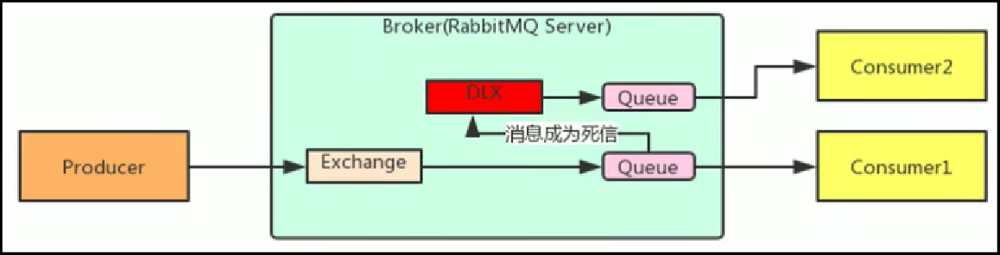

- **RabbitMQ和其他的MQ产品相比，比较特殊。别的MQ也有死信队列这一特性，但是队列，而RabbitMQ是死信交换机；**

> 问题

1. 消息什么时候成为死信？消息成为死信的三种情况：

   - 队列消息长度到达限制；
   - 消费者拒绝消费消息，basicNack/basicReject，并且不把消息重新放入原目标队列，即requeue=false；
   - 原队列存在消息过期设置，消息到达超时时间未被消费；

2. 队列是如何给死信交换机发消息的呢？即队列是如何绑定死信交换机的？

   - 队列给死信交换机发送消息和生产者通过交换机给队列发送消息是一样的，需要指定交换机，以及发送规则；

   - 给队列设置参数：`x-dead-letter-exchange`和`x-dead-letter-routing-key`；

     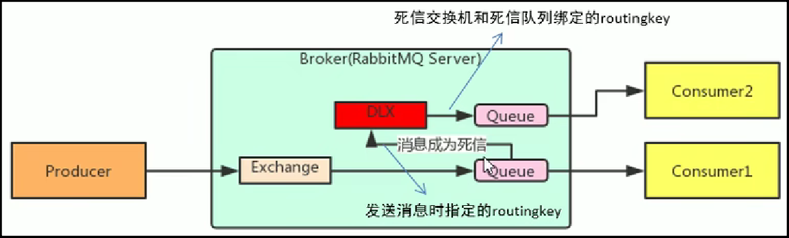

> 实现

1. 声明普通交换机`test_dlx_exchange`以及普通队列`test_dlx_queue`，将普通交换机与普通队列绑定，并指明路由规则；

2. 为普通队列`test_dlx_queue`指明消息过期时间以及队列最大容量限制；

3. 声明死信交换机`dlx_exchange`以及死信队列`dlx_queue`，将死信交换机与死信队列绑定，并指明路由规则；

4. 将普通队列`test_dlx_queue`绑定至死信交换机`dlx_exchange`，并指明路由规则（精准匹配）；

5. 测试：

   - 第一种情况：生产端发送1条消息，无消费端。消息过期后，会自动转发至死信队列`test_dlx_queue`；

     ```xml
     <!--1、声明普通交换机`test_dlx_exchange`以及普通队列`test_dlx_queue`，将普通交换机与普通队列绑定，并指明路由规则；-->
     <rabbit:fanout-exchange name="test_dlx_exchange" id="test_dlx_exchange" auto-declare="true">
         <rabbit:bindings>
             <rabbit:binding queue="test_dlx_queue">
             </rabbit:binding>
         </rabbit:bindings>
     </rabbit:fanout-exchange>
     <!--2、为普通队列`test_dlx_queue`指明消息过期时间以及队列最大容量限制；-->
     <rabbit:queue id="test_dlx_queue" name="test_dlx_queue" auto-declare="true">
         <rabbit:queue-arguments>
             <entry key="x-message-ttl" value="5000" value-type="java.lang.Integer"/>
             <entry key="x-max-length" value="10" value-type="java.lang.Integer"/>
             <!--4、将普通队列`test_dlx_queue`绑定至死信交换机`dlx_exchange`，并指明路由规则（精准匹配）；-->
             <entry key="x-dead-letter-exchange" value="dlx_exchange"/>
             <entry key="x-dead-letter-routing-key" value="dlx.hehe"/>
         </rabbit:queue-arguments>
     </rabbit:queue>
     <!--3、声明死信交换机`dlx_exchange`以及死信队列`dlx_queue`，将死信交换机与死信队列绑定，并指明路由规则；-->
     <rabbit:topic-exchange name="dlx_exchange" id="dlx_exchange" auto-declare="true">
         <rabbit:bindings>
             <rabbit:binding pattern="dlx.#" queue="dlx_queue"/>
         </rabbit:bindings>
     </rabbit:topic-exchange>
     <rabbit:queue id="dlx_queue" name="dlx_queue" auto-declare="true"></rabbit:queue>
     ```

     ```java
     @Test
     public void sendDlx(){
         rabbitTemplate.convertAndSend("test_dlx_exchange","", "Am I Dead ?");
     }
     ```

     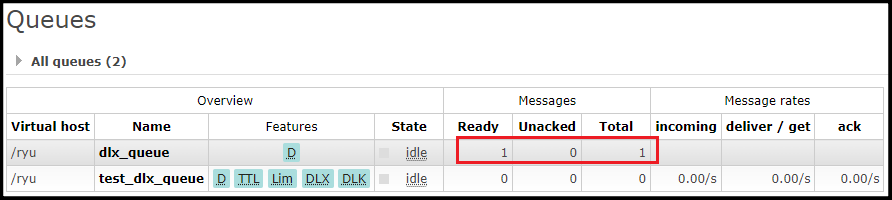

   - 第二种情况：生产端发送超过普通队列最大容量限制的消息数，超额的消息数会自动转发至死信队列`test_dlx_queue`；

     ```java
     @Test
     public void sendDlx(){
         // 第二种情况：生产端发送超过普通队列最大容量限制的消息数，超额的消息数会自动转发至死信队列`test_dlx_queue`；
         for (int i = 0; i < 20; i++) {
             rabbitTemplate.convertAndSend("test_dlx_exchange","", "Am I Dead ?");
         }
     }
     ```

     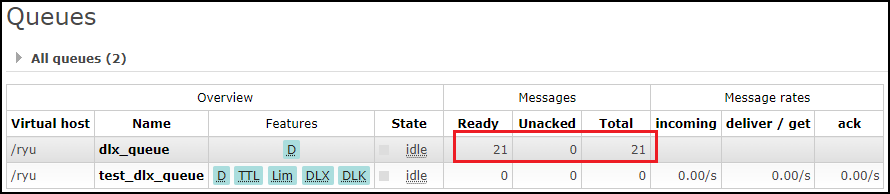

   - 第三种情况：生产端发送1条消息，消费端拒收，并且不让其重回队列，消息会自动转发至死信队列`test_dlx_queue`；

     - 消费端：

       ```xml
       <rabbit:listener-container connection-factory="connectionFactory" auto-declare="true" acknowledge="manual">
           <rabbit:listener ref="dlxListener" queue-names="test_dlx_queue"/>
       </rabbit:listener-container>
       ```

       ```java
       @Component
       public class DlxListener implements ChannelAwareMessageListener {
           @Override
           public void onMessage(Message message, Channel channel) throws Exception {
               long deliveryTag = message.getMessageProperties().getDeliveryTag();
               try {
                   System.out.println("接收消息：" + new String(message.getBody()));
                   int i = 10 / 0;
                   channel.basicAck(deliveryTag, true);//手动确认签收
                   System.out.println("接收消息成功");
               } catch (Exception e) {
       
                   System.out.println("接收消息异常");
                   // 不让消息重回普通队列，因为要让消息转发至死信队列
                   channel.basicNack(deliveryTag, true, false);
               }
           }
       }
       ```

       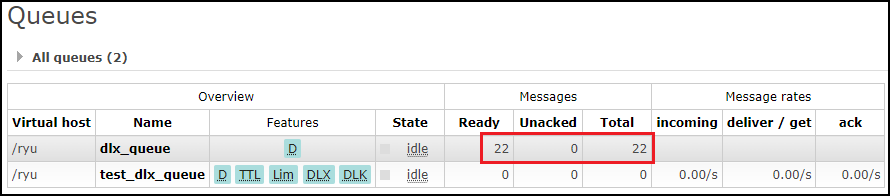

> 总结

1. 死信交换机和死信队列，和普通的没有区别；
2. **当消息称为死信后，如果该队列绑定了死信交换机，则消息会被死信交换机重新路由到死信队列；**

## 7.9、延迟队列

> 介绍

- 消息进入队列后不会立即被消费，只有到达指定时间后，才会被消费；

- 需求：

  1. 下单后，30分钟未支付，取消订单，回滚库存；
  2. 新用户注册成功7天后，发送短信问候；

- 实现方式：

  1. 定时器：下单的时候会将下单数据保存至表中，并记录下单时间（后并更新库存-1）。设置一个定时器，每隔1分钟去查询表中的下单记录的状态，过期30分钟未支付的则回滚库存表，过期30分钟已支付的什么都不做。但是这样做并不优雅，定时器间隔时间设置大的话，时间差大，间隔时间设置小的话，要频繁查询数据库，影响性能；

  2. 延迟队列：订单系统将下单数据放进MQ中的延迟队列（后并更新库存-1），30分钟后库存系统再去消费队列中的下单数据，通过订单ID去查询订单状态，如果支付则什么都不做，如果未支付则取消订单，回滚库存；

     

> RabbitMQ中延迟队列的实现方式

- **很可惜，RabbitMQ中并未提供延迟队列功能；**

- 但是可以使用：`TTL+死信队列`组合实现延迟队列的效果；

- 订单系统可以将下单数据发送至一个设置了过期时间30分钟的普通队列，并为普通队列绑定一个死信交换机。当普通队列中的消息过期后则会路由转发至死信队列中，**库存系统只需要去死信队列中获取下单数据再进行以上操作就可以了**；

  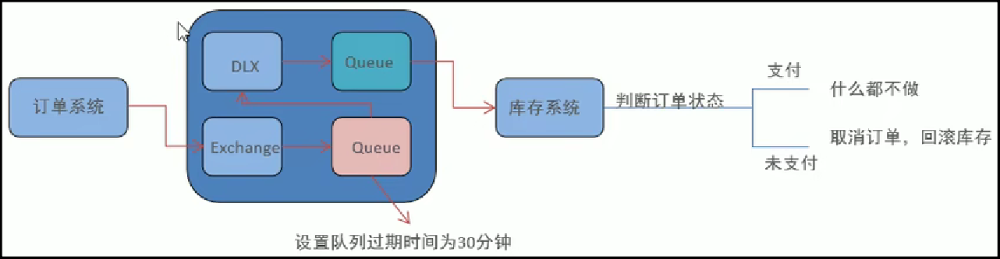

## 7.10、日志与监控

### 7.10.1、RabbitMQ日志

- RabbitMQ默认日志存放路径：`/var/log/rabbitmq/rabbit@服务器主机名.log`

  ```shell
  [root@ryualvin100 rabbitmq]# cd /var/log/rabbitmq
  [root@ryualvin100 rabbitmq]# ll
  总用量 104
  -rw-r--r--. 1 rabbitmq rabbitmq 19955 12月 12 08:15 rabbit@ryualvin100.log
  -rw-r--r--. 1 rabbitmq rabbitmq 76584 12月 11 18:58 rabbit@ryualvin100.log-20221211
  -rw-r--r--. 1 rabbitmq rabbitmq     0 12月  7 08:43 rabbit@ryualvin100-sasl.log
  -rw-r--r--. 1 root     root         0 12月  8 06:46 shutdown_err
  -rw-r--r--. 1 root     root        49 12月  8 06:46 shutdown_log
  -rw-r--r--. 1 root     root         0 12月 12 06:16 startup_err
  -rw-r--r--. 1 root     root       355 12月 12 06:16 startup_log
  [root@ryualvin100 rabbitmq]# cat rabbit@ryualvin100.log
  
  =INFO REPORT==== 12-Dec-2022::06:16:33 ===
  Starting RabbitMQ 3.6.5 on Erlang 18.3
  Copyright (C) 2007-2016 Pivotal Software, Inc.
  Licensed under the MPL.  See http://www.rabbitmq.com/
  
  =INFO REPORT==== 12-Dec-2022::06:16:33 ===
  ...
  ```

### 7.10.2、管理和监控

1. 方式一：通过管理控制台`http://ryualvin100:15672`

2. 方式二：rabbitmqctl命令：

   ```shell
   #查看队列
   rabbitmqctl list_queues
   #查看交换机
   rabbitmqctl list_exchanges
   #查看用户
   rabbitmqctl list_users
   #查看连接
   rabbitmqctl list_connections
   #查看消费者信息
   rabbitmqctl list_consumers
   #查看环境变量
   rabbitmqctl environment
   #查看未被确认的队列
   rabbitmqctl list_queues name messages_unacknowledged
   #查看单个队列的内存使用
   rabbitmqctl list_queues name memory
   #查看准备就绪的队列
   rabbitmqctl list_queues name messages_ready
   ```

## 7.11、消息追踪

- 在使用任何消息中间件的过程中，难免会出现某条消息异常丢失的情况。对于RabbitMQ而言，可能是因为生产者或消费者与RabbitMQ断开了连接，而它们与RabbitMQ又采用了不同的确认机制；也有可能是因为交换机与队列之间不同的转发策略；甚至是交换机并没有与任何队列进行绑定，生产者又不感知或者没有采取相应的措施；另外RabbitMQ本身的集群策略也可能导致消息的丢失。这个时候就需要有一个较好的机制跟踪记录消息的投递过程，以此协助开发和运维人员进行问题的定位。在RabbitMQ中可以使用Firehose和rabbitmq_tracing插件功能来实现消息追踪；

### 7.11.1、Firehose

- Firehose的机制是将生产者投递给RabbitMQ的消息，RabbitMQ投递给消费者的消息按照指定的格式发送到默认的交换机上。这个默认的交换机的名称为`amq.rabbitmq.trace`，它是一个TOPIC类型的交换机。发送到这个交换机上的消息的`RoutingKey`为`publish.exchangename`和`deliver.queuename`。其中`exchangename`和`queuename`为实际交换机和队列的名称，分别对应生产者投递到交换机的消息，和消费者从queue上获取的消息；

- 打开trace会影像消息写入功能：一般情况下不打开，只有在排查问题的时候再打开；

  ```shell
  #开启
  rabbitmqctl trace_on
  #关闭
  rabbitmqctl trace_off
  ```

### 7.11.2、rabbitmq_tracing

- rabbitmq_tracing和Firehorse在实现上如出一辙，只不过rabbitmq_tracing的方式比Firehorse多了一层GUI的波安装，更容易使用和管理；

  ```shell
  #罗列所有的rabbitmq的插件
  [root@ryualvin100 rabbitmq]# rabbitmq-plugins list
   Configured: E = explicitly enabled; e = implicitly enabled
   | Status:   * = running on rabbit@ryualvin100
   |/
  #[e*]代表enable 
  [e*] amqp_client                       3.6.5
  [  ] cowboy                            1.0.3
  [  ] cowlib                            1.0.1
  [e*] mochiweb                          2.13.1
  [  ] rabbitmq_amqp1_0                  3.6.5
  [  ] rabbitmq_auth_backend_ldap        3.6.5
  [  ] rabbitmq_auth_mechanism_ssl       3.6.5
  #启用插件
  [root@ryualvin100 rabbitmq]# rabbitmq-plugins enable rabbitmq_tracing
  ```

# 8、应用问题

## 8.1、消息可靠性保障-消息补偿

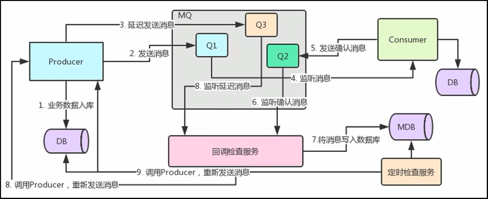

- 正常情况：
  - Producer将业务数据入库（包含正常消息ID），然后发送正常消息给Q1。Consumer监听Q1，消费正常消息后，将业务数据入自己的库，并且发送确认消息给Q2；
  - Producer在发送正常消息给Q1后，延迟一段时间，发送一条一样的消息给Q3；
  - 回调检查服务监听Q2，获取确认消息，并将确认消息写入消息数据库；
  - 回调检查服务监听Q3，获取延迟消息， 根据延迟消息ID到消息数据库中查找，若有记录，则不做任何操作；

- 异常情况1：
  - 回调检查服务监听Q2，没有收到确认消息，但收到了延迟消息，根据延迟消息ID到消息数据库中查找发现没有记录，此时，Consumer消费异常，则回调检查服务调用Producer，重新发送消息；

- 异常情况2：
  - Broker故障或者Producer发送消息故障，此时，正常消息和延迟消息都没有成功到达Q1和Q3。定时检查服务会定时检查Producer的业务数据库和消息数据库的记录是否一致，不一致则调用Producer，重新发送消息；


## 8.2、消息幂等性保障-乐观锁

> 什么是幂等性

[(26条消息) 什么是幂等性_mischen520的博客-CSDN博客_幂等性是什么意思](https://blog.csdn.net/miachen520/article/details/91039661)

**幂等性：就是用户对于同一操作发起的一次请求或者多次请求的结果是一致的，不会因为多次点击而产生了副作用。**

例子：拿支付来说，用户购买商品后支付，支付扣款成功，但是返回结果的时候网络异常，用户未收到支付结果。此时钱已经扣了，用户再次点击按钮，此时会进行第二次扣款操作，返回结果成功，用户查询余额发现多扣钱了，流水记录也变成了两条。

在以前的单应用系统中，我们只需要把数据操作放入事务中即可，发生错误立即回滚，但是在响应客户端的时候也有可能出现网络终端或者异常等等问题，因为没有办法返回响应结果，此时后台已经处理完毕了，就没办法因为响应的故障而进行数据回滚了。

在增删改查4个操作中，**尤为注意就是增加或者修改，查询对于结果是不会有改变的，删除只会进行一次**，用户多次点击产生的结果一样，修改在大多场景下结果一样，增加在重复提交的场景下会出现。

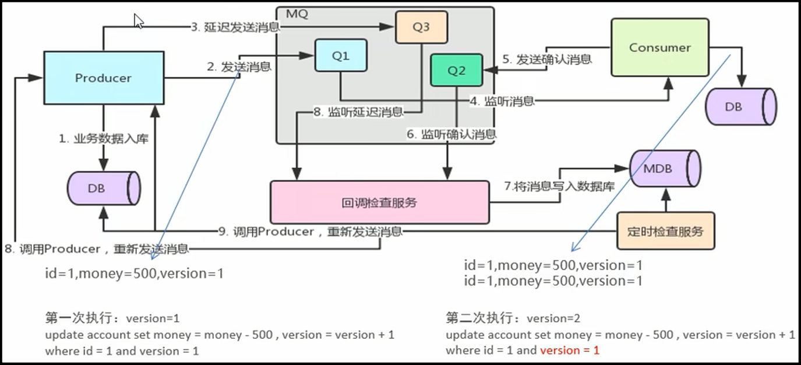

> 问题

- Producer发送1条正常的消息给Q1后，Consumer服务挂了没有消费这条正常的消息，则无法发送确认消息。回调检查服务监听不到确认消息则无法写入消息数据库，接着又收到了延迟消息，一比对发现消息消费异常，则调用Producer重新发送消息。最后，Q1中就有两条一样的消息；
- 当Consumer服务重启后，监听Q1，接收到了两条一样的消息，重复消费，对业务数据库中的同一条数据来说，就不具有幂等性了；
- 如果是同一条扣款消息，执行两次，那对很多金融服务来说是很可怕的；

> 解决

- Producer发送消息的时候带上版本号，Consumer根据版本号来更新数据库，并且每一次更新操作也一起将版本号更新，那么当1条消息消费过后，即使重复多少条，也无法再更新这条记录了，因为版本号已经变了（如图）；

# 9、集群搭建

## 9.1、集群方案的原理

- RabbitMQ这款消息队列中间件产品本身是基于Erlang编写，Erlang语言天生具备分布式特性（通过同步Erlang集群各节点的magic cookie来实现）。因此，RabbitMQ天然支持Clustering。这使得RabbitMQ本身不需要像ActiveMQ、Kafka那样通过Zookeeper分别来实现HA方案和保存集群的元数据。集群是保证可靠性的一种方式，同时可以通过水平扩展以达到增加消息吞吐量能力的目的；

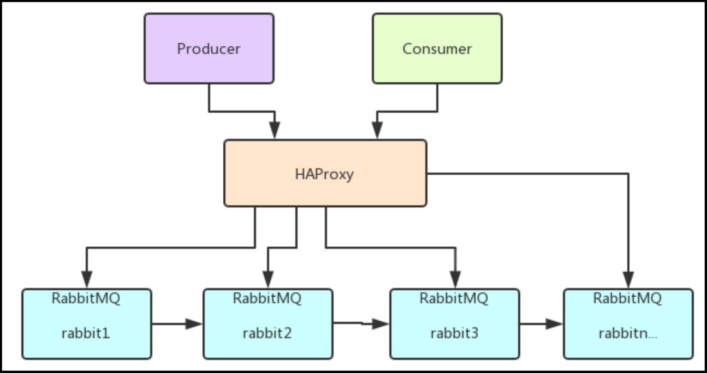

## 9.2、单机多实例部署

- 用端口区分的伪集群，生产环境上用不同服务器IP区分；

### 9.2.1、创建节点

```shell
#确保RabbitMQ运行没有问题
[root@ryualvin100 ~]# rabbitmqctl status
#停止RabbitMQ服务
[root@ryualvin100 ~]# service rabbitmq-server stop
#启动第一个节点
[root@ryualvin100 ~]# RABBITMQ_NODE_PORT=5673 RABBITMQ_NODENAME=rabbit1 rabbitmq-server start
#启动第二个节点
[root@ryualvin100 ~]# RABBITMQ_NODE_PORT=5674 RABBITMQ_SERVER_START_ARGS="-rabbitmq_management listener [{port,15674}]" RABBITMQ_NODENAME=rabbit2 rabbitmq-server start
#此时可以通过15672以及15674端口分别访问两个控制台（需要开放端口），但是只能通过guest登录
#此时，只是创建了2个节点，他们还没有组成一个集群

#其他操作：停止节点服务
rabbitmqctl -n rabbit1 stop
rabbitmqctl -n rabbit2 stop
```

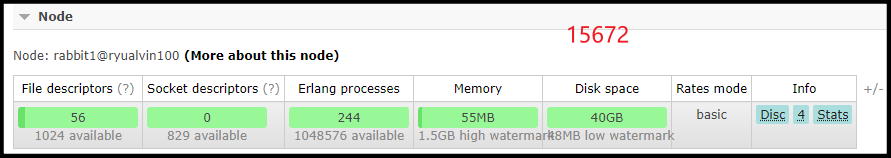

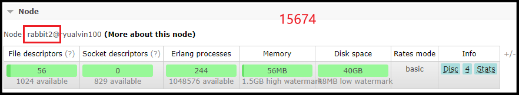

### 9.2.2、创建集群

```shell
#将rabbit1设置为主节点
#先停止rabbit1节点服务
[root@ryualvin100 ~]# rabbitmqctl -n rabbit1 stop_app
Stopping node rabbit1@ryualvin100 ...
#重置rabbit1
[root@ryualvin100 ~]# rabbitmqctl -n rabbit1 reset
Resetting node rabbit1@ryualvin100 ...
#启动rabbit1节点
[root@ryualvin100 ~]# rabbitmqctl -n rabbit1 start_app
Starting node rabbit1@ryualvin100 ...
```

```shell
#将rabbit2设置为从节点
#先停止rabbit2节点服务
[root@ryualvin100 ~]# rabbitmqctl -n rabbit2 stop_app
Stopping node rabbit2@ryualvin100 ...
#重置rabbit2
[root@ryualvin100 ~]# rabbitmqctl -n rabbit2 reset
Resetting node rabbit2@ryualvin100 ...
#将rabbit2节点加入主机点rabbit1的集群
[root@ryualvin100 ~]# rabbitmqctl -n rabbit2 join_cluster rabbit1@'ryualvin100'
Clustering node rabbit2@ryualvin100 with rabbit1@ryualvin100 ...
#启动rabbit2节点
[root@ryualvin100 ~]# rabbitmqctl -n rabbit2 start_app
Starting node rabbit2@ryualvin100 ...
#此时，可分别到两个管理控制台查看，两个节点服务都已经启动起来了
#也可通过主机点查看整个集群状态
[root@ryualvin100 ~]# rabbitmqctl cluster_status -n rabbit1
Cluster status of node rabbit1@ryualvin100 ...
[{nodes,[{disc,[rabbit1@ryualvin100,rabbit2@ryualvin100]}]},
 {running_nodes,[rabbit2@ryualvin100,rabbit1@ryualvin100]},
 {cluster_name,<<"rabbit2@ryualvin100">>},
 {partitions,[]},
 {alarms,[{rabbit2@ryualvin100,[]},{rabbit1@ryualvin100,[]}]}]
```

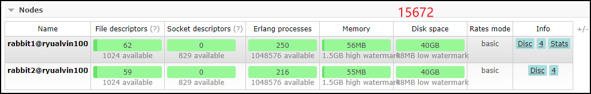

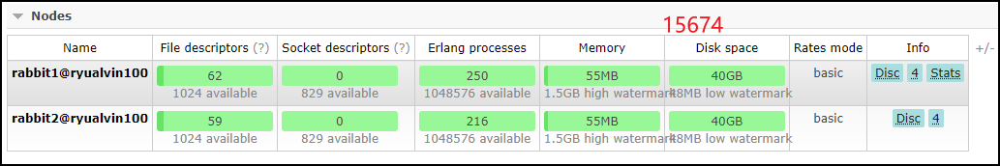

- 此时，在主节点创建队列，以及在主节点发送消息，在从节点的控制台上都是可以看到的，但是一旦主机点挂了，消息就不同步了，只有队列存在：

  ```shell
  rabbitmqctl -n rabbit1 stop
  ```

  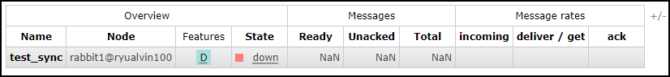

- 重启主节点之后，在从节点的控制台上查看，如果是持久化消息，可以恢复：

  ```shell
  RABBITMQ_NODE_PORT=5673 RABBITMQ_NODENAME=rabbit1 rabbitmq-server start
  ```

  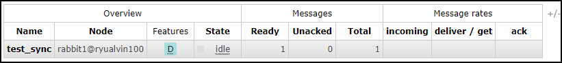

### 9.2.3、创建同步策略

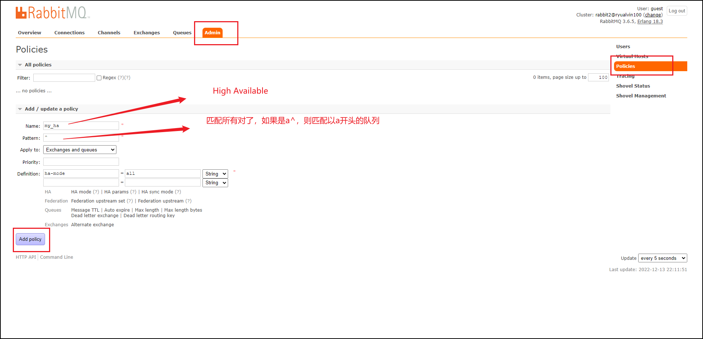

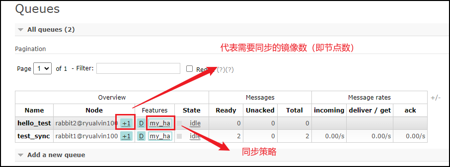

```shell
#镜像集群配置可以通过以上的管理控制台，也可以通过以下命令配置策略，开启集群配置
#ha-mode模式中的all，代表同步所有匹配的队列
rabbitmqctl set_policy my_ha "^" '{"ha-mode":"all"}'
```

> 其他集群管理命令

```shell
#将节点加入指定集群中。在这个命令执行前需要停止RabbitMQ应用并重置节点
rabbitmqctl join_cluster {cluster_node} [–ram]
#显示集群的状态
rabbitmqctl cluster_status
#修改集群节点的类型。在这个命令执行前需要停止RabbitMQ应用
rabbitmqctl change_cluster_node_type {disc|ram}
#将节点从集群中删除，允许离线执行
rabbitmqctl forget_cluster_node [–offline]
#在集群中的节点应用启动前咨询clusternode节点的最新信息，并更新相应的集群信息。这个和join_cluster不同，它不加入集群。考虑这样一种情况，节点A和节点B都在集群中，当节点A离线了，节点C又和节点B组成了一个集群，然后节点B又离开了集群，当A醒来的时候，它会尝试联系节点B，但是这样会失败，因为节点B已经不在集群中了
rabbitmqctl update_cluster_nodes {clusternode}
#取消队列queue同步镜像的操作
rabbitmqctl cancel_sync_queue [-p vhost] {queue}
#设置集群名称。集群名称在客户端连接时会通报给客户端。Federation和Shovel插件也会有用到集群名称的地方。集群名称默认是集群中第一个节点的名称，通过这个命令可以重新设置
rabbitmqctl set_cluster_name {name}
```

## 9.3、负载均衡-HAProxy

> 介绍

- HAProxy对外提供一个访问端口，对内路由分发至各个节点；

- HAProxy提供高可用性、负载均衡以及基于TCP和HTTP应用的代理，并且免费、可靠、支持虚拟主机，包括Twitter、Reddit、StackOverflow、GitHub在内的多家知名互联网公司都在使用。HAProxy实现了一种事件驱动、单一进程模型，此模型支持非常大的并发连接数；

- HAProxy统一IP和端口，不管是生产端还是消费端，都通过这个IP:端口来访问各个节点。不管哪个节点挂了，其他节点都能通过这个统一的IP:端口来代理；

  

> 安装

```shell
#安装依赖环境
yum install gcc vim wget
#上传haproxy源码包，略
#解压
tar -zxvf haproxy-1.6.5.tar.gz -C /usr/local
#进入解压目录
cd /usr/local/haproxy-1.6.5
#编译
make TARGET=linux31 PREFIX=/usr/local/haproxy
#安装至指定目录
make install PREFIX=/usr/local/haproxy
#添加组
groupadd -r -g 149 haproxy
#添加用户
useradd -g haproxy -r -s /sbin/nologin -u 149 haproxy
#创建目录
mkdir /etc/haproxy
#创建haproxy配置文件
vim /etc/haproxy/haproxy.cfg
```

> 配置

```shell
#logging options
global
	log 127.0.0.1 local0 info
	maxconn 5120
	chroot /usr/local/haproxy
	uid 99
	gid 99
	daemon
	quiet
	nbproc 20
	pidfile /var/run/haproxy.pid

defaults
	log global
	
	mode tcp

	option tcplog
	option dontlognull
	retries 3
	option redispatch
	maxconn 2000
	contimeout 5s
   
     clitimeout 60s

     srvtimeout 15s	
#front-end IP for consumers and producters

#指定集群名字，以及对外提供服务的端口
listen rabbitmq_cluster
	bind 0.0.0.0:5672
	
	mode tcp
	#balance url_param userid
	#balance url_param session_id check_post 64
	#balance hdr(User-Agent)
	#balance hdr(host)
	#balance hdr(Host) use_domain_only
	#balance rdp-cookie
	#balance leastconn
	#balance source //ip
	
	balance roundrobin
		#本机:节点端口，如果是部署在不同的服务器，则服务器IP:端口
		#rise 2 fall 2 重试2次，失败2次就不再重试
        server node1 127.0.0.1:5673 check inter 5000 rise 2 fall 2
        server node2 127.0.0.1:5674 check inter 5000 rise 2 fall 2

listen stats
	#通过该bing/status uri可以访问控制台
	bind 192.168.182.100:8100
	mode http
	option httplog
	stats enable
	stats uri /rabbitmq-stats
	stats refresh 5s
```

> 启动

```shell
#通过配置文件启动haproxy应用程序
/usr/local/haproxy/sbin/haproxy -f /etc/haproxy/haproxy.cfg
#查看haproxy进程状态
ps -ef | grep haproxy
#访问（需要开放8100端口）
http://192.168.182.100:8100/rabbitmq-stats
```

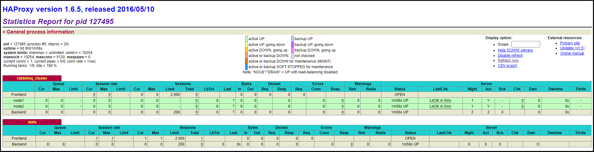
