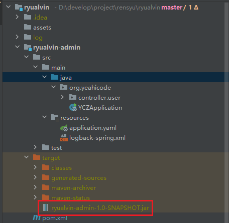
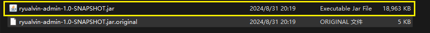

# 防止SpringBoot工程打包出现空包的现象

**空包：**




**在pom文件中添加构建配置，指定主程序入口，从主程序入口开始依次向下打包：**

```xml
    <build>
        <plugins>
            <!-- Package as an executable jar -->
            <plugin>
                <groupId>org.springframework.boot</groupId>
                <artifactId>spring-boot-maven-plugin</artifactId>
                <configuration>
<!--                    指定入口，从入口开始打包-->
                    <mainClass>org.yeahicode.YCZApplication</mainClass>
                    <!--打包成可执行文件-->
                    <executable>true</executable>
                </configuration>
                <executions>
                    <execution>
                        <goals>
                            <goal>repackage</goal>
                        </goals>
                    </execution>
                </executions>
            </plugin>
        </plugins>
    </build>
```



# Run Dashboard（Services）设置

```xml
  <component name="RunDashboard">
    <option name="configurationTypes">
      <set>
        <option value="SpringBootApplicationConfigurationType" />
      </set>
    </option>
    <option name="ruleStates">
      <list>
        <RuleState>
          <option name="name" value="ConfigurationTypeDashboardGroupingRule" />
        </RuleState>
        <RuleState>
          <option name="name" value="StatusDashboardGroupingRule" />
        </RuleState>
      </list>
    </option>
  </component>
```

