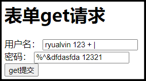

# 发送Get请求

## 浏览器发起Get请求

浏览器发送Get请求的时候，会自动将我们的参数进行Encode。当服务器收到我们传入的参数后，又会自动的将我们的参数Decode（Web容器都具备Decode的能力）。因而不用担心参数中带有特殊字符。

> 客户端

- 提交表单，发起Get请求；



- 浏览器自动Encode我们的参数，显现在Url地址栏中；

  ```java
  http://localhost:8899/httpclient-demo/test1?username=ryualvin+123+%2B+%7C&password=%25%5E%26dfdasfda+12321
  ```

> 服务端

```java
业务入参：UserRequest(id=null, username=ryualvin 123 + |, password=%^&dfdasfda 12321)
```

## HttpClient发起Get请求

- 不带特殊字符的情况下，即使不进行Encode，也是可以正常请求；

- 带有特殊字符，并且没有进行Encode的情况下，会报非法参数异常：

```java
String username = "ryualvin 123 + |";
String password = "%^&dfdasfda 12321";
String urlStr = String.format("http://localhost:8899/httpclient-demo/test1?username=%s&password=%s", username, password);
```

```java
Exception in thread "main" java.lang.IllegalArgumentException: Illegal character in query at index 60: http://localhost:8899/httpclient-demo/test1?usernameryualvin 123 + |=&password=%^&dfdasfda 12321
```

- 带有特殊字符，并且进行Encode的情况下，可以正常请求：

  - 客户端：

    ```java
        public static void main(String[] args) throws UnsupportedEncodingException {
            // 1、创建可关闭的http请求客户端，相当于你打开的一个浏览器
            CloseableHttpClient closeableHttpClient = HttpClients.createDefault();
            // 2、设置请求url
            String username = "ryualvin 123 + |";
            username = URLEncoder.encode(username, StandardCharsets.UTF_8.name());
            String password = "%^&dfdasfda 12321";
            password = URLEncoder.encode(password, StandardCharsets.UTF_8.name());
            String urlStr = String.format("http://localhost:8899/httpclient-demo/test1?username=%s&password=%s", username, password);
            // 3、构造httpGet请求对象
            HttpGet httpGet = new HttpGet(urlStr);
            // ...
    ```

  - 服务端：

    ```java
    业务入参：UserRequest(id=null, username=ryualvin 123 + |, password=%^&dfdasfda 12321)
    user-agent:Mozilla/5.0 (Windows NT 10.0; Win64; x64) AppleWebKit/537.36 (KHTML, like Gecko) Chrome/107.0.0.0 Safari/537.36
    host:localhost:8899
    connection:Keep-Alive
    accept-encoding:gzip,deflate
    ```

# 发送Post请求

## MIME TYPE

- 详细介绍：https://www.cnblogs.com/jsean/articles/1610265.html

- 含义：Multipurpose Internet Mail Extensions，即多用途互联网邮件扩展类型；

- 组成：

  | 信息头                    | 含义         | 举例                                                         |
  | ------------------------- | ------------ | ------------------------------------------------------------ |
  | MIME-Version              | MIME版本     | 1.0                                                          |
  | Content-Type              | 内容类型     | application/x-www-form-urlencoded, application/json          |
  | Content-Transfer-Encoding | 编码格式     | 8bit，binary                                                 |
  | Content-Disposition       | 内容排列方式 | 上传文件时：<br/>Content-Disposition: from-data; name="filename";<br/>filename="c:\Users\ryualvin\Desktop>"<br/>下载文件时需要设置：<br/>Content-Disposition: attachment; filename=URLEncoder.encode("xxx.zip", "UTF-8") |

- 请求媒体类型文件流程：（以png为例）

  - 客户端发起请求获取一张图片，服务器上的Web容器接收到请求，通过后缀在`conf/web.xml`文件中找到对应的`<mime-mapping>`，将`<mime-type>`的值设置为Content-Type并返回；

    ```xml
    <mime-mapping>
        <extension>png</extension>
        <mime-type>image/png</mime-type>
    </mime-mapping>
    ```

- 网页form表单enctype可用的MIME类型（Content-Type类型）：

  - application/x-www-form-urlencoded
  - multipart/form-data
  - text/plain -> 一般用来返回字符串

## 发送application/x-www-form-urlencoded类型的请求

```java
HttpPost httpPost = new HttpPost(urlStr);
List<NameValuePair> list = new ArrayList<>();
BasicNameValuePair username = new BasicNameValuePair("username", "ryualvin");
BasicNameValuePair password = new BasicNameValuePair("password", "32435&| fdaf");
list.add(username);
list.add(password);
UrlEncodedFormEntity entity = new UrlEncodedFormEntity(list);
httpPost.setEntity(entity);
```

> 客户端请求报文

```java
21:07:41.395 [main] DEBUG org.apache.http.headers - http-outgoing-0 >> POST /httpclient-demo/test2 HTTP/1.1
21:07:41.395 [main] DEBUG org.apache.http.headers - http-outgoing-0 >> Content-Length: 43
21:07:41.395 [main] DEBUG org.apache.http.headers - http-outgoing-0 >> Content-Type: application/x-www-form-urlencoded
21:07:41.395 [main] DEBUG org.apache.http.headers - http-outgoing-0 >> Host: localhost:8899
21:07:41.395 [main] DEBUG org.apache.http.headers - http-outgoing-0 >> Connection: Keep-Alive
21:07:41.395 [main] DEBUG org.apache.http.headers - http-outgoing-0 >> User-Agent: Apache-HttpClient/4.5.13 (Java/1.8.0_333)
21:07:41.395 [main] DEBUG org.apache.http.headers - http-outgoing-0 >> Accept-Encoding: gzip,deflate
21:07:41.395 [main] DEBUG org.apache.http.wire - http-outgoing-0 >> "POST /httpclient-demo/test2 HTTP/1.1[\r][\n]"
21:07:41.395 [main] DEBUG org.apache.http.wire - http-outgoing-0 >> "Content-Length: 43[\r][\n]"
21:07:41.395 [main] DEBUG org.apache.http.wire - http-outgoing-0 >> "Content-Type: application/x-www-form-urlencoded[\r][\n]"
21:07:41.395 [main] DEBUG org.apache.http.wire - http-outgoing-0 >> "Host: localhost:8899[\r][\n]"
21:07:41.395 [main] DEBUG org.apache.http.wire - http-outgoing-0 >> "Connection: Keep-Alive[\r][\n]"
21:07:41.395 [main] DEBUG org.apache.http.wire - http-outgoing-0 >> "User-Agent: Apache-HttpClient/4.5.13 (Java/1.8.0_333)[\r][\n]"
21:07:41.396 [main] DEBUG org.apache.http.wire - http-outgoing-0 >> "Accept-Encoding: gzip,deflate[\r][\n]"
21:07:41.396 [main] DEBUG org.apache.http.wire - http-outgoing-0 >> "[\r][\n]"
21:07:41.396 [main] DEBUG org.apache.http.wire - http-outgoing-0 >> "username=ryualvin&password=32435%26%7C+fdaf"
```

> 服务端响应报文

```java
21:07:41.488 [main] DEBUG org.apache.http.wire - http-outgoing-0 << "HTTP/1.1 200 [\r][\n]"
21:07:41.488 [main] DEBUG org.apache.http.wire - http-outgoing-0 << "Content-Type: text/plain;charset=UTF-8[\r][\n]"
21:07:41.488 [main] DEBUG org.apache.http.wire - http-outgoing-0 << "Content-Length: 5[\r][\n]"
21:07:41.488 [main] DEBUG org.apache.http.wire - http-outgoing-0 << "Date: Tue, 06 Dec 2022 13:07:41 GMT[\r][\n]"
21:07:41.488 [main] DEBUG org.apache.http.wire - http-outgoing-0 << "Keep-Alive: timeout=60[\r][\n]"
21:07:41.488 [main] DEBUG org.apache.http.wire - http-outgoing-0 << "Connection: keep-alive[\r][\n]"
21:07:41.488 [main] DEBUG org.apache.http.wire - http-outgoing-0 << "[\r][\n]"
21:07:41.488 [main] DEBUG org.apache.http.wire - http-outgoing-0 << "test2"
21:07:41.490 [main] DEBUG org.apache.http.headers - http-outgoing-0 << HTTP/1.1 200 
21:07:41.490 [main] DEBUG org.apache.http.headers - http-outgoing-0 << Content-Type: text/plain;charset=UTF-8
21:07:41.490 [main] DEBUG org.apache.http.headers - http-outgoing-0 << Content-Length: 5
21:07:41.490 [main] DEBUG org.apache.http.headers - http-outgoing-0 << Date: Tue, 06 Dec 2022 13:07:41 GMT
21:07:41.490 [main] DEBUG org.apache.http.headers - http-outgoing-0 << Keep-Alive: timeout=60
21:07:41.492 [main] DEBUG org.apache.http.headers - http-outgoing-0 << Connection: keep-alive
```

## 发送application/json类型的请求

```java
HttpPost httpPost = new HttpPost(urlStr);
// 设置请求Entity
JSONObject jsonObject = new JSONObject();
jsonObject.put("username", "ryualvinjsonobj");
jsonObject.put("password", "12312|78^&* -%$");
StringEntity jsonEntity = new StringEntity(jsonObject.toString());
// 设置内容类型
jsonEntity.setContentType(new BasicHeader("content-type", "application/json;charset=utf-8"));
// 设置编码，否则有中文的话可能会乱码
jsonEntity.setContentEncoding(Consts.UTF_8.name());
httpPost.setEntity(jsonEntity);
```

> 客户端请求报文

```java
21:44:22.462 [main] DEBUG org.apache.http.headers - http-outgoing-0 >> POST /httpclient-demo/testJson HTTP/1.1
21:44:22.462 [main] DEBUG org.apache.http.headers - http-outgoing-0 >> Content-Length: 59
21:44:22.462 [main] DEBUG org.apache.http.headers - http-outgoing-0 >> Content-Type: application/json;charset=utf-8
21:44:22.462 [main] DEBUG org.apache.http.headers - http-outgoing-0 >> Content-Encoding: UTF-8
21:44:22.462 [main] DEBUG org.apache.http.headers - http-outgoing-0 >> Host: localhost:8899
21:44:22.462 [main] DEBUG org.apache.http.headers - http-outgoing-0 >> Connection: Keep-Alive
21:44:22.462 [main] DEBUG org.apache.http.headers - http-outgoing-0 >> User-Agent: Apache-HttpClient/4.5.13 (Java/1.8.0_333)
21:44:22.462 [main] DEBUG org.apache.http.headers - http-outgoing-0 >> Accept-Encoding: gzip,deflate
21:44:22.462 [main] DEBUG org.apache.http.wire - http-outgoing-0 >> "POST /httpclient-demo/testJson HTTP/1.1[\r][\n]"
21:44:22.462 [main] DEBUG org.apache.http.wire - http-outgoing-0 >> "Content-Length: 59[\r][\n]"
21:44:22.462 [main] DEBUG org.apache.http.wire - http-outgoing-0 >> "Content-Type: application/json;charset=utf-8[\r][\n]"
21:44:22.462 [main] DEBUG org.apache.http.wire - http-outgoing-0 >> "Content-Encoding: UTF-8[\r][\n]"
21:44:22.462 [main] DEBUG org.apache.http.wire - http-outgoing-0 >> "Host: localhost:8899[\r][\n]"
21:44:22.462 [main] DEBUG org.apache.http.wire - http-outgoing-0 >> "Connection: Keep-Alive[\r][\n]"
21:44:22.462 [main] DEBUG org.apache.http.wire - http-outgoing-0 >> "User-Agent: Apache-HttpClient/4.5.13 (Java/1.8.0_333)[\r][\n]"
21:44:22.462 [main] DEBUG org.apache.http.wire - http-outgoing-0 >> "Accept-Encoding: gzip,deflate[\r][\n]"
21:44:22.462 [main] DEBUG org.apache.http.wire - http-outgoing-0 >> "[\r][\n]"
21:44:22.462 [main] DEBUG org.apache.http.wire - http-outgoing-0 >> "{"password":"12312|78^&* -%$","username":"ryualvinjsonobj"}"
```

> 服务端响应报文

```java
21:44:22.557 [main] DEBUG org.apache.http.wire - http-outgoing-0 << "HTTP/1.1 200 [\r][\n]"
21:44:22.559 [main] DEBUG org.apache.http.wire - http-outgoing-0 << "Content-Type: text/plain;charset=UTF-8[\r][\n]"
21:44:22.559 [main] DEBUG org.apache.http.wire - http-outgoing-0 << "Content-Length: 8[\r][\n]"
21:44:22.559 [main] DEBUG org.apache.http.wire - http-outgoing-0 << "Date: Tue, 06 Dec 2022 13:44:22 GMT[\r][\n]"
21:44:22.559 [main] DEBUG org.apache.http.wire - http-outgoing-0 << "Keep-Alive: timeout=60[\r][\n]"
21:44:22.559 [main] DEBUG org.apache.http.wire - http-outgoing-0 << "Connection: keep-alive[\r][\n]"
21:44:22.559 [main] DEBUG org.apache.http.wire - http-outgoing-0 << "[\r][\n]"
21:44:22.559 [main] DEBUG org.apache.http.wire - http-outgoing-0 << "testJson"
21:44:22.561 [main] DEBUG org.apache.http.headers - http-outgoing-0 << HTTP/1.1 200 
21:44:22.561 [main] DEBUG org.apache.http.headers - http-outgoing-0 << Content-Type: text/plain;charset=UTF-8
21:44:22.561 [main] DEBUG org.apache.http.headers - http-outgoing-0 << Content-Length: 8
21:44:22.561 [main] DEBUG org.apache.http.headers - http-outgoing-0 << Date: Tue, 06 Dec 2022 13:44:22 GMT
21:44:22.561 [main] DEBUG org.apache.http.headers - http-outgoing-0 << Keep-Alive: timeout=60
21:44:22.561 [main] DEBUG org.apache.http.headers - http-outgoing-0 << Connection: keep-alive
```

## 发送multipart/form-data类型的上传文件请求

```java
HttpPost httpPost = new HttpPost(urlStr);
// 构造一个ContentBody的实现类对象
// 构造上传文件使用的Entity
MultipartEntityBuilder builder = MultipartEntityBuilder.create();
builder.setCharset(Consts.UTF_8);//设置编码
builder.setContentType(ContentType.create("multipart/form-data", Consts.UTF_8));
builder.setMode(HttpMultipartMode.BROWSER_COMPATIBLE);//设置浏览器模式
// 对于普通的表单字段如果含有中文的话，不能通过addTextBody，否则乱码
StringBody usernameTextBody = new StringBody("小明", ContentType.create("text/plain", Consts.UTF_8));
FileBody fileBody = new FileBody(new File("C:\\Users\\ryualvin\\Desktop\\test.log"));
HttpEntity httpEntity = builder
        .addPart("file", fileBody)
        // 通过file，byte[]，inputstream来上传文件
        .addBinaryBody("file", new File("C:\\Users\\ryualvin\\Desktop\\test.png"))
        // .addTextBody("username", "小明") // 普通的表单字段如果含有中文的话，不能通过addTextBody，否则乱码
        .addPart("username", usernameTextBody)
        .addTextBody("password", "1332|  ^7%$* -")
        .build();
httpPost.setEntity(httpEntity);
```

> 客户端请求报文

```java
22:44:12.460 [main] DEBUG org.apache.http.headers - http-outgoing-0 >> POST /httpclient-demo/testUpload HTTP/1.1
22:44:12.460 [main] DEBUG org.apache.http.headers - http-outgoing-0 >> Content-Length: 138870
22:44:12.460 [main] DEBUG org.apache.http.headers - http-outgoing-0 >> Content-Type: multipart/form-data; boundary=DyyikaESxRwmXTam0_FRodtrDVwIqZ-; charset=UTF-8
22:44:12.460 [main] DEBUG org.apache.http.headers - http-outgoing-0 >> Host: localhost:8899
22:44:12.460 [main] DEBUG org.apache.http.headers - http-outgoing-0 >> Connection: Keep-Alive
22:44:12.460 [main] DEBUG org.apache.http.headers - http-outgoing-0 >> User-Agent: Apache-HttpClient/4.5.13 (Java/1.8.0_333)
22:44:12.460 [main] DEBUG org.apache.http.headers - http-outgoing-0 >> Accept-Encoding: gzip,deflate
22:44:12.460 [main] DEBUG org.apache.http.wire - http-outgoing-0 >> "POST /httpclient-demo/testUpload HTTP/1.1[\r][\n]"
22:44:12.460 [main] DEBUG org.apache.http.wire - http-outgoing-0 >> "Content-Length: 138870[\r][\n]"
22:44:12.460 [main] DEBUG org.apache.http.wire - http-outgoing-0 >> "Content-Type: multipart/form-data; boundary=DyyikaESxRwmXTam0_FRodtrDVwIqZ-; charset=UTF-8[\r][\n]"
22:44:12.460 [main] DEBUG org.apache.http.wire - http-outgoing-0 >> "Host: localhost:8899[\r][\n]"
22:44:12.460 [main] DEBUG org.apache.http.wire - http-outgoing-0 >> "Connection: Keep-Alive[\r][\n]"
22:44:12.460 [main] DEBUG org.apache.http.wire - http-outgoing-0 >> "User-Agent: Apache-HttpClient/4.5.13 (Java/1.8.0_333)[\r][\n]"
22:44:12.460 [main] DEBUG org.apache.http.wire - http-outgoing-0 >> "Accept-Encoding: gzip,deflate[\r][\n]"
22:44:12.460 [main] DEBUG org.apache.http.wire - http-outgoing-0 >> "[\r][\n]"
22:44:12.460 [main] DEBUG org.apache.http.wire - http-outgoing-0 >> "--DyyikaESxRwmXTam0_FRodtrDVwIqZ-[\r][\n]"
22:44:12.460 [main] DEBUG org.apache.http.wire - http-outgoing-0 >> "Content-Disposition: form-data; name="file"; filename="test.log"[\r][\n]"
22:44:12.460 [main] DEBUG org.apache.http.wire - http-outgoing-0 >> "Content-Type: application/octet-stream[\r][\n]"
22:44:12.460 [main] DEBUG org.apache.http.wire - http-outgoing-0 >> "[\r][\n]"
22:44:12.460 [main] DEBUG org.apache.http.wire - http-outgoing-0 >> "[0xe5][0x93][0x88][0xe5][0x93][0x88][0xe5][0x93][0x88]AAAA"
22:44:12.460 [main] DEBUG org.apache.http.wire - http-outgoing-0 >> "[\r][\n]"
22:44:12.460 [main] DEBUG org.apache.http.wire - http-outgoing-0 >> "--DyyikaESxRwmXTam0_FRodtrDVwIqZ-[\r][\n]"
22:44:12.460 [main] DEBUG org.apache.http.wire - http-outgoing-0 >> "Content-Disposition: form-data; name="file"; filename="test.png"[\r][\n]"
22:44:12.460 [main] DEBUG org.apache.http.wire - http-outgoing-0 >> "Content-Type: application/octet-stream[\r][\n]"
22:44:12.460 [main] DEBUG org.apache.http.wire - http-outgoing-0 >> "[\r][\n]"
22:44:12.460 [main] DEBUG org.apache.http.wire - http-outgoing-0 >> "[0x89]PNG[\r][\n]"
22:44:12.460 [main] DEBUG org.apache.http.wire - http-outgoing-0 >> "[0x1a][\n]"
22:44:12.460 [main] DEBUG org.apache.http.wire - http-outgoing-0 >> "[0x0][0x0][0x0][\r]IHDR[0x0][0x0][0x7]
...
22:44:12.495 [main] DEBUG org.apache.http.wire - http-outgoing-0 >> "[\r][\n]"
22:44:12.495 [main] DEBUG org.apache.http.wire - http-outgoing-0 >> "--DyyikaESxRwmXTam0_FRodtrDVwIqZ-[\r][\n]"
22:44:12.495 [main] DEBUG org.apache.http.wire - http-outgoing-0 >> "Content-Disposition: form-data; name="username"[\r][\n]"
22:44:12.495 [main] DEBUG org.apache.http.wire - http-outgoing-0 >> "[\r][\n]"
22:44:12.495 [main] DEBUG org.apache.http.wire - http-outgoing-0 >> "username"
22:44:12.495 [main] DEBUG org.apache.http.wire - http-outgoing-0 >> "[\r][\n]"
22:44:12.495 [main] DEBUG org.apache.http.wire - http-outgoing-0 >> "--DyyikaESxRwmXTam0_FRodtrDVwIqZ-[\r][\n]"
22:44:12.495 [main] DEBUG org.apache.http.wire - http-outgoing-0 >> "Content-Disposition: form-data; name="password"[\r][\n]"
22:44:12.495 [main] DEBUG org.apache.http.wire - http-outgoing-0 >> "[\r][\n]"
22:44:12.495 [main] DEBUG org.apache.http.wire - http-outgoing-0 >> "1332|  ^7%$* -"
22:44:12.495 [main] DEBUG org.apache.http.wire - http-outgoing-0 >> "[\r][\n]"
22:44:12.495 [main] DEBUG org.apache.http.wire - http-outgoing-0 >> "--DyyikaESxRwmXTam0_FRodtrDVwIqZ---[\r][\n]"
```

> 服务端响应报文

```java
22:44:12.495 [main] DEBUG org.apache.http.wire - http-outgoing-0 << "HTTP/1.1 200 [\r][\n]"
22:44:12.495 [main] DEBUG  org.apache.http.wire - http-outgoing-0 << "Content-Type: text/plain;charset=UTF-8[\r][\n]"
22:44:12.495 [main] DEBUG org.apache.http.wire - http-outgoing-0 << "Content-Length: 10[\r][\n]"
22:44:12.495 [main] DEBUG org.apache.http.wire - http-outgoing-0 << "Date: Tue, 06 Dec 2022 14:44:12 GMT[\r][\n]"
22:44:12.495 [main] DEBUG org.apache.http.wire - http-outgoing-0 << "Keep-Alive: timeout=60[\r][\n]"
22:44:12.495 [main] DEBUG org.apache.http.wire - http-outgoing-0 << "Connection: keep-alive[\r][\n]"
22:44:12.495 [main] DEBUG org.apache.http.wire - http-outgoing-0 << "[\r][\n]"
22:44:12.495 [main] DEBUG org.apache.http.wire - http-outgoing-0 << "testUpload"
22:44:12.495 [main] DEBUG org.apache.http.headers - http-outgoing-0 << HTTP/1.1 200 
22:44:12.495 [main] DEBUG org.apache.http.headers - http-outgoing-0 << Content-Type: text/plain;charset=UTF-8
22:44:12.495 [main] DEBUG org.apache.http.headers - http-outgoing-0 << Content-Length: 10
22:44:12.495 [main] DEBUG org.apache.http.headers - http-outgoing-0 << Date: Tue, 06 Dec 2022 14:44:12 GMT
22:44:12.495 [main] DEBUG org.apache.http.headers - http-outgoing-0 << Keep-Alive: timeout=60
22:44:12.495 [main] DEBUG org.apache.http.headers - http-outgoing-0 << Connection: keep-alive
```
